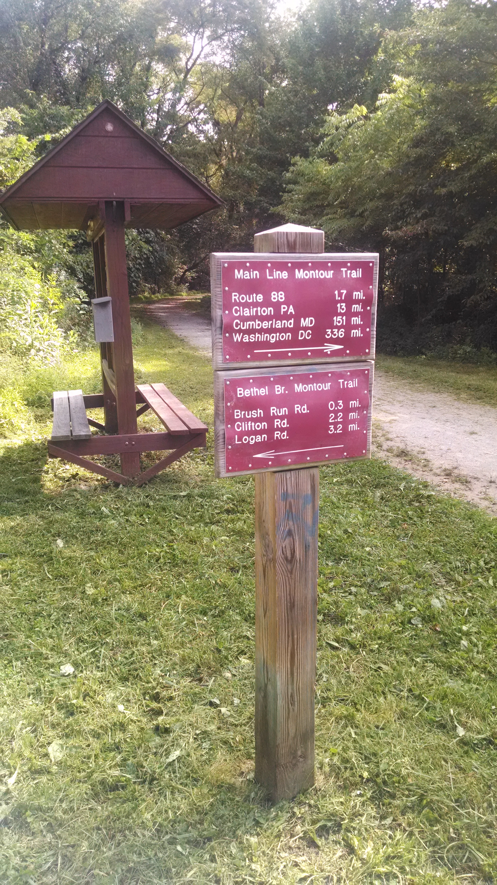
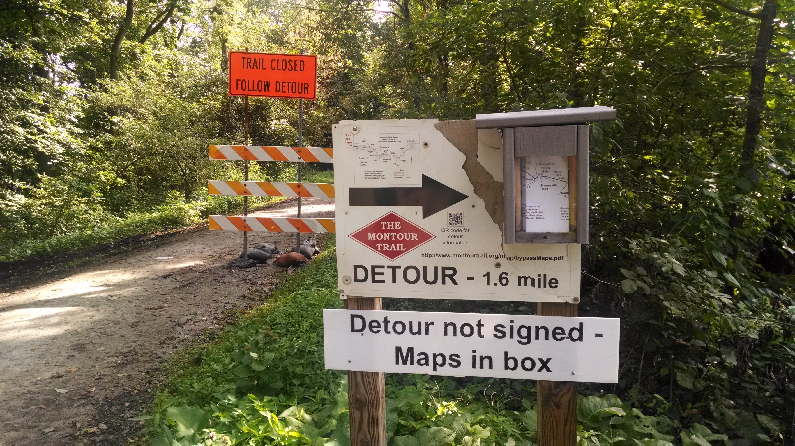
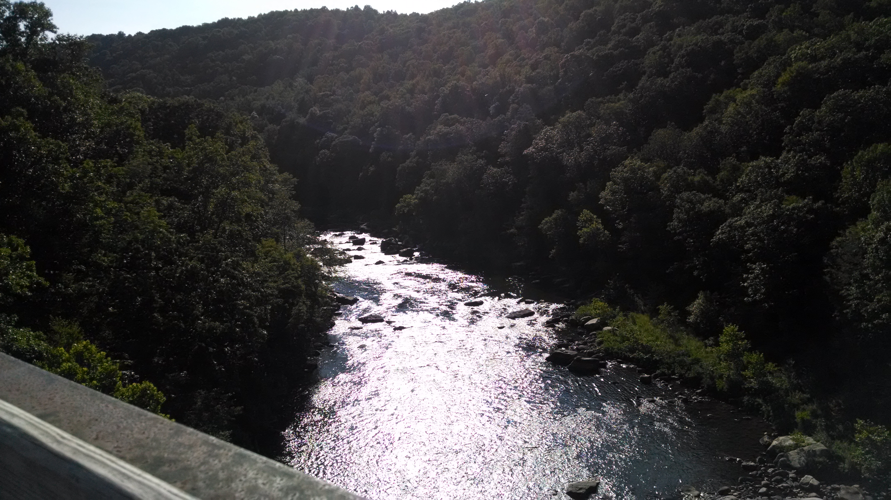
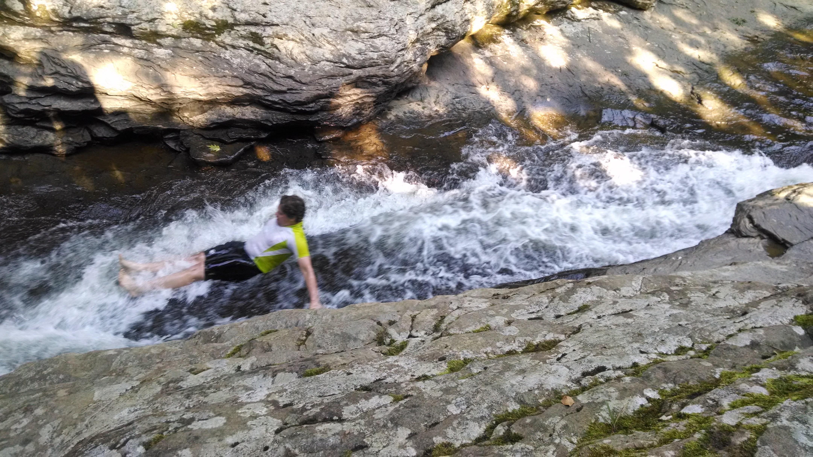
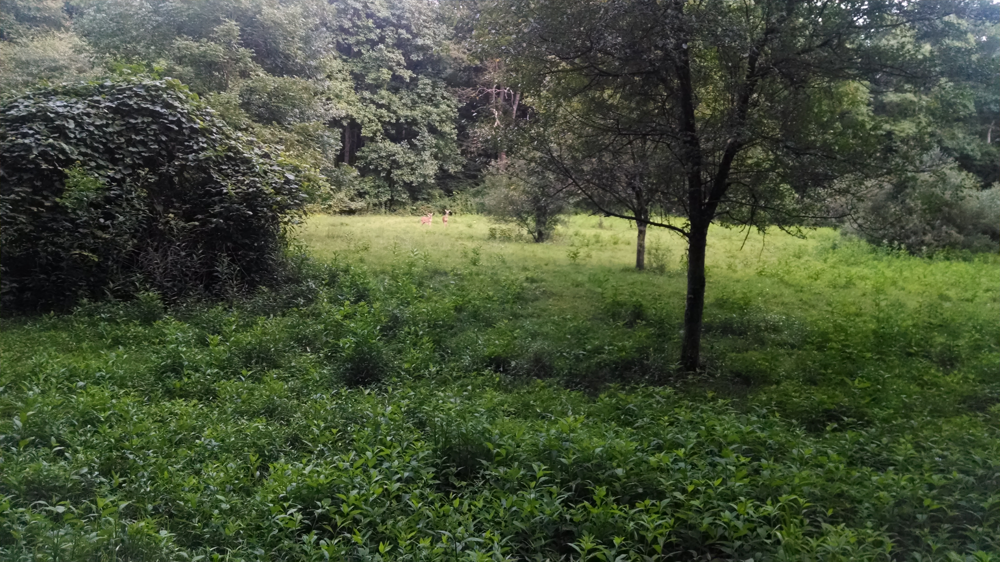

+++
title = "Day 4 -- Cannonsburg PA to Ohiopyle PA -- On the trail"
date = "2014-08-17T17:23:09+00:00"
tags = ["Bicycle Trip","Travel"]
categories = []
image = "IMG_20140816_174300817.jpg"
+++

I left Aaron's house and got on the road around 9:30. It still wasn't on time but I'm getting closer. Leaving the Pittsburgh suburbs wasn't as bad as many cities and the roads became country roads and then the Montour trail pretty quickly.

The elevation profile showed two big up and back down hills as I traveled the short distance from the Montour trail to the great Allegheny passage. The ride was going well enough and I was getting close enough to the trail that I started to think the hills didn't exist, but sure enough, there were two of them and they were big. I did manage to bike up them both this time though! It probably helped that I threw away some of the structural material from my saddle bags before leaving this morning in a conscious effort to lighten my packs.

I stopped for a milkshake and water right as I was getting on the big trail just west of West Newton.

The uphill shown in the trail's elevation profile had me scared that I would have a very hard climb ahead of me, but so far that has not been the case (even though there were a few times I thought I was dying just from the distance). I stayed in at least third gear the whole way down the trail today, so I'm looking forward to a relatively level journey into DC. I know the steepest part is still tomorrow so hopefully I didn't jinx it.

When I arrived in Ohiopyle I set out to find the natural water slide that I had heard about from uncle John when I stayed at his place. It was a short ride through a really happening recreation-based town. I watched a few people go while chatting with another couple who was visiting. They were quite friendly and took pictures for me as I went. The water was pretty cold, and although I sustained a slight ankle injury bashing my foot into a rock on the way down, it was totally fun and totally worth it.

After sliding I cleaned up in the free public showers, got some dinner at Grace's Wok, and started to think about where to stay for the night. The army corps of engineers had a campground for only eight dollars in Confluence which was only 17km down the trail, but I was already showered, and the campground didn't have electrical outlets to charge my phone, so I didn't really want to pay.

I decided to head in that direction and if a good spot to camp along the trail showed up I would stop (although I was still a little nervous about getting busted). I passed a few decent sites, and then came upon a large grassy field. I though about setting up there, but then saw some deer that just kept staring at me even as I moved around and that made me nervous. Not much farther down the trail was another more level grassy field with picnic tables and benches. It was even mowed. With a setup like that I figured it would be rude not to camp out.

I locked my bike to a bench and kind of screwed around as I started to make camp. Just then a guy on a bike rode by. I didn't make eye contact, but right after he passed he started talking. I was afraid he was reporting me to get busted. So after he left I moved my bike deeper into the woods and quickly finished setting up my tiny tent. In hindsight I have no idea why he would call me on rather than asking me to move himself, but hey, I was nervous.

In the morning I'll ride the last ~10km into Confluence refill on water, and conquer the rest of this climb before descending into Cumberland MD.

Omg, as I was finishing this post in my tiny tent, now after dark, another two people rode by on the trail and startled me. I don't think they noticed the tent :) I should probably be out of here before too many people pass by in the morning. Maybe that will help me get an earlier start.

Today's distance: 130 km
Average speed: 20.2 km/h
Trip odometer: 459 km

Photos:

