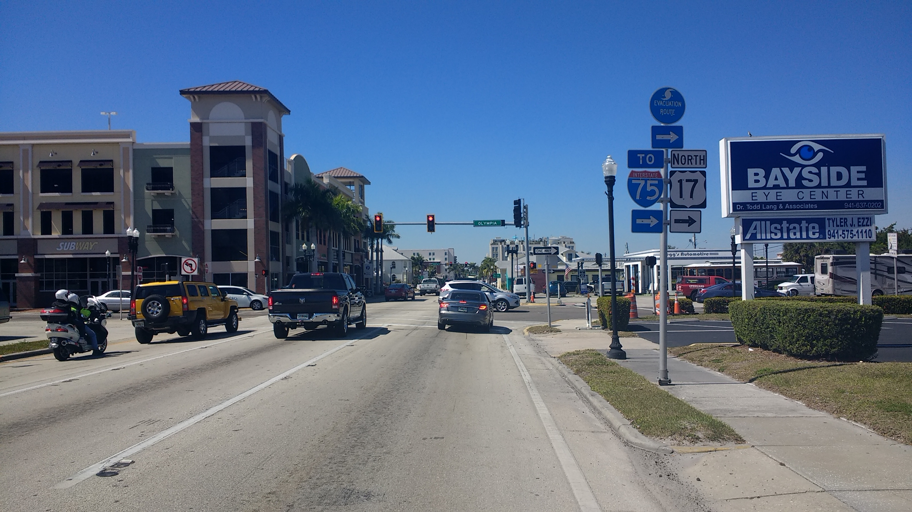
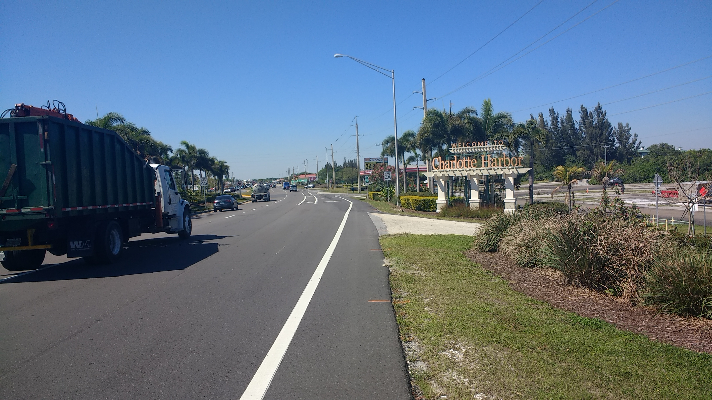
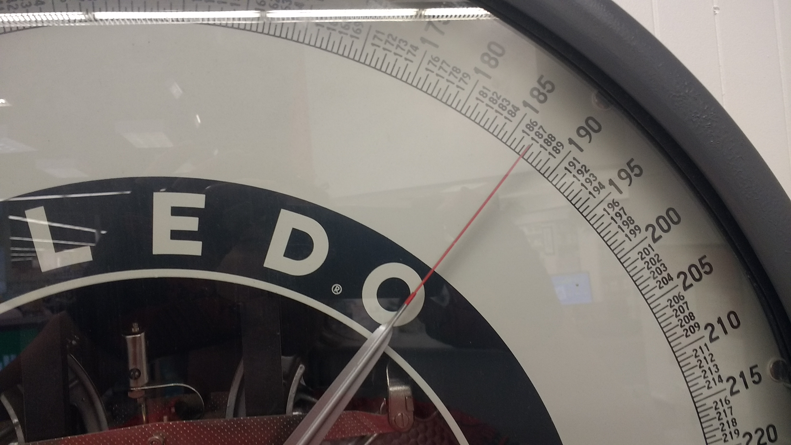
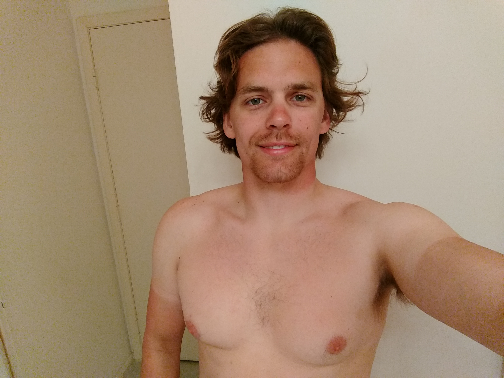

+++
title = "Day 4 -- Cape Coral FL to North Port FL"
date = "2018-03-16T00:52:42+00:00"
tags = ["Bicycle Trip"]
categories = []
image = "IMG_20180315_150102992.jpg"
+++

The hardest part of today was getting out of bed. I guess it was partly really needing the sleep and partly really appreciating not being in my tiny tent. The first round of alarms went off around 9:00 and I quickly snoozed them and cancelled the rest. In addition to just really wanting to sleep more I had a slight headache that I hoped would go away with a little more sleep.

Finally got out of bed a little before 11:00. The headache persisted, but I felt fine otherwise. I took my time getting breakfast of cereal and packing up the bike, ultimately hitting the road around noon.

I took Kyle's suggestion of riding burnt store rd instead of the larger main road that was full of traffic lights, and was glad I did. It added about ten minutes to the trip, but on a short day I could afford it and it saved the frustration of having to brake every km for a red light.

I was fighting the wind again today, but it wasn't as strong as yesterday and I had a fully inflated tire so it wasn't as difficult as I had feared. And the medicated powder worked wonders. My butt is only like half as bad as when I finished yesterday. That is to say, it's still kinda rough but much better and I'm optimistic it will continue getting better.

After I crossed the peace river, route 41 got a nice smooth bike lane, and the wind was actually slightly behind me for a few miles before switching back to its usual trick. I stopped at Winn Dixie to stock up on granola bars for tomorrow since it will be a long ride, topped off my tires at a Ford dealer, and made my final push into North Port.

I met up with George and Debbie Triana right around 5:00, and caught up for a little while before heading to dinner with her brother Jim and his wife Judy. It was a fun and delicious night and I'm happy to have a bed again tonight before my long ride tomorrow.

Daily distance: 71.28km
Average speed: 20.8km/h
Trip odometer: 525km

Photos:

