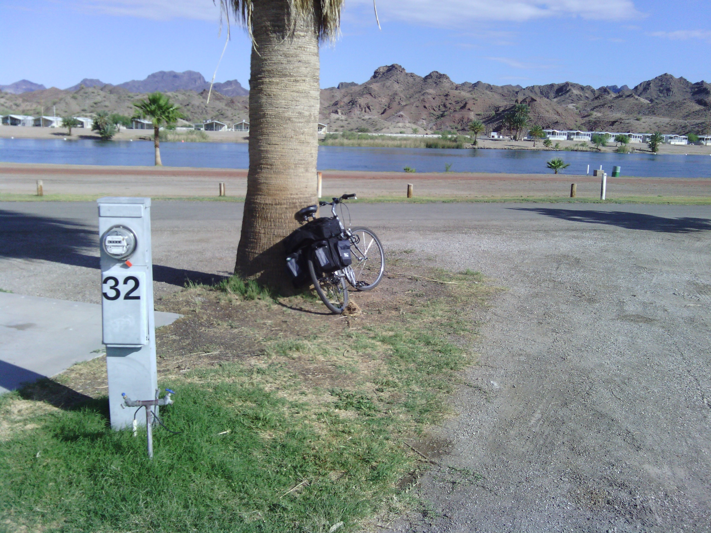
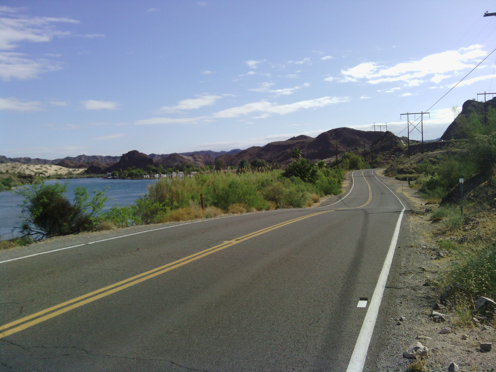
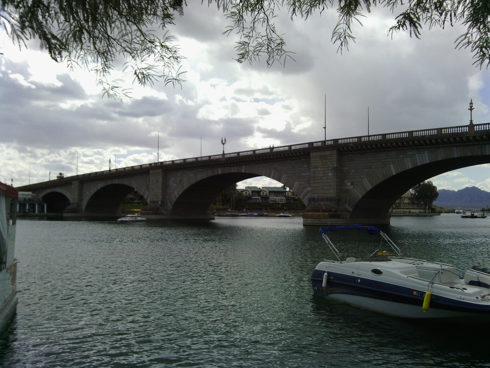
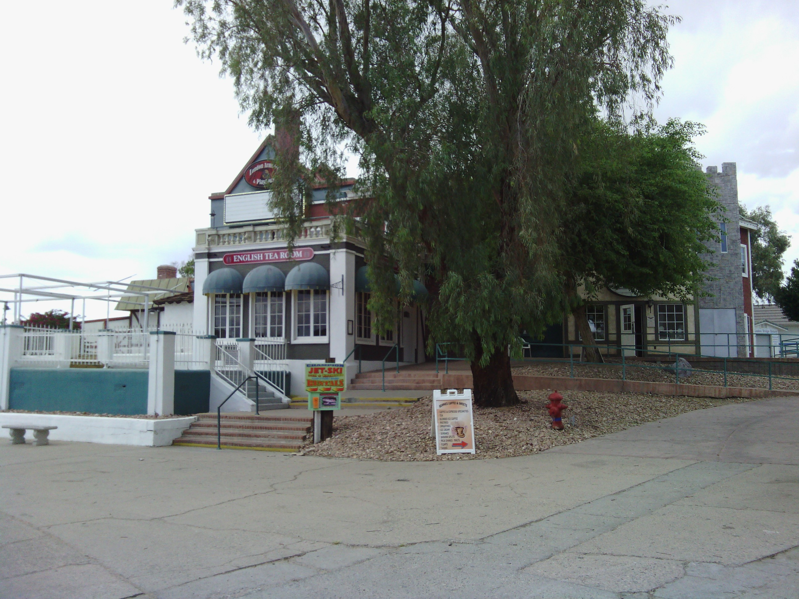
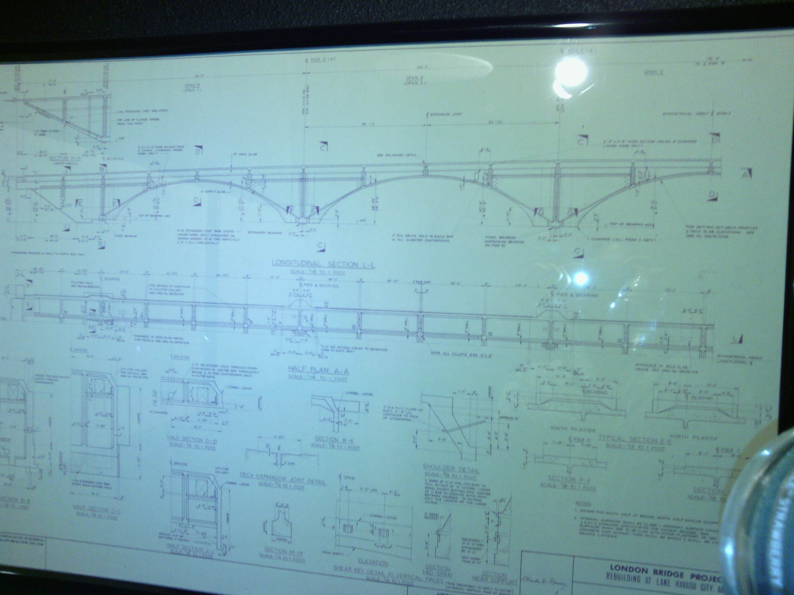
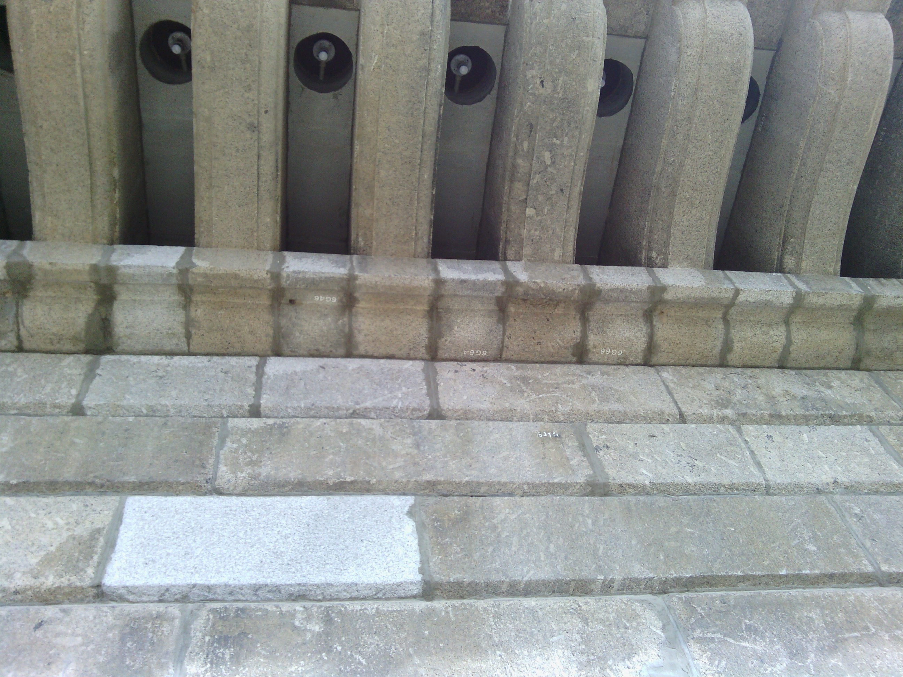
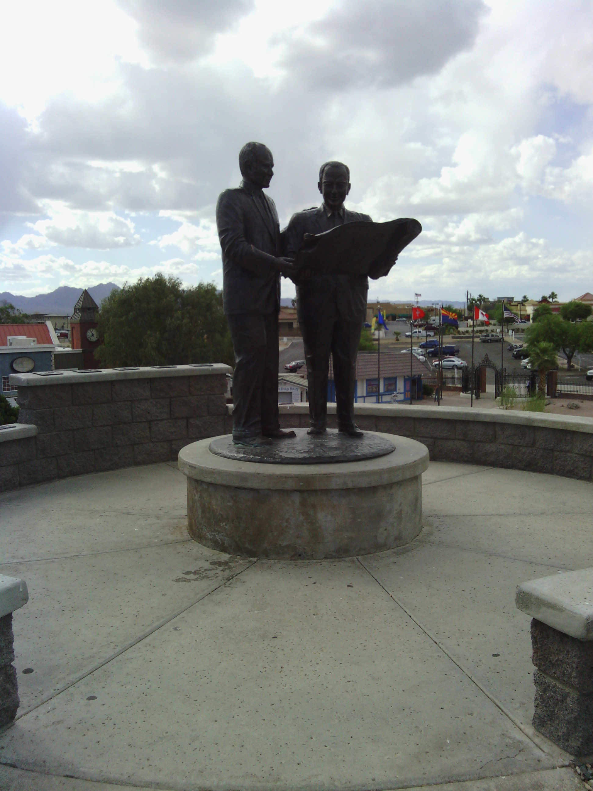

+++
title = "Day 4 -- Parker AZ to Lake Havasu AZ -- A short day"
date = "2013-05-07T18:20:28+00:00"
tags = ["Bicycle Trip"]
categories = []
image = "IMG_20130507_082516.jpg"
+++

By 11:00 in the morning I had already arrived in my final city for the day. Today was planned to be a shorter day, and pressing on across the river yesterday made it that much shorter. 

I woke up to the sound of birds squawking like crazy. The sun was bright outside the tent and I wondered if I had slept through my alarm, but it turned out to only be 7:00. I guess I'm pretty far east in the time zone because the sun was up by 8:00, and up before I was. As I tore down and brushed my teeth a few other campers said hi or good morning and I realized that I wasn't horribly out of place at the RV park like I feared I might be. I decided the best plan of action when I reached the guard shack would be to just wave at the guard and ride out as if I was just going for a little ride and my RV was still in the park. When I got there, there wasn't even a guard present. So thanks for the free camp and shower La Paz County Park.

The ride in was hilly but scenic, and since I knew it was a short ride I didn't mind the hills to much. After a short break outside a grocery store I decided to head to a bike shop for a little routine maintenance. But on the way to the shop I heard the familiar snap and felt my rear wheel start to wobble. I had broken another spoke. I pushed my bike the last 2 km to the shop where the mechanic told me what the guys back in California had already told me. My packs were too heavy and my wheel too cheap for this kind of riding. The shop owner didn't have a replacement wheel that would fit my bike, so instead he relaced the wheel replacing every spoke and checking the tension by hand. He also oiled my chain, adjusted my gears, and installed some vertical grips on my handlebars to help my palm soreness.

After that was all in order, my cousin Linda and her husband Kevin showed me around the city and took me out for dinner.

They told me all about the city's history including the London bridge. The city's founder bought the original London bridge after it was "falling down", shipped it out here, rebuilt it in the dessert, and then dug a channel under it. It was really cool to see, and they were great tour guides.

I rode and pushed a total of 55 km today with an average speed of 18.6 km/h. And don't worry, it was only so slow because of the pushing :-)

A real shower with shampoo and a towel and everything was great, as was doing my laundry. I'm looking forward to sleeping in a real bed too. Tomorrow is less that 100 km, but it is a slow climb the whole way, so I'll need my sleep.

Today's distance: 55km
Average speed: 18.6 km/h
Trip odometer: 522 km

Photos:

Comments:

> 1. Sooo how have you been keeping your toothbrush's head from touching... well, anything? 
> 2. I love the story about the London Bridge :-).
> 
> **M**

> How much did the bike guy charge you?
> **Sarah22bara**
>
>> About 130 bones when it was all done, so that wheel better hold up now.
>> **Josh Orndorff**

> ya, but did you use deodorant?  
> **Blevdog**
>
>> ha, not a chance!
>> **Josh Orndorff**