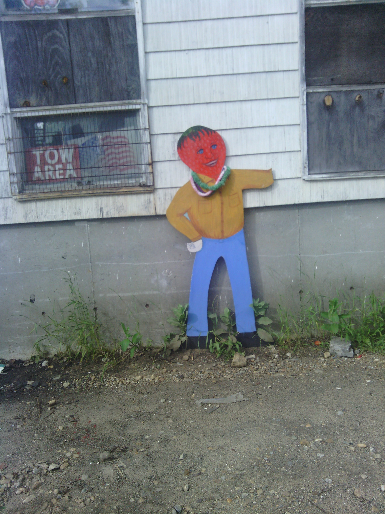
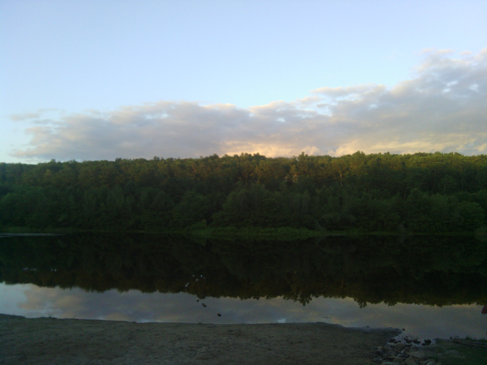
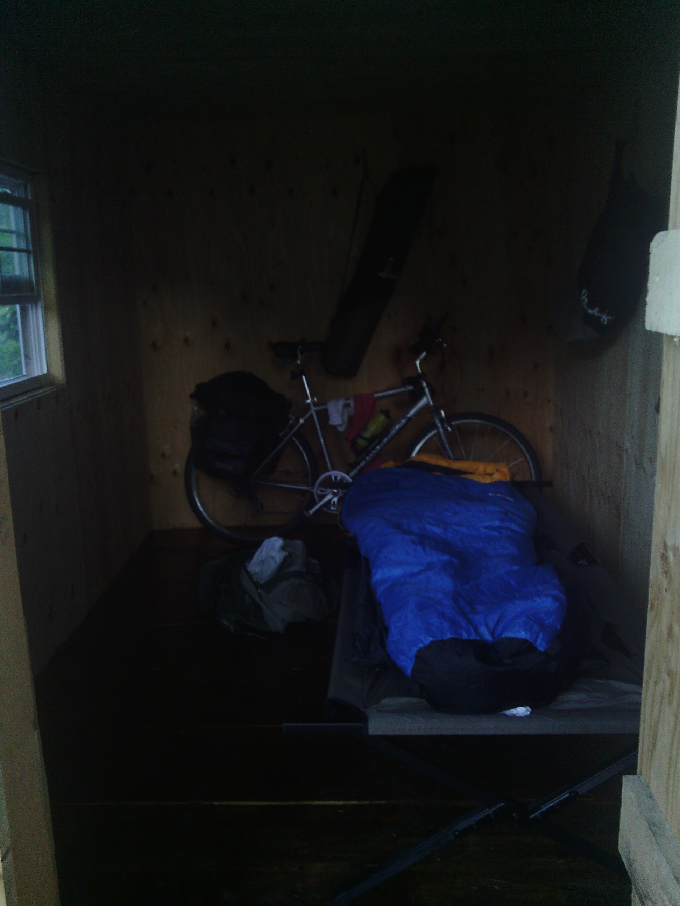

+++
title = "Day 40 -- New Milford CT to Stafford Springs CT -- New England hills"
date = "2013-06-13T01:06:29+00:00"
tags = ["Bicycle Trip"]
categories = []
image = "IMG_20130612_200621.jpg"
+++

I was very slow getting up this morning and didn't even get out of bed until almost 9:00. By the time I found a campground I liked and plotted my route it was 9:40. But today didn't have to be as long as yesterday, and with no rain in the forecast, it didn't hurt much to sleep in.

Connecticut is much hillier than I expected. The terrain I crossed today was not significantly different than most of my Pennsylvania days. But by now my legs are trained for it and I was able to move quickly through the small towns and winding roads. During some of the steeper climbs I thought about how easy it would be to turn and ride south for a few hours until I hit the water and celebrate my trip a little early, but never actually considered the idea. It does seem cool that I'm within a days riding distance of the water now though.

When I got to downtown Stafford Springs I had a quick milkshake before heading on to my campground. I've had some good and bad campgrounds on this trip, but I think this one, my last one, is the best. Which says a lot because some of the campgrounds in Missouri were pretty awesome. The owner knocked the price from $30 to $20 for me, let me set up in a cabin and use his cot for free. And even let me ride along on his trip to the grocery store.

Since I had a few longer days this week I managed to get one more day ahead of schedule. Just two more short days to go.

Total distance: 134 km
Average speed: 22.2 km/h
Trip odometer: 5181 km

Photos:

