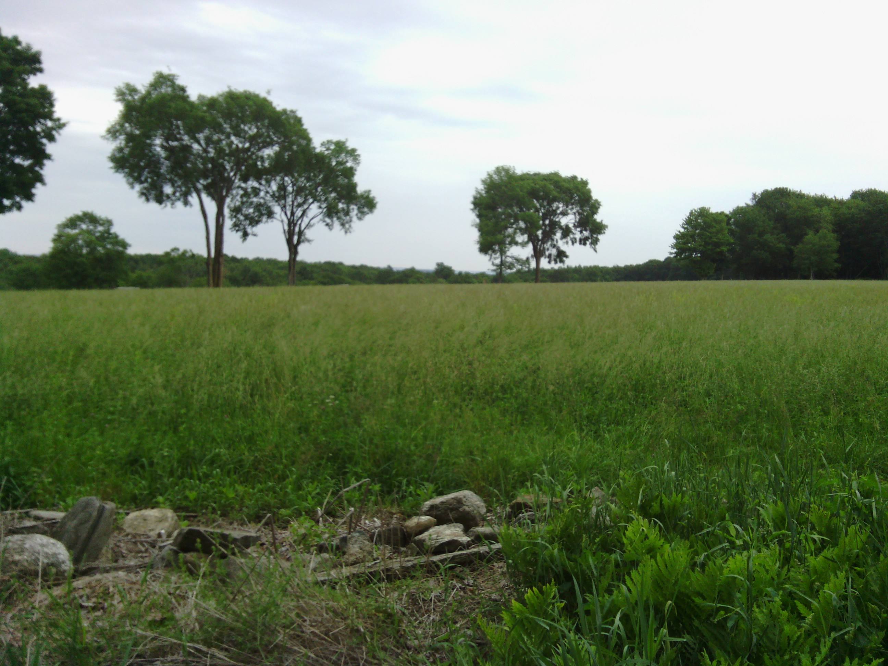
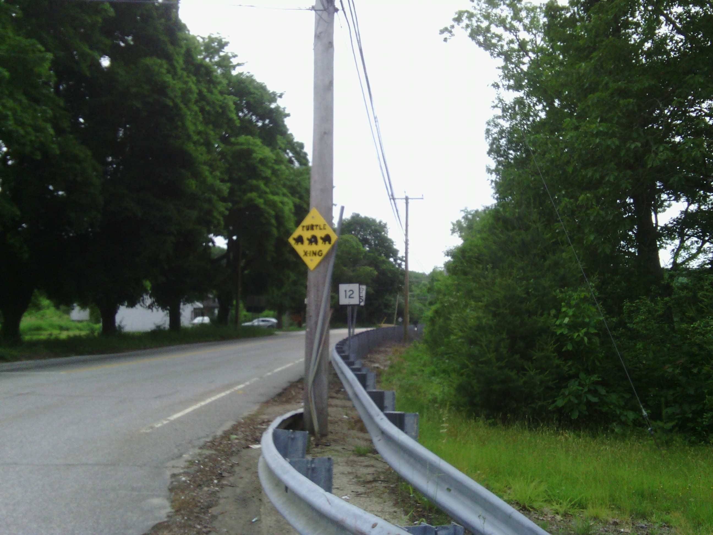
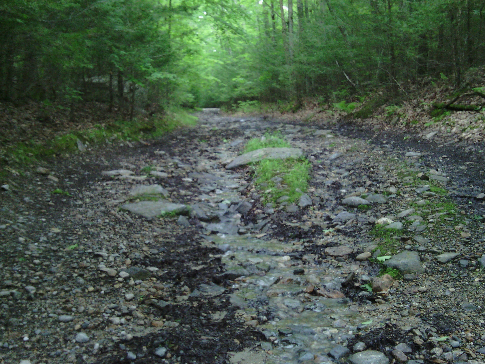

+++
title = "Day 41 -- Stafford Springs CT to Douglas MA -- Final state"
date = "2013-06-14T03:35:53+00:00"
tags = ["Bicycle Trip"]
categories = []
image = "IMG_20130613_104239.jpg"
+++

I set my alarm early expecting rain in the afternoon. Although I was a little sleepy, I managed to be packed up and on the road by 8:00. The terrain was still hilly and my legs were sluggish at first, but they warmed up eventually and I was on my way. I passed from town to town and the short ride went by quickly.

My route passed through the north west corner of Rhode Island. As I approached the state line the road turned unpaved, then flooded, then rocky and unridable. I was bummed that I would have to push the bike for a kilometer or so as the sprinkles started to fall, but there was no other option. When the road turned uphill and water ran down the other way it felt like I was pushing the bike up a creek which made me laugh.

Not long later I entered Massachusetts and traveled the short distance to my friend Annika's house. She worked in the afternoon today and I made it to her place just before she had to leave. I spent the afternoon showering, doing laundry, and catching up on some emails from the past few weeks.

When Annika and Mike got home for the evening we went shopping, made dinner, chatted for a while, and played games. Dinner was grilled chicken which Mike injected with butter and olive oil. Delicious. It was a great time catching up with them partly because I haven't seen them for a while, and also because they used to live in Los Angeles and knew some of the same crew I saw at the beginning of the trip. I guess it's been a long ride since LA. I can't believe it's only one more day to Boston.

Today's distance: 65 km
Average speed: 20.9 km/h
Trip odometer: 5246 km

Photos:

Comments:

> That's definitely a creek. Did any cars actually pass while you were on that road?!
> **Sarah22bara**
>
>> I don't think any cars have taken that road this century.
>> **Josh Orndorff**
