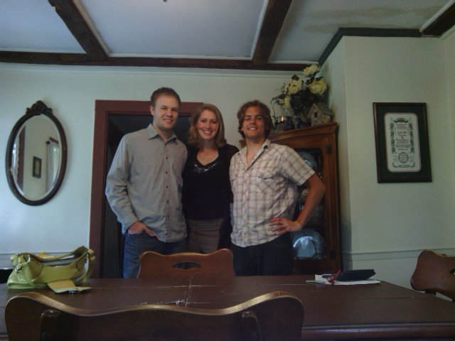
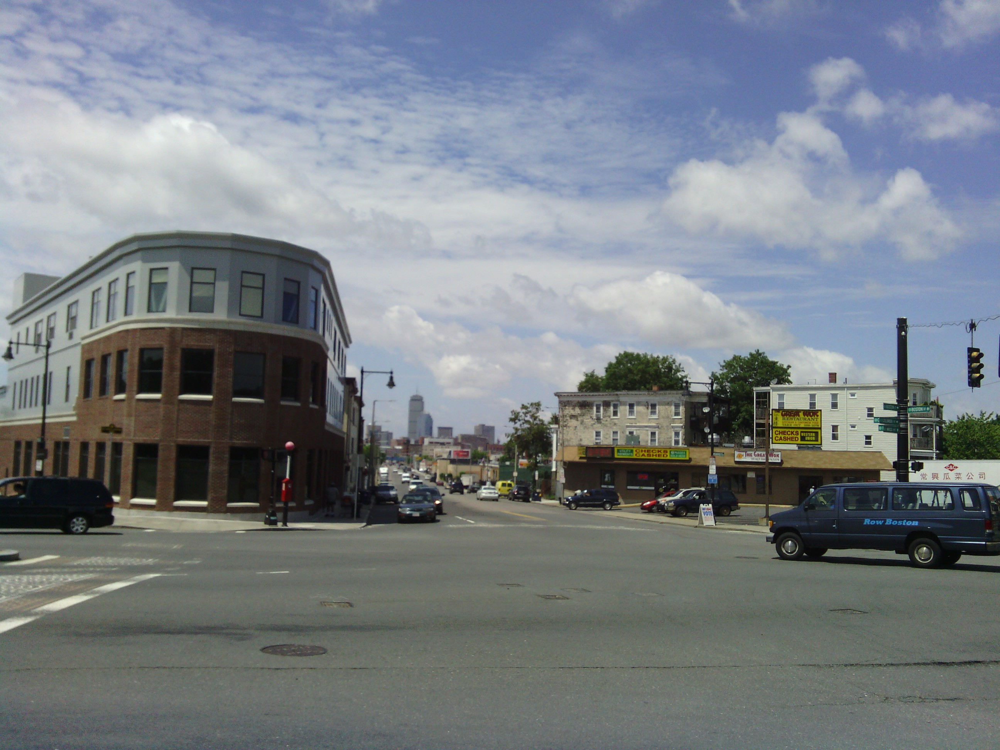
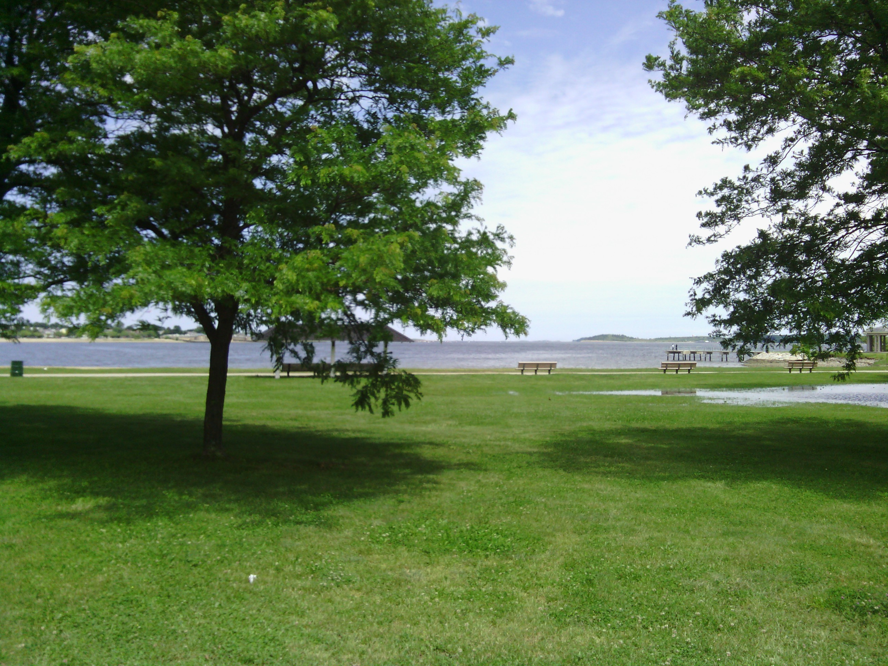
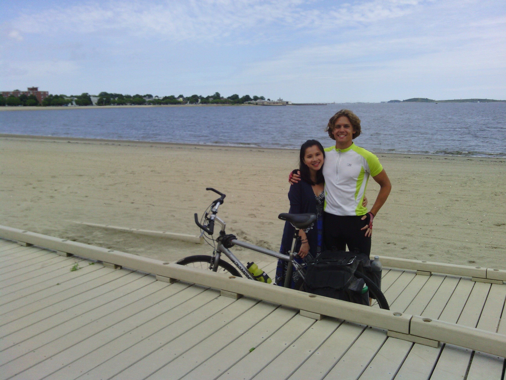
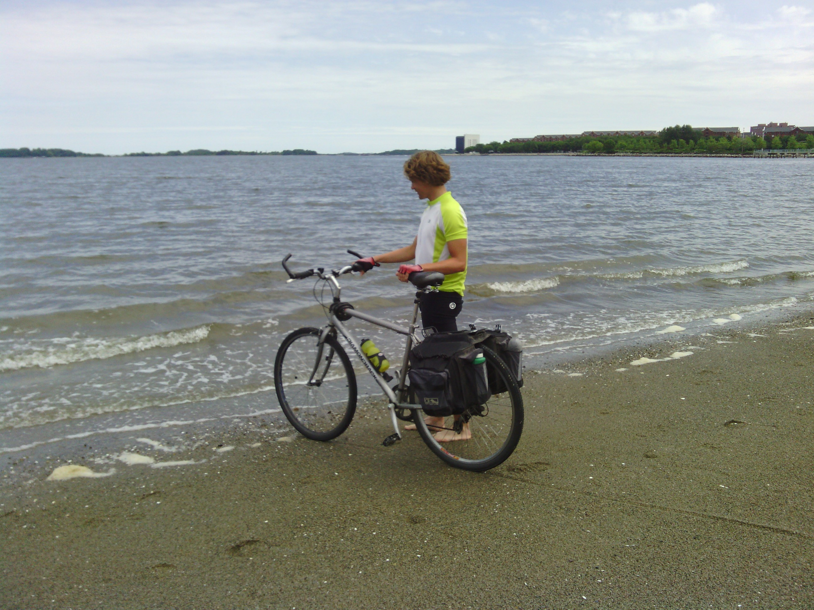
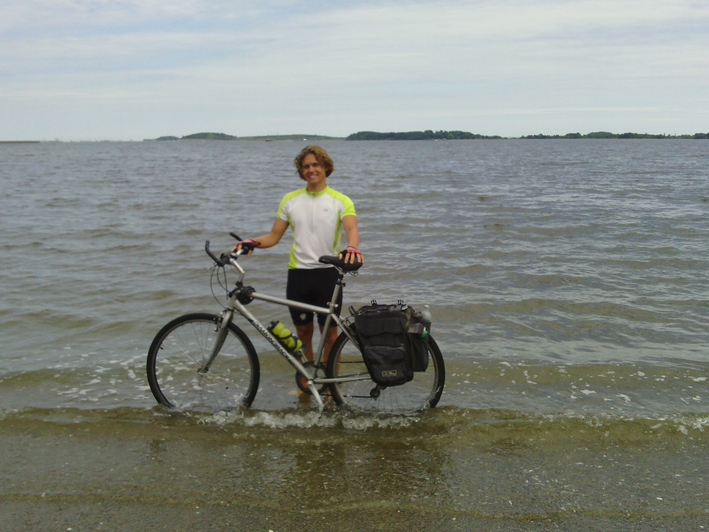
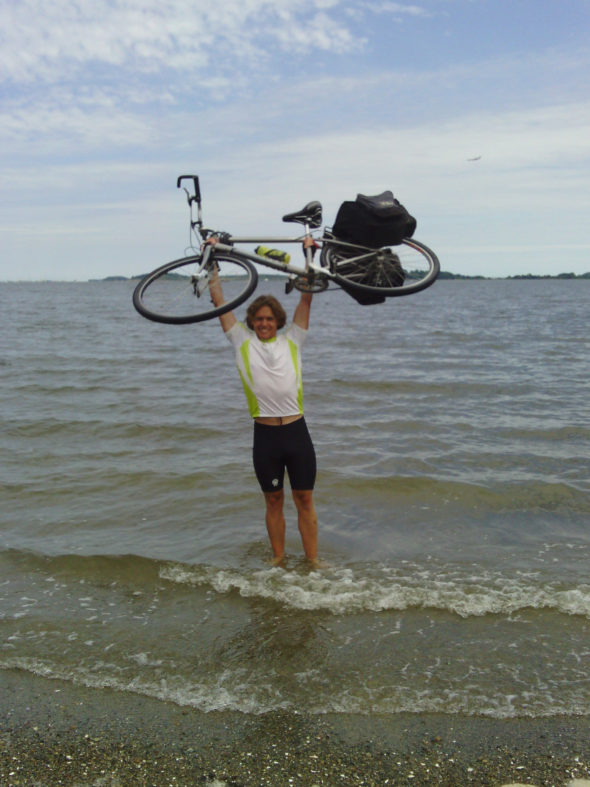

+++
title = "Day 42 -- Douglas MA to Boston MA --Finish line (oh my gosh, I actually made it)"
date = "2013-06-15T06:04:23+00:00"
tags = ["Bicycle Trip"]
categories = []
image = "IMG_20130614_140742.jpg"
+++

The final day started around 8:00 with a breakfast of pancakes complete with Mike's homemade syrup. It was a delicious way to start the day, and I was excited to finally be reaching the Atlantic. But the weather forecast looked wet, and there was a steady drizzle outside the breakfast room window. I took my time getting ready not wanting to go out into the rain, but just before 9:00, my planned departure time, a bike trip miracle happened: a bit of sun showed through the clouds. The rain slowed and stopped, and suddenly I was excited to head out and finish the adventure.

I followed route 16, another winding, scenic New England road, for a while passing through several small towns. The road also happened to be Annika's route to work and as she passed she stopped to take a few pictures. As I rode, the sky got clearer and my excitement continued to grow.

By the time I reached the outskirts of Boston there were large patches of blue above me, and I stopped to call Maggie who planned to met me at Old Harbor beach. She was on track to get there the same time I did. My first glimpse of the ocean through the trees was exciting, and I had a hard time believing it was real. I rode along the beach and met Maggie, and we headed to the boardwalk. As I pushed my bike to the water's edge I was suddenly hesitant to dip the wheels. Reaching the ocean would be the end of this trip that has occupied the last six weeks. After a moment of nostalgia I rolled the bike in and celebrated. I even made sure to dip the section of my original rear tire that I replaced in Missouri. 

And so the trip had come to an end. It feels like just a few days ago I was wheeling the bike off the end of the boardwalk in Santa Monica to dip a wheel in the Pacific. It's been a long, hard, awesome ride since then. A ride that was worth every pedal stroke, detour, and broken spoke of the way. Thanks for sharing in the adventure everyone. We made it!

Total distance: 81 km
Average speed: 22.1 km/h
Trip odometer: 5327 km

Photos:

Comments:

> Congratulations!!!! That's amazing! and tell Maggie I said hi.
> **Sarah22bara**

> You simply amaze me with the things you can accomplish. Congrats, man!
> **tymorehart**

> Awesome Josh! Been following you every day!  Congratulations!
> **Steve Hannah**

> You are the man buddy.
> **Terence**

> Way to go Josh!   I wish I could have done it with you.  It seemed like an awesome trip.   Next time you should bike from Canada to Mexico.  Its much shorter.
> Have you weighed yourself?  I've heard most people loose about 20 pounds when they do this.
> **George**
>
>> I didn't have a really accurate starting weight, but it looks like I lost about 15 pounds. Hopefully I'll be able to keep them off for the summer. I don't know if there will be a next time, but if there is I'd like to do the Dakotas, Montana, Idaho, etc. Places I've never been, and the real hard party of the Rockies. I'll call you so you can join in before that trip. Thanks for the encouragement along the way man :-)
>> **Josh Orndorff**
>>
>>> Don't you mean 6.8 Kg?  :-)
>>> **George**

> Congratulations Josh!!!  AMAZING!!!!  You are an inspiration as I've said before you set a goal and go for it and you accomplished this unbelievable journey!!!!  So what is your next adventure!?
> **Gail Murray**