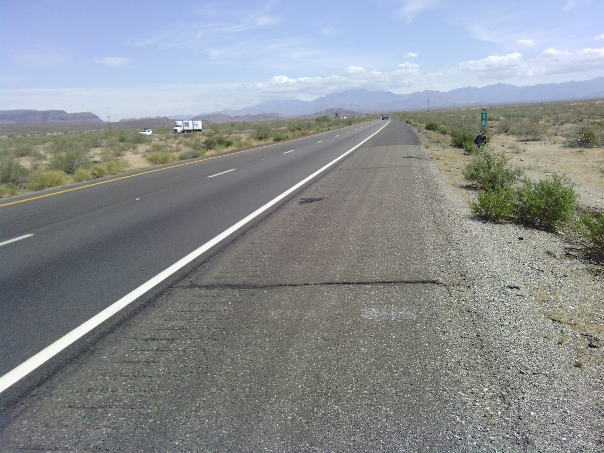
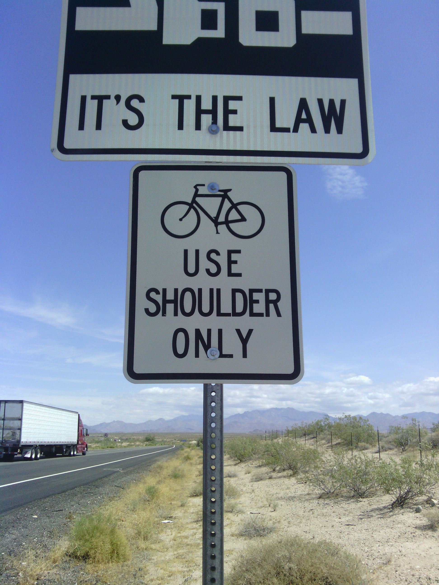
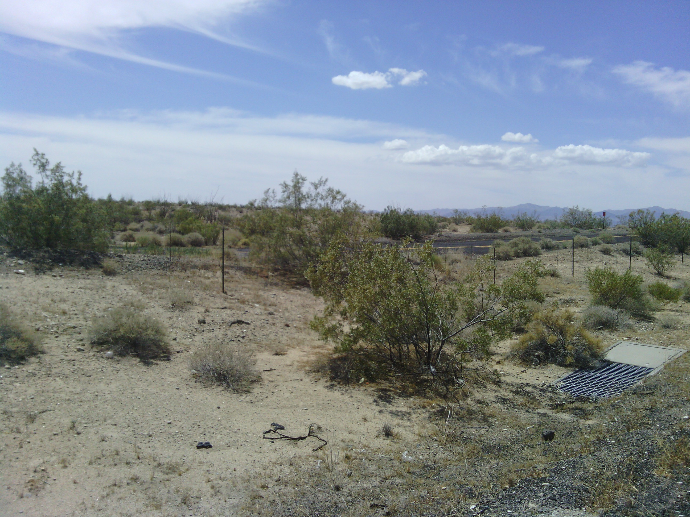
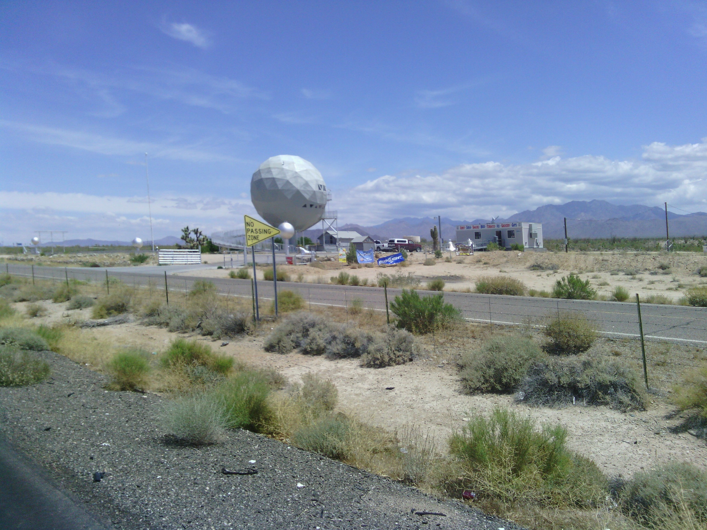
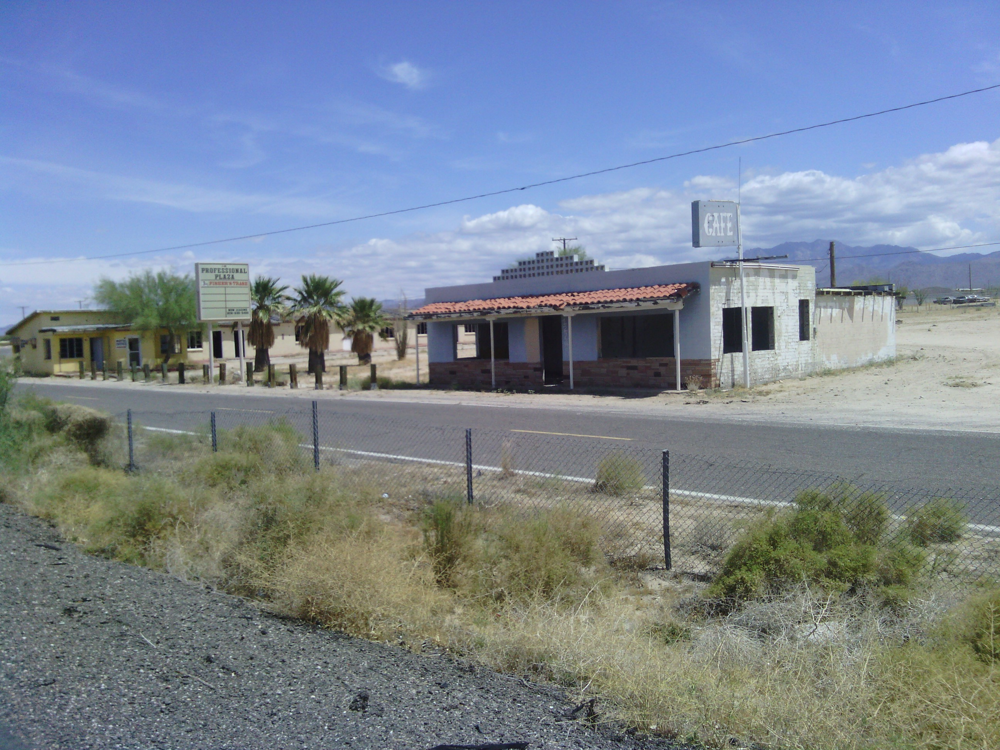
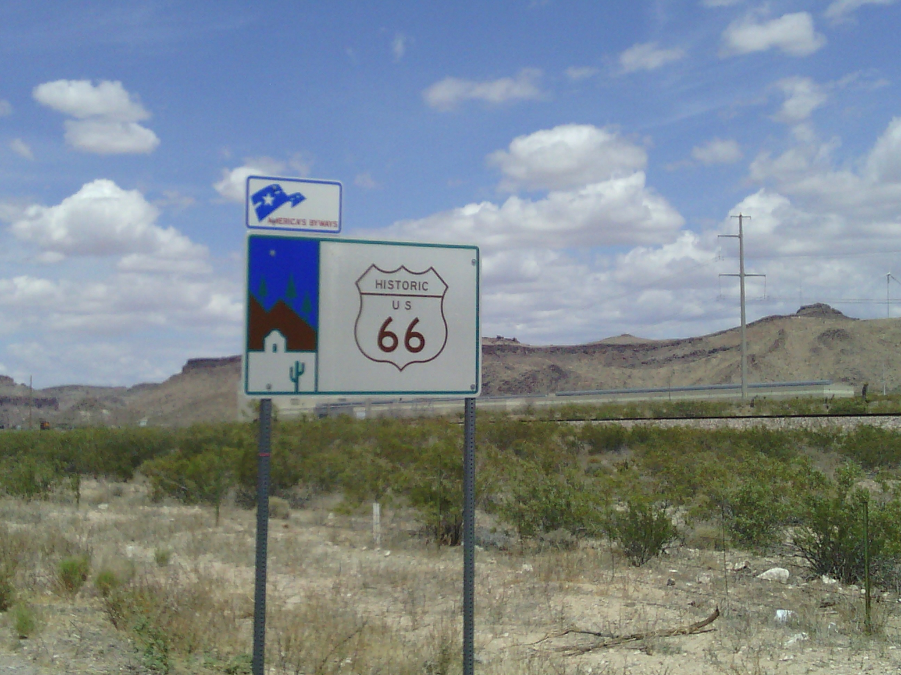
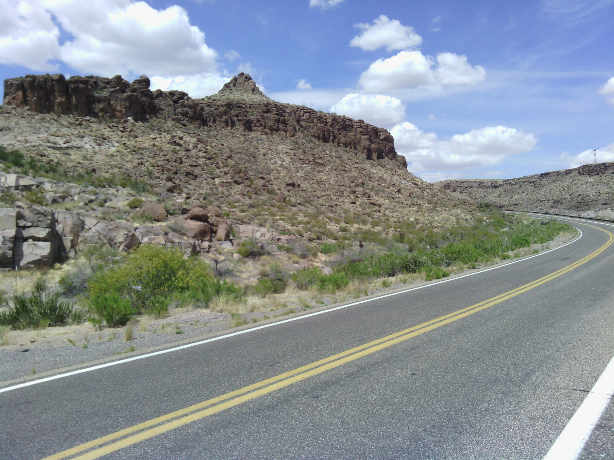
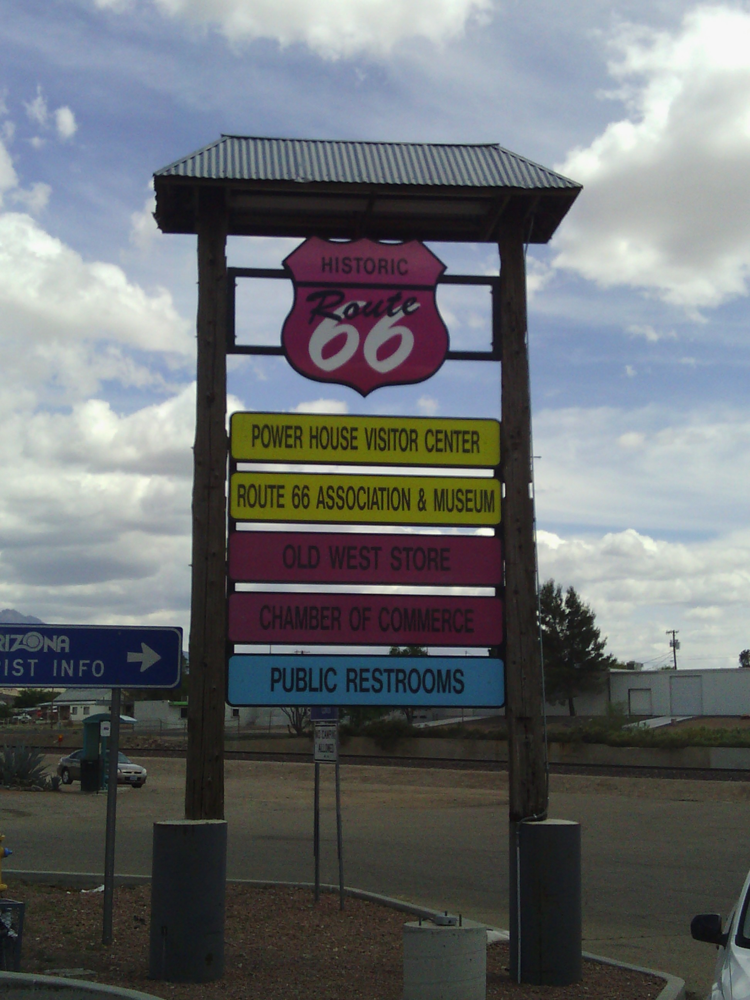
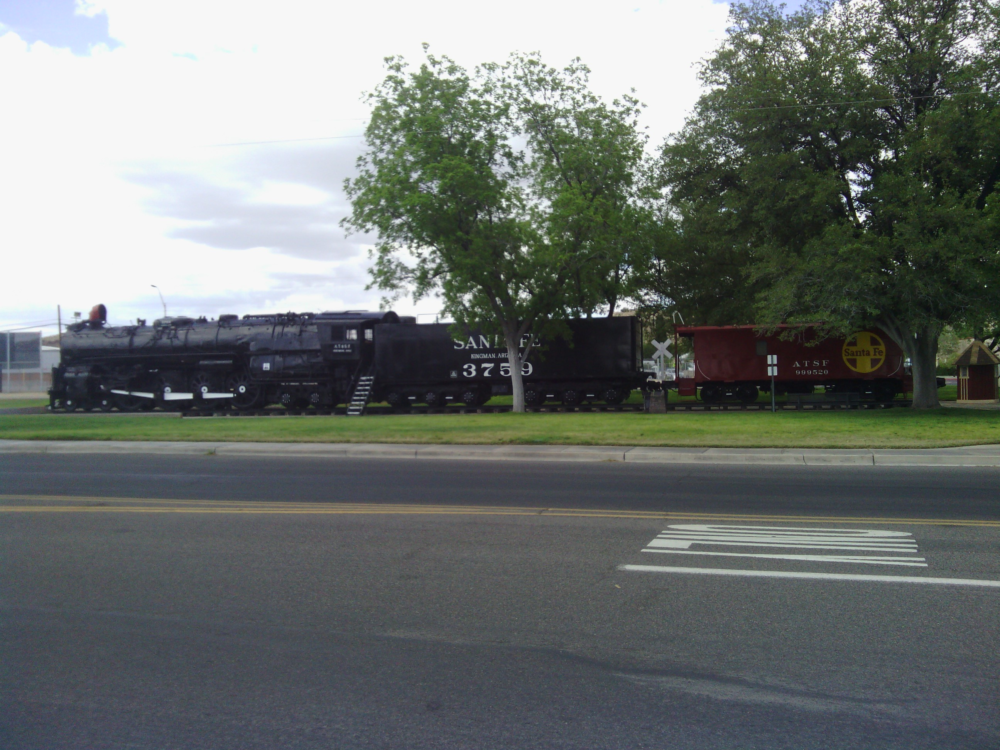

+++
title = "Day 5 -- Lake Havasu AZ to Kingman AZ -- An uphill climb"
date = "2013-05-09T03:29:59+00:00"
tags = ["Bicycle Trip"]
categories = []
image = "IMG_20130508_151539.jpg"
+++

After sleeping through a few alarms this morning, I woke up and had breakfast with Kevin before hitting the road at about 9:00. Today's route featured a lot more straight roads, a lot more sand, and my return to historic route 66. The first third of the ride was on route 95 and featured up and down hills with a slight net elevation gain. The rest of the route was on I-40. Riding bicycles on I-40 is actually legal in Arizona as long as it is on the shoulder. At first the shoulder was very rough despite the lanes being nicely paved and I couldn't help worrying that I would break another spoke. But eventually even the shoulder had a nice smooth surface to ride on, and the gradual uphill climb didn't feel too taxing.

Although the ride was scenic and not too long, I was feeling a little bummed for a while because I started to have some neck, back, and arm pain. I'm hoping it is just a fluke and not the beginning of a bigger problem caused by my biking posture. I was also a little disappointed when I took a rest and my bike computer reset. Luckily I took note of it before the break so my totals can continue.

I made it to Kingman around 2:00, and took a look around their downtown area which emphasizes route 66 and the heavily used railroad that runs through town. After that I headed a few more km up the hill to meet my host, Bonita, who I meet on couch surfing. Tomorrow will be more uphill and entirely on route 66.

Today's distance: 96 km
Trip odometer: 618 km

Photos:

Comments:

> Hi Josh I see you bypassed Oatman but that was probably a good thing. It would have been longer and more up and down and might not have anything open except on a weekend. Good luck as your trip continues.
> 
> **CW Mitchell**
>
>> Yeah, I took the shorter more gradual (ie. wimpier) route instead of passing through Oatman :-) Thanks for the good luck, I think it kicked in tonight when the rain held out for me.
>> **Josh Orndorff**
>>
>>> I made it to Oatman today (by car not bicycle). It was much more commercialized than I expected. It still would have been a cool place to ride on the bicycle trip because of all the desert highway.
>>> **Josh Orndorff**

> Hi Josh, 
> Nice to see you are having a great adventure!!!  I'm always amazed at the adventures you take on!  Can't wait to read each day and how it is going!!!  Continued success and be safe!!!
> Gail
> **Gail Murray**

> World's biggest golf ball? Lol and you gotta love the abundance of public bathrooms in America!
> **Sarah22bara**