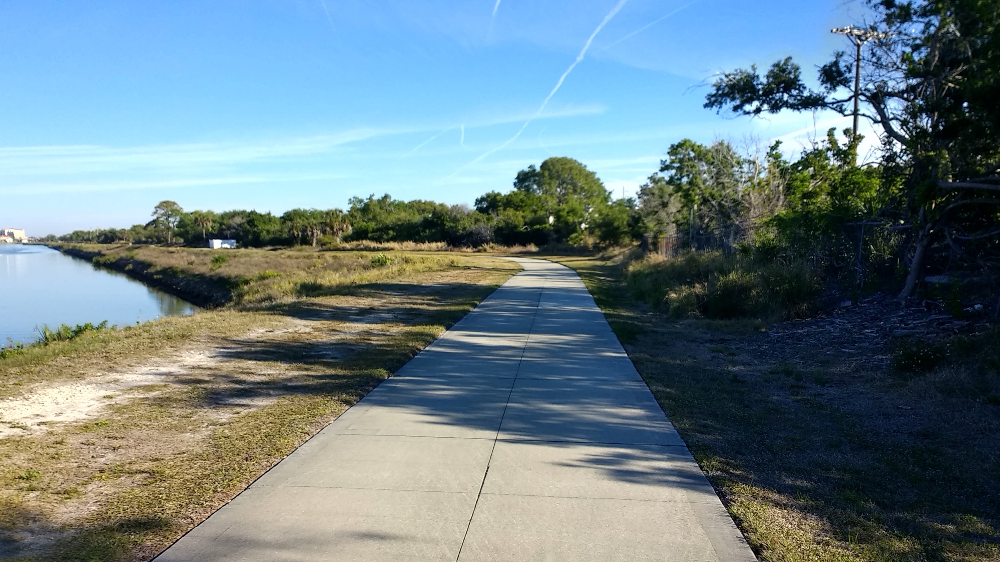
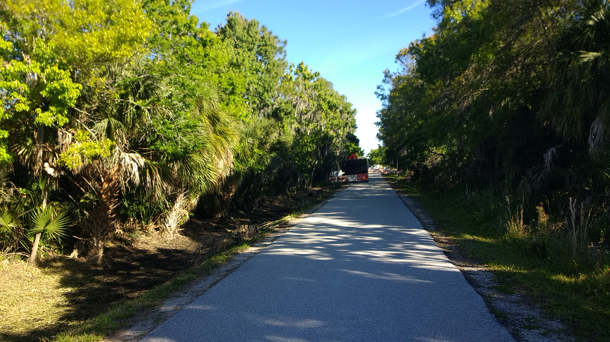
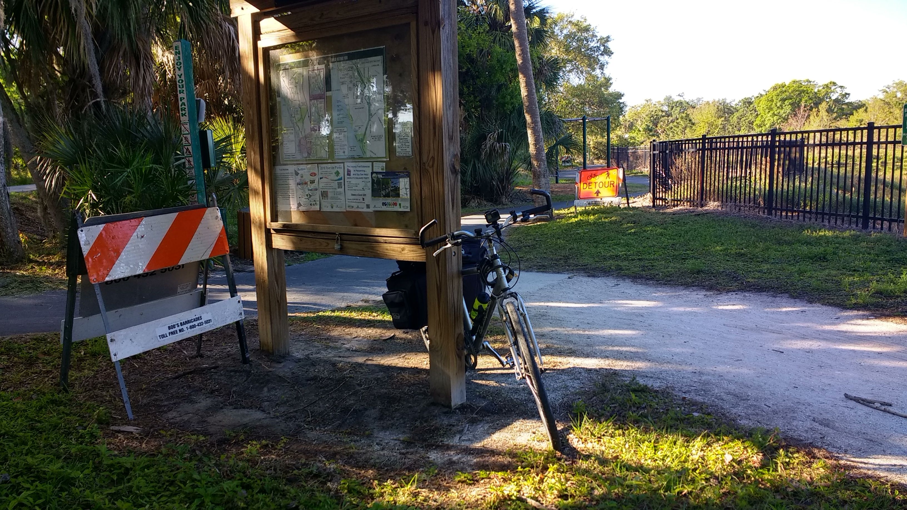
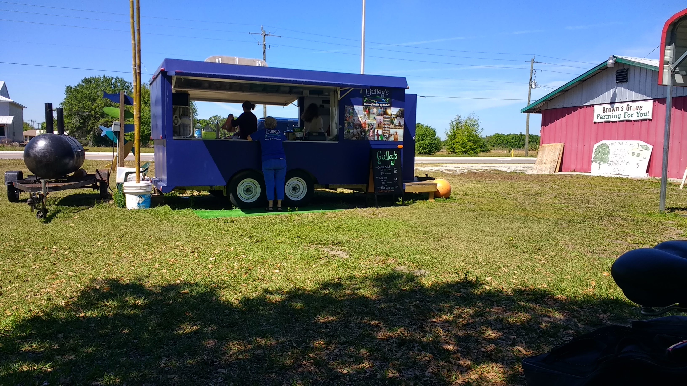
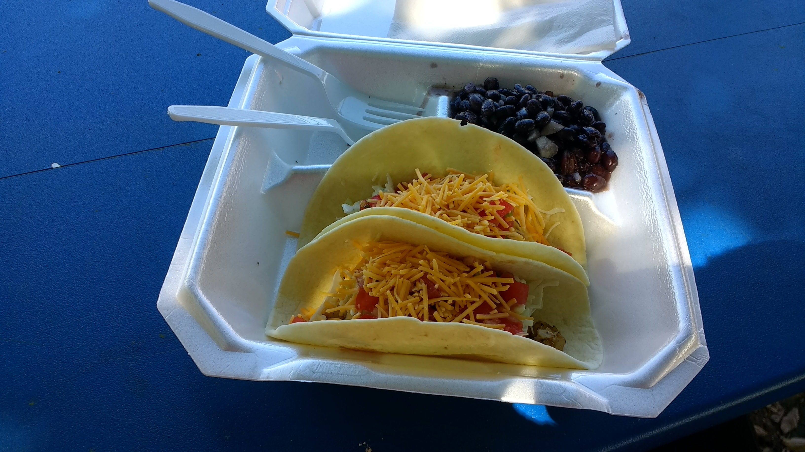
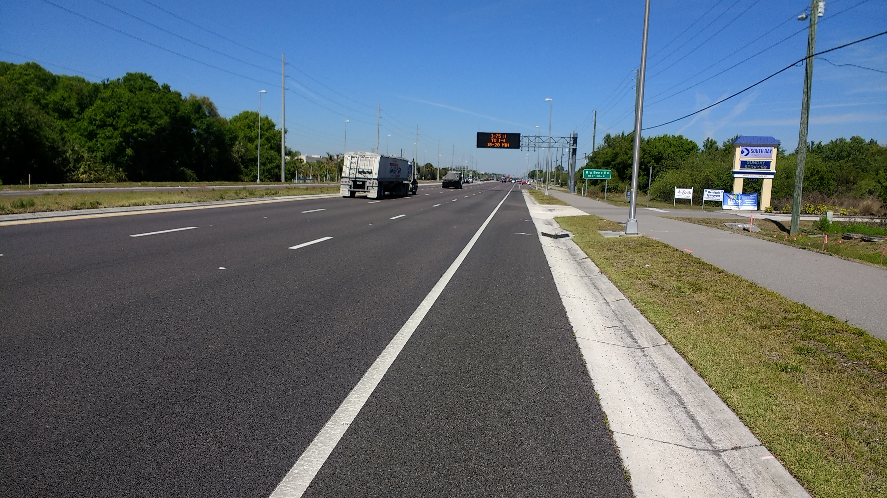
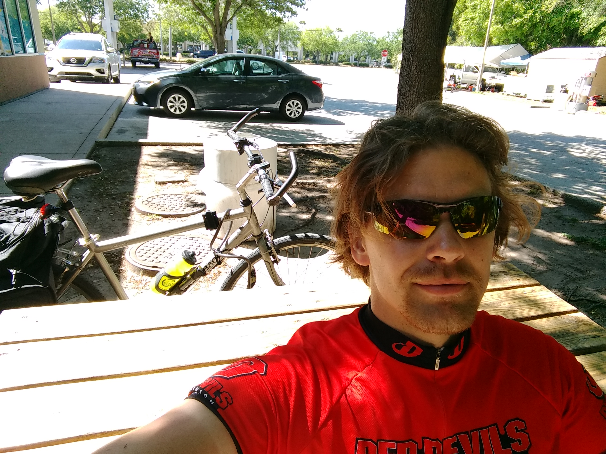
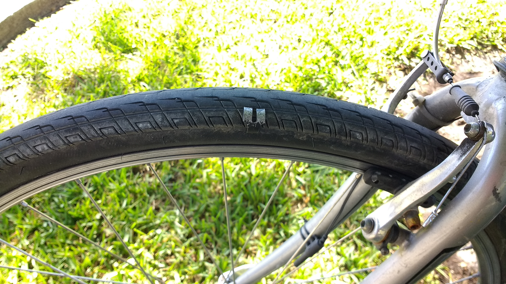
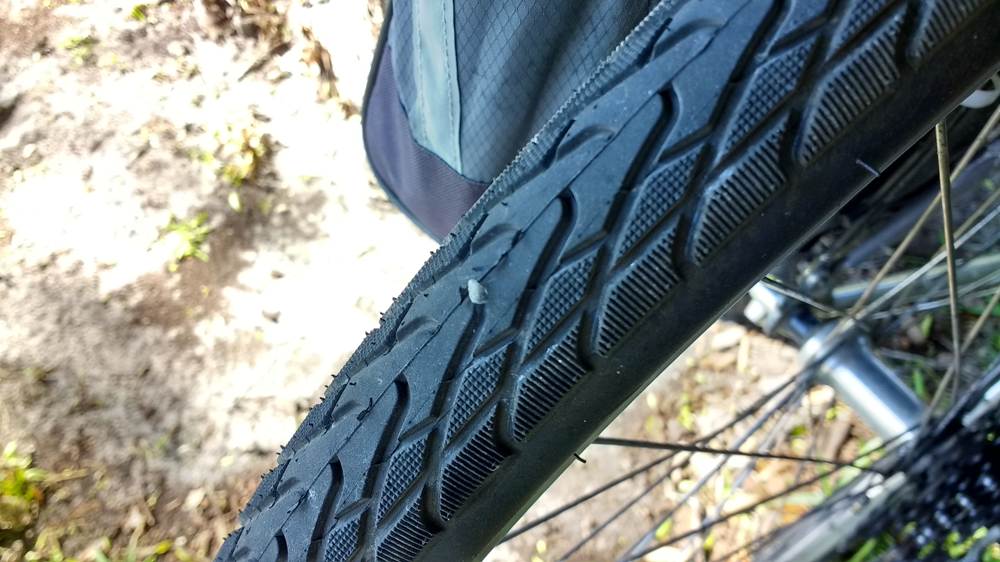
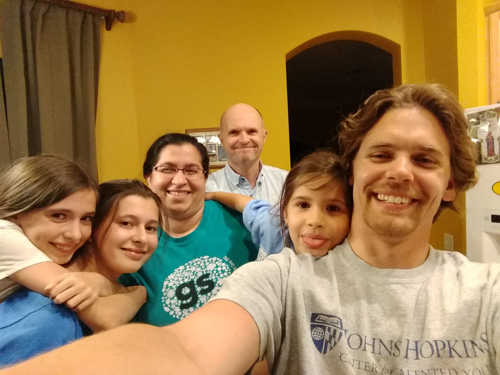

+++
title = "Day 5 -- North Port FL to Lutz FL"
date = "2018-03-16T20:52:06+00:00"
tags = ["Bicycle Trip"]
categories = []
image = "IMG_20180316_150146184.jpg"
+++

I did a better job waking up today, getting out of bed around 7:15. George made me a delicious breakfast of eggs and toast to get the day started right. Then I packed the bike, said goodbye and was on my way just before 8:00.

It was cold (39F) so I wore the long fingered gloves and neck warmer for the first while. Luckily there was almost no wind and it was actually being me as route 41 worked easy for the first hour of the ride.

Although today was a long ride, much of it kind of blurs together. There was a pretty nice dedicated bike trail at the beginning, and bike lanes on a lot of the rest. Although they have a tendency to suddenly disappear at important times like freeway interchanges. I stopped for lunch at a food truck in a farmers market. Their specially was smoked mullet. Turns out mullet is also a fish. The sample I tried was delicious, but it was a bone-in fillet and I worried it would take me too long to eat on a day when I was trying to make good time. So I went with fish tacos instead.

As I worked my way into Tampa, traffic picked up and navigation got harder as it usually does in cities. Btw, the phone holder I bought us total bs. It it difficult too attach the phone to, constantly pressed the side buttons, and covers to much of the screen. I should have taken Shannon's advice. But I made decent progress, and was actually on schedule to arrive by 6:00. I was pretty excited about that considering when I left in the morning I was worried about missing dinner plans that ended at 8:00.

With about an hour and a half to go I told Sanders that I was ahead of schedule, but still left room for error (I hate to over-promise on time estimates). It's a good thing I did because just a few km later... You guessed it. The hissing started. Some piece of metal junk was lodged into my front tire. This is the first front tire issue so far. So I found a shady place to fix it up.

While I was at it I inspected the back tire again just for good measure and found two pieces of glass stuck in it. Luckily I found them and dug them out before they punctured the tube, but I have to say, I'm starting to wonder how long my patience for tire changing will last. At this rate, which I sincerely hope decreases, I'll spend about $700 on tubes on this trip.

Anyway, I was back on the road with only 10ish km to go and glad to be on the home stretch. I navigated the last big intersection of the day and started to pick up some speed when I heard... any readers from the last cross country trip wanna guess?... I heard a spoke snap. Deep breath. Thought about just riding through and dealing with it later but decided not to put any extra stress on the remaining spokes. So I stopped, took the packs and rear wheel off, and proceeded to replace the broken spoke. I had to bend the new one more than I liked to get it in, but maybe that's normal? It was the only option without the tools to take the cassette off. I trued the wheel reasonably well, and finally got on my way in what I really really hoped was the home stretch.

Arriving at Sandra's house, I met the family, and got a quick shower. Then we headed to their church for delicious fish fry.

When we got back, I fully inflate the front tire, patched the punctured tube just in case I ended up needing a spare, and trued both wheels. Hoping for no breakdowns tomorrow!

Daily distance: 165.90km (I'm starting to suspect my bike computer might have a slight miscalibration)
Average speed: 22.6km/h
Trip odometer: 691km

Photos:

