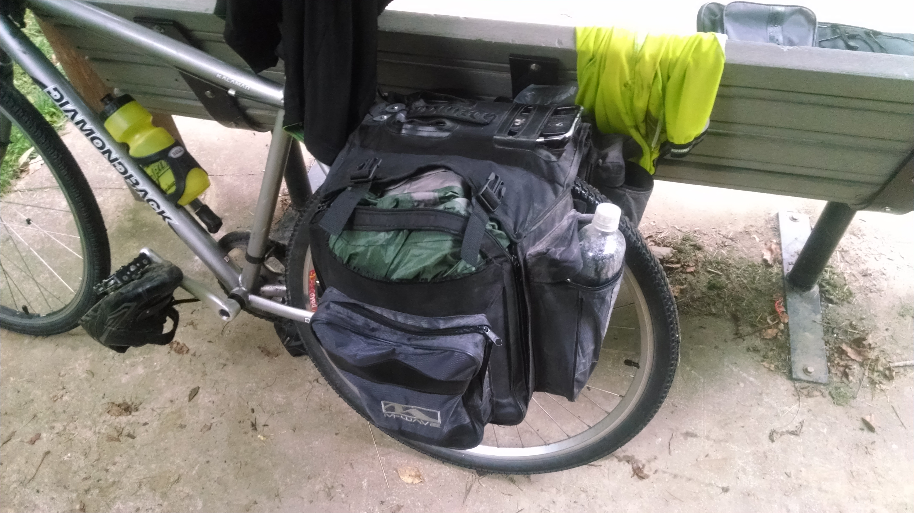
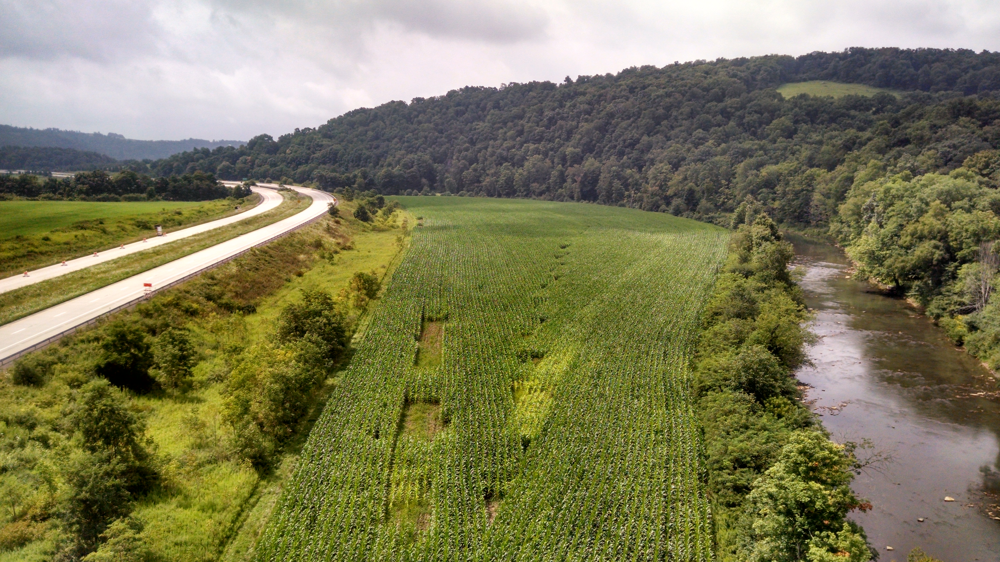
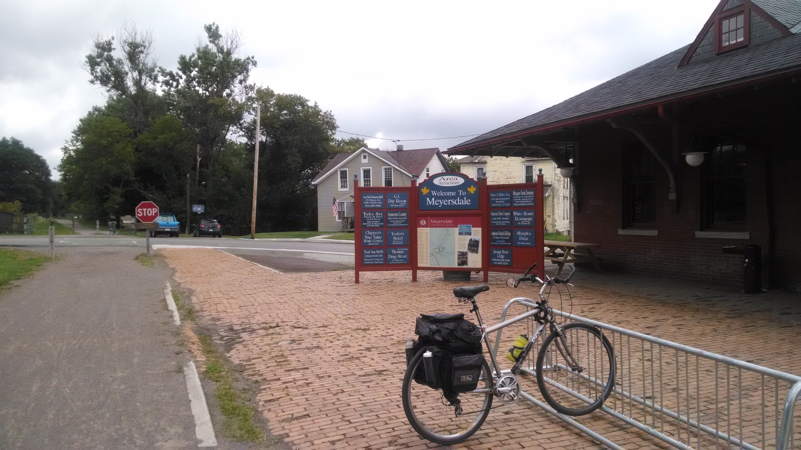
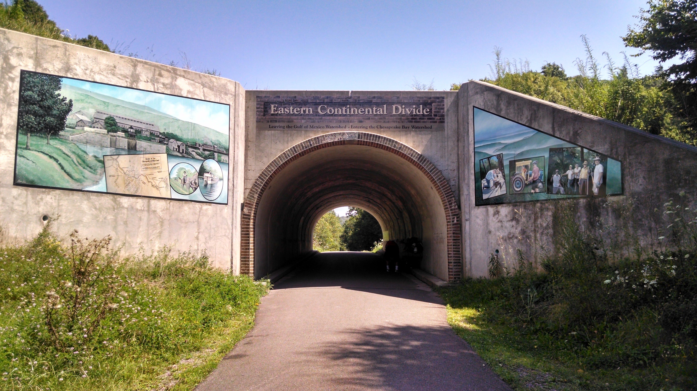
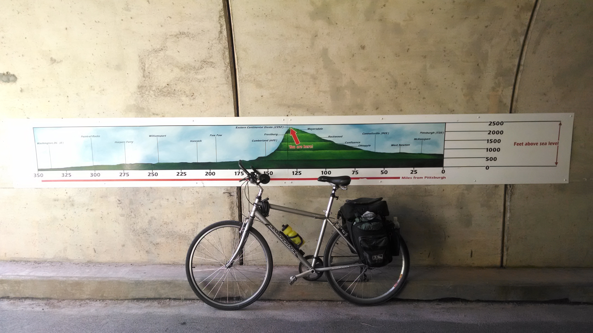
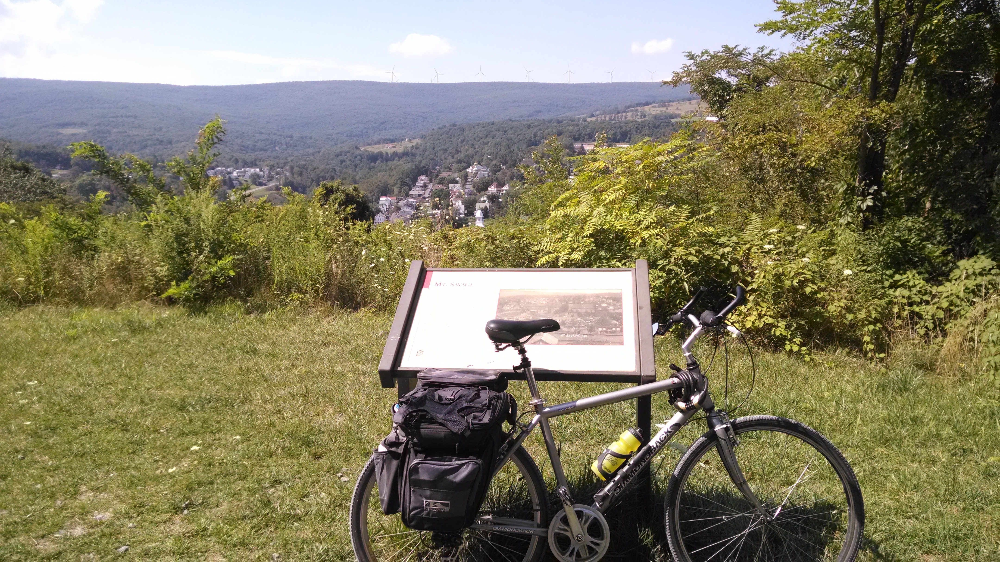
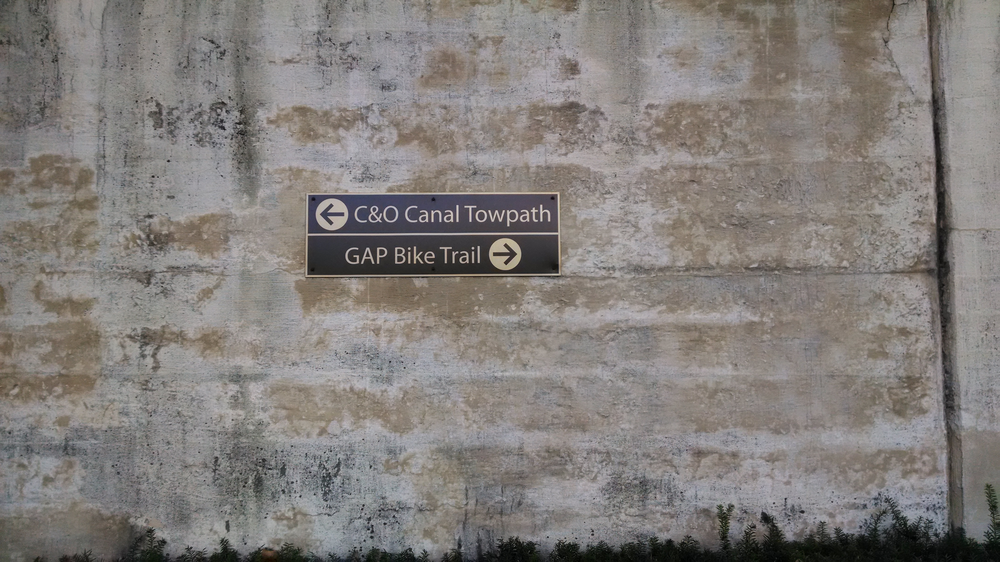
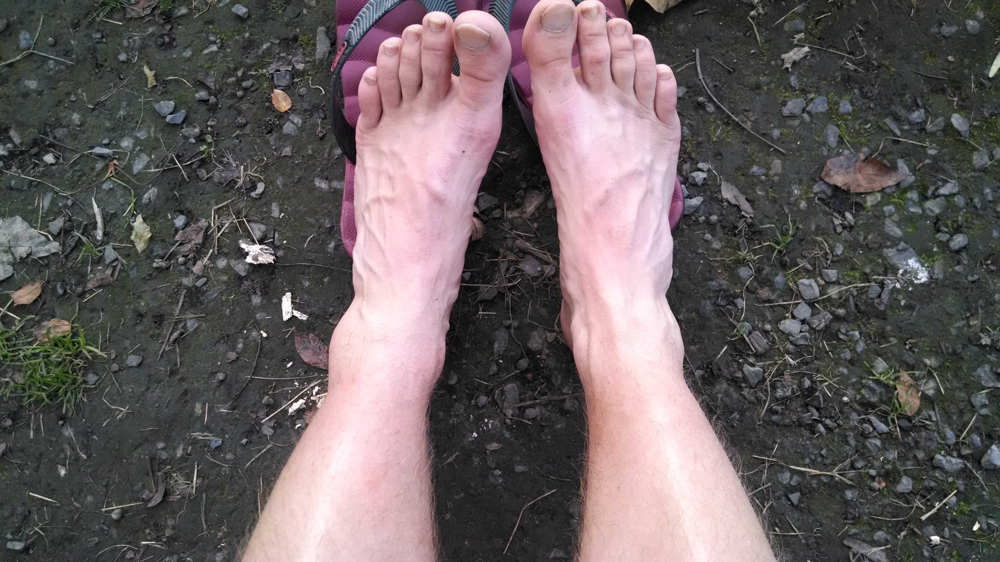

+++
title = "Day 5 -- Ohiopyle PA to Cumberland MD -- Crossing the divide (and the line)"
date = "2014-08-18T00:17:57+00:00"
tags = ["Bicycle Trip","Travel"]
categories = []
image = "IMG_20140817_143405656.jpg"
+++

Even though I was camping out in a technically illegal spot, I still snoozed a few alarms this morning. I finally got up when raindrops started to fall. I quickly moved everything to the one bench in my clearing that had an overhang so I could pack up while staying dry. Between the rain and the sorer-than-expected ankle I wasn't in the best mood. But it got even worse when I was packing my tent into my saddle bags and one of them ripped open. Right across the top; a huge rip. The tent was in well enough that it wouldn't fall out so I left it and decided to think about it more later. I'll probably end up switching which side the tent and clothes go in and making these bags work until this trip ends in DC.

After the heavy rain subsided I got on the trail and rode 10km into Connellsburg where I filled my bottles at a restaurant and used the bathroom at a campground. Unfortunately I followed the wrong trail out of the campground and by the time I was on the right track again it was almost 10:00.

I stopped very briefly in a few towns for water or to let my butt rest, but with the drizzle it wasn't worth standing around or chatting too long. The climb was going smoothly and still didn't feel too strenuous although I did occasionally have to shift to second gear.

I stopped for lunch at subway in Meyersdale, the last city before the eastern continental divide. I scarfed down an entire foot-long while my phone charged and I slowly dried. But when I stepped outside to check on my bike it was sunny again. I stayed a little while longer figuring out some logistics about where I might spend the night and letting my phone charge. It was exciting and encouraging to go back out and ride in the sunshine.

As I was leaving the city, so was a train on the tracks that run almost parallel the path. I managed to keep up with it for over 8km. Eventually I made it to the continental divide and entered the Chesapeake Bay watershed. Although the climb wasn't that bad, the decent sure was nice. I stayed in fifth or sixth gear almost the entire time down.

The steep downhill, it seems, is more popular because there was a group of about 30 cyclists hanging out around (blocking) the trail at one point and about 20 more who has already taken off. They were casually biking so I passed by them one at a time and eventually overtook the lead group which was about five twentyish year old guys and one girl. When I stopped to take a picture of the Mason-Dixon line the lead group passed me again and a few minutes later I was caught back up with them. Just when I was almost close enough to warm them that I was passing, one of them in the middle wiped out big time. One kid swerved off into the brush to miss him, another skidded to a stop and a third just barely hit the fallen bike but not the kid. In the the extra second of reaction time that I had I managed to get in the grassy shoulder to get around him. He seemed okay despite some road rash so I pressed on.

The downhill was going so well I cruised right through Frostburg and didn't stop until Cumberland. The most promising campground, the YMCA, was closed so I got to the visitors' center and found out that there are a series of primitive but free camping areas along the second half of the trail including one just outside of town. I let my phone charge at a public outlet for a while, stopped by the grocery store, and headed out. The campsite seems fine albeit a bit lumpy/sticky, but free sticks are good sticks.

Two more basically level days until DC.

Today's distance: 128 km
Average speed: 20.2 km/h
Trip odometer: 587 km

Photos:

