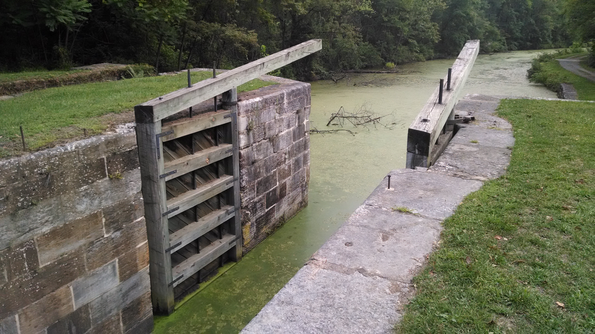
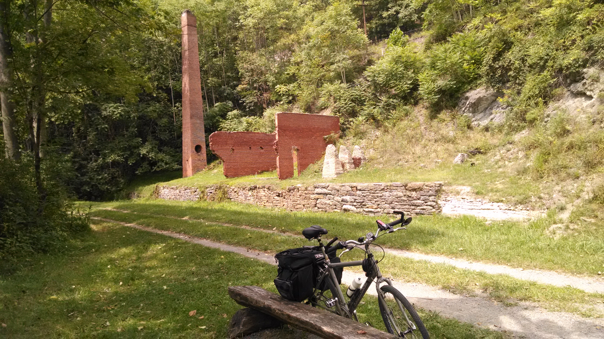
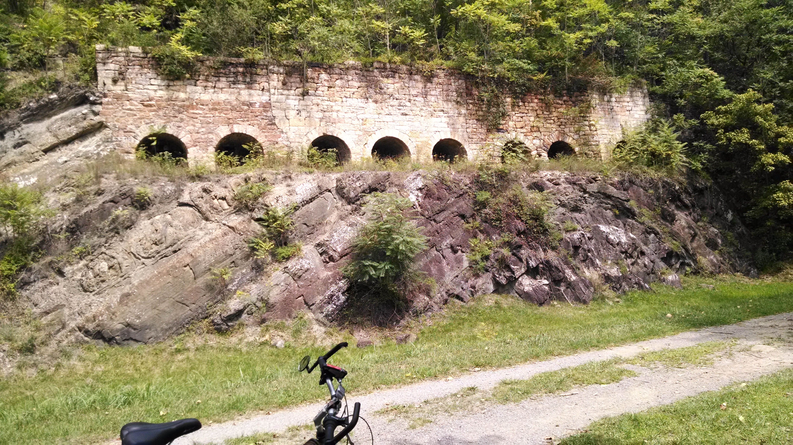
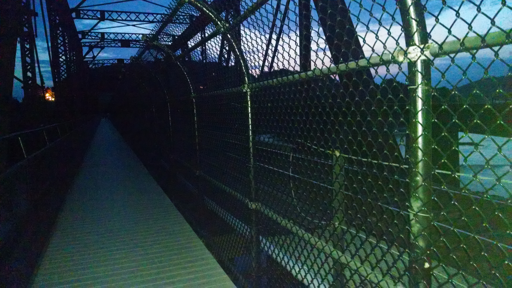

+++
title = "Day 6 -- Cumberland MD to Harpers Ferry WV -- The longest day"
date = "2014-08-19T02:58:59+00:00"
tags = ["Bicycle Trip","Travel"]
categories = []
image = "IMG_20140818_083315682.jpg"
+++

Sleep was weird last night. I fell asleep immediately, but then lay awake from three to five in the morning. Luckily I woke up just after seven and got on the road just after eight. It was my earliest start yet.

I had a quick turkey cheese wrap with ingredients I bought the night before, but then ditched the rest of the meat and cheese because I was afraid they had gone bad over night, and my stummy already felt a little funny when I woke up.

Having camped with no electricity two nights in a row my phone was nearly dead before I even took off, so I immediately switched it to airplane mode and navigated with the paper map in the brochure I picked up the day before at the visitors' center. The map forgot to mention that the second part of this trail was a little rougher than the first. As one other cyclist put it, "it gets a little boney."

I didn't stop for more than a quick drink and map glance until the 90km mark in Hancock. There were a few cool things to keep my mind occupied on that first stretch including the paw paw tunnel (which just looks black in the pictures), but by the time I got to Hancock I figured it was time for some real food. I got to subway and scarfed down a sub and a Sprite, which I had been craving for a few hours, while my phone charged and I considered where I might go for the night.

The next 40 km brought me into Williamsport MD where I did little more than check the map and call some hotels. I decided to get a hotel so I could have an actual shower, and charged phone for my last day of navigating the city and coordinating plans. And because it might rain tomorrow and I hate packing up in the rain (I'm a girl and I don't want to play anymore).

I decided that if I wanted a hotel I needed to earn it, and it would be nice to have a short last day anyway, so I pressed on just over 50 km more into Harpers Ferry. As the sun got lower more bugs came out and they are super gross in the face. By the end it felt like I was in a sea of bugs.

But finally around 9:00 I rolled into the hotel and took a much needed shower. Because it was dark I wasn't able to stop anywhere for dinner but I found the door to the continental breakfast room unlocked and solved the dinner problem. Unfortunately they didn't have any disposable razors for me to use, so I may have beard tan lines for a few days... Embarrassing.

Today's distance: 186 km
Average speed: 19.9 km/h
Trip odometer: 773 km

Photos:

