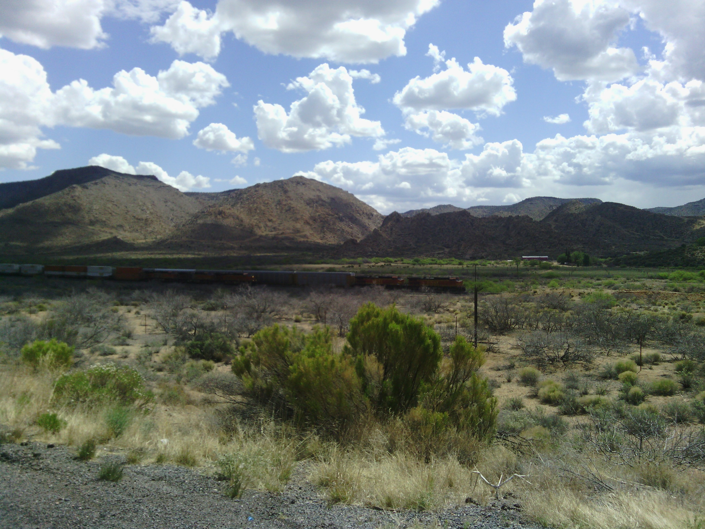
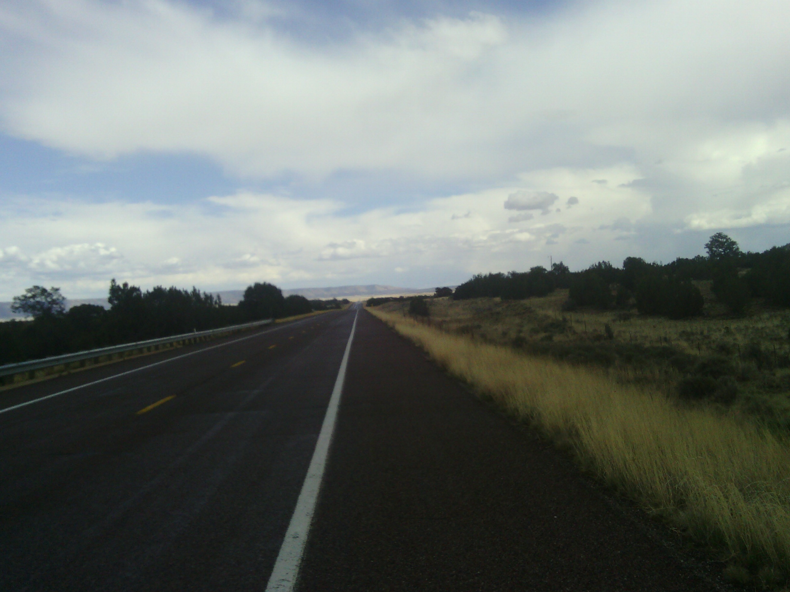
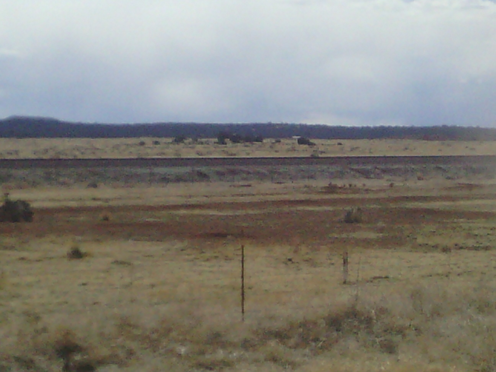
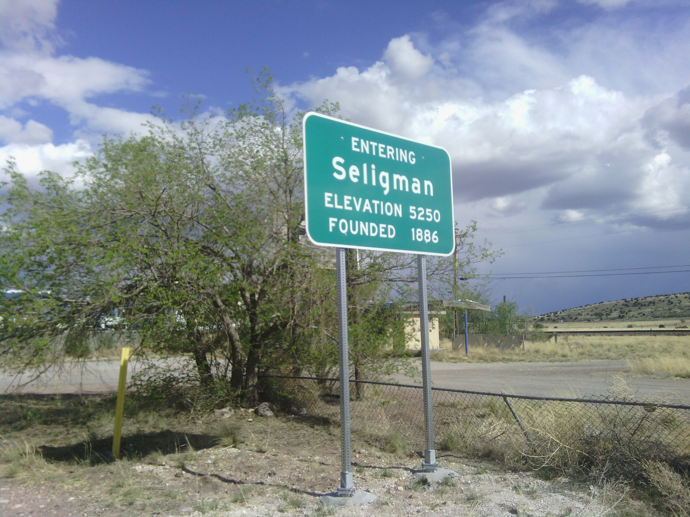

+++
title = "Day 6 -- Kingman AZ to Seligman AZ -- First rain"
date = "2013-05-10T05:03:40+00:00"
tags = ["Bicycle Trip"]
categories = []
image = "IMG_20130509_102757.jpg"
+++

After heading North for the last two days, it was good to make some actual eastward progress again today. Quite a day it was though. The entire route was on the original route 66, and it was not the same as interstate 40 at all. It was a steady uphill climb, and the wind blew from every possible direction at some point during my ride today.

I knew there was a chance of rain, and around the 55 km mark the sky was looking very ominous. I passed an animal rescue attraction called "keepers of the wild" and thought of stopping, but decided not to because I hadn't felt any rain yet. Sure enough, about ten strokes later the first few drops hit my face so I turned around and asked if I could hide from the rain there. The woman was very friendly and let me eat my lunch on their covered patio while the rain passed. Of course it didn't do anything but lightly sprinkle...yet.

About an hour after I restarted the real rain came and I got to test out my water proof saddle bag covers for the first and hopefully last time. The rain fell steadily for about an hour, and I made sure to keep moving so I wouldn't get cold. When I finally made it to the next stop a few motorists said, "so, you made it through the rain huh?" and I felt a sense of accomplishment.

Finally as I came into Seligman, the sky cleared and the road leveled out. The last little bit was even a tiny bit downhill.

I got dinner at a local diner before heading to the campground. When I was setting up my tent the sky turned dark again, and the wind really picked up. I was nervous that the slowly separating seams on my cheap tent wouldn't be waterproof, and while I was considering going to the motel next door instead, I broke a zipper on my saddle bag. Needless to say, my mood was pretty grim for a little while, but talking with my parents and a few friends helped, and the dark clouds held back their rain for the evening which helped even more.

Today, like day one, was mentally taxing, but I made it through. In fact, tomorrow I'll have made it through an entire week. And you know what Karl would say about that right?

Today's total distance: 141 km
Trip odometer: 765 km

Photos:

Comments:

> Well Josh looks like the storm is over NM and you should have at least 4 days of nice but maybe warm weather. I don't think you will catch the storm unless it stalls. Enjoy. :)
> **CW Mitchell**

> Great job! Keep your chin up, even though you might not be able to shave it since you left your razor here in Havasu.
> **Linda Nitschke**
>
>> Oh no, I did? Well at least I didn't have to Carry it up that big hill I just climbed into Williams AZ.
>> **Josh Orndorff**