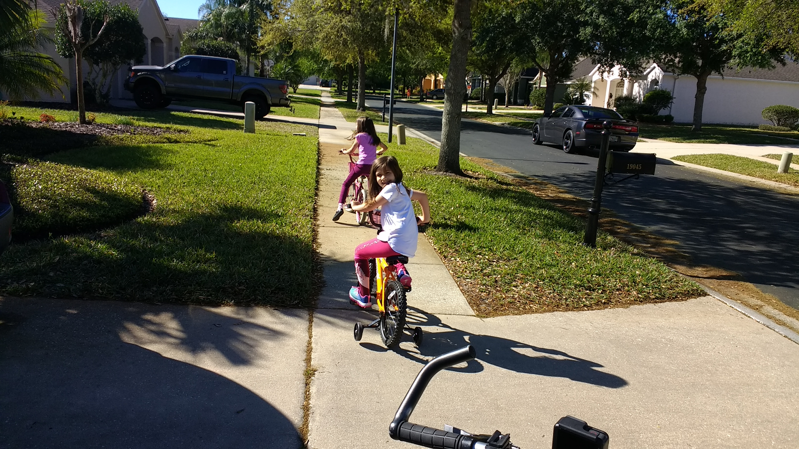
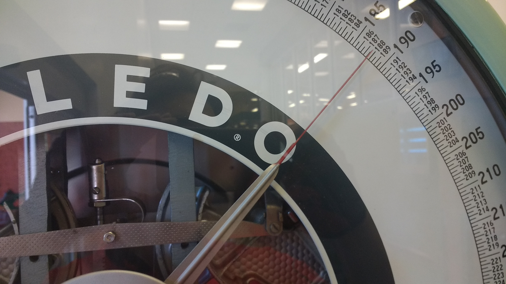
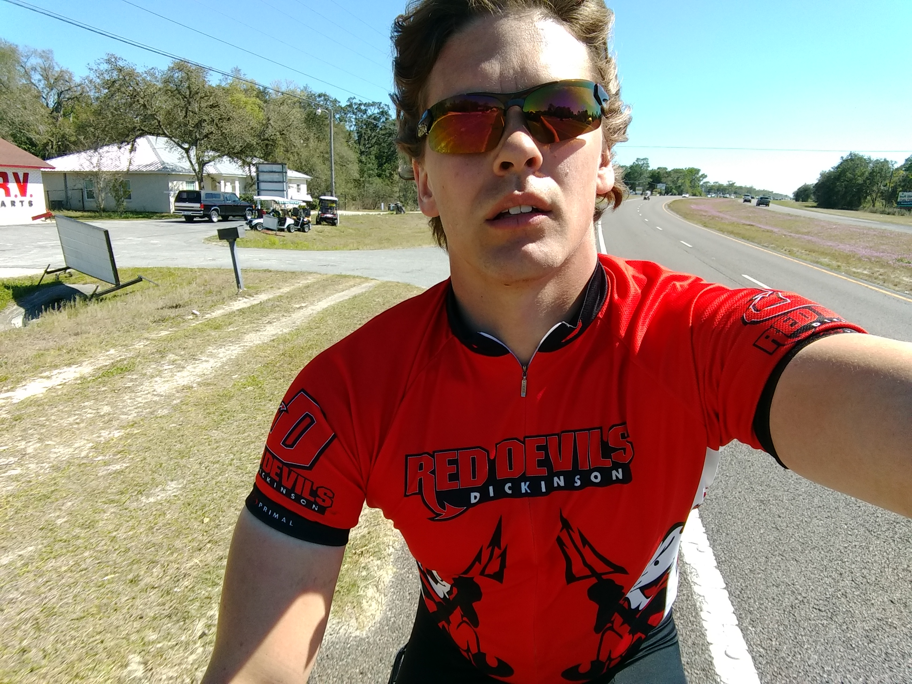
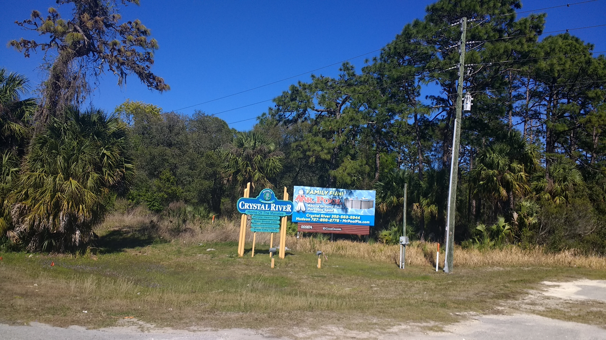
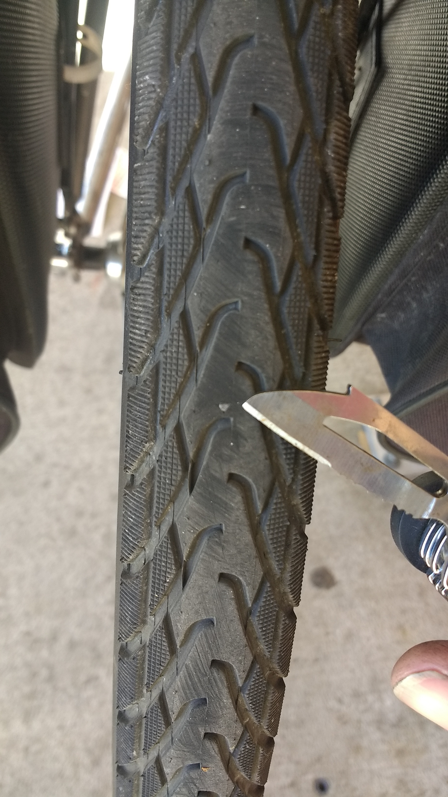
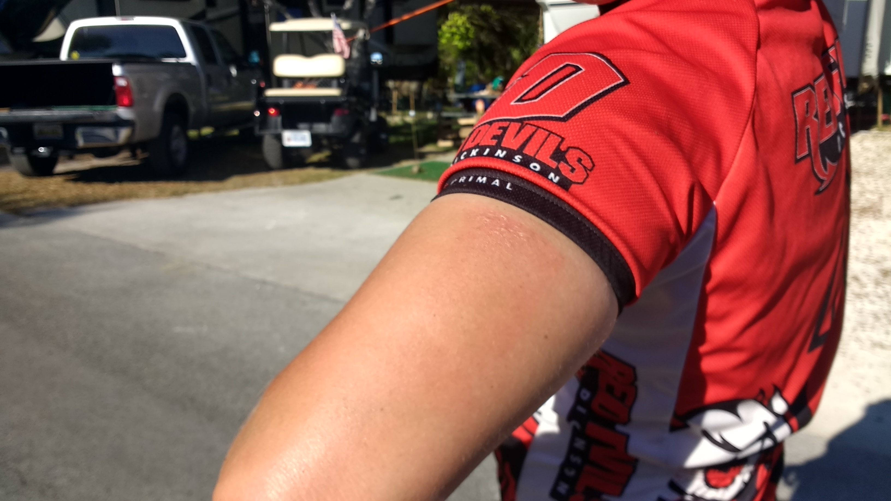
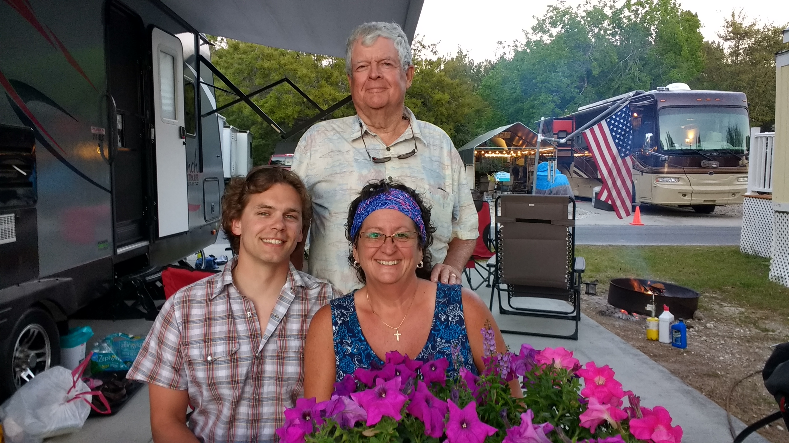

+++
title = "Day 6 -- Lutz FL to Crystal River FL"
date = "2018-03-17T21:43:50+00:00"
tags = ["Bicycle Trip"]
categories = []
image = "IMG_20180317_152507382_0.jpg"
+++

I woke up around 8:30 although my alarm wasn't set to go off until 9:00. Laying awake, I opened the warm showers app and saw a host that I thought would work for night eight and left a voicemail.

Lily made me a delicious breakfast of scrambled eggs while I packed my bike. A little after 10:00 I rode off with Lily and Samantha riding alongside until the end of the development. The first 65km of today's ride were on a very well maintained paved bike path with a slight tail wind which felt so amazing. It was mostly uneventful except for one rest stop where I chatted with another cyclist who advised I lighten my packs. At the same stop I got a call back from Jim, the warm showers dude, and I'm all set to stay two nights from now.

Since not much worth telling happened on the bike path (and believe me, that's a good thing!) I'll tell you some of the stuff I thought and daydreamed about. Optimistic thoughts are that this is (at the time I was thinking "might be") the first time in the nearly-week-old trip that my average tube replacement rate had fallen below one tube per day. This is also the longest day (of two) that I've gone breakdown free. Some of the worries I have are that breakdowns could happen again at any moment, and the corresponding meta-worry that I'm spending too much energy worrying about that. I also worry about my knees (mostly lefty) which have some injury that is kinda similar to tendinitis. Maybe I should give it a name like Betsy, my friends Alina's ankle. Finally, the fact that my phone doesn't make voice calls without headphones isn't really a worry so much as a constant disadvantage that I'll have to overcome. I'm open to suggestions to those problems; just realize that I may not take every suggestion I get.

After the bike trail ended, I got on route 98 and headed Northeast which was into the wind slightly, but not a big deal. Eventually the road curved back to the north and I made good time getting to Crystal River. One final stop at the Winn Dixie, and I rode the last 7 km to Kay and Lee's campground.

I got a shower, my fav, we had burgers for dinner, and then I hit up the hot tub. This was probably the most encouraging day of the trip so far.

Daily distance: 99.09km
Average speed: 22.3km/h
Trip odometer: 790km

Photos:

