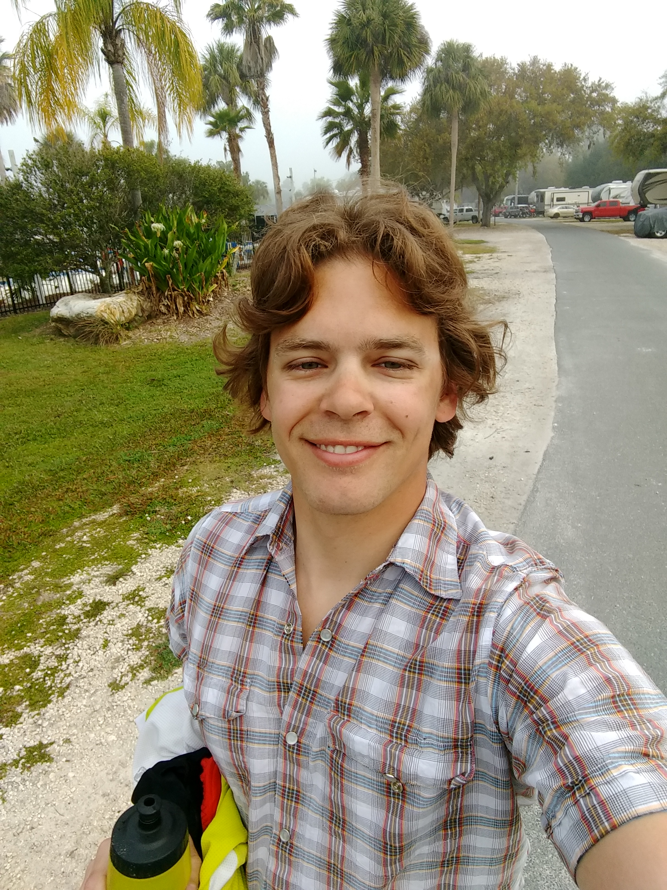
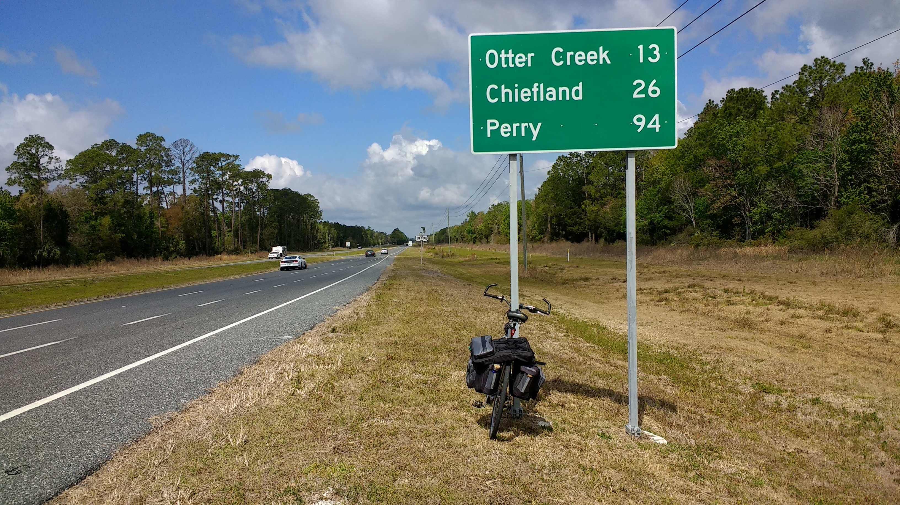
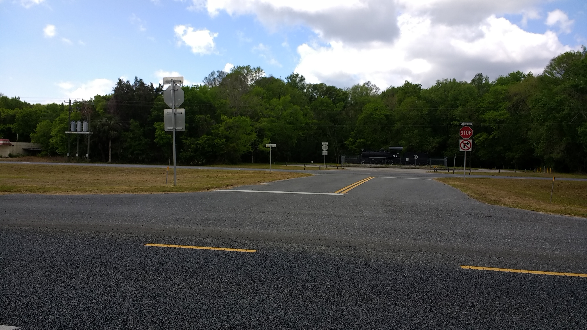
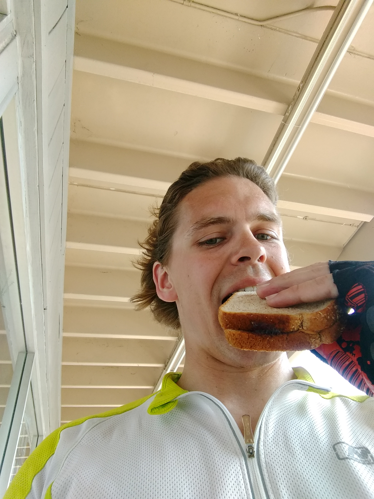
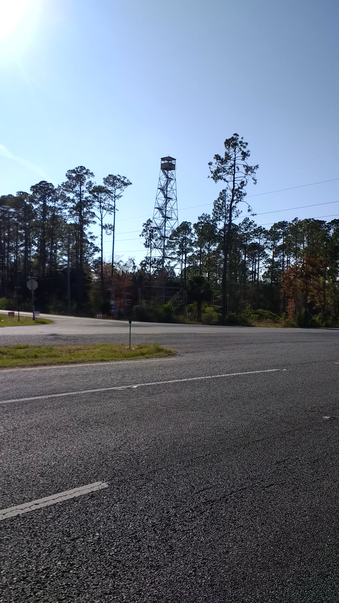
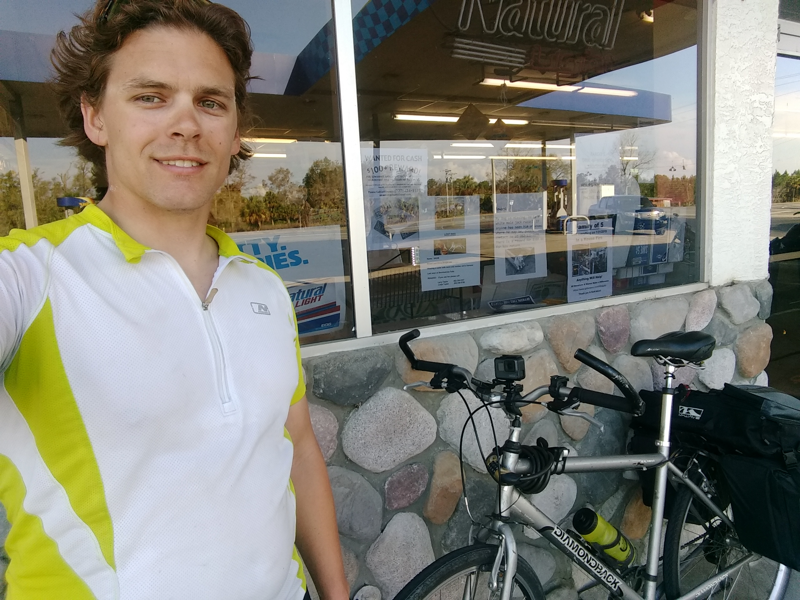

+++
title = "Day 7 -- Crystal River FL to Perry FL"
date = "2018-03-19T01:24:03+00:00"
tags = ["Bicycle Trip"]
categories = []
image = "IMG_20180318_091642130.jpg"
+++

I slept in until about 8:30 and then got up and started breaking down camp. For some reason, my throat felt scratchy when I woke up and it persisted throughout the day. Kay and Lee got up around nine and she made a nice breakfast of bacon and eggs. After we said our goodbyes, Kay hooked me up with two pbj sandwiches, and I was on my way.

Today was one long ride on the same highway fighting a headwind. There was little to break up the task, and I just had to keep chugging along. Luckily there were no mechanical problems though.

As I made my final press toward the city of Perry, the sky got dark and I could tell rain was immanent. I got my tent set up just in time before the downpour started. I was able to stash my bike and clothes in a nearby unlocked semipermanent kitchen of some sort, although I'm worried they'll make me pay some outrageous amount for it. The rain is always a mood killer, and the mosquitos didn't help.

A warm shower did help, but as I went to get dressed afterward I found that all of my clothes were damp. I stood in the shower air drying and letting my clothes do likewise for about half an hour after I was done, and then walked through the rain for a shelter house to write this post. That only lasted a few minutes before the mosquitos drove me away, and I didn't want to put on the deet because I'll be going to bed soon. Luckily the clubhouse was open, so I'm swyping from there.

All things considered, this was a discouraging day in many ways, but there are also several positives.

1. No mechanical problems. This is huge! This is the second straight day with no breakdowns.

2. It was my longest day, and I pressed through despite getting a somewhat late start and fighting wind.

Here's hoping my tent isn't soaked when I get back to it. That would be positive number 3.

Daily distance: 182.51km
Average speed: 22.7km/h
Trip odometer: 973km

Photos:

