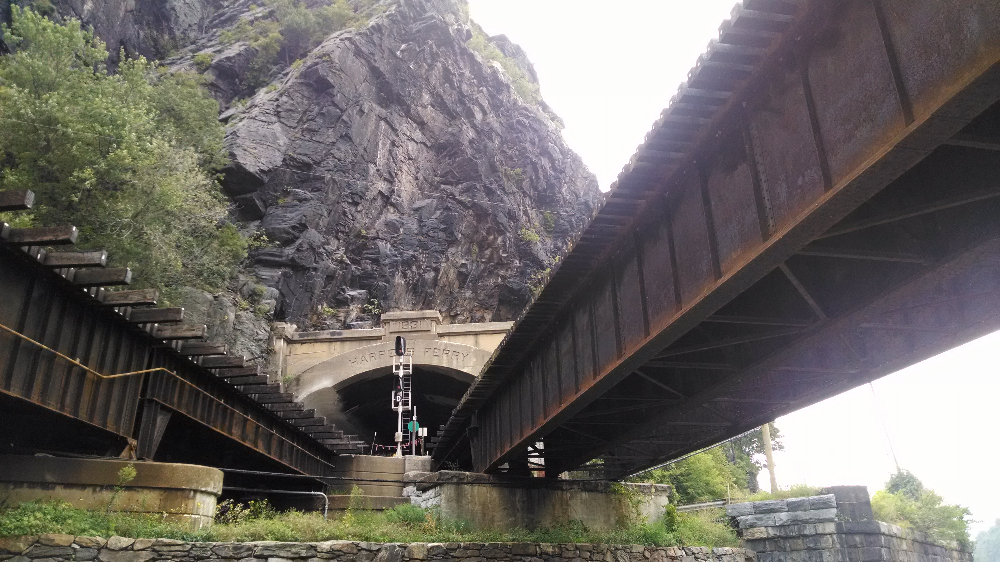
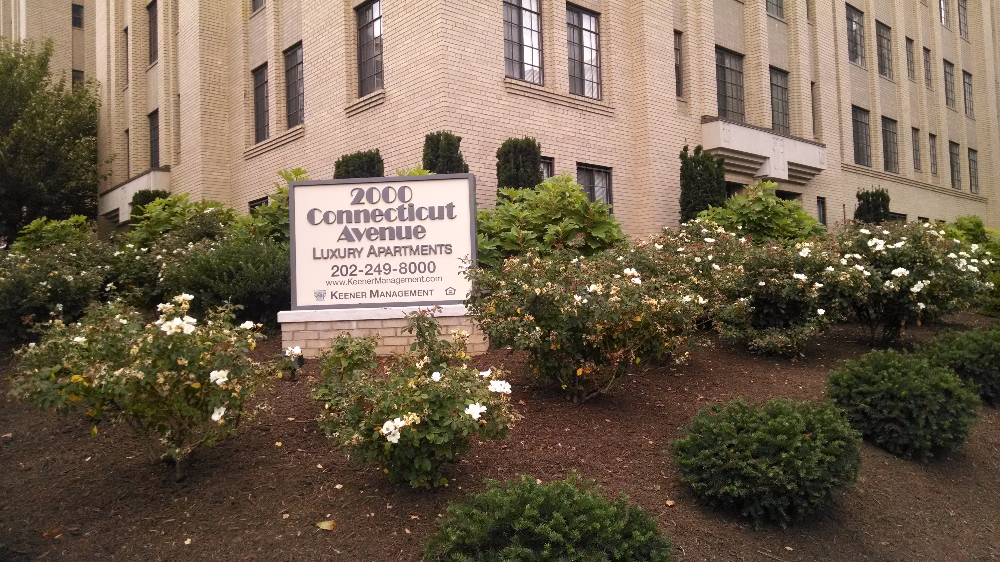
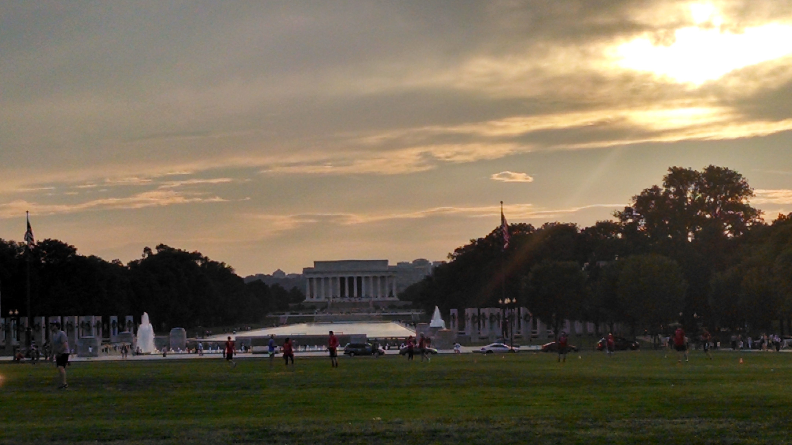

+++
title = "Day 7 -- Harpers Ferry WV to Washington DC -- Finish line"
date = "2014-08-20T02:55:08+00:00"
tags = ["Bicycle Trip","Travel"]
categories = []
image = "IMG_20140819_093917325.jpg"
+++

After a big breakfast of sausage gravy, cereal, and a waffle, I hit the road at 9:30.

I was glad I went extra far yesterday so today could be shorter. I cruised along steadily and quickly. The big breakfast seemed to help. I never made a proper rest stop today; the longest rest was about five minutes to refill my bottles. I stayed in a higher gear today opting for forth or fifth instead of third, and sometimes shifting all the way up and riding standing up just to give my butt a rest. The change in cadence was nice and kept me moving quickly.

Google's directions had me navigate some city streets in the DC suburbs and being unfamiliar with the area I followed them, but later discovered that I should have stayed on the trail making navigation easier, and probably the journey shorter.

In any case I got into the city and picked up the keys to Erin and Michael's place at 2:45. I spent the afternoon uploading photos, doing laundry, and resting. Then in the evening I went down to the mall, wandered around a little bit, and went to dinner with my hosts.

I actually made it!

Today's distance: 105 km
Average speed: 21.5 km/h
Trip odometer: 878 km

Photos:

