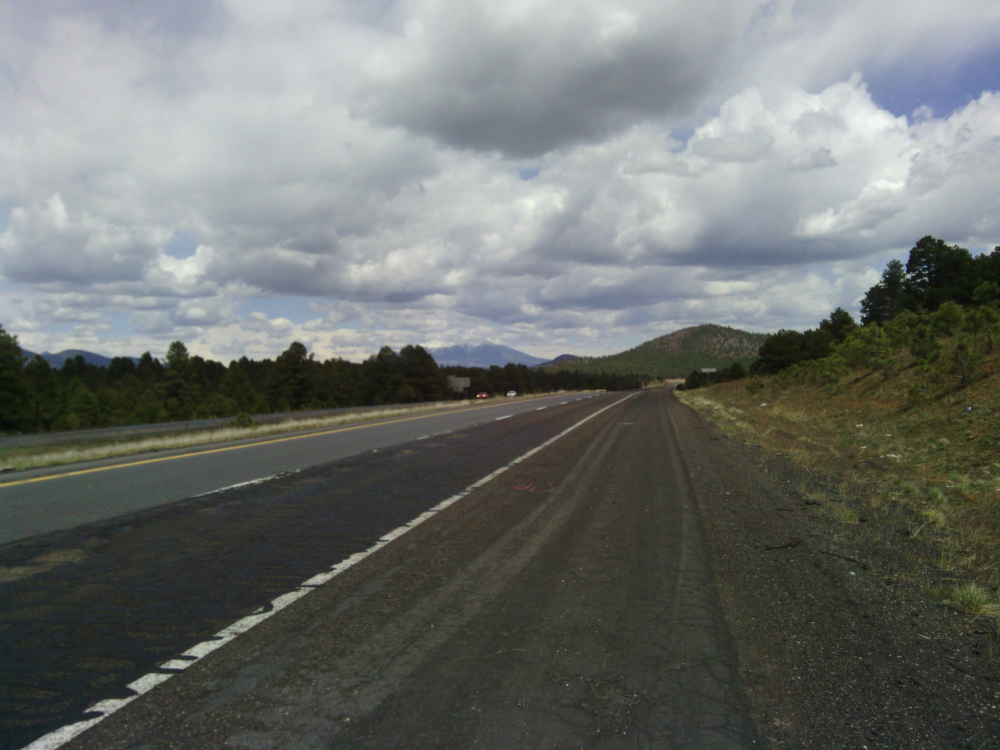
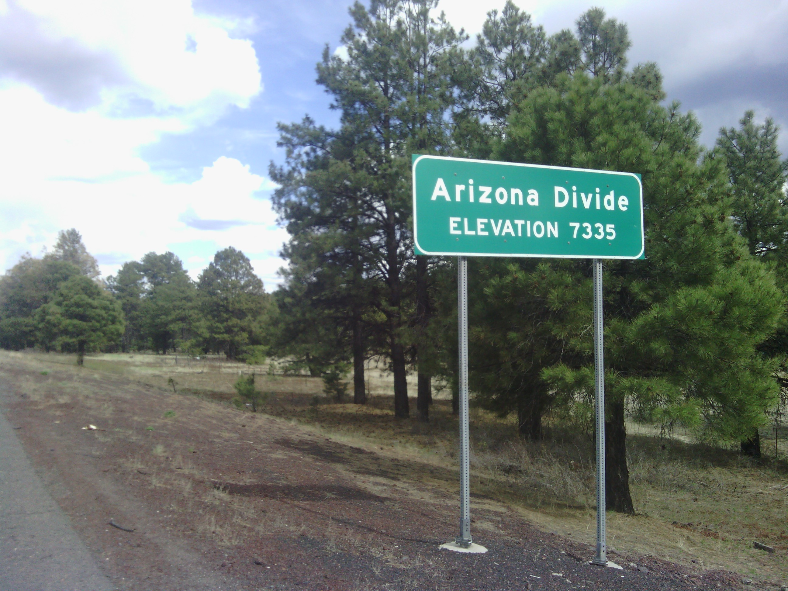

+++
title = "Day 7 -- Seligman AZ to Flagstaff AZ -- More uphill"
date = "2013-05-11T05:15:40+00:00"
tags = ["Bicycle Trip"]
categories = []
image = "IMG_20130510_154226.jpg"
+++

Today was shorter than yesterday, but was entirely uphill. The beginning was old route 66 and not I 40. That segment, like a lot of yesterdays ride, had old Burma shave signs. Look them up. The rest of the ride was on the interstate. The hardest part was from Ash Fork to Williams. I finished the climb and pulled into a gas station right as the rain began. I waited out the rest of the weather while eating lunch and charging my phone at Dennys.

My last break was in Parks AZ where I chatted with a friendly Dutch tourist for a while before starting again. In Flagstaff I stopped at a bike shop where I finally picked up a proper touring wheel. I was bummed to drop so much money on the bike again since I just had the wheel relaced a few days ago, but I think this was the proper and hopefully final fix. I'll try to pick up a proper tent tomorrow before I leave too.

After the bike shop, I headed to my host Steve's house. I met him through his daughter's friend's brother's friend. Luckily there was a graduation party tonight where I got to meet several of the links in that chain and eat some good food. I also got some good suggestions about my route for the next few days which is not yet fully decided.

Total distance: 123 km
Trip Odometer: 882 km

Photos:

Comments:

> You are doing great! Remember each day completed, is one day closer to your goal.
> **auntdeb**