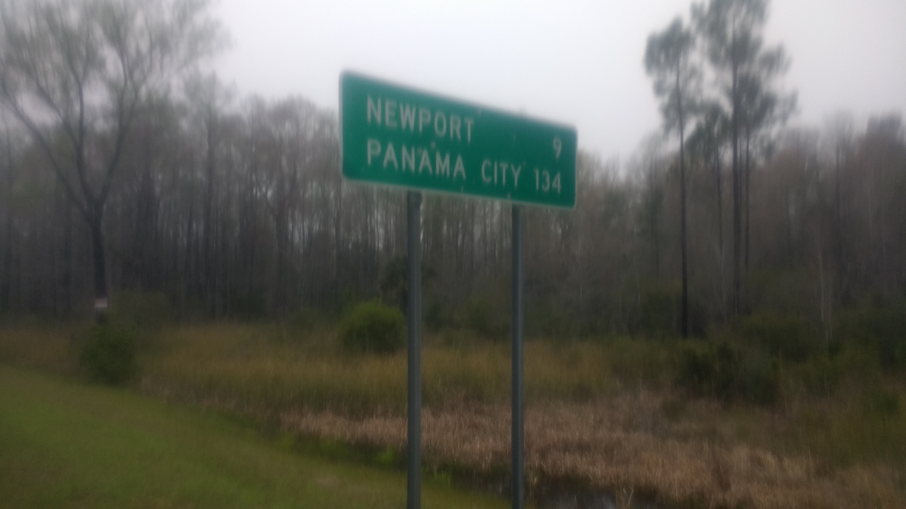
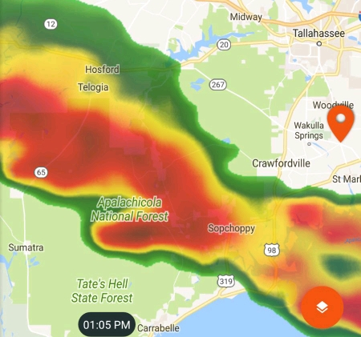
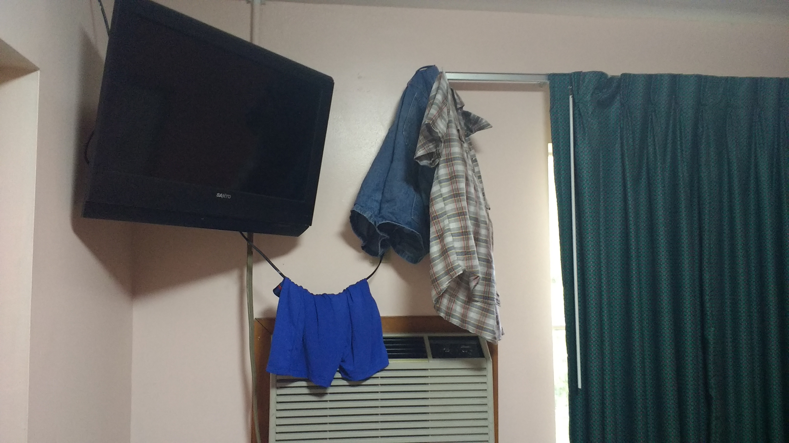
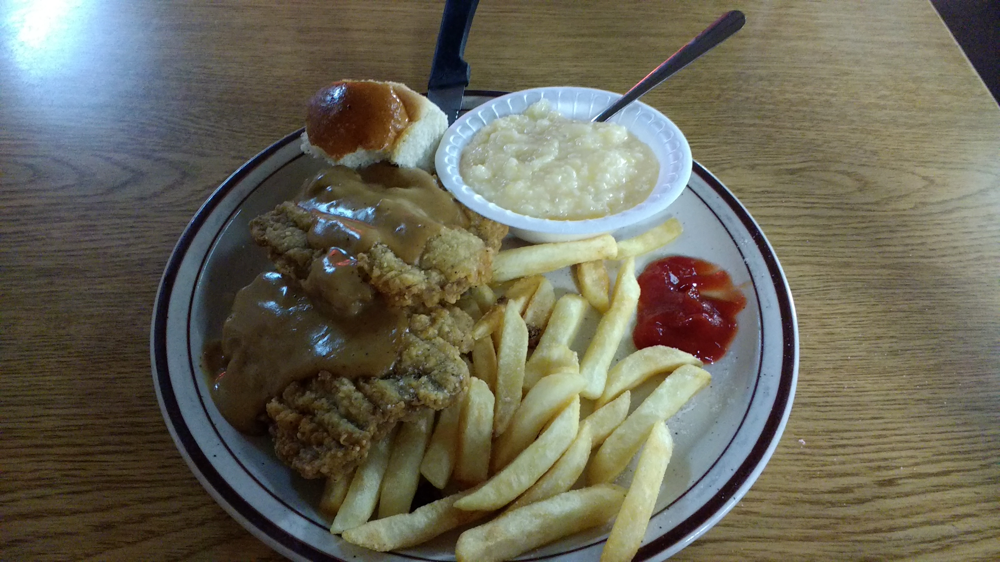

+++
title = "Day 8 -- Perry FL to Bristol FL"
date = "2018-03-20T02:55:29+00:00"
tags = ["Bicycle Trip"]
categories = []
image = "PhotoPictureResizer_180319_231816479_crop_450x421.jpg"
+++

Last night was brutal. The rain lasted hours and my tent leaked significantly. Sometime around 1:30 it let up to just a sprinkle and I moved everything into the screened-in kitchenette on the adjacent site where I had stashed my bike. I laid the tent out to dry, and laid down in my wet sleeping bag on my sleeping pad. At least it was warmish out. An hour or so later the thunder and lightning started and so did the wind. Rain blew in the screens hard enough that the entire floor, my sleeping bag, the tent, and all my hung clothes were completely soaked. If I had set up my tent inside to begin with, I probably would have made it through the night relatively dry, but there was no use wishing about it at this point.

I tried several different places on the floor to minimize the rain hitting me before giving up around 5:00. After stashing the phone away inside two Ziploc bags and hoping it wasn't too late, I laid down, pulled the drenched bag over my face and waited for morning. As I fell asleep, I thought it sounded like a tornado, but assured myself that Florida didn't get tornados.

I awoke again around nine. I was surprised how late it was having thought I would barely be able to sleep. After jamming all the wet gear in my packs for future Joshy to deal with, I was off.  It was a calm-wind day which was nice and offset the extra water weight I was carrying.

I followed just a few highways today, which was lucky because cell coverage has been rough in rural Florida and I was able to easily memorize the route. Around noon, I stopped to take a photo near a pulled over car. The woman inside asked for help with directions and although I wasn't familiar with the area I could tell she appreciated any help she could get. As I tried to do my best it became clear that she was upset about having lost her way and worried that she wouldn't make it back to Michigan. After a few minutes we had a plan for her, and agreed that we would both do our best to hang in there through the day's journey. She offered me a yogurt and a baby wipe. I've never needed a baby wipe so badly in my adult life.

A little while later I heard thunder off on the distance and saw a scary weather radar. Not wanting to get stuck out after sunset, I decided to brave the storm, and about an hour and a half later came through the other side.

Mom helped me find a hotel to stay at rather than the warm showers guy I had originally planned to stay with since I would still have to camp at his place and it would make for a long day tomorrow.

I finally arrived at the hotel around 6:30 and immediately stretched out all my clothes and camping gear to begin drying. While it dried, I got dinner down the street at a local restaurant. The waitress was incredibly friendly and asked me all about my trip. She even tried to find me a phone charger to test since my phone wasn't reliably charging with my own charger. (This will likely be a new source of worry.) At the end of the meal, she told me she would cover my dinner.

While it was a brutal day weather wise, the people made it a positive overall day.

Daily distance: 146.57 km
Average speed: 22.3 km/h
Trip odometer: 1119km (first thousand in the rear view mirror #ReasonsToUseKms)

Photos:

