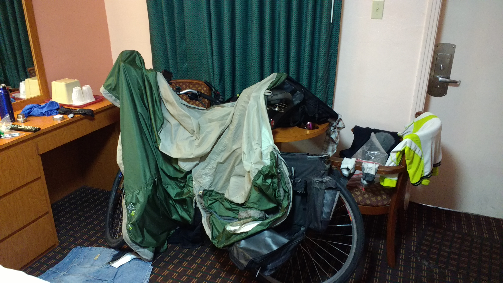
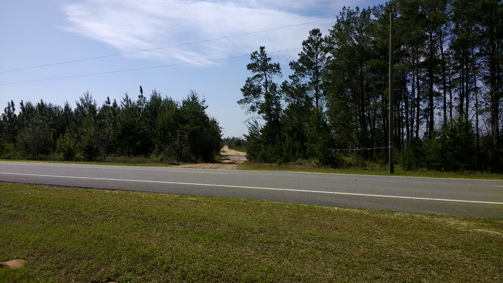
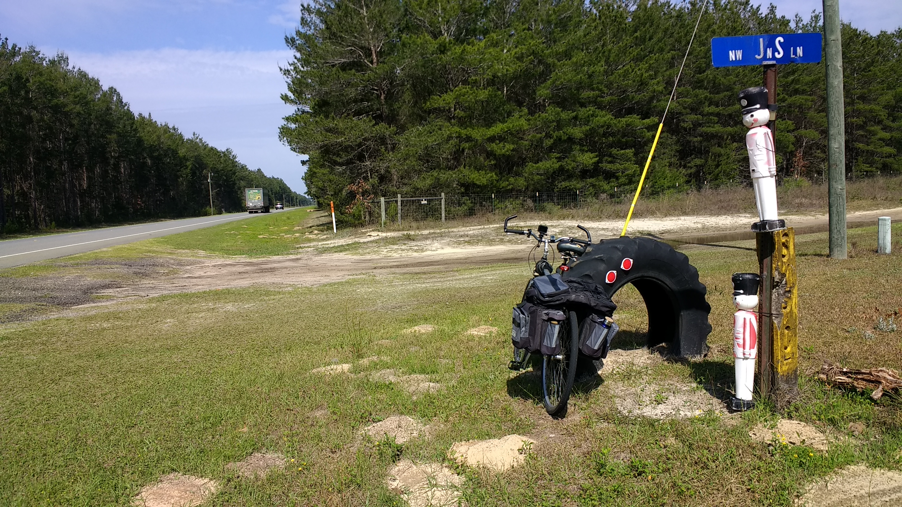
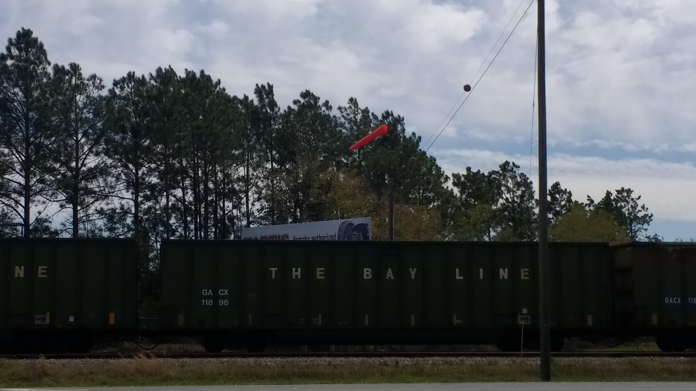
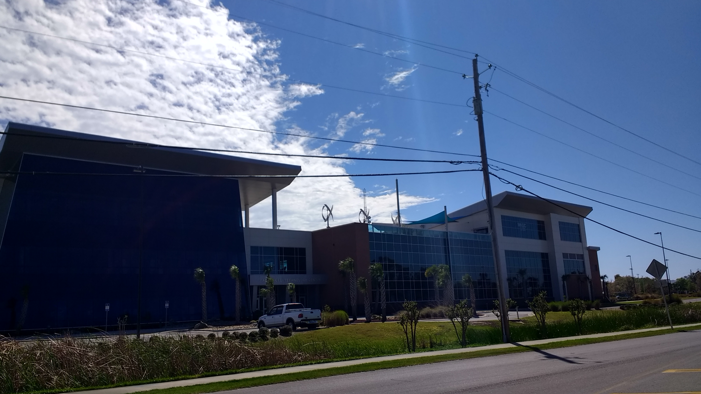
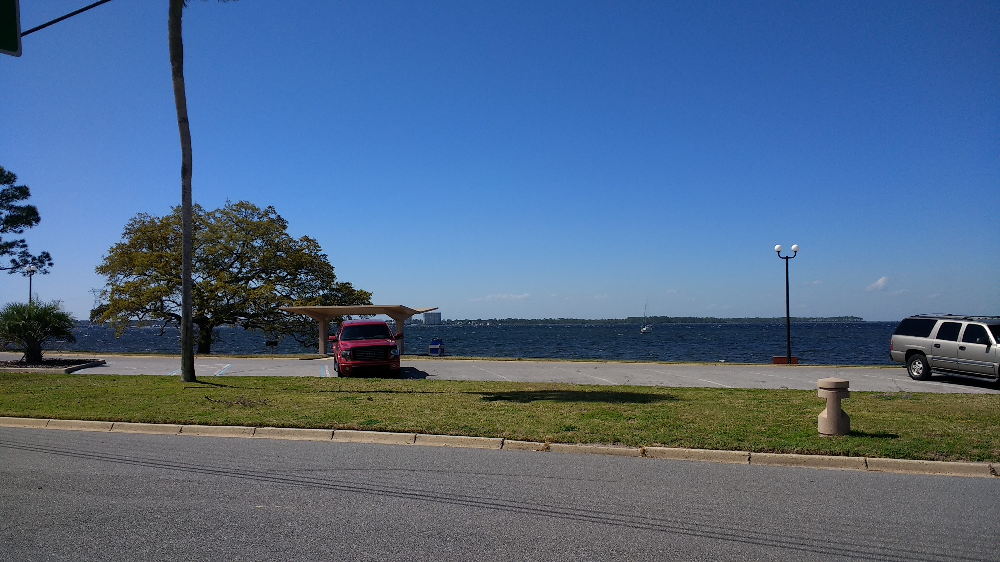
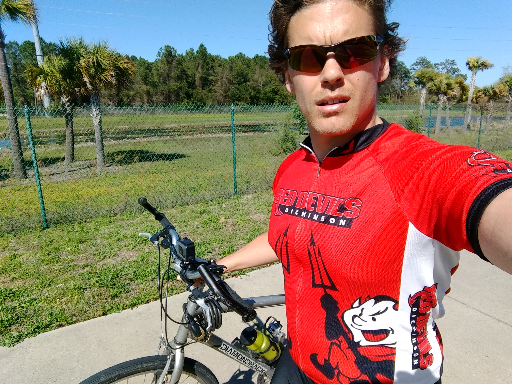
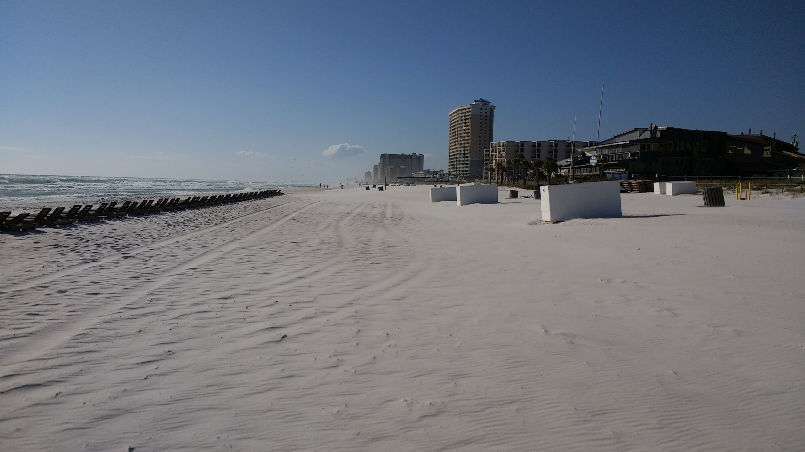
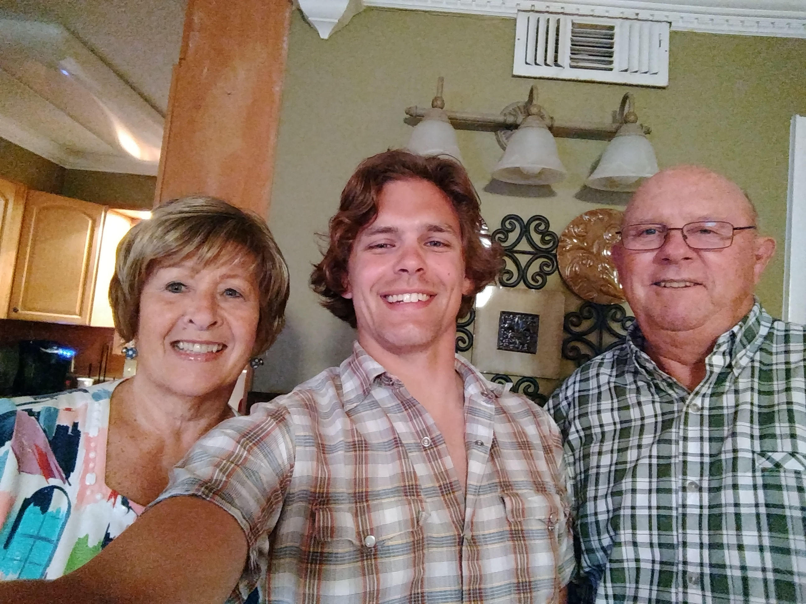

+++
title = "Day 9 -- Bristol FL to Panama City Beach FL"
date = "2018-03-20T22:23:03+00:00"
tags = ["Bicycle Trip"]
categories = []
image = "IMG_20180320_164852289.jpg"
+++

The one big accomplishment of the day was crossing into the central time zone! But it was not an easy day.

After a quick stop at subway where I ate half a sub and packed the second half for lunch, I got on the way. I knew the wind was forecast to be strong and in my face, and the forecast appeared correct. Nevertheless, I chugged away slowly but surely covering some rolling hills along the highway. It was slow going, but it was also planned to be a fairly short day and I was keeping a steady pace.

But mid-afternoon everything changed. My right knee, not the one that had minor lingering tendinitis, began to suddenly hurt on the left top. I rode through it for a while thinking it was likely a passing ache, but it didn't go away. After a few stops, it became clear that the pain was going to stay at least for the day. The last few dozen kms were especially hard as my knee felt more like it was grinding, and I became quite disheartened. The last 10 kms took me about two hours as I alternately walked the bike and rode it pedaling only with my left leg.

I was greeted very warmly by Bob and Sharon Hewitt when I arrived at their condo. The greeting and generosity was exactly what I needed to recover from another draining day. Although my knee continued to hurt throughout the evening, my mood became much much better. We had a home-cooked dinner of ham and potatoes and went to walmart to replace the materials that I had expected to have arrive via mail but hadn't. No big deal, the only things really missing were gu tablets and brake pads.

Daily distance: 97.24km
Average speed: 17.9 km/h
Trip odometer: 1217km

Photos:

