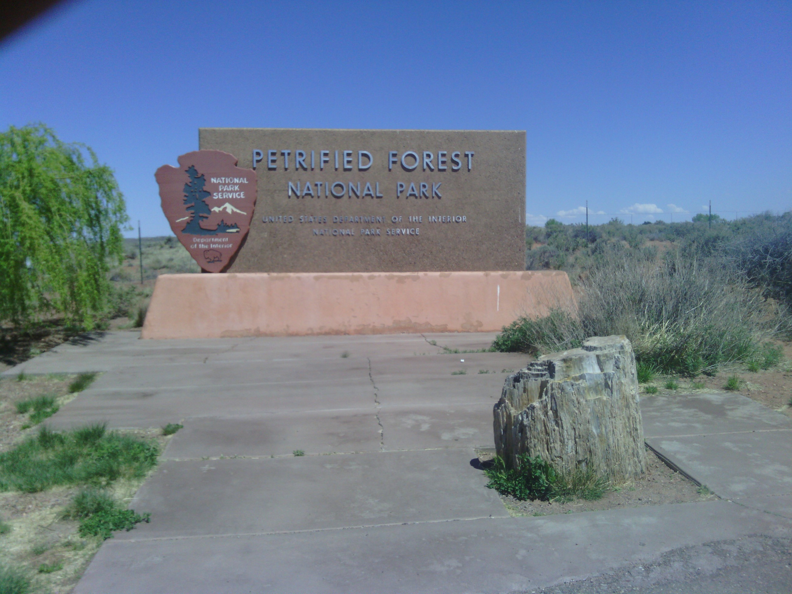
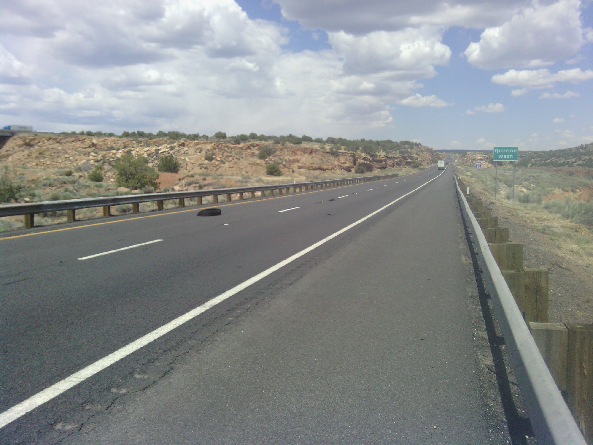
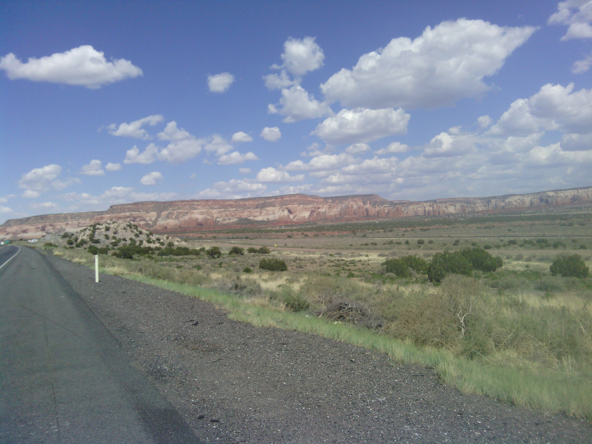
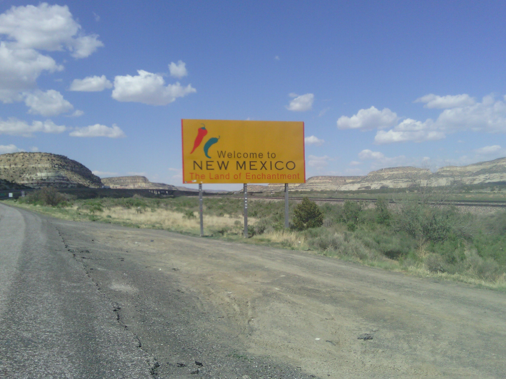
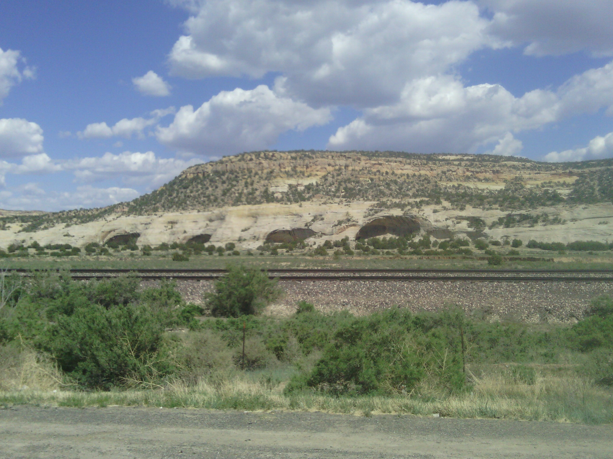

+++
title = "Day 9 -- Holbrook AZ to Gallup NM -- Time change"
date = "2013-05-13T06:10:57+00:00"
tags = ["Bicycle Trip"]
categories = []
image = "IMG_20130512_141832.jpg"
+++

I entered mountain time today! One zone down and three to go. Too bad that last one is so darn big.

Today started with a few other campers taking interest in my trip over all-you-can-eat pancake breakfast. I was excited and rearing to go after telling them about my trip, and that feeling remained as I realized that although the wind was mostly a gentle breeze, it was partially at my back.

I left the campground around 9:00 and despite being another day of almost entirely interstate, it started well. But that all changed at  11:07 when the wind suddenly changed from a gentle tail breeze to head-on kick-me-in-the-face gusting terror and remained as such for the rest of the day. Wind aside, there were some scenic areas today, and it felt good to enter state number three. 

After arriving in Gallup, I had pizza and watched a movie with my host Phil, my friend Jessi's husband. Of course I like my new tent, but it will be nice to sleep in their guest bed.

Total distance: 159 km
Average speed: 23.5 km/h
Trip odometer: 1191 km

As a final thought, the last time I was in Gallup, I hopped in a car and drove to LA in a few hours. I sure didn't appreciate it as much that time.

Photos:

