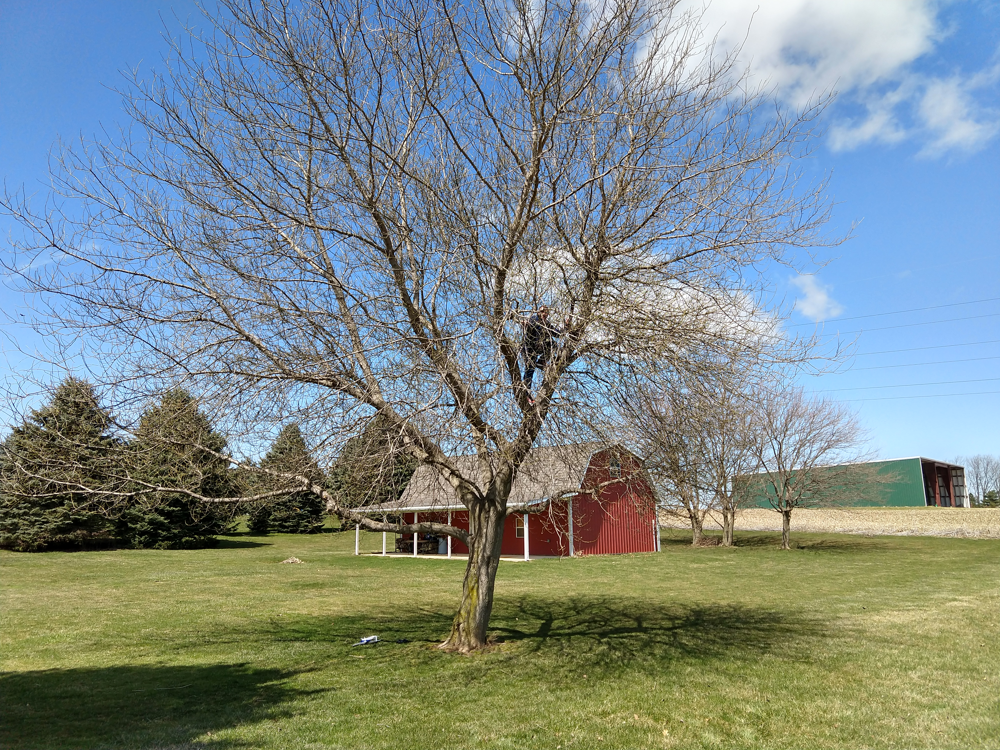
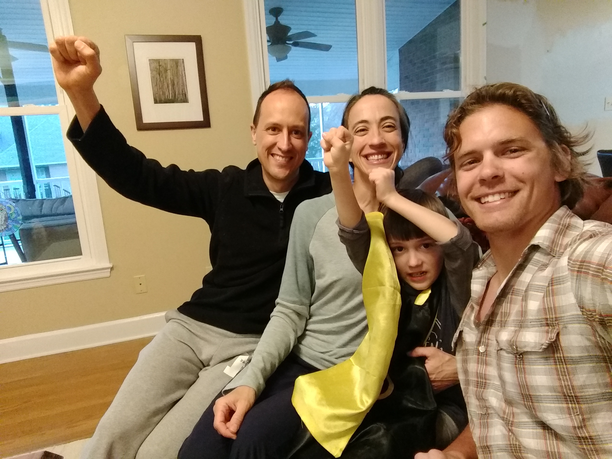
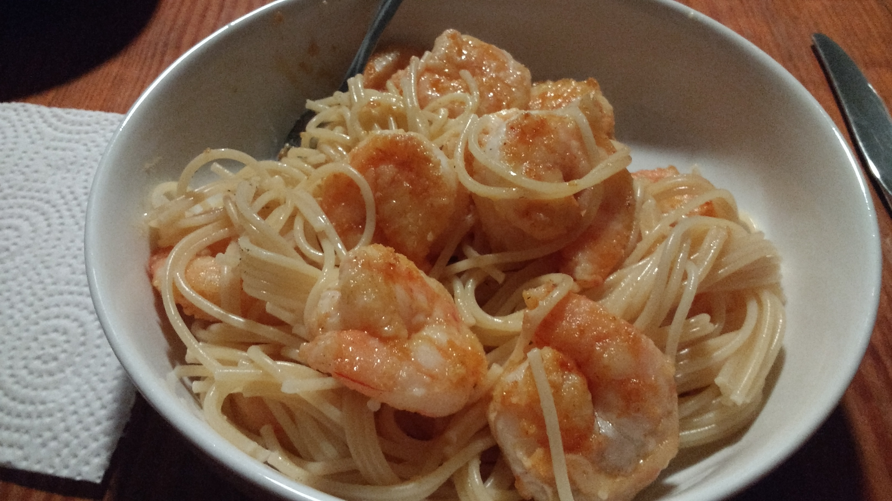
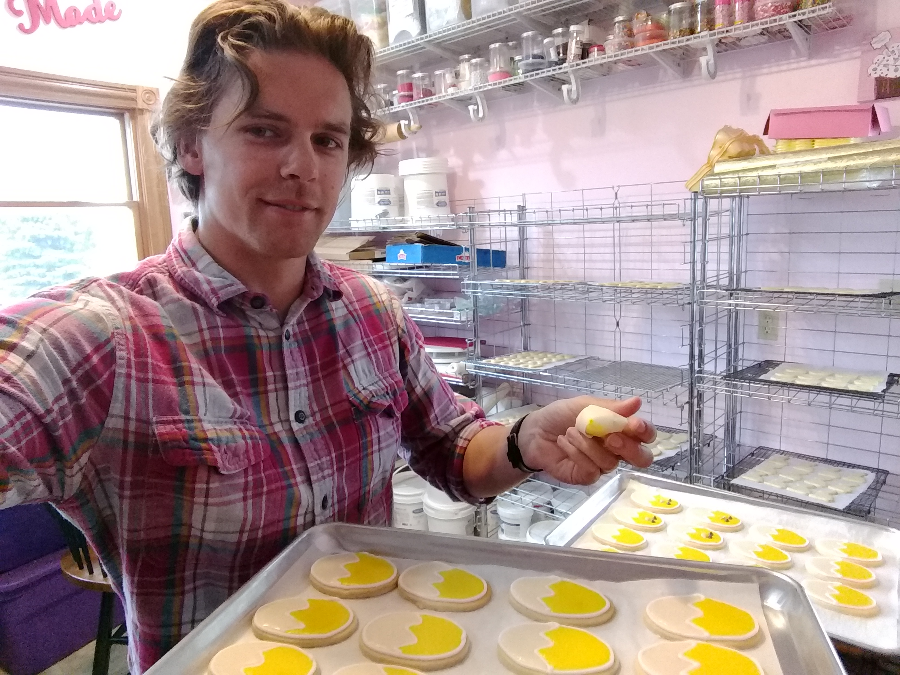
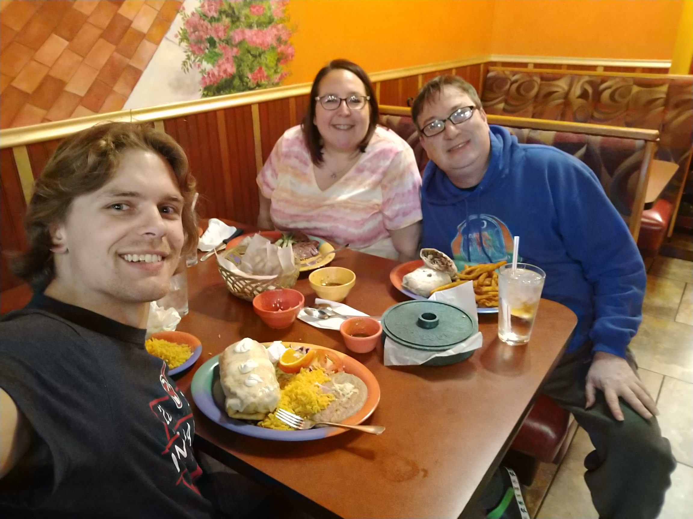

+++
title = "Days 11 - 32 -- Wandering"
date = "2018-04-14T07:29:01+00:00"
tags = []
categories = []
image = "IMG_20180327_112844363.jpg"
+++

This update is long overdue. Thanks for all of your patience. The past few weeks have been significantly different than I had planned. I don't mean to imply that they were worse. Only time will tell, but I suspect this surprise turn of events may prove to be better.

One thing is for sure though, I haven't been biking. I rented a car in Florida after the attempted day ten. The reservation was roundtrip so that I would have to get back on the bike. Knowing my own personality, I knew it would be hard to start riding again, so having a roundtrip reservation would get me back down there.

I spent the next night in Tennessee with Andrew, Deedra, and Matthias. Then I headed to New Jersey to see Julie for a few days. Finally I headed back to Ohio to stay with my parents for the week. Then I planned to spend Easter weekend with Julie's family, get the car back to Florida and get back on the bike.

During the week I sized up my knee injury. And it felt fine almost all the time. Very occasionally it felt a tiny bit sore or funny. But it was nowhere near how it felt those last two days riding.  My best hypothesis now is that the right knee injury that made me decide to stop was caused by compensating for a lingering tendon injury in my left knee. We'll probably never know for sure. The tendinitis itself continues to be somewhere between inconvenient and slightly painful as well.

During that same few days, I also found out that I got rejected from all the graduate schools I had applied to for the fall. Probably should have applied for masters programs first #RookieMistake. Live and learn. So I started realizing I would need a new plan for the next year.

Some combination of all those things and probably others that I haven't fully realized yet contributed to my decision to change the car reservation and return the car in Cleveland, putting the bike trip on indefinite hiatus.

I want to take a quick aside to clarify something I said in the last post. In hindsight I realize that my remark about stopping because I decided to rather than because I had to could be interpreted arrogantly as in, "I could keep going if I wanted to, but I don't want to." That is definitely not what I meant. What I did mean is that there is an element of defeat here. There is a moment when I said this is my threshold and I'm deciding to stop here. I want to acknowledge in good faith that I made that decision to stop. And that I'd prefer not to frame it as "I got hurt so I had to cancel the trip". It's possible that this distinction is important to literally nobody other than myself. I think it's important to me because I still identify largely as a cross country runner, and this is the same decision that had to be made in every race. I spent a decade of my life practicing being as tough as possible when facing this decision. I love cross country... Okay, back to the story.

I spent Easter weekend with Julie's family and had a great time. We even got a bonus day together because of a snowday in April. (I'll take it 😎) It feels like this is getting serious.

The last few days have been spent studying my butt off, applying to blockchain jobs, and learning a lot of new programming techniques. I'm hoping/planning to contribute to the blockchain revolution somehow, but I genuinely don't know how yet.

I also got to be around for Dad's birthday which hasn't happened in a while. We've spent a good amount of time flying and crashing the rc plane mom got him. And I learned to decorate Easter cookies too.

At present I'm on Oak Forest IL with Paula and Mike on my way to the rchain developers conference in Boulder CO. I'm nervous but excited about it.

You may have noticed that the title of this collection of posts shifted from "Florida to Alaska Bicycle Trip" to "Bicycle Vision Quest". It looks like it will shift even more before it's over. But I guess this is how vision quests go?

To acknowledge the elephant in the room, I haven't tried out biking more. But at the moment I'm feeling like the next chapter of the vision quests may be without the bicycle. Thanks to everyone for their continued support, especially my family.

Photos:

