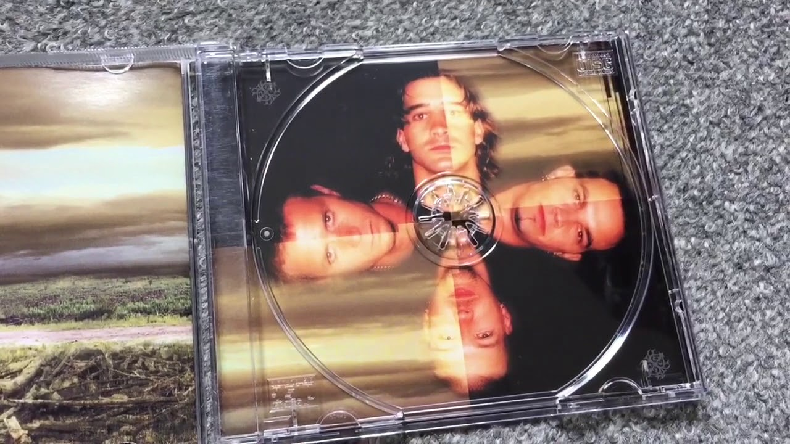
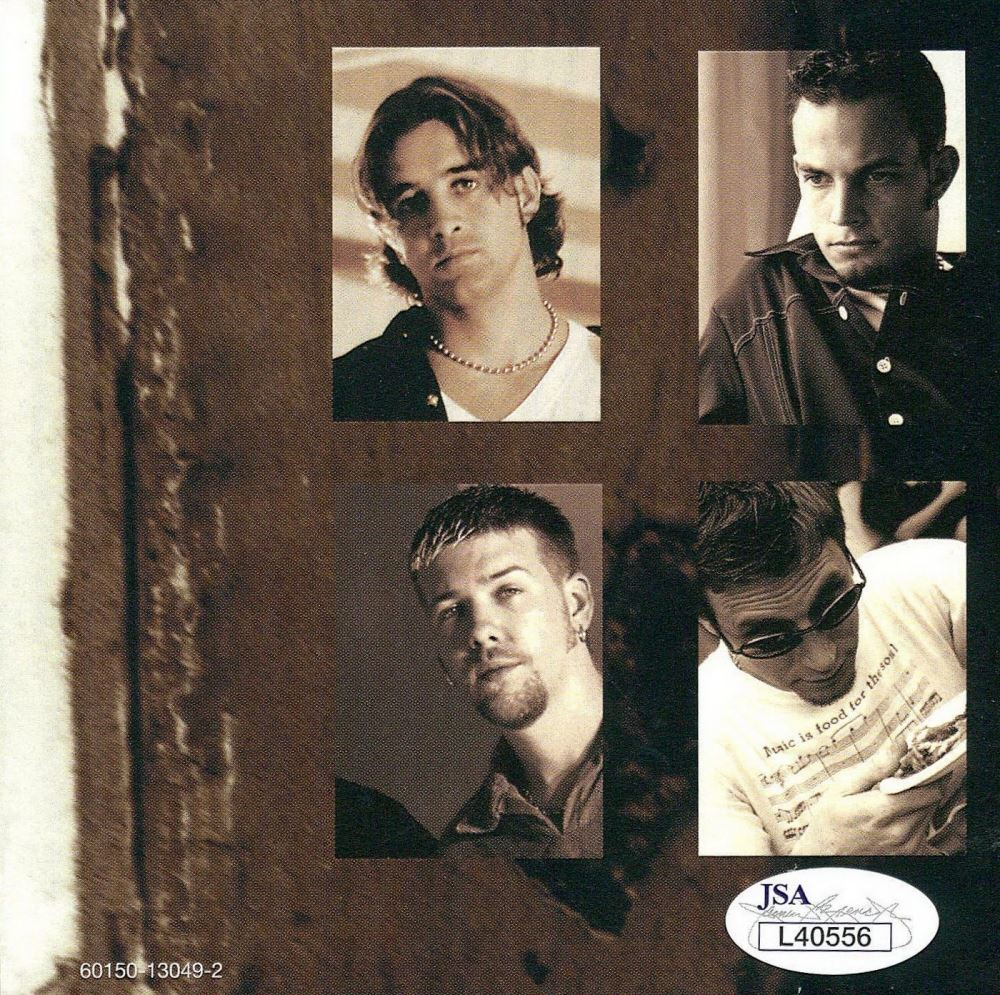

+++
title = "Did You Know You Would Be Here?"
date = "2025-05-05"

tags = [
    "Creed",
    "Music",
    "Family",
]
categories = []
image = "QandA.png"
+++

In the spring of 2024 I happened to put one of my old Creed CDs in my truck CD Player. I listened casually with my 3yo son Forest.

## Origin Story

Creed is my favorite band. They became my favorite band in 1999 right after Human Clay came out. I remember the moment. I was with my friend Gary and he was flipping through radio stations trying to find a song I wasn't familiar with. And I was proud to know all the song names and artists. But then Gary found a song I had never heard before. 🎤"So lets go there.. Lets make our escape..." _woah, what song is this?_ 🎤"Can you take me higher?" _This must be new? I love it!_ 🎸"--2-3-5-3h2-3~~--". Gary was happy to have won, "Ha, you don't know this one! This is Creed." I misheard it as "Cre" and spent a day or two thinking about that song before diving in head first. They were my first concert (without Brian Marshall, unfortunately) in 2001ish at Gund Arena. 

Then they broke up. Then Rock and Roll died, and then pop culture turned against them. And I thought less and less about them over the next several years.

## Next Generation

As Forest and I drove with the Creed playing, he suddenly looked at me and said, "Daddy! Does Creed have drums in it!?" 🤯 This little genius just connected the drum set he's whacked at in the basement with the Creed CD. He has no idea what a band is or how music is made of multiple instruments.

Three days later all that had changed. He spent the next trip to school studying the "picture of the four guys" in the human clay booklet. He spent the way home memorizing their names. The next trip to school looking at the picture of the "same four guys!?" looking younger in the My Own Prison booklet. Over the next weeks and months we played drums, listened to all the albums, jammed together, watched videos of Scott Phillips playing drums.

And then, with remarkable synchronicity, Creed announced a brief reunion. They only promised a cruise with two performances. Perhaps the only chance I would have to see them in the entire rest of my life. And with Brian Marshall this time too. But by the time I discovered it and hastily clicked through the website, I was too late. Sold out. A week later the second cruise was announced and I was in. I was torn about the cruise itself. I don't like burning all that fuel and flaunting the luxury and throwing all the plastic into the ocean. But in some sense this was a pilgrimage and I decided to press on. Another trial came when I realized I couldn't afford the money or time away from the needs of home including a newly-pregnant wife. I don't even remember how that all got resolved but somehow the path was cleared.

Later they announced a tour. We bought tickets to take Forest and sat through a truly shitty three doors down concert that reminded me of a lame christian youth service. (That says a lot coming from a guy who voluntarily went to christian youth concerts as a youth and was voluntarily going to see Creed still.)

## You Are Here

On the cruise there was a Q and A with the band. I can't find a recording of it anywhere so I will recount the question that struck me most. 

> Fan: "In the early days, did you ever expect you'd be here?"
>
> Mark: "Scott has a good answer for this one."
>
> Scott: hesitates, smiles, "I hate to say it, but I did. I knew we would work as hard as we could and be one of the biggest bands in the world."

It struck me that the band had interpreted the question in the same way they would have in 1999. As if they were one of the biggest bands in the world. They slipped into muscle memory and, at Mark's suggestion, Scott recounted the tale of how he had always believed that he had what it took as long as he worked as hard as he could.

But I wish they had paused to consider that "here" means something different in 2024 after a breakup and decade apart and now reuniting as 50 year olds worn life and not merely seeing them begin to form. Did they know they would be HERE? On a cruise ship? Did they know that working as hard as they could to be among the biggest bands in the world would be unsustainable? The lyrics of Human Clay indicate that Scott saw the early signs of Life wearing on him and Youth being depleted. Some of the weathered songs like "Who's Got My Back" and "Signs" show that it was clear that things were unsustainable by that point.

I would love to hear whether they knew they would be here in 2024. And when did they know it. Through Q and A would be cool, but through an album would be even better.

## Did You Know You Would Be Here?

Did you know that you would be here in 2025? I did not know I would be here. There were places I suspected I would be at some point. Some of them I have been. Some I have not.

