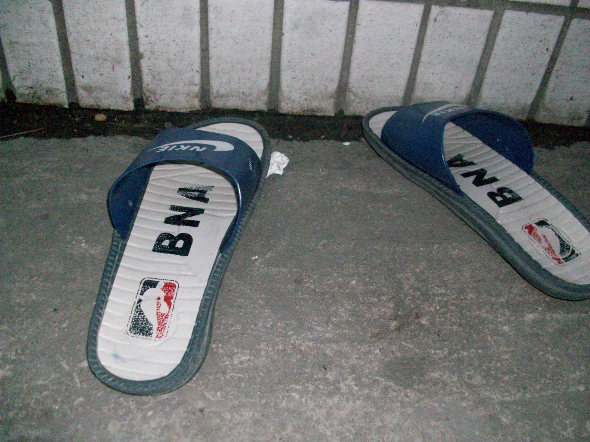
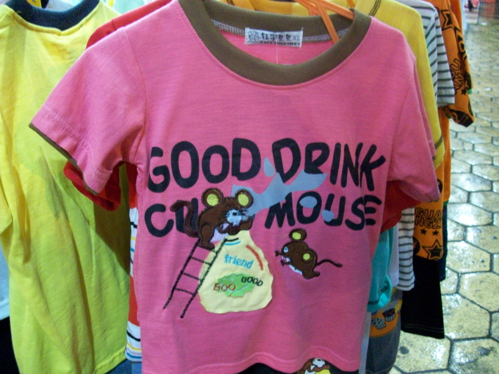
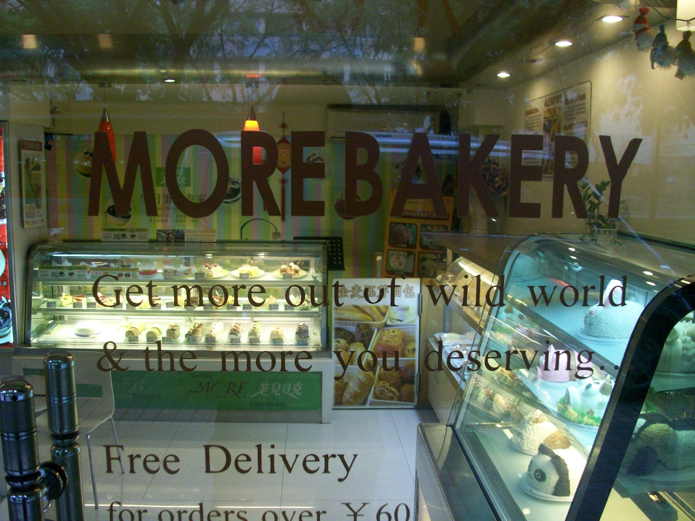

+++
title = "Engrish"
date = "2010-03-23T14:17:11+00:00"
tags = ["China"]
categories = []
image = "100_0063.JPG"
+++

This album contains all the pictures of hilarious english misspellings and mistranslations that I&#39;ve seen in China. Unfortunately the camera will probably never capture the priceless interaction that goes (on a regular basis) as follows. I&#39;m walking down the street and see an english T-shirt and read it. It inevitably says something like &quot;Everyone, yes what? thereby you?&quot; Or &quot;I got more kick that you!&quot; and I can&#39;t help but smile. The Chinese person wearing it sees me smiling and realizes how cool he must be because the white guy liked his english shirt. I love it when that happens.

Photos:

