+++
title = "Euro Trip Summer 2018"
date = "2018-09-24T00:47:28+00:00"
tags = ["Travel"]
categories = []
image = "IMG_20180808_091044130.jpg"
+++

This year I spent third session traveling in Europe with Julie. I had never been there and was glad to have her showing me around. And just to spend some time together.

Julie had already been traveling for weeks and <a href="https://laflaneriebejuled.wordpress.com/" target="_blank">her adventures</a> are chronicled much more carefully than my own.

I joined her in Rome for a few days. Then we spent the next few days in Florence where we saw my friends the Nalbani's from PRISMS. I guess Julie took the pics with that crew. We rounded out Italy with a quick stop in Pisa and then headed to England for a week.

Photos:

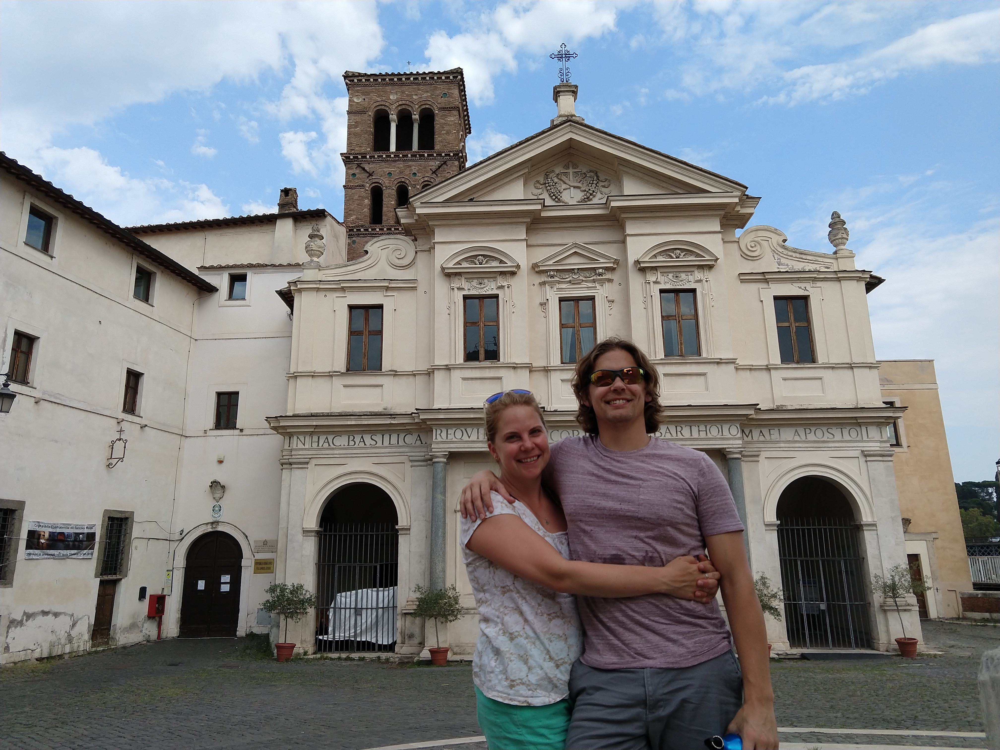
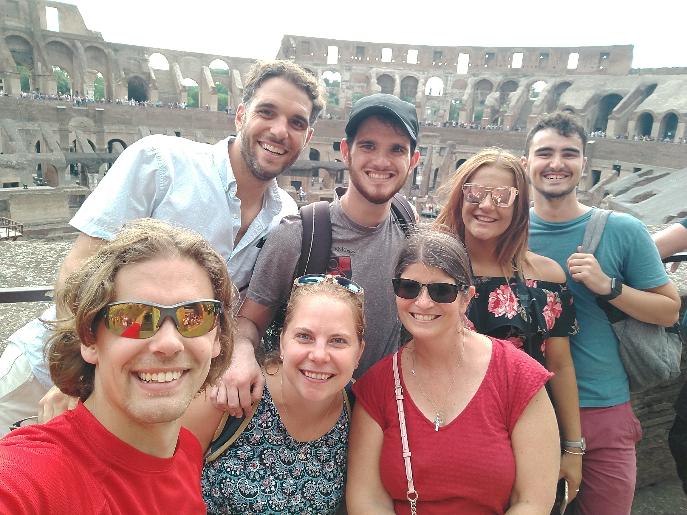
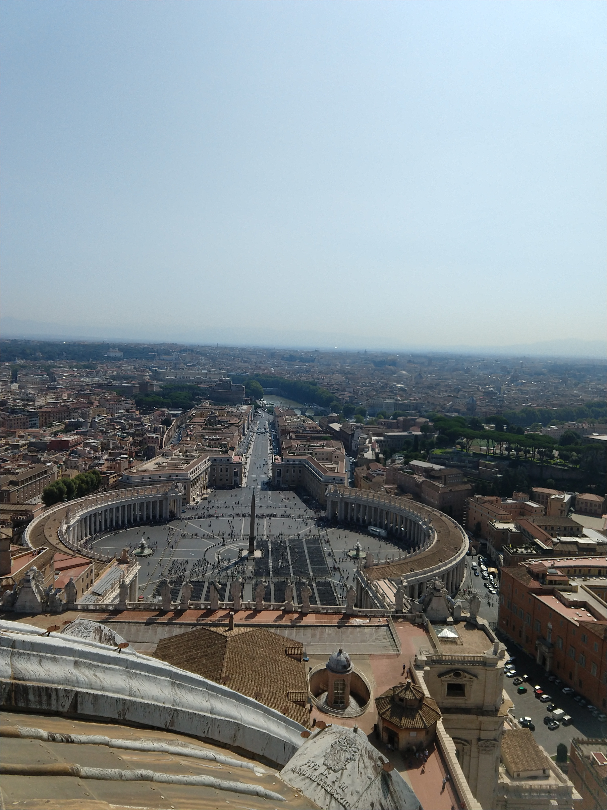
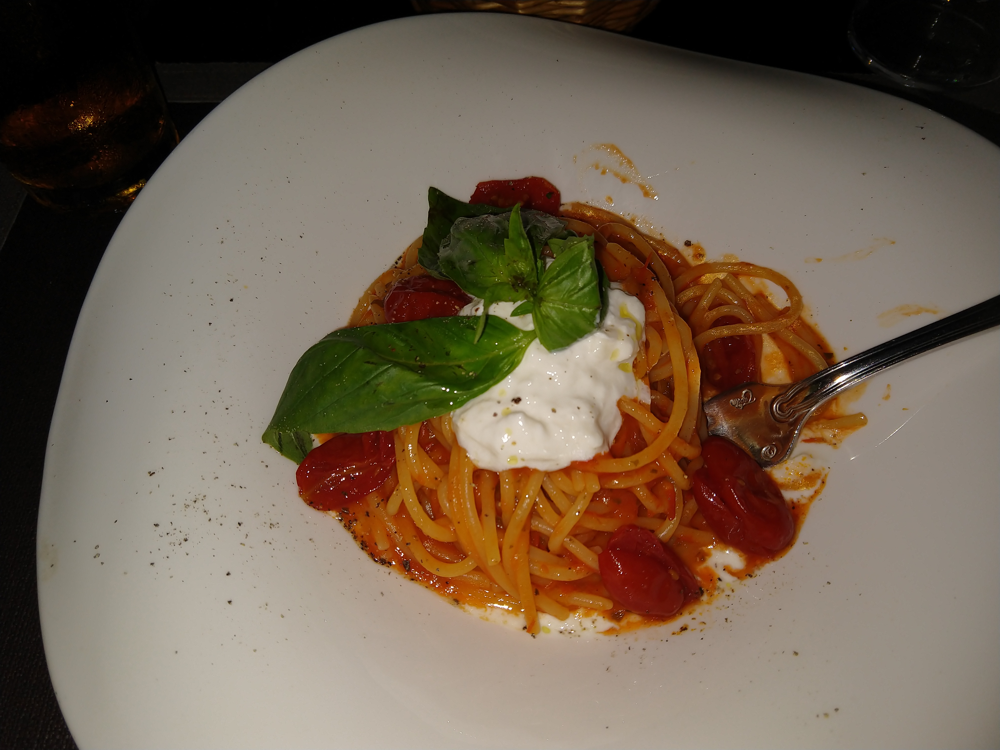
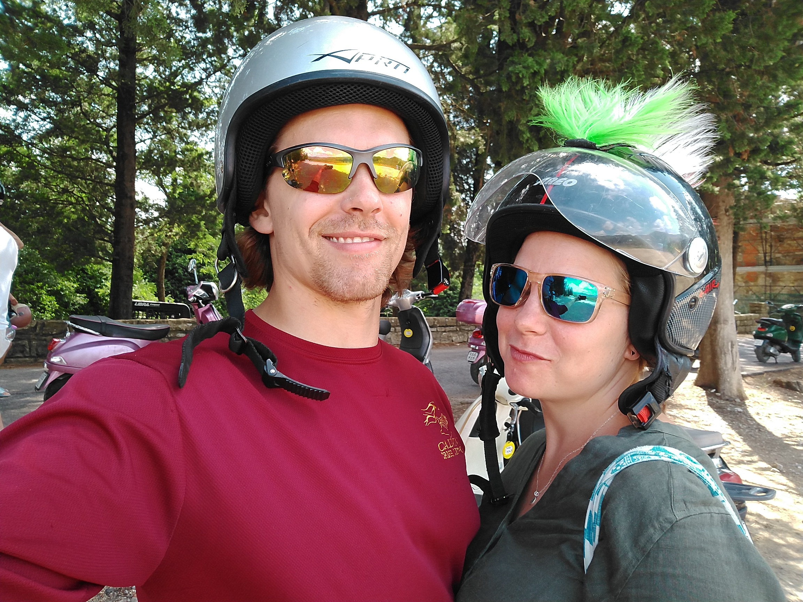

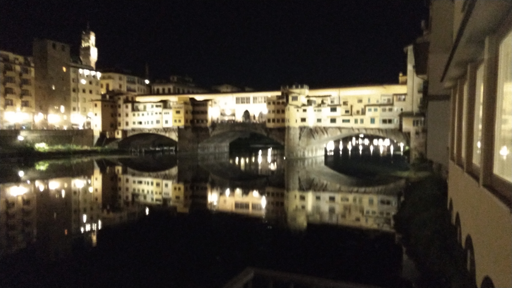
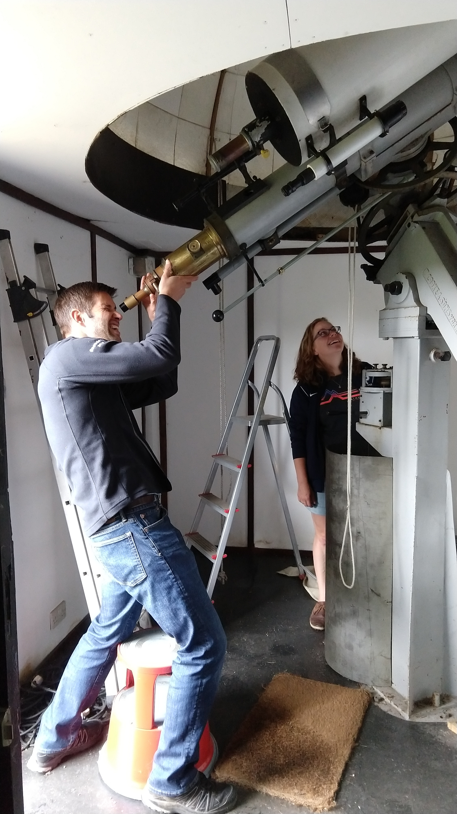
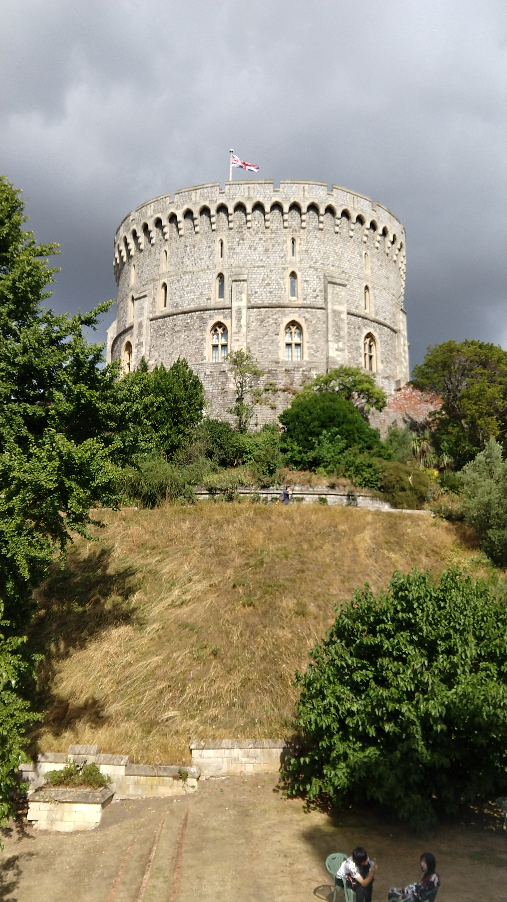
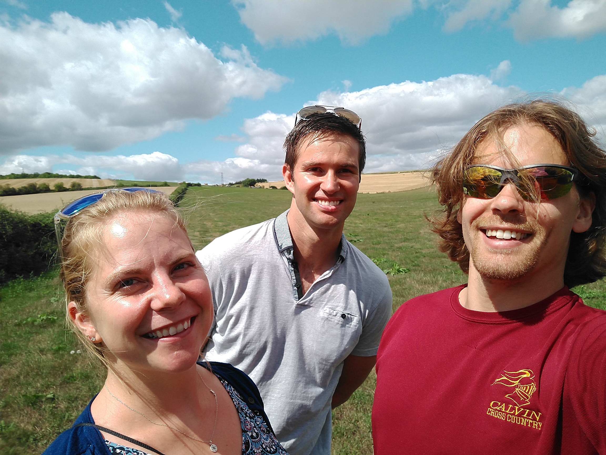

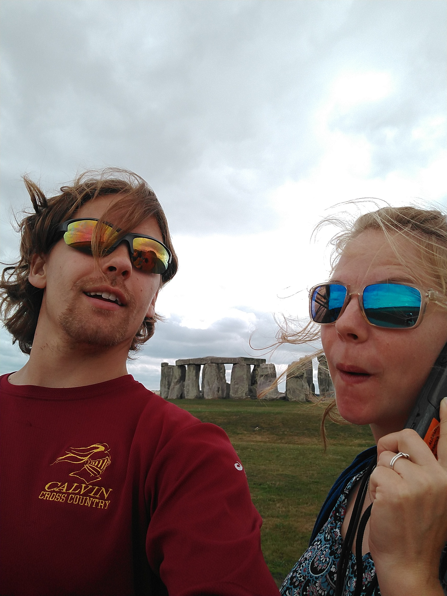
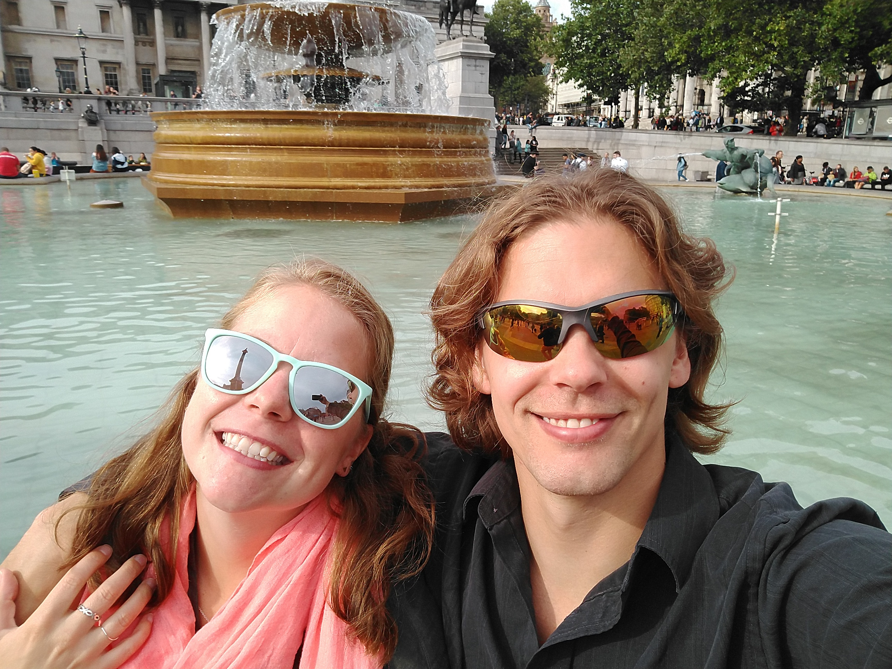
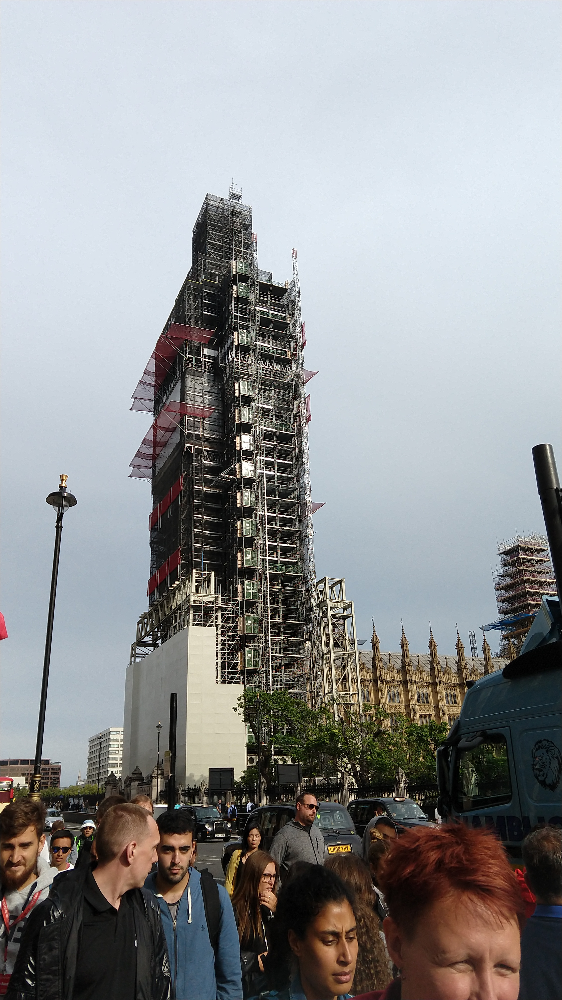
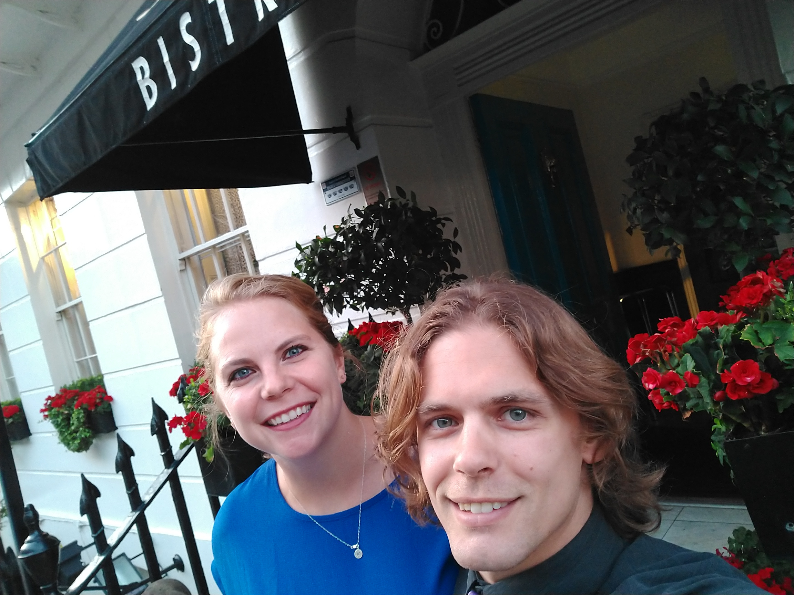
