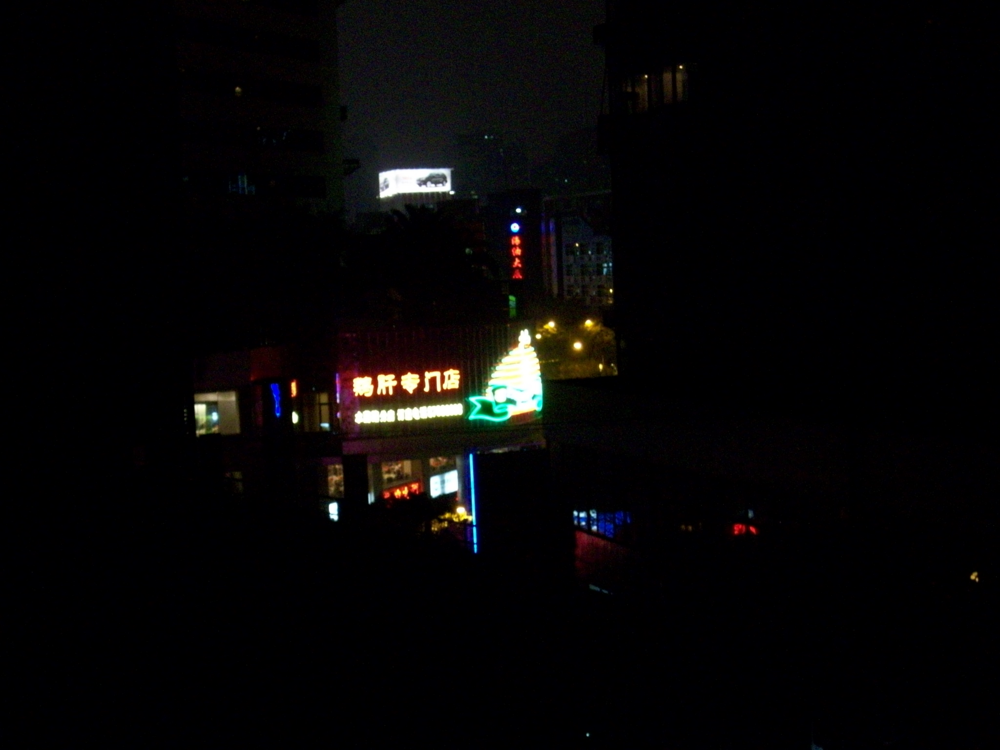
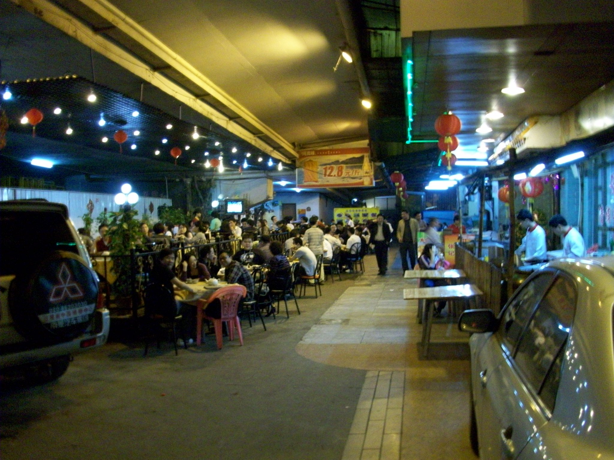
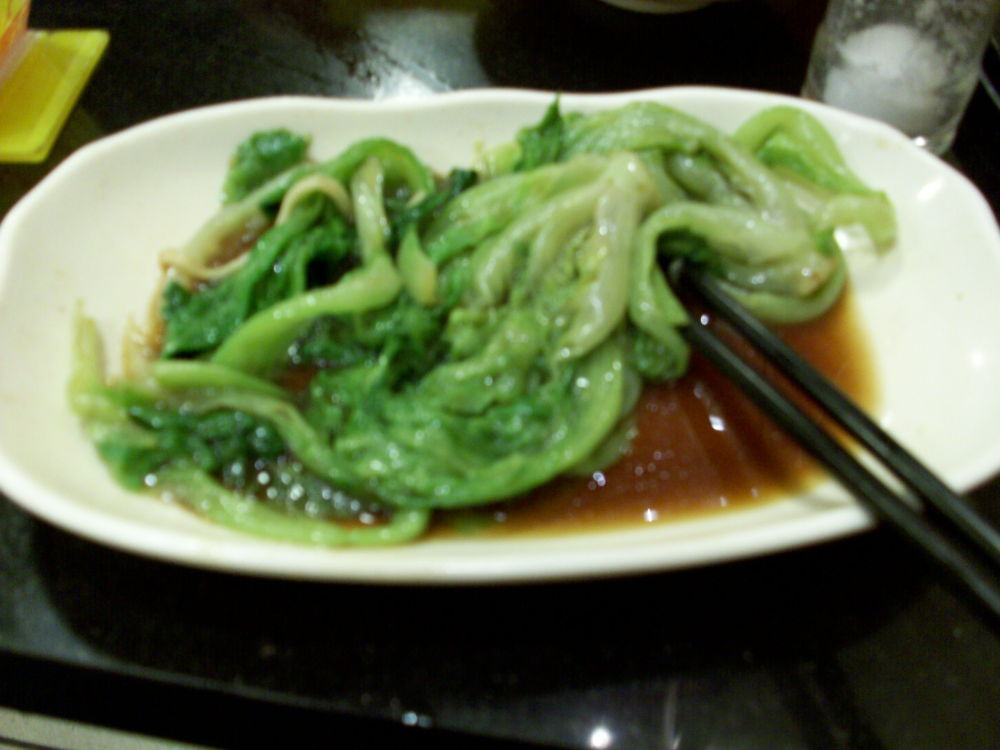
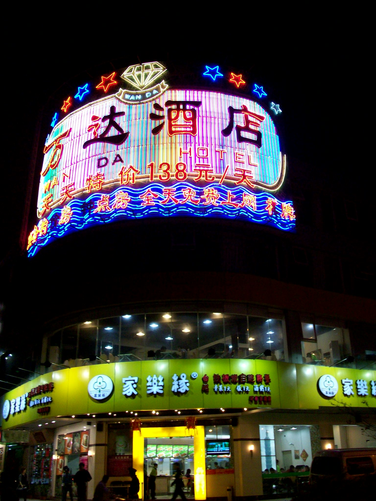
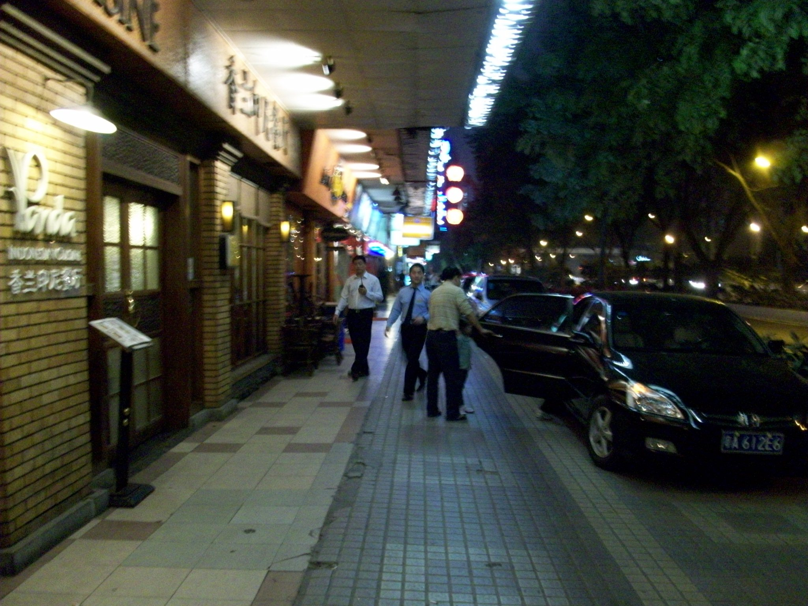
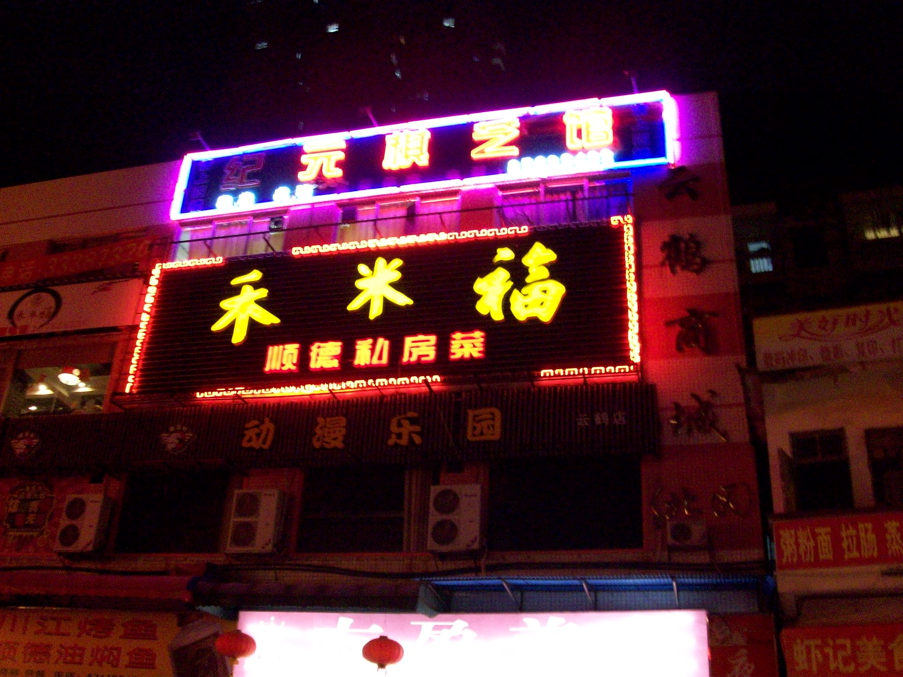
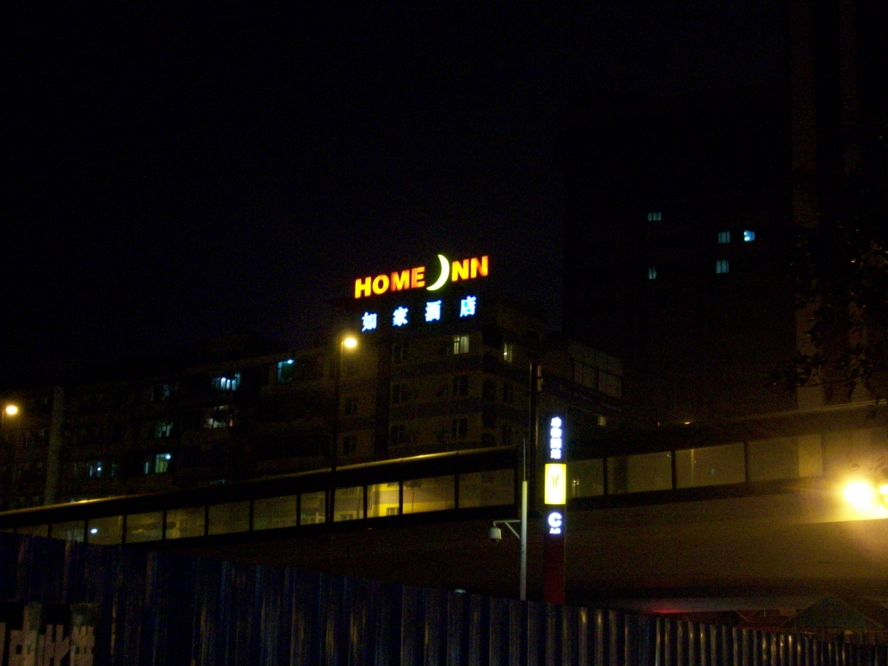

+++
title = "First Night in China"
date = "2010-03-21T06:21:20+00:00"
tags = ["China"]
categories = []
image = "100_0041.JPG"
+++

These are pictures that I took on the street and from the fire escape of the hotel that I stayed in the first few nights that I was in China.  The streets have many cool neon and LED signs that make the city look exciting.  Which it is :)

Photos:

