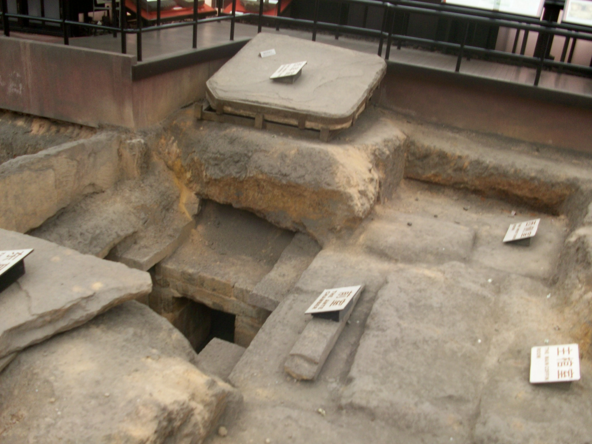
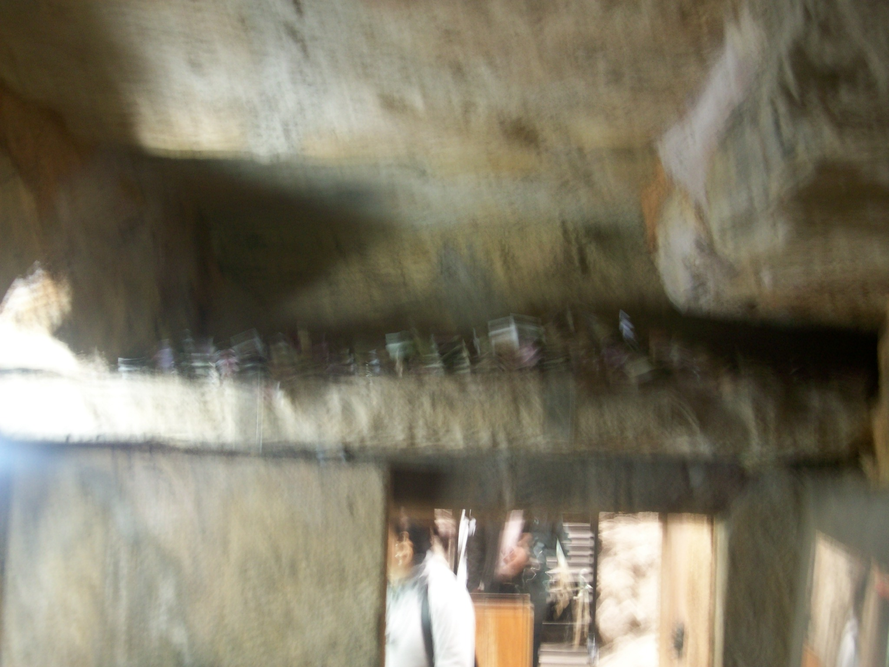
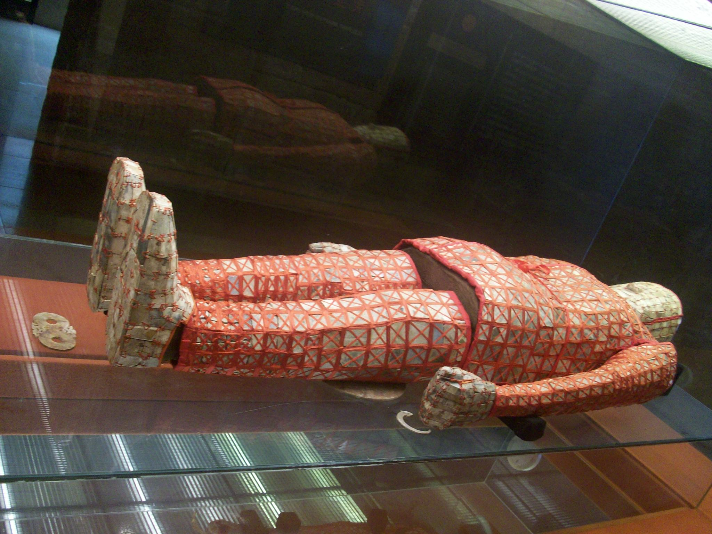
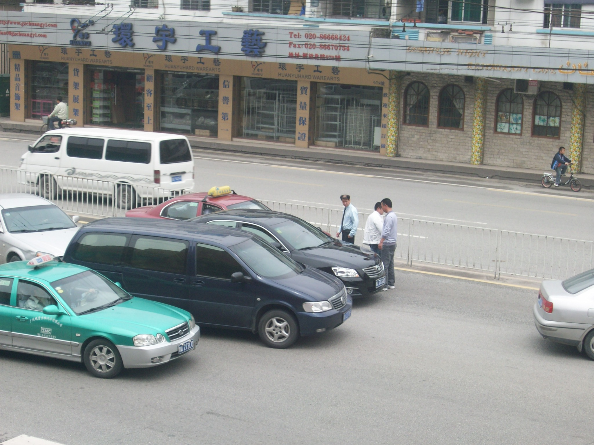
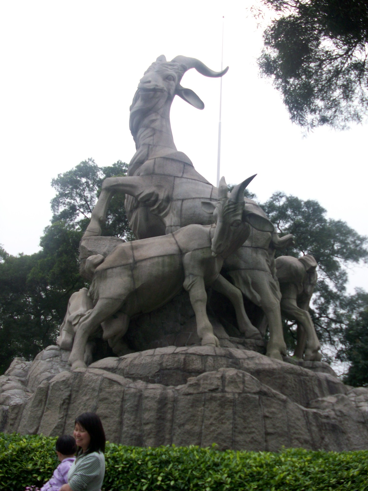
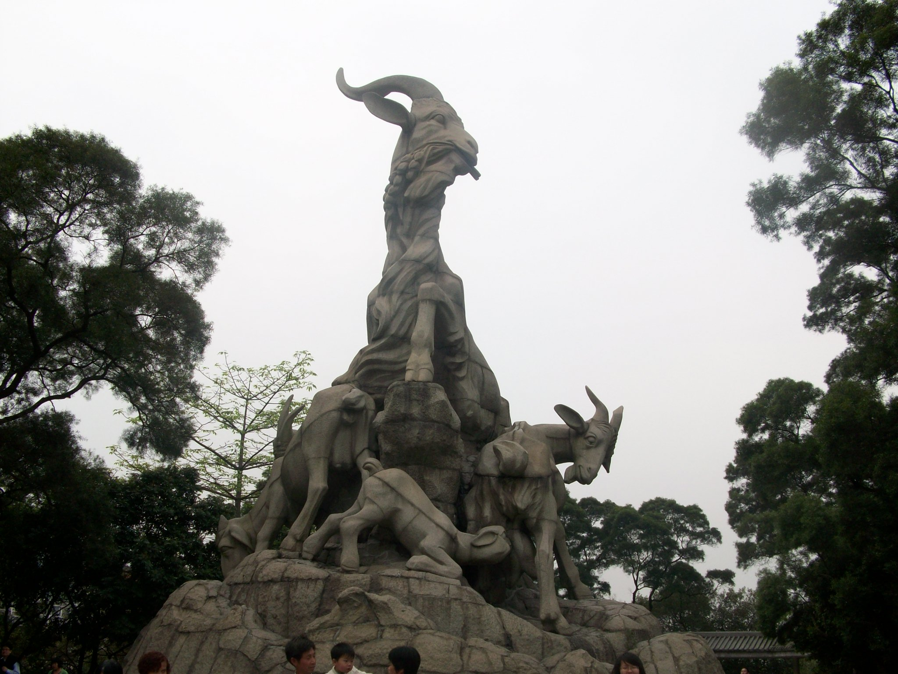
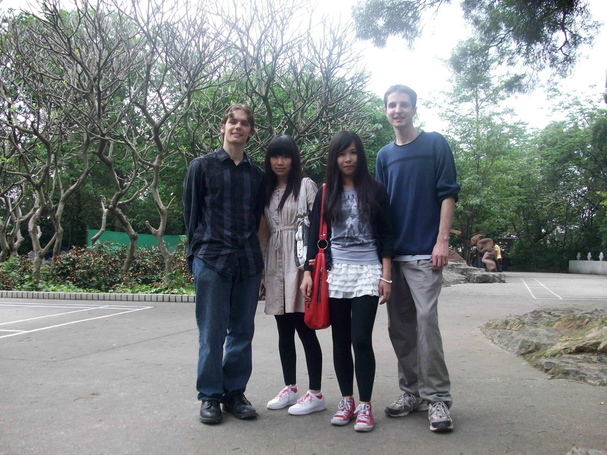
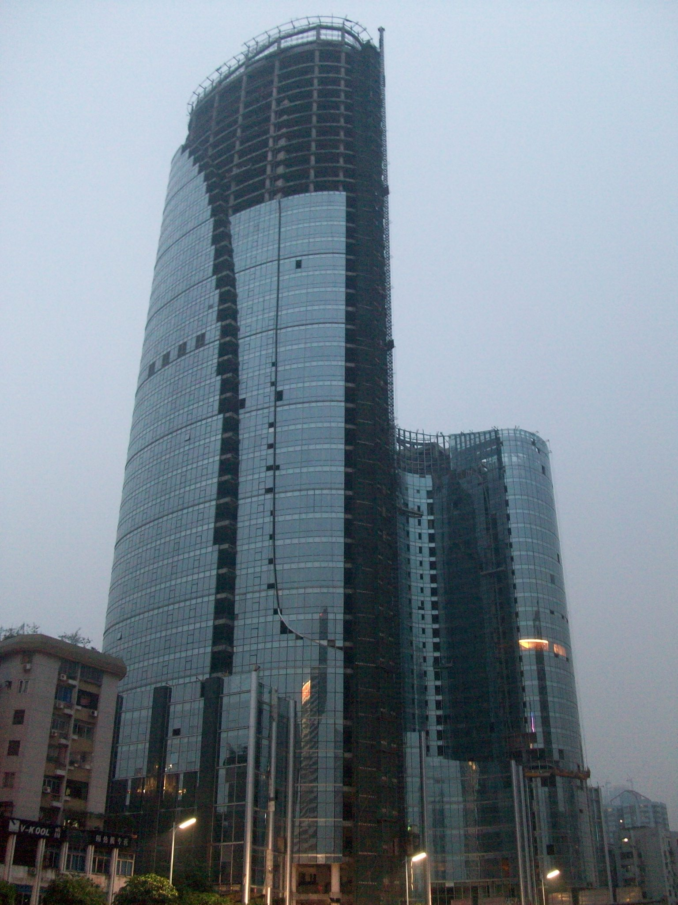
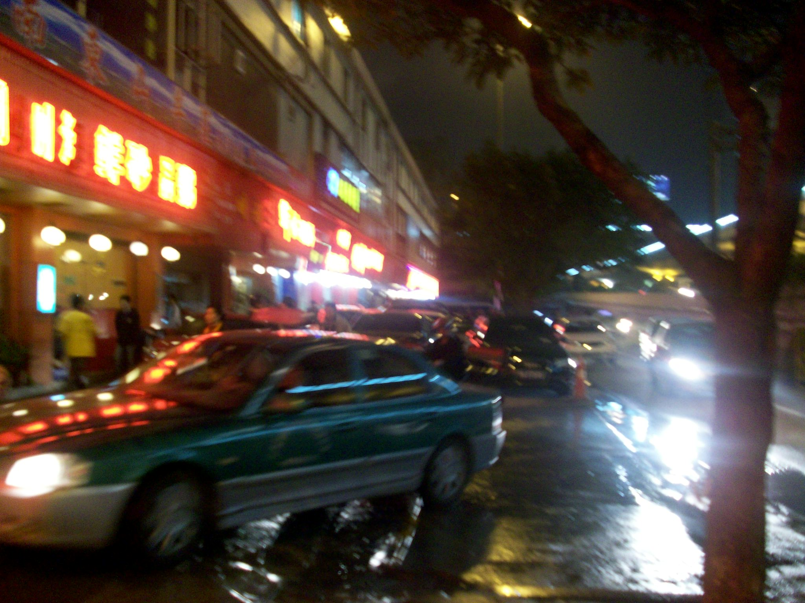

+++
title = "Five Goat Statue and Others"
date = "2010-04-22T12:02:37+00:00"
tags = ["China"]
categories = []
image = "100_0213.JPG"
+++

These pictures are the fruit of another walking adventure I went on with Tim.  We went to Yuexiao park and walked around for a while, and saw the famous five goat statue.  I had never heard of this before coming here, but there are billboards around town showing famous things from all over the world including the statue of liberty, the Sydney opera house, and the five goat statue, so I guess it's a big deal.  We also saw the site of an ancient Chinese tomb and the stuff that was extracted from it.  Some of that was cool, and some of it was a little oversold.  But the tomb itself was cool.  Afterward we walked around town for a while and bought some cooked ostrich eggs from a street vendor and some boba tea.  Then on to poker.

Photos:

