+++
title = "Flight school in Needles, CA"
date = "2014-01-05T21:41:59+00:00"
tags = ["Travel", "Flying"]
categories = []
image = "IMG_20131210_101620.jpg"
+++

Spending so much time around planes in Alaska made me really want to work on my pilot's license, so I went to accelerated flight school in Needles, CA right before Christmas. I passed my practical test on my birthday.

Photos:

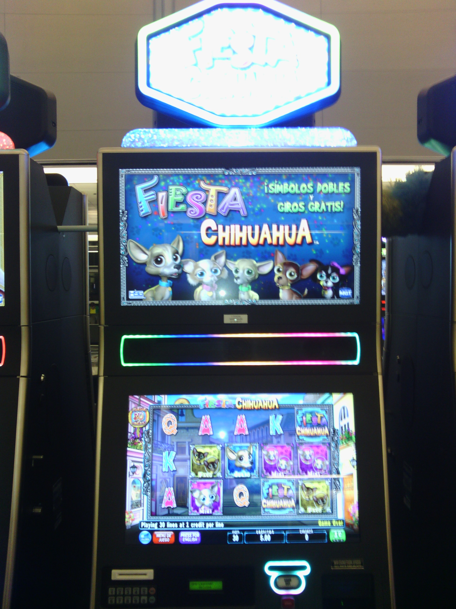
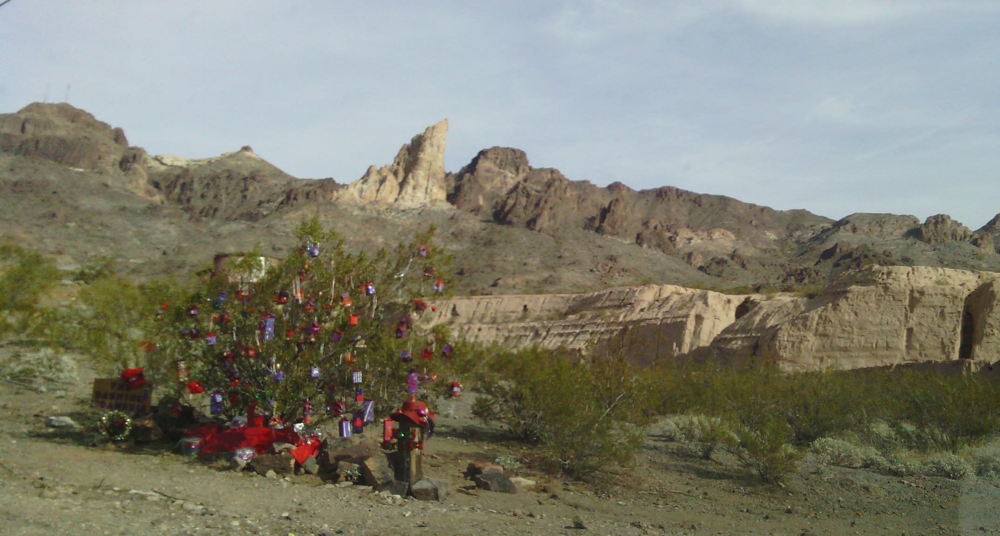
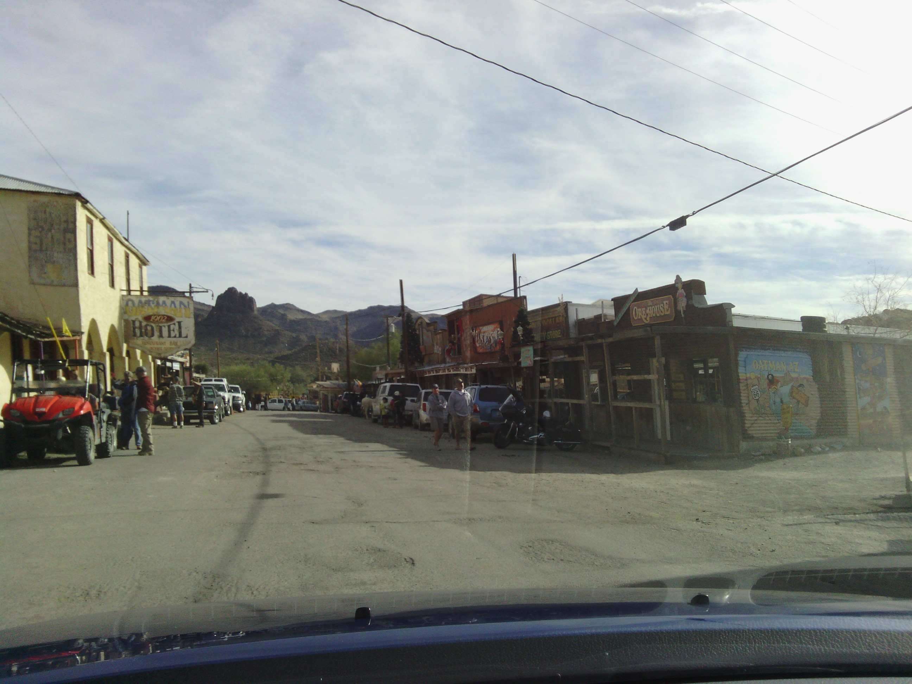
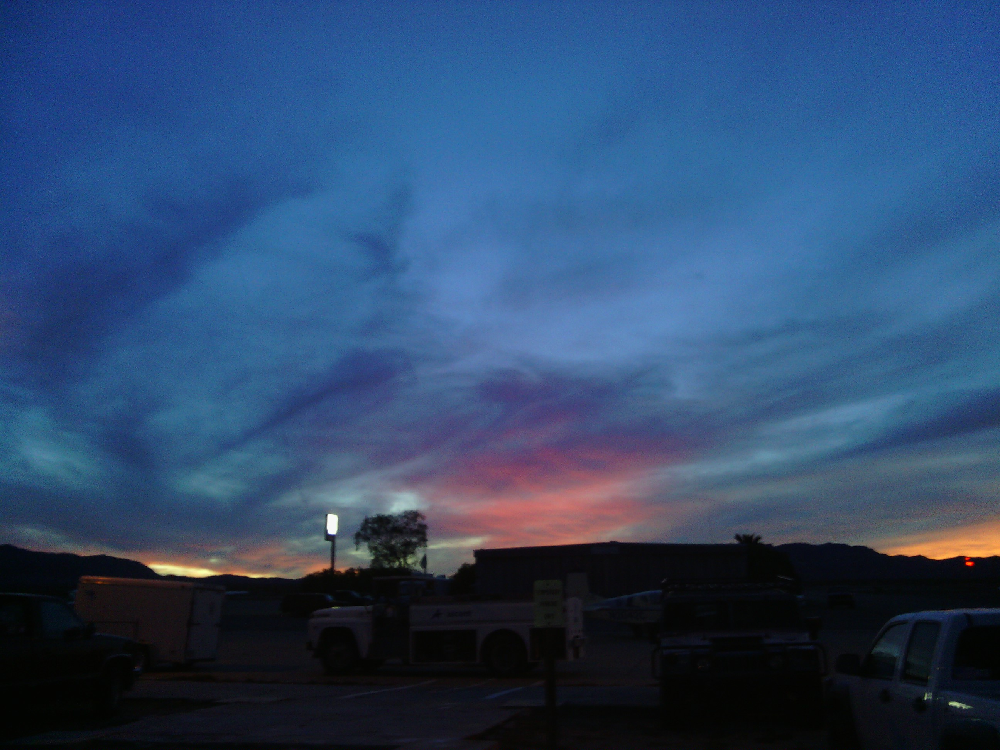
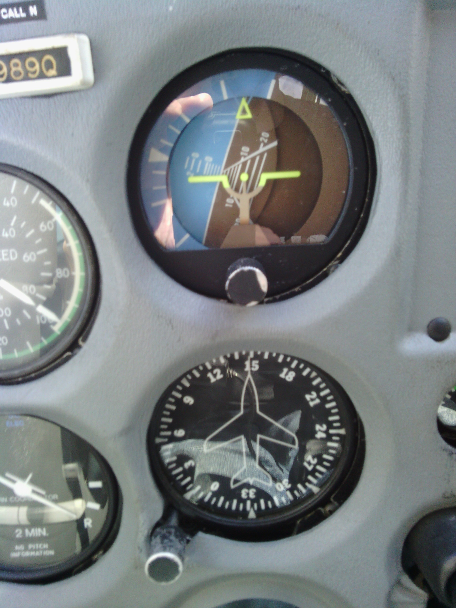

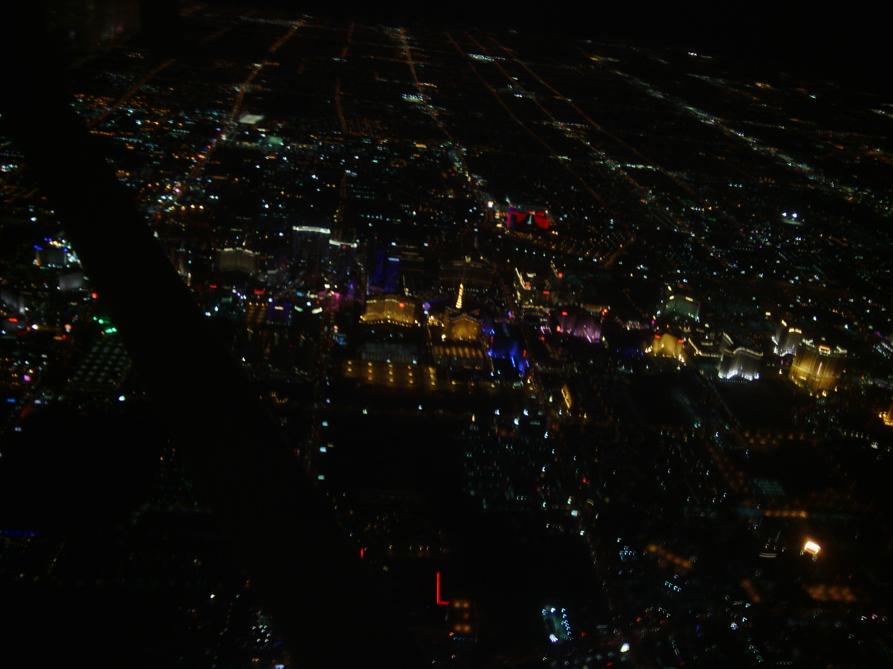
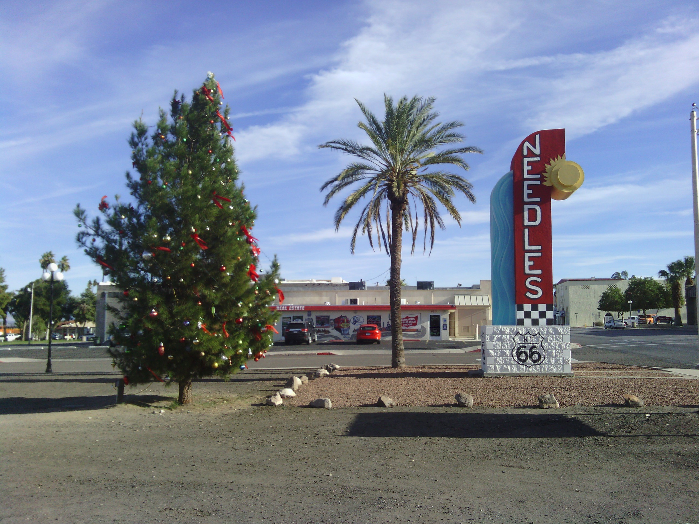
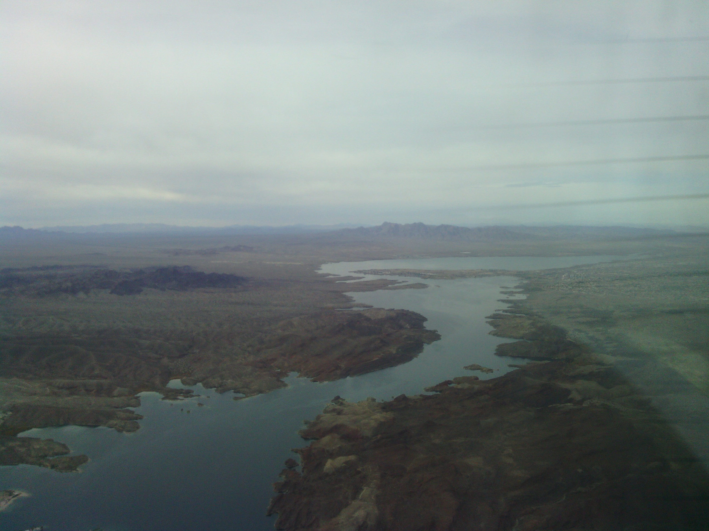

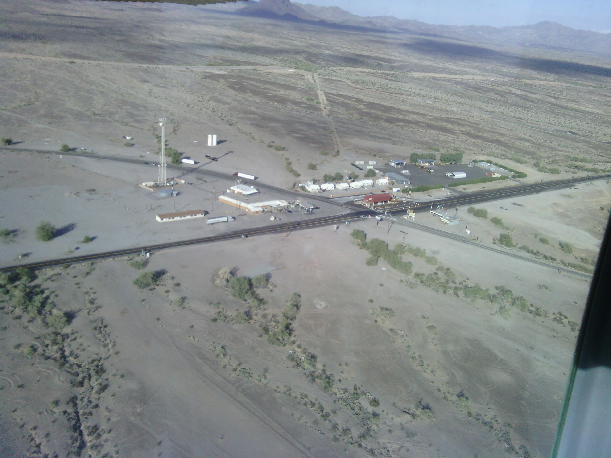
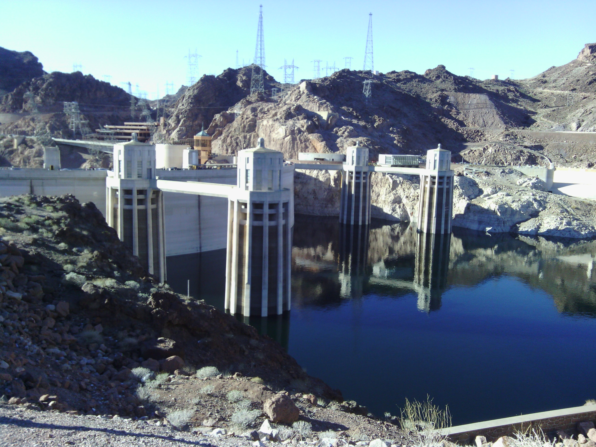
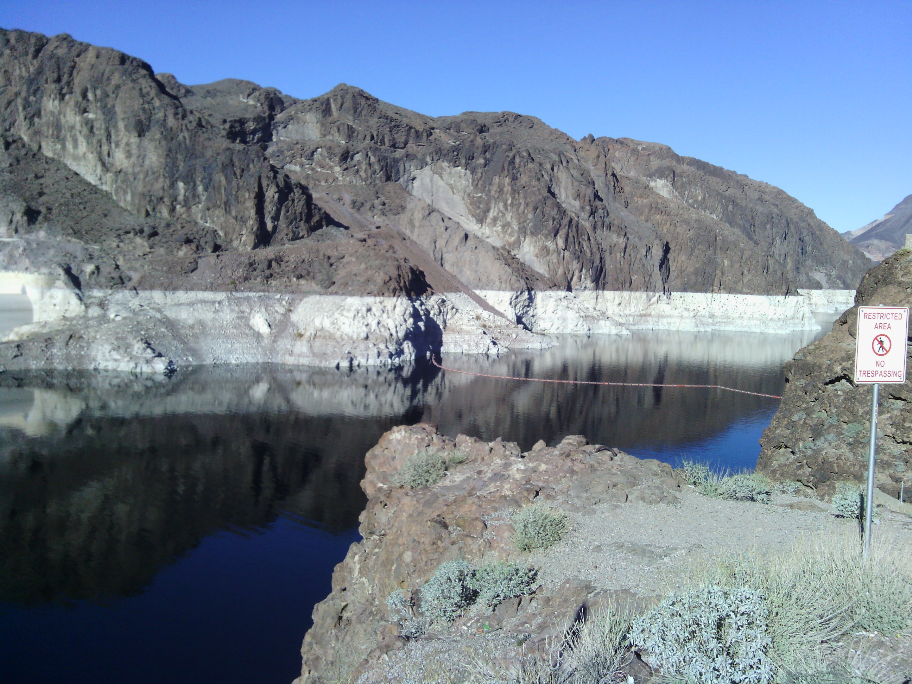
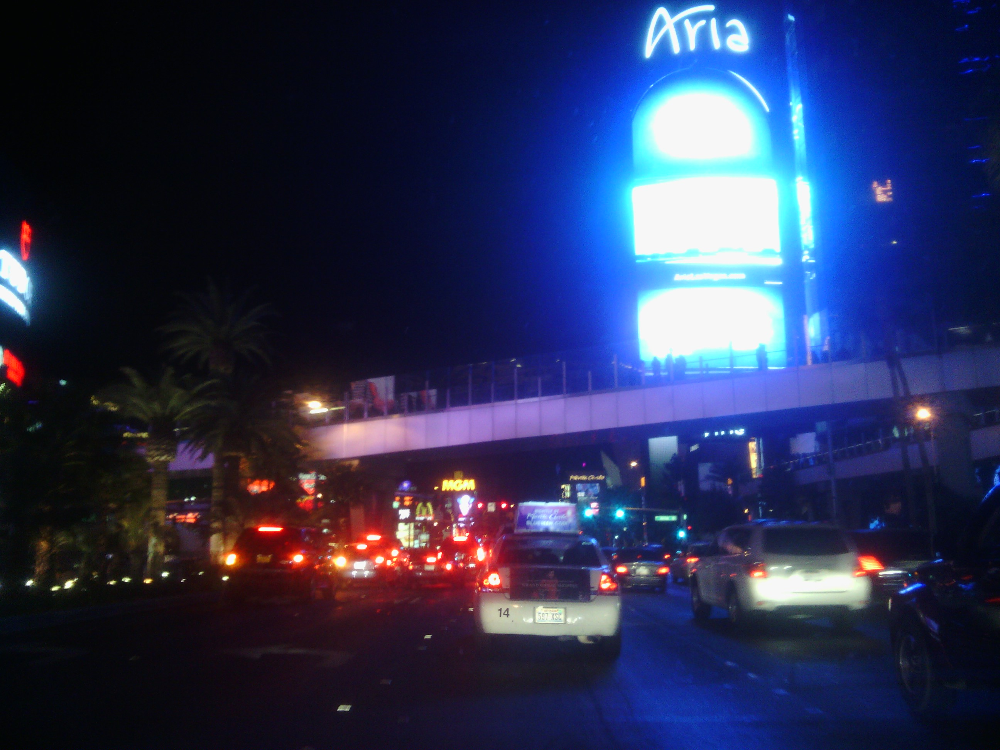
