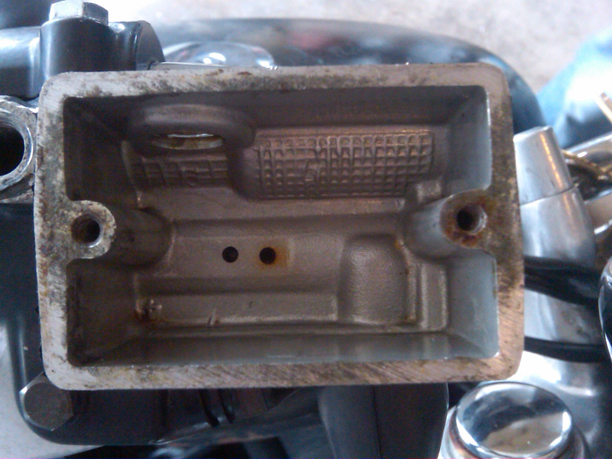
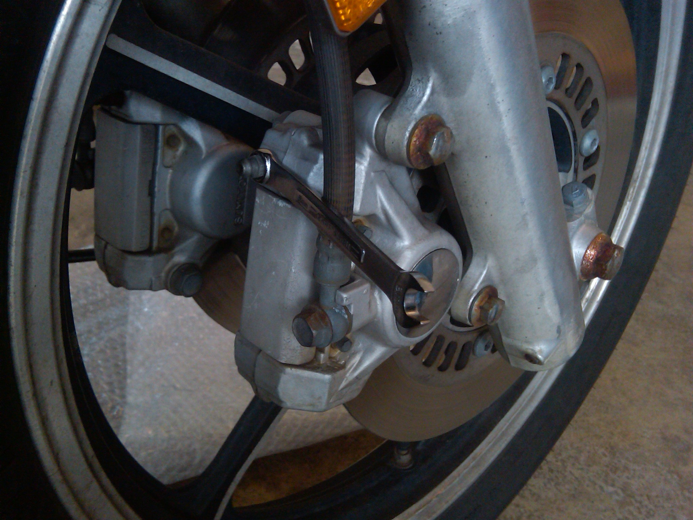
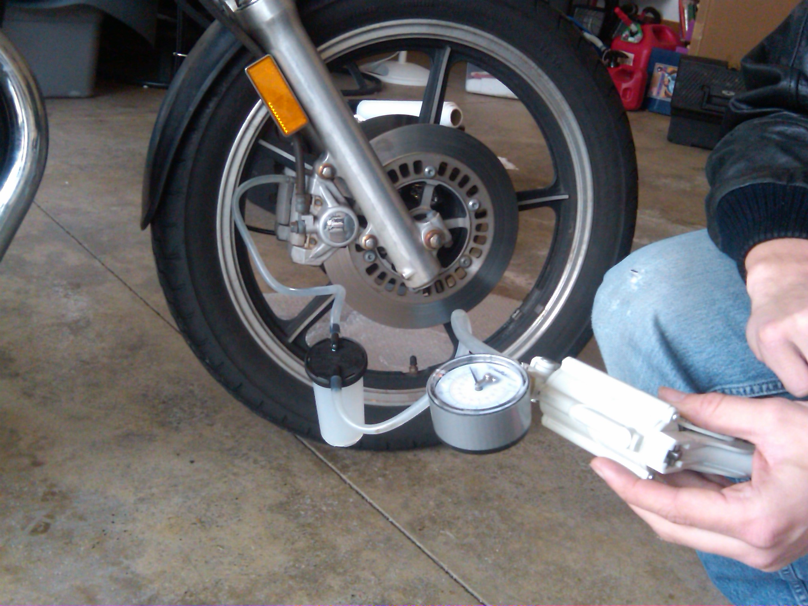
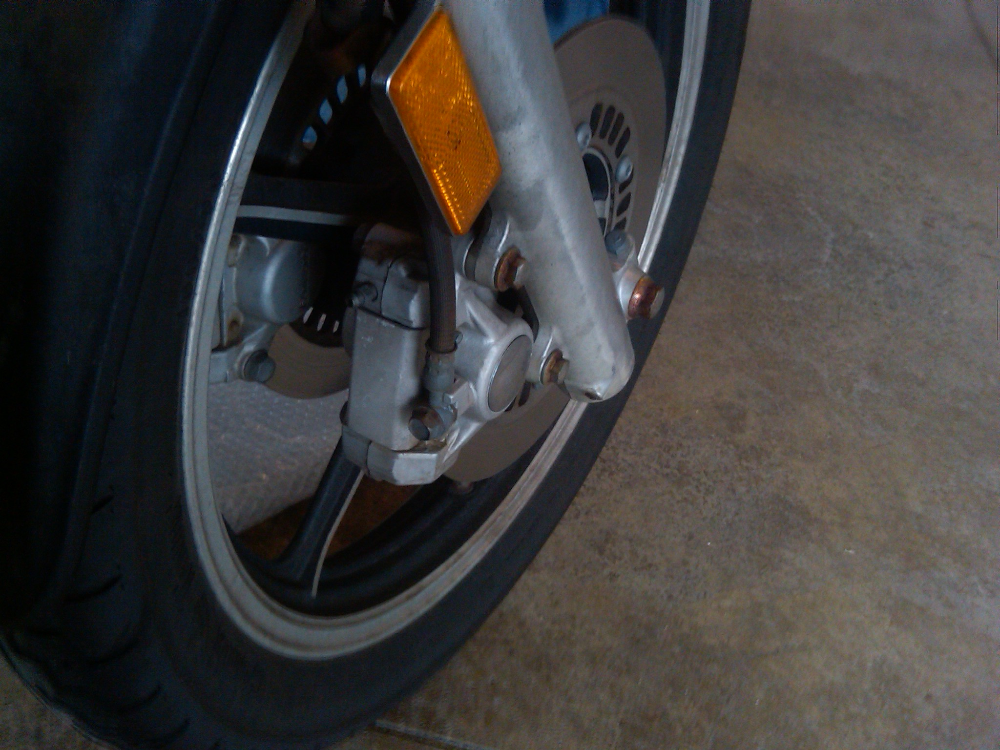
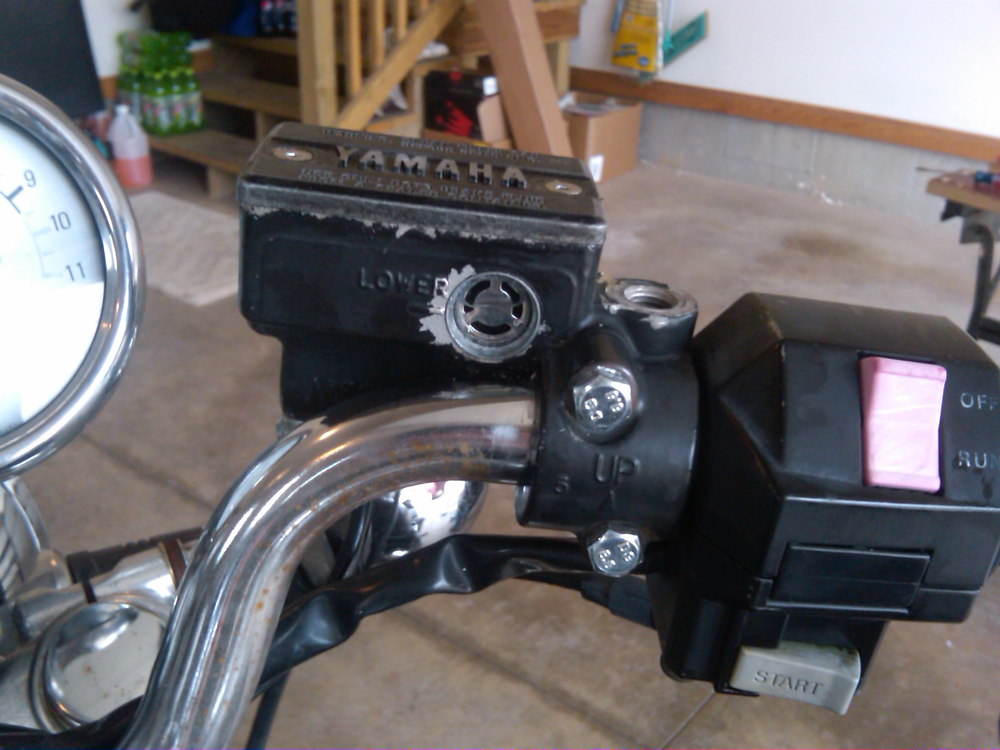

+++
title = "Flushing hydraulic brakes (vacuum method)"
date = "2012-09-09T01:59:00+00:00"
tags = ["motorcycle"]
categories = []
image = "vacuum-setup.jpg"
+++

One of my hobbies is riding and restoring, and maintaining motorcycles. I've not been trained to do it, but I learn as I go, and I enjoy learning things as I need them, so I've decided to share what I know. Today, I'm changing the brake fluid on my Yamaha Maxim XJ700.

Brake fluid reacts with air and water and needs to be changed on a regular basis.  I change my fluid once a season, and recommend the same, but in all honesty, changing it once every three or four seasons probably will not result in failure.  If your brakes are sticking, it's time to change the fluid.  The most common methods for home for bleeding brakes at home is the pumping method.  Here I will describe another method known as the vacuum method.  The advantages of the vacuum method are that it is faster, easier, and can be used on an empty brake line.  The disadvantage is that it requires a vacuum pump.

<ul>
<strong>You will need:</strong>
<li>Brake Fluid</li>
<li>Screw Driver Set</li>
<li>Wrench Set</li>
<li>Towels</li>
<li>A friend who is willing to help</li>
<li>Vacuum Pump (<a href="https://www.autozone.com/test-scan-and-specialty-tools/vacuum-pump/oem-vacuum-pump-and-gauge-tester-hand-pump/2080_0_0">example</a>)</li>
</ul>

As preparation, remove or cover any nearby painted surfaces to prevent brake fluid from dripping onto them.  I always remove my gas tank.  Brake fluid is very corrosive to paint.

Remove the lid from your master cylinder, wipe it off thoroughly, and set it aside in a clean place.  Use the pump to remove any old brake fluid.  When the master cylinder is empty, wipe it clean inside and, if necessary, clean out any hardened old brake fluid until it looks nice and clean inside.  Finally replace the old fluid with clean new fluid that meets the specifications for your bike.  the required fluid is stamped on the lid of the master cylinder.  Most bikes that are still on the road will require at least DOT3 fluid.

After your master cylinder is refilled with new fluid, you can get set up to start the pumping.  Place a wrench on the bleeder valve but do not turn it yet.  As always, be sure to use an appropriately sized wrench rather than an adjustable wrench, something almost right, or god forbid pliers.  It will not be worth the time you saved when you round off the bleeder valve.

Once the wrench is in place, you can connect the vacuum pump as described in its manual.  My pump has a canister that sits in the middle of the line as shown. (If you're paying attention, you'll notice that there should be a wrench on the bleeder valve, but I forgot to put it on before originally snapping this picture)

<strong>Be sure to read and understand the rest of this post before attempting any actual pumping.</strong>  Now we're ready to actually start pumping.  Squeeze the handle on the vacuum pump a few times (or turn it on if you have an electronic pump).  Once there is vacuum in the line, turn that wrench about a quarter turn to open the bleeder valve.  At this point old fluid will flow out of the line into the vacuum bottle, and new fluid will replace it from the master cylinder.  It is critical that no air flow into the line from either end of you will have to start over.  This means you (and your friend will have to monitor two things.
<ul><li>The vacuum on the line must never reach zero</li>
<li>The fluid level in the master cylinder must never reach the bottom</li></ul>
One person can continue pumping as the other person continues adding fluid the the cylinder.  Once clean fluid starts to come out of the line, you can re-tighten the bleeder valve, and then release the vacuum.

If you have a dual front brake system, you should repeat the process for the other disc.  The second side should go faster as the top of the line is already flushed, and only the bottom needs to be done.  If you only have a single disc, then you are almost done.

After you've flushed the entire line (two sides or just one) all that is left is filling the master cylinder back to the level indicated by the level viewing window.

That's all there is to it.  It should take about an hour and a half your first time, and closer to an hour subsequent times.  Be sure to thoroughly test the system before riding.

