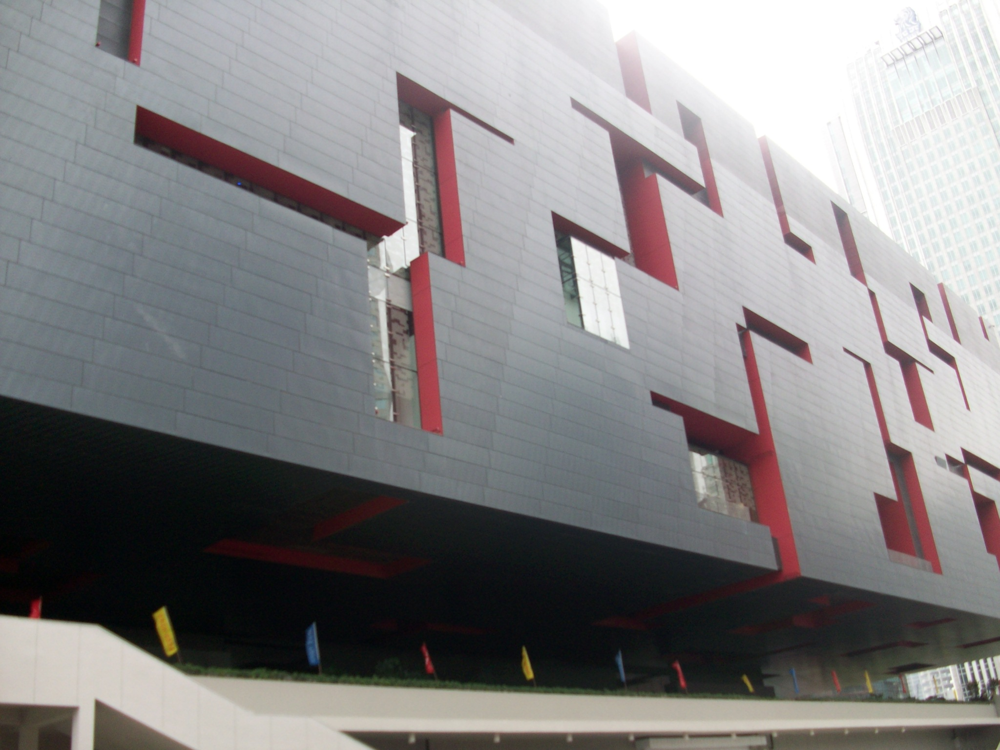
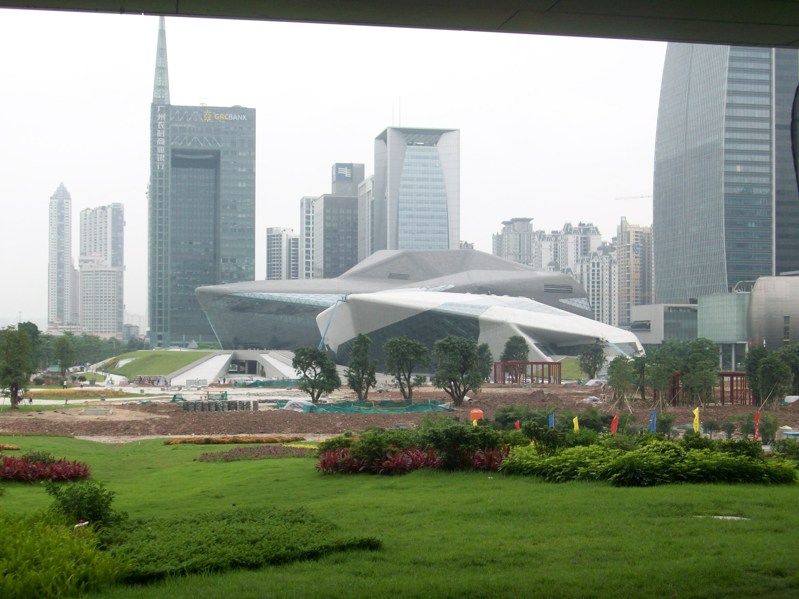
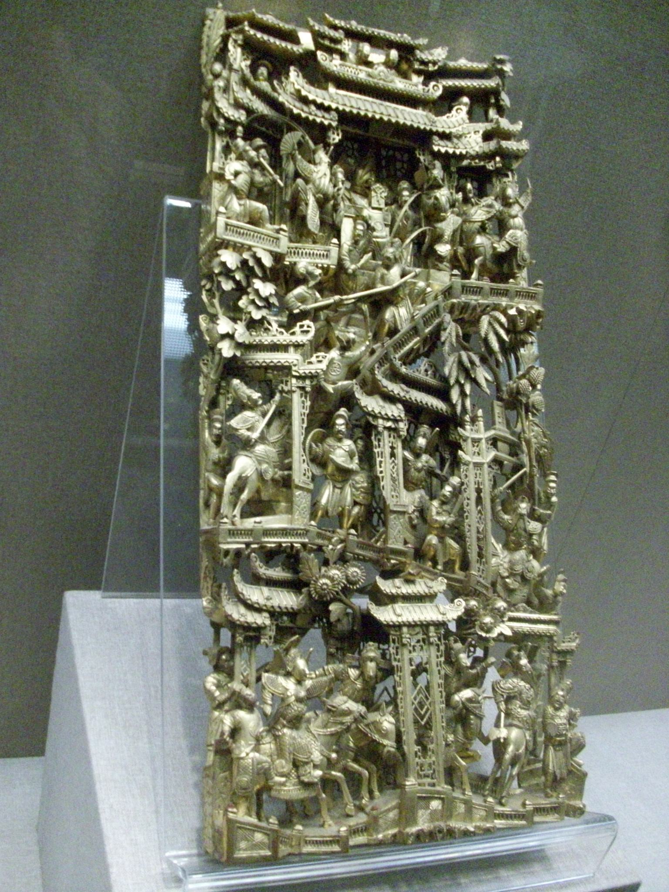
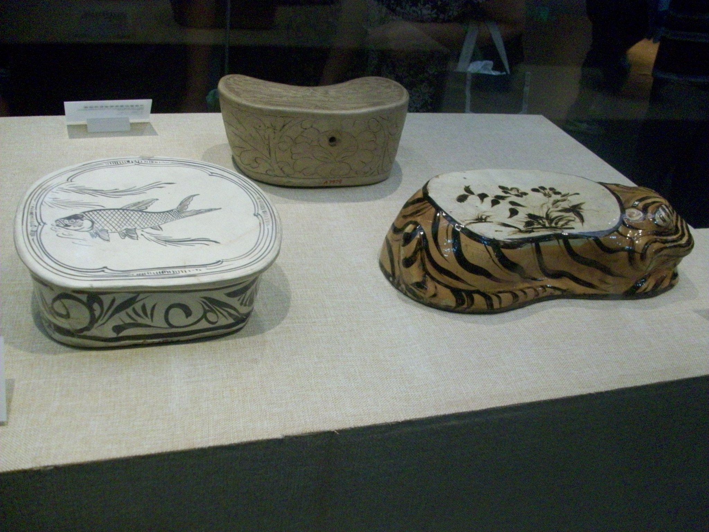
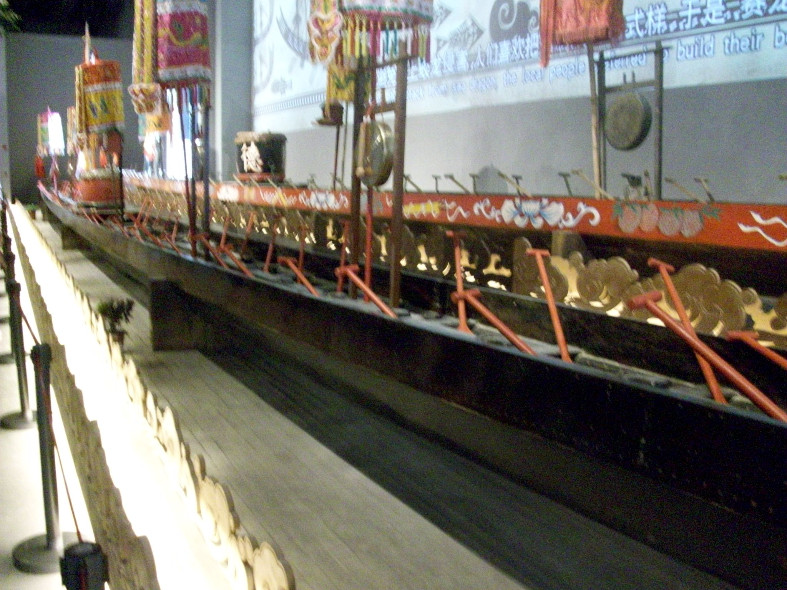
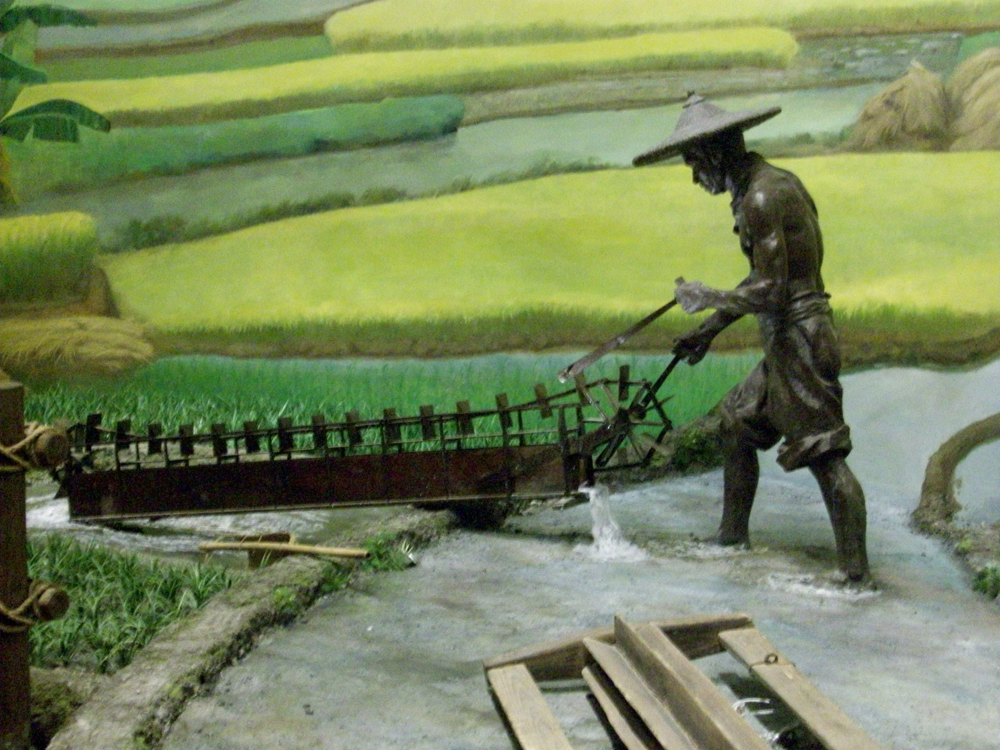
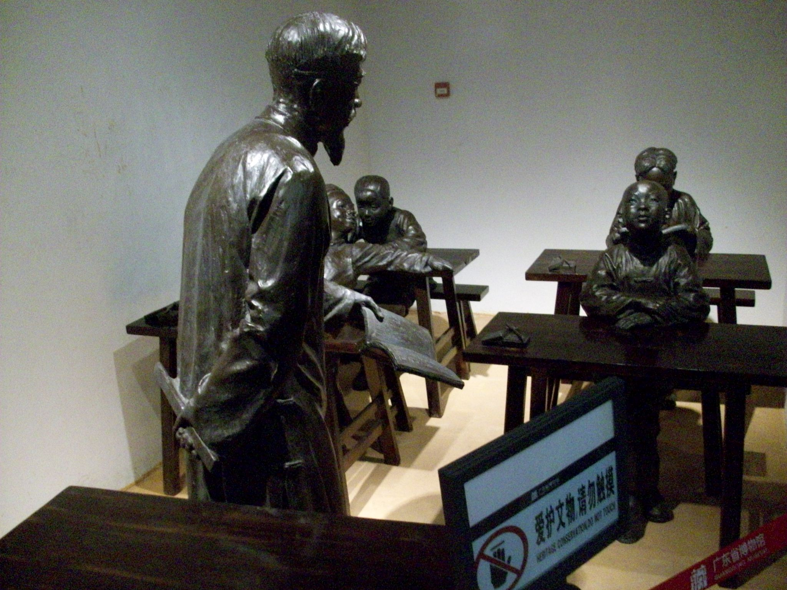
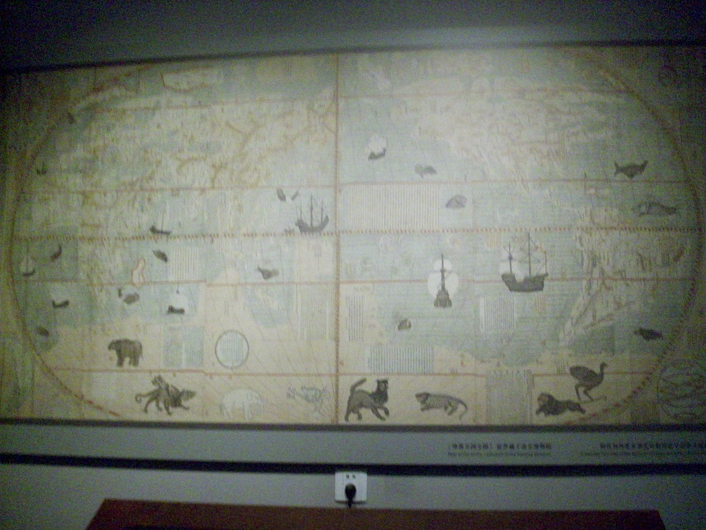
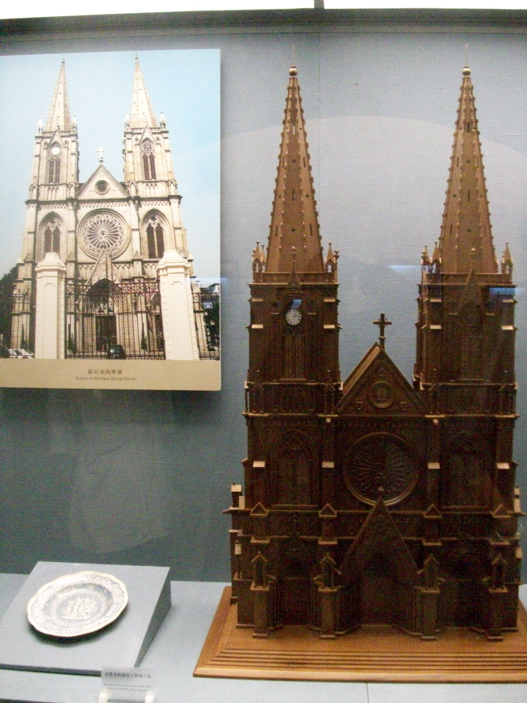
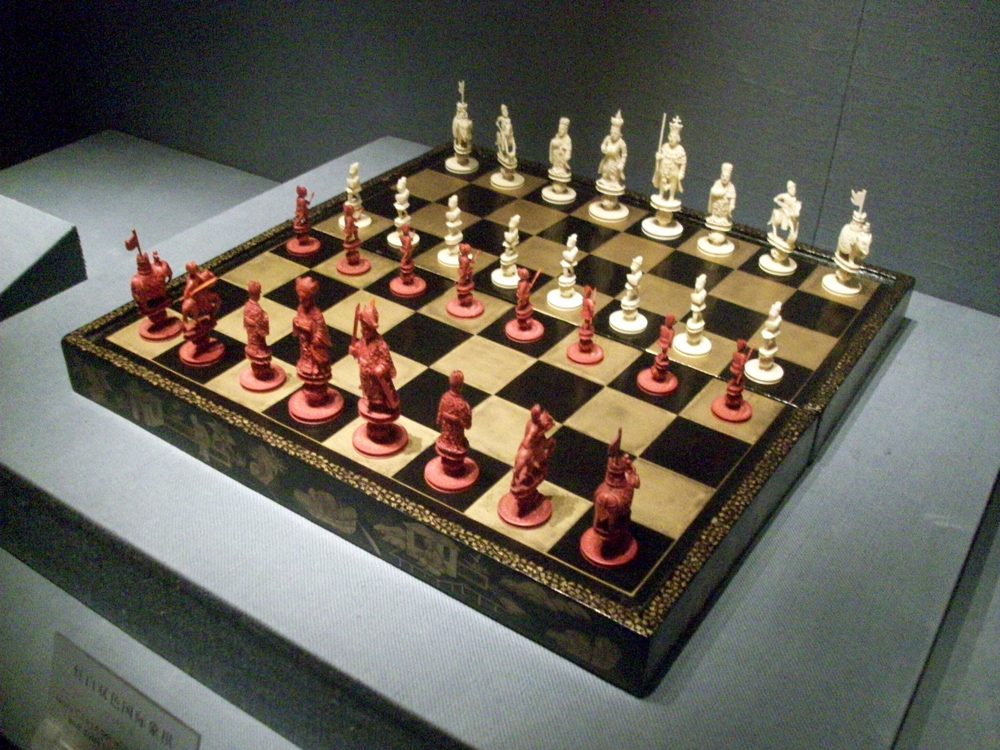

+++
title = "GuangDong (广东) Musuem"
date = "2010-06-12T09:35:48+00:00"
tags = ["China"]
categories = []
image = "100_0356.JPG"
+++

This was a trip with Tim, Brian, Jasmine, and Galon to the new museum downtown.  It has a lot of interesting historical displays, and natural history stuff too.  The building is really new and fancy.  Afterward we went out to an delicious lunch courtesy of Galon!

In retrospect, I should have gotten more people shots, and fewer museum shots.

Photos:

