+++
title = "Happy Valentine's Day 2025"
date = "2025-02-14"

tags = [
    "holiday",
    "art",
    "valentines",
]
categories = []
image = "coral.jpg"
+++

I'll end my five year quiet spell by sharing these valentines I made recently.

My kids are in preschool now and they had a Valentines day party at their school.
Each student was asked to bring some Valentines to pass out.
I remember buying and giving out silly cards with hearts and cute puns on them.
I thought it would be fun to make them instead of buy them, so we all sat down to draw some.

I made some too but I liked them enough that I didn't want to give them out to random kids who might not appreciate them.
This instinct was confirmed later when I saw how many gifts (aka sugar and plastic) he got in his valentines bag.
Instead I gave them to a few special people in my life.
I'll also share the photos here for everyone to enjoy.

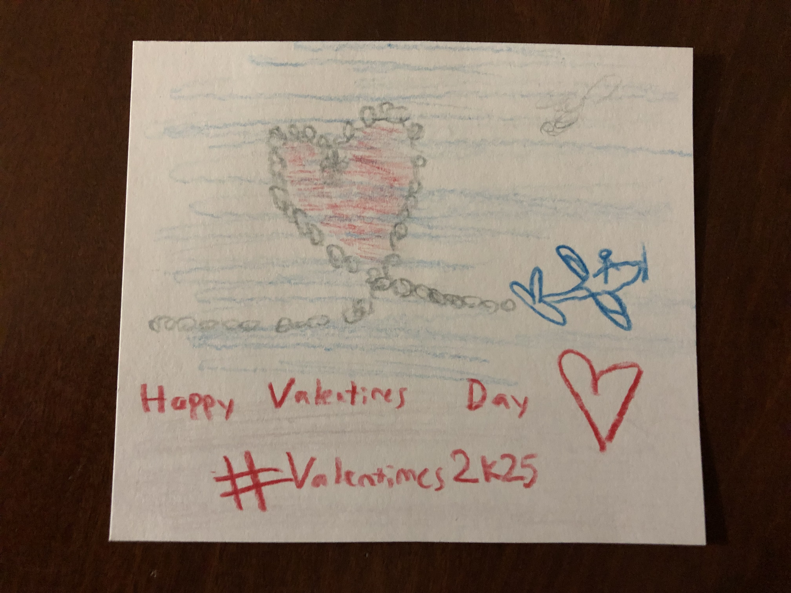
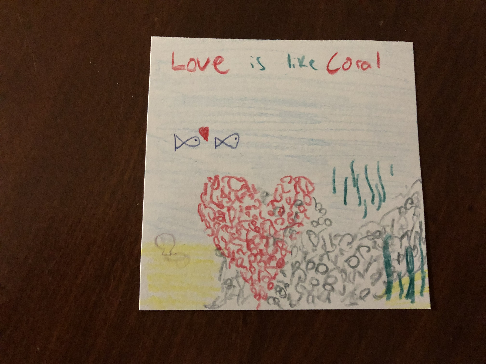
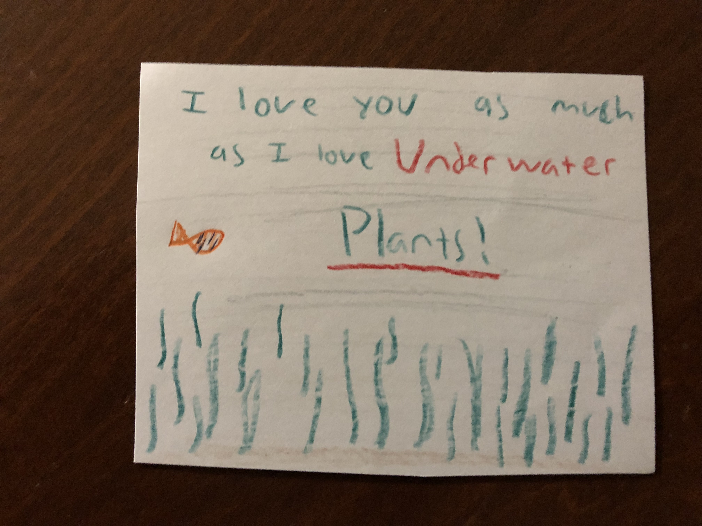
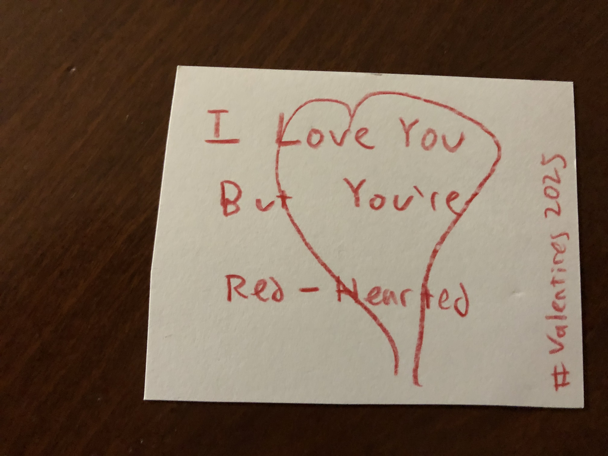
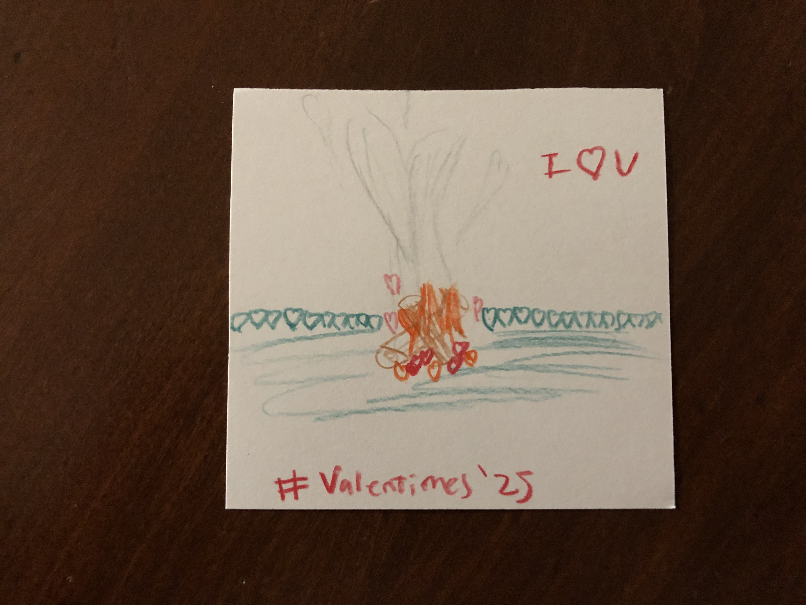
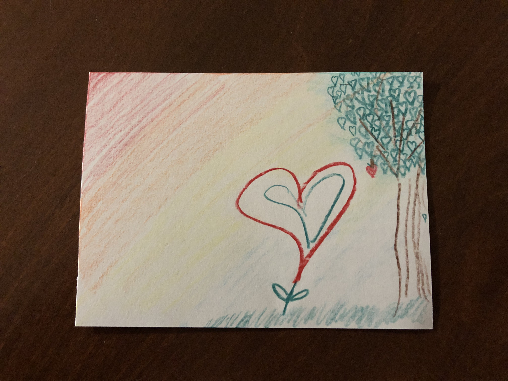
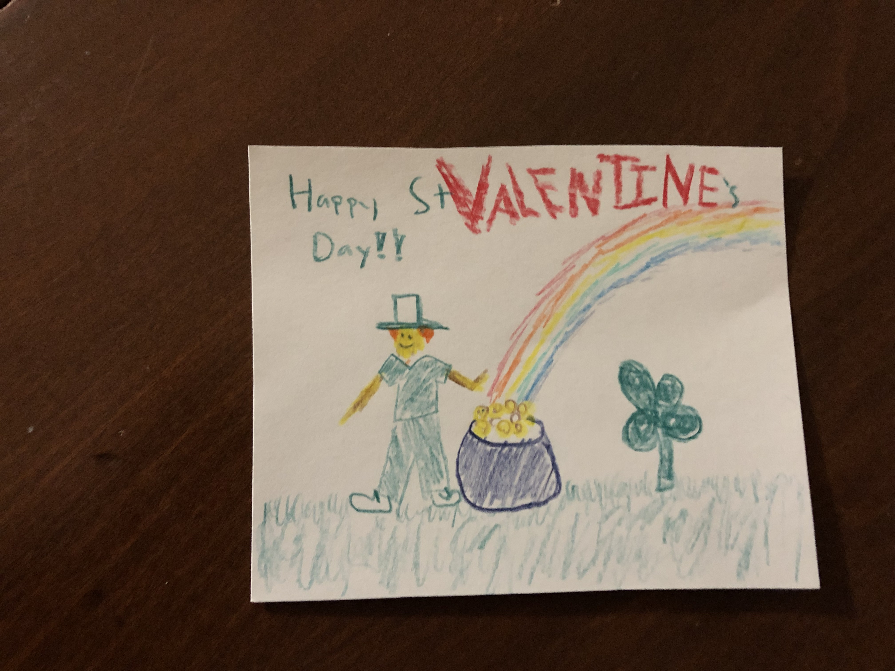
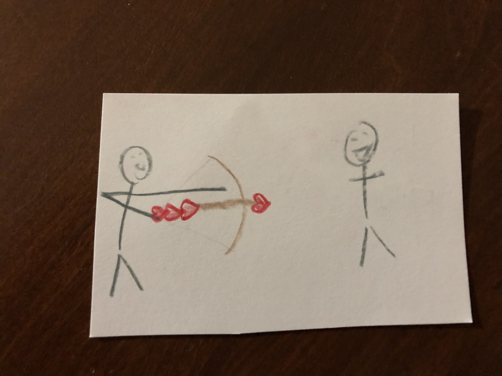
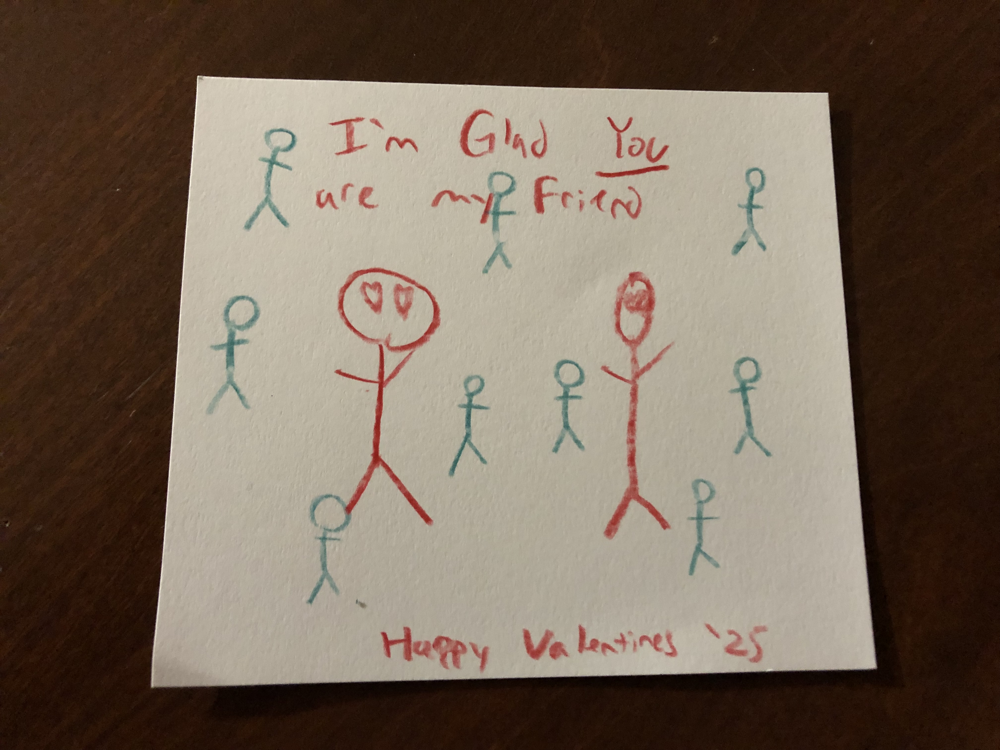
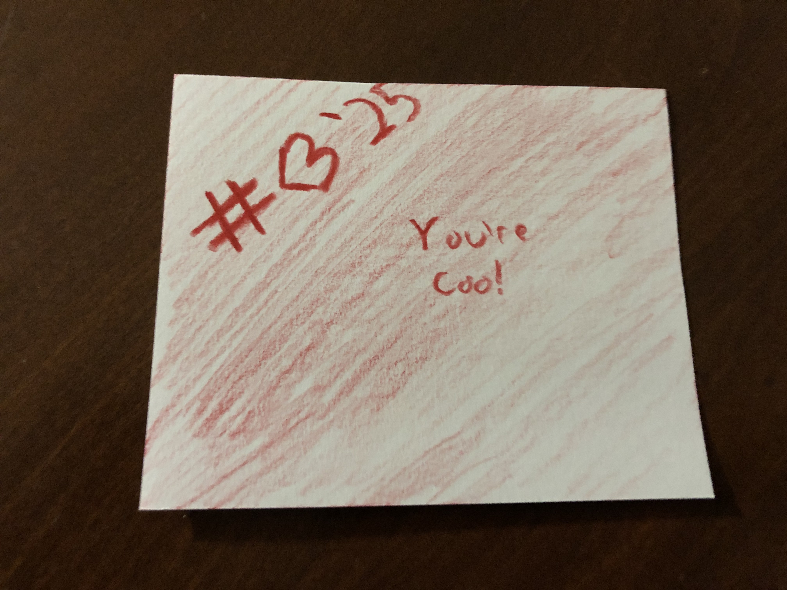
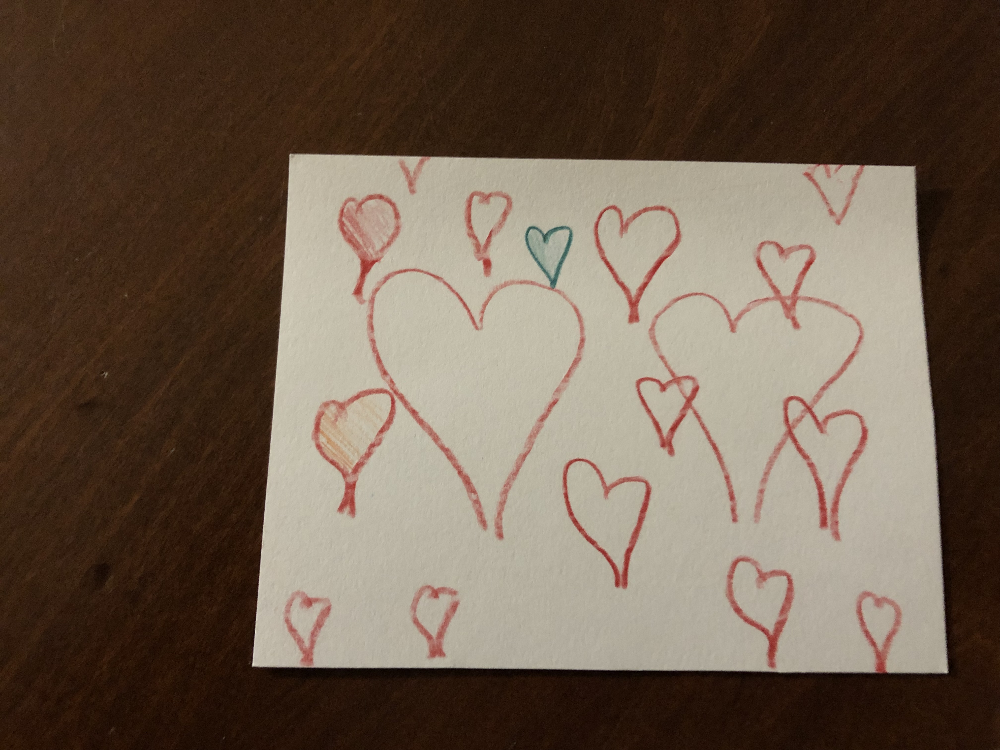
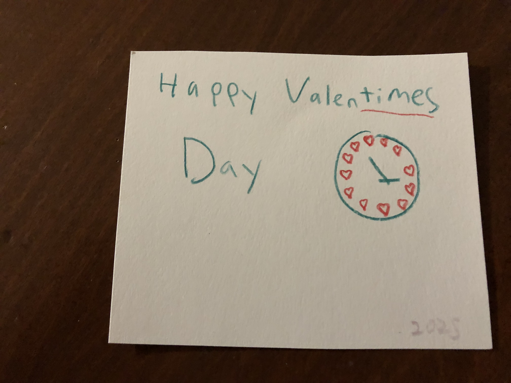
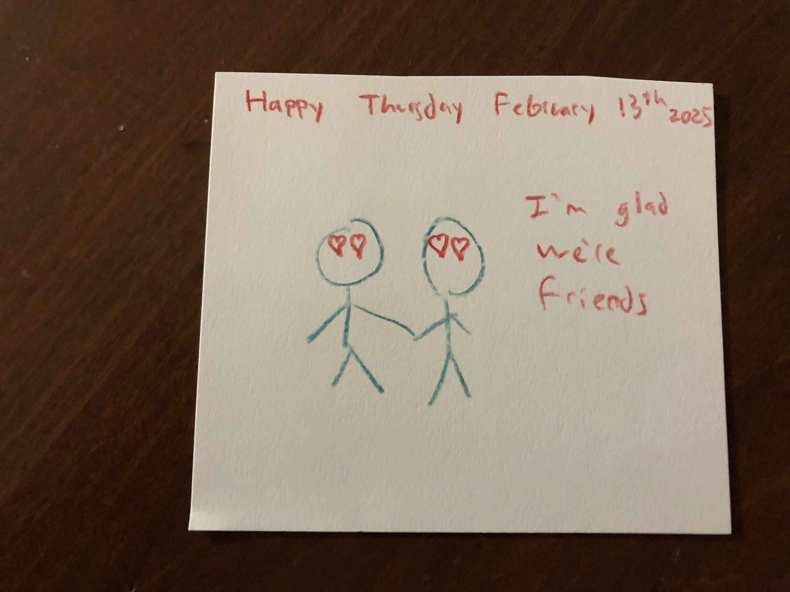
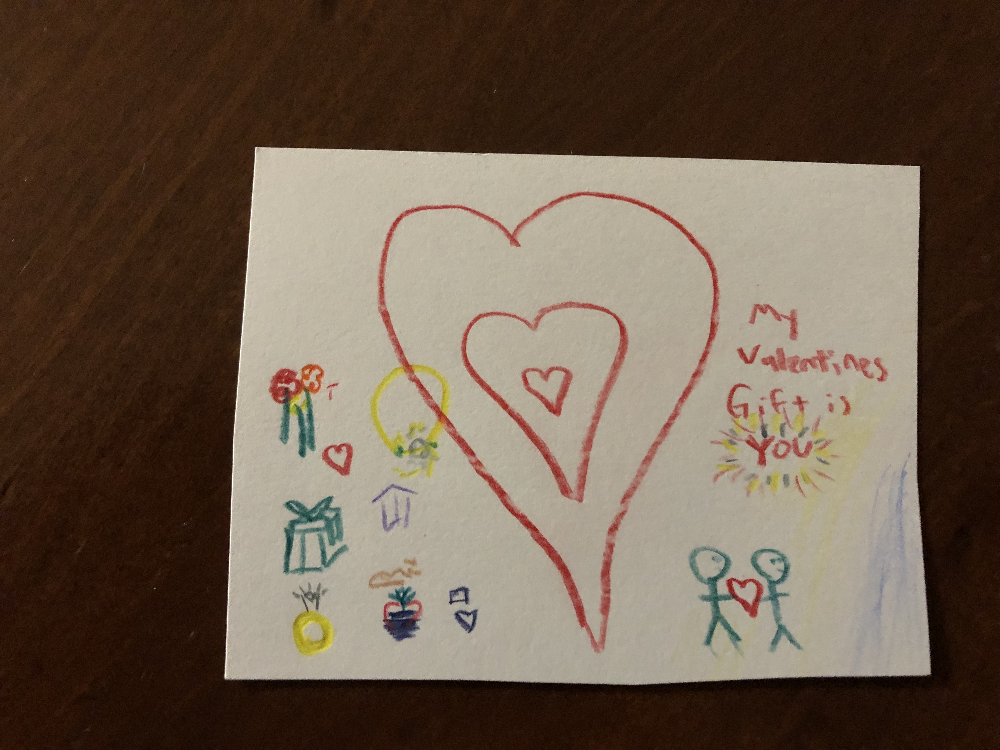