+++
title = "HuangPu Port"
date = "2010-06-10T15:07:08+00:00"
tags = ["China"]
categories = []
image = "100_0341.JPG"
+++

I went with Brian and some of his friends from his QQ group to the huangpu port.  There are a bunch of little shops, restaurants, and fruit stands.  There are also a lot of fields, and it feels like you're in the traditional Chinese countryside rather than a few kilometers outside of Guangzhou.  The restaurant where we had lunch in located behind several fields and banana farms, and we got to see the guy go get our goose from the field before he cooked it.

Photos:

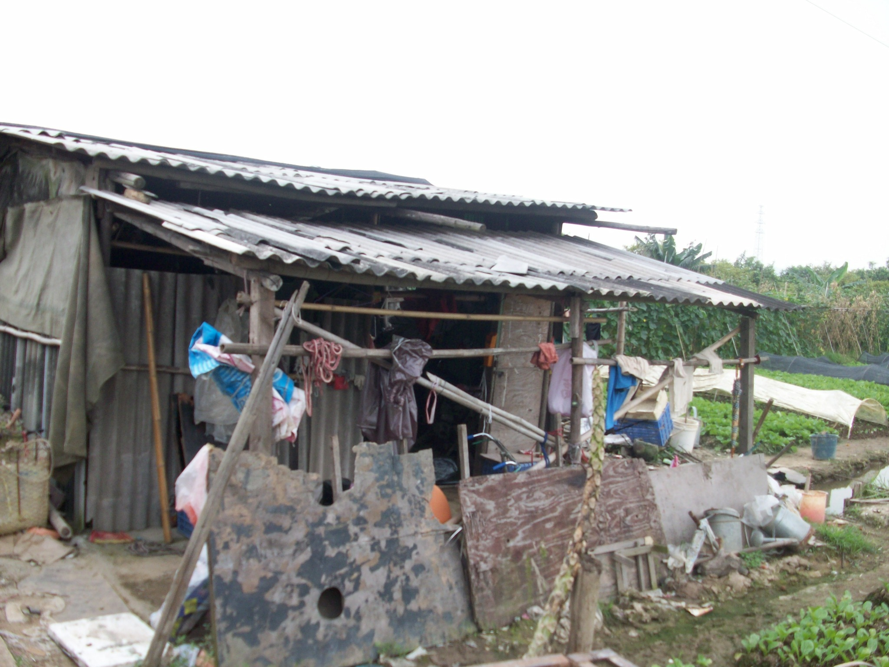
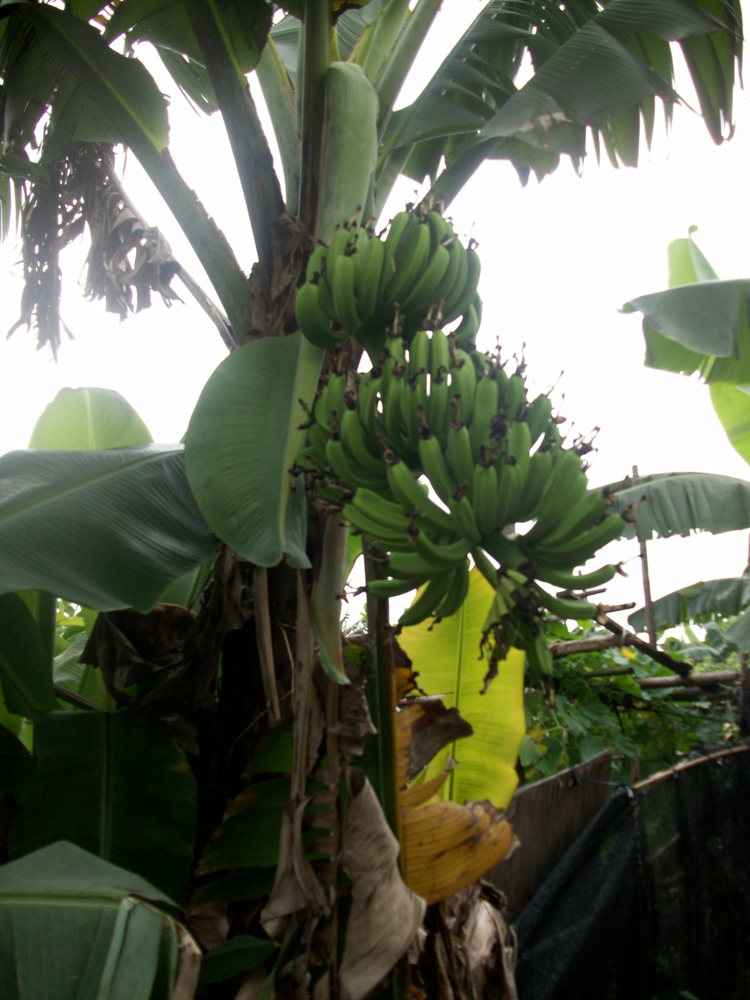
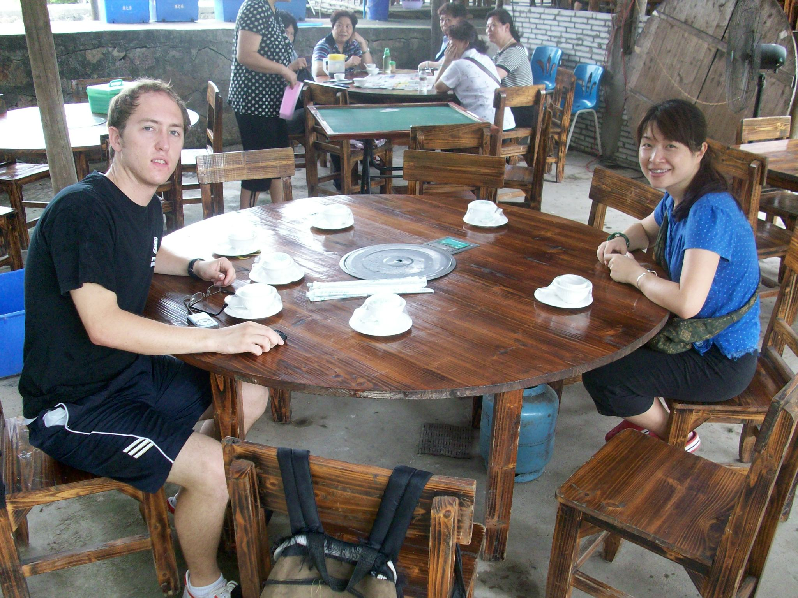
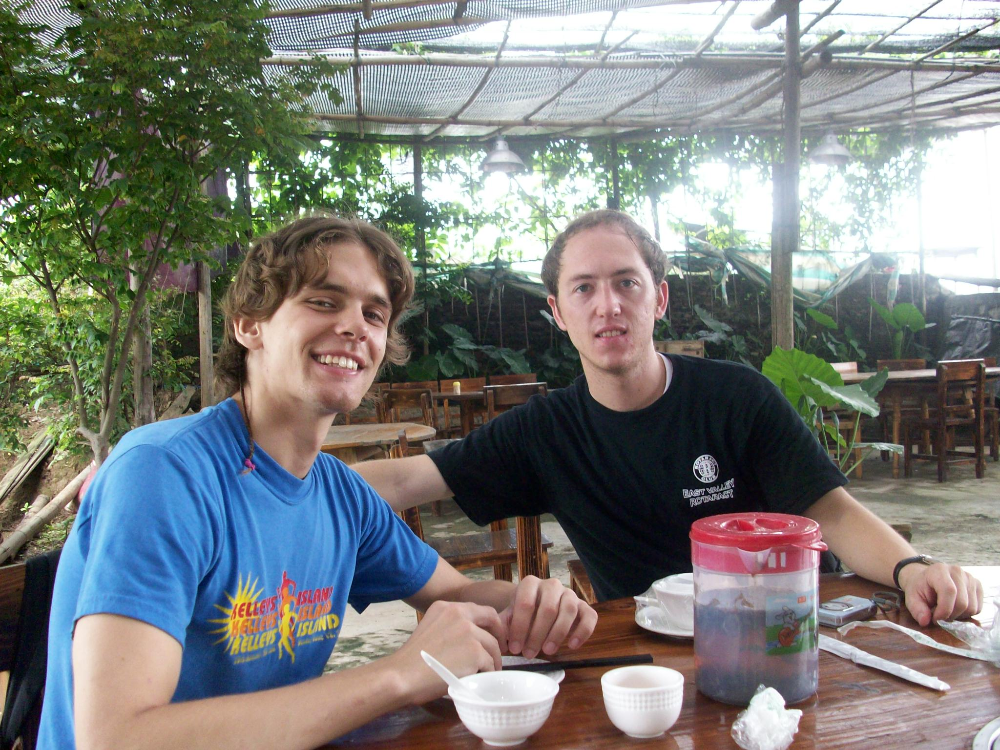
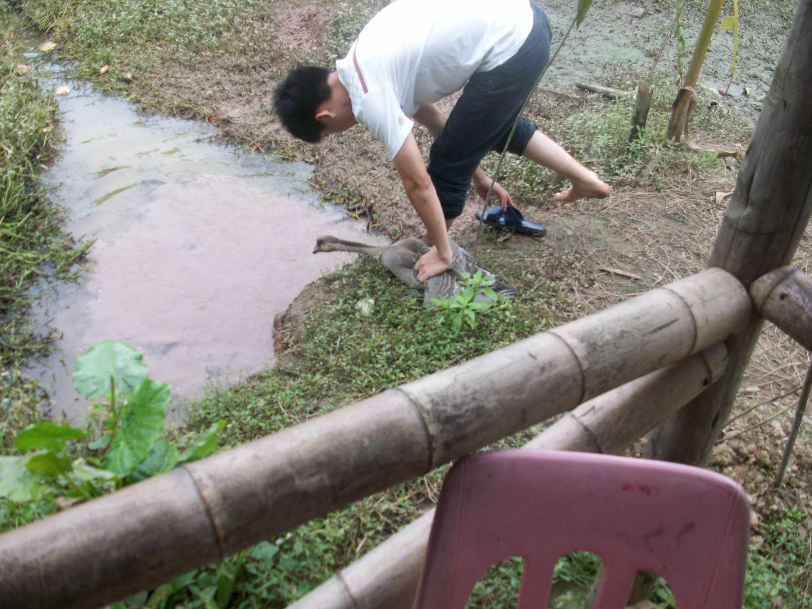

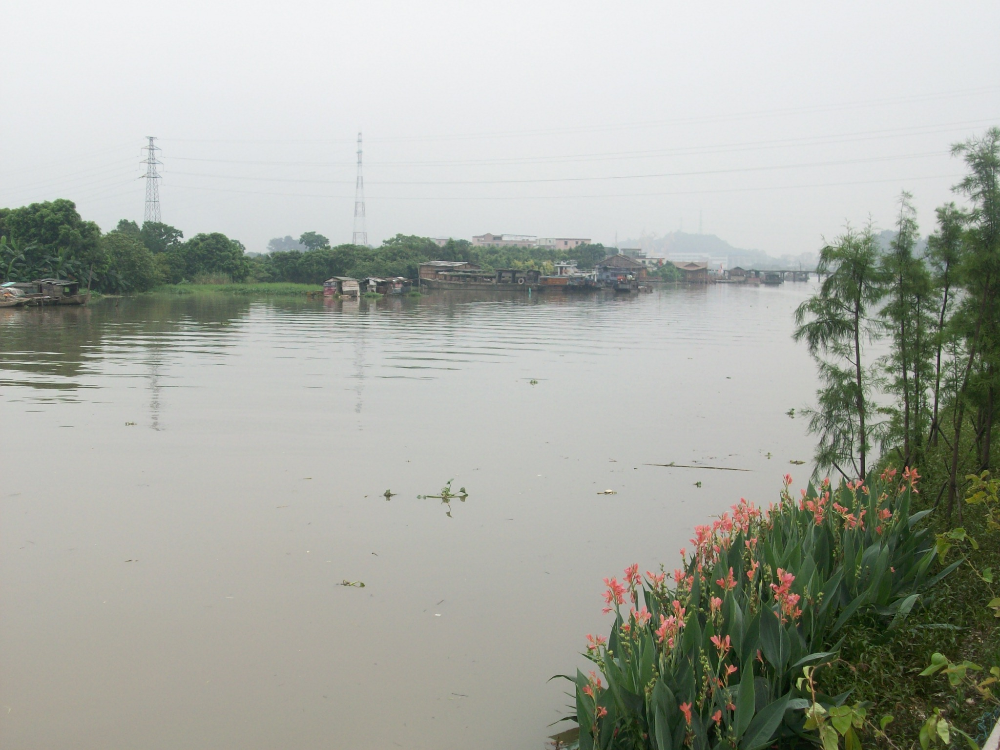
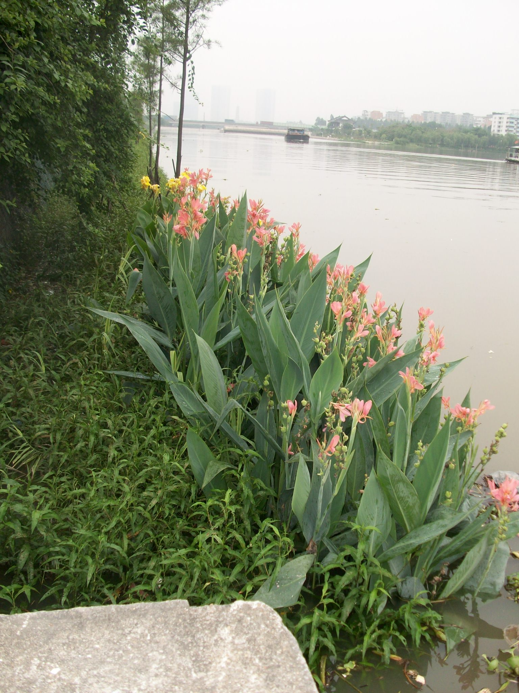
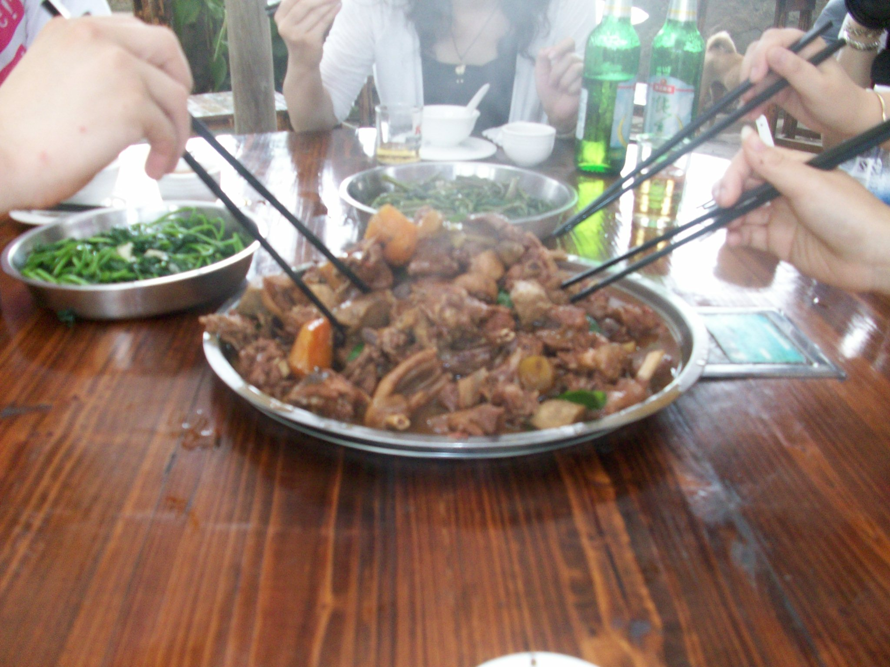
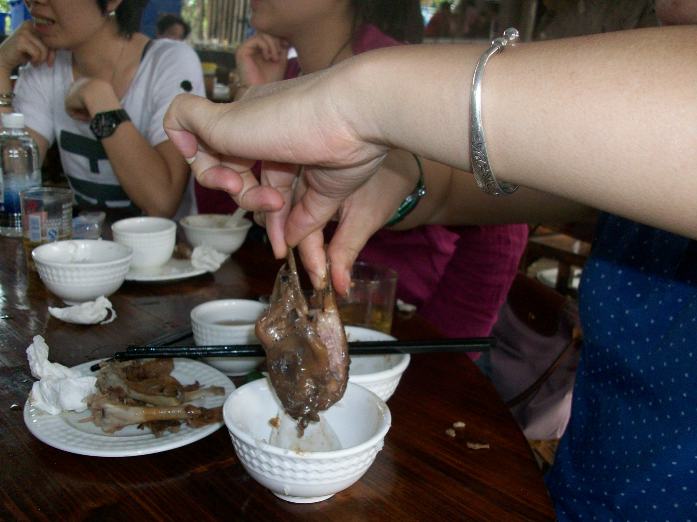
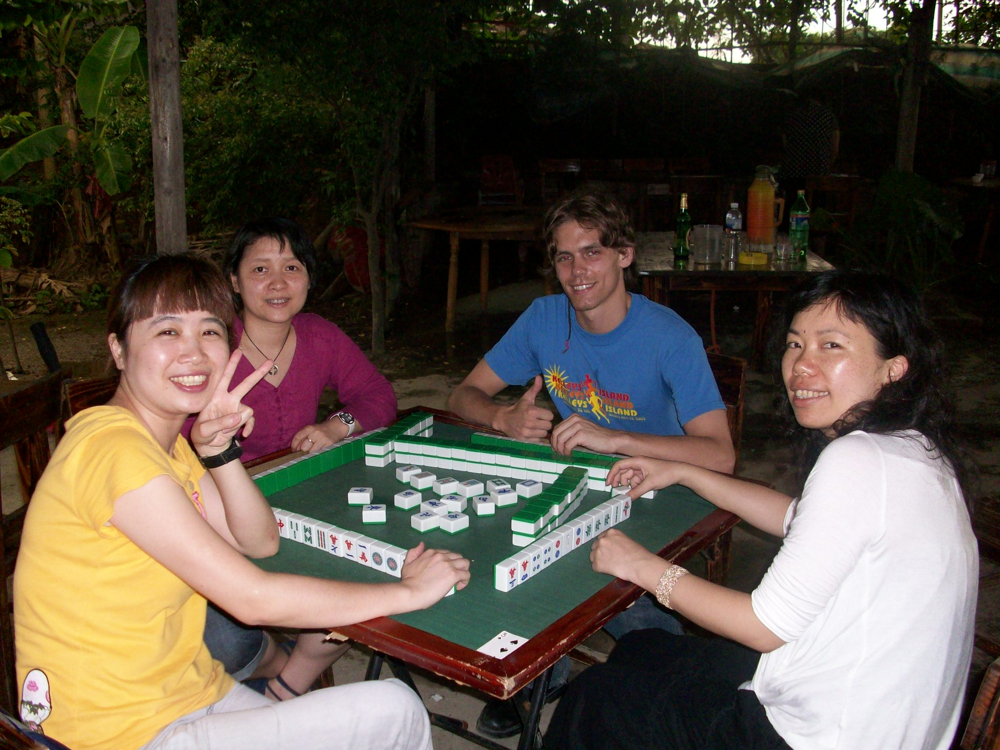
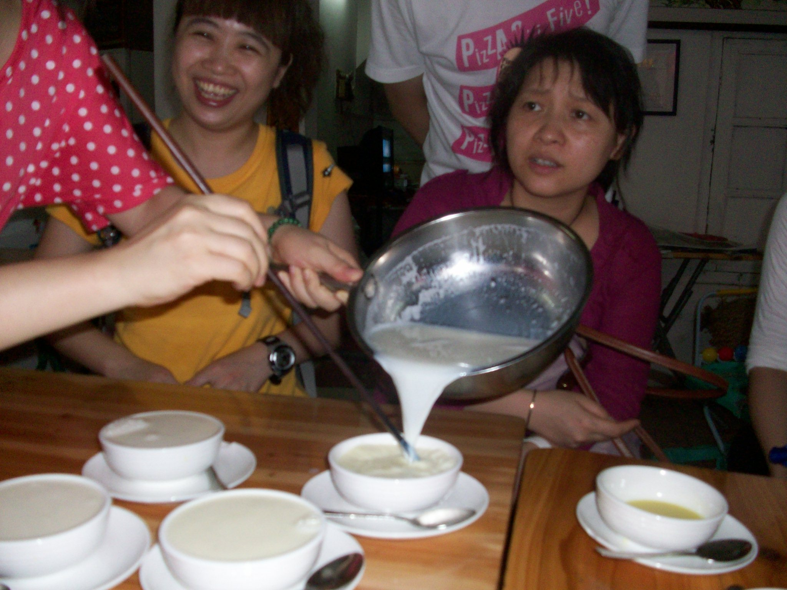
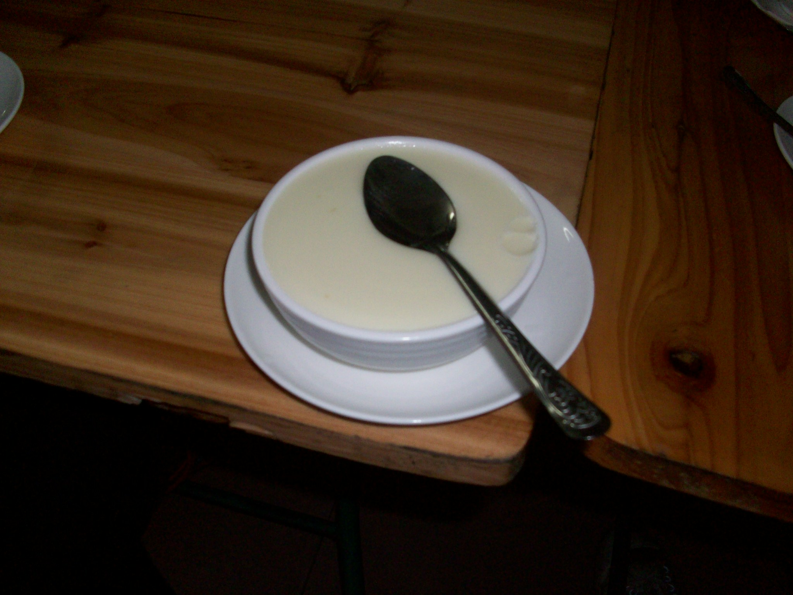
