+++
title = "Some Old It Pok Blogs"
date = "2026-07-13"

tags = [
    "It Pok",
    "Music",
    "High School",
]
categories = []
image = "P2120002.JPG"
+++

I was looking through some old files recently and found these old writings associated with It Pok. It Pok is the band I (guitar, keys) was in during high school with my best friend Tyler (drums, vocals) and my sister Sarah (bass guitar, saxophone, vocals). The year was 2006 and [MySpace](https://en.wikipedia.org/wiki/Myspace) was king of social media, although that term did not yet exist. It Pok, like all serious bands, had a myspace page featuring its music and a blog. In this post I will share both of the original blog posts and band bio along with some behind the scenes band photos and outtakes from the album photo shoot.

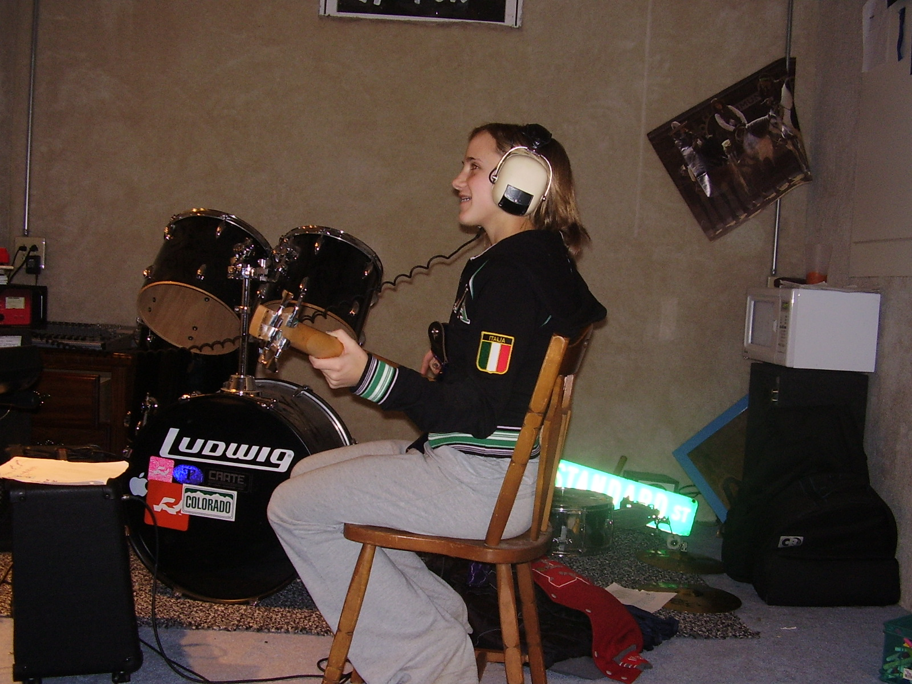
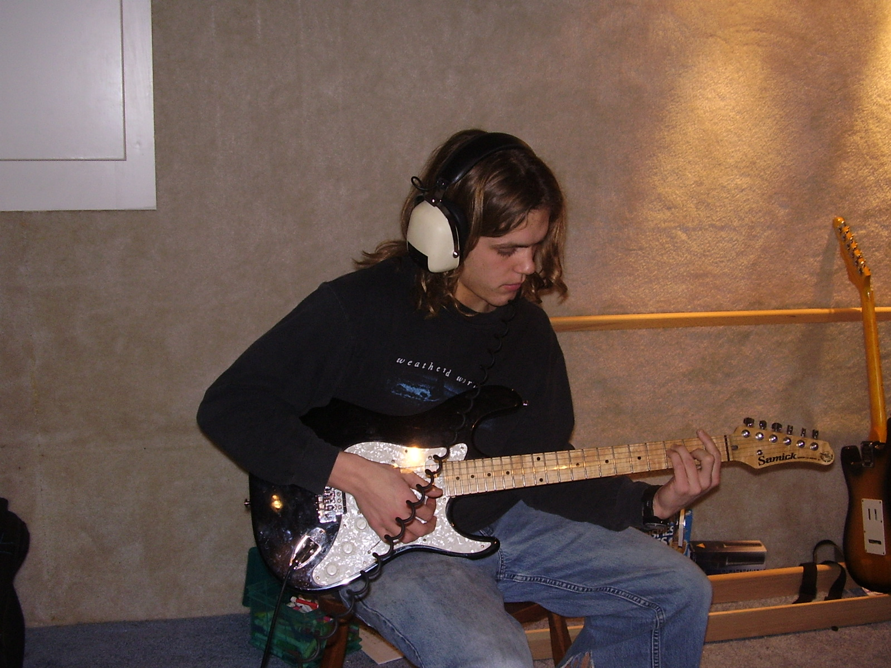
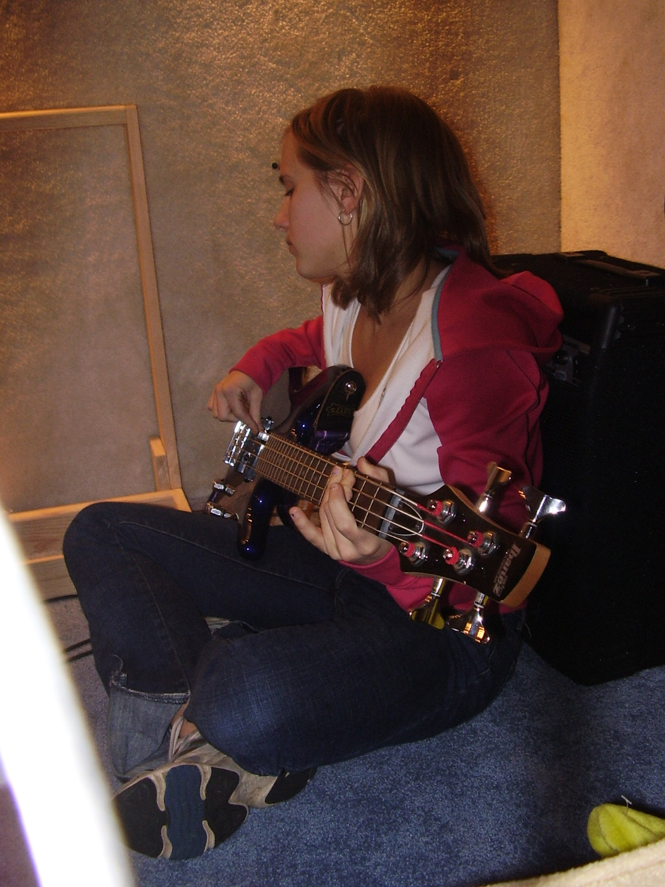
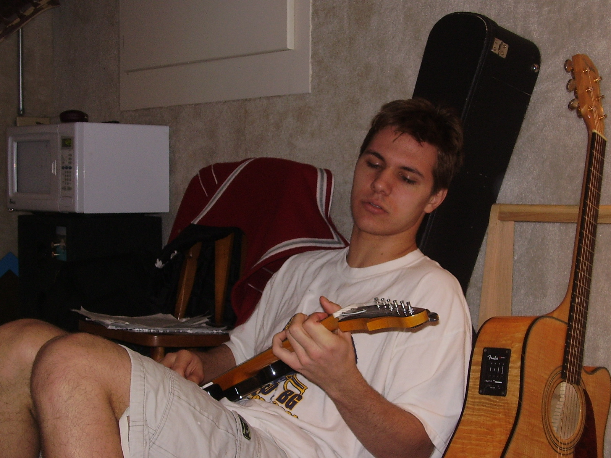

## Blog: Did our manager skip school to have sex?

This blog was written on February 10th 2006 by Sarah. It is just a silly fun piece of content typical of our shenanigans at the time. Probably got lots of engagement back before that metric was measured in any serious way.

> Did our manager skip school to have sex? Good question.
> WAIT!! what? you have a manager? hahaha ohh yeah... forgot to tell you that.
> ok so here's the nitty gritty:
> 
> 1)yes, we have a manger. His name is Anton "get out of my room you pervert" Putra. He works for cheese and pretzels, and the occassional slap on the butt.
> 
> 2)well...to be honest, we don't know if he skipped school to have sex. Anton himself doesn't even know. But nonetheless, everyone thinks he does. So I > guess that means he did.
> 
> 3) NO. None of the "members" of It Pok have sex and we are NOT TAKING APPLICATIONS. so stop sending them.
> 
> -----Sarah

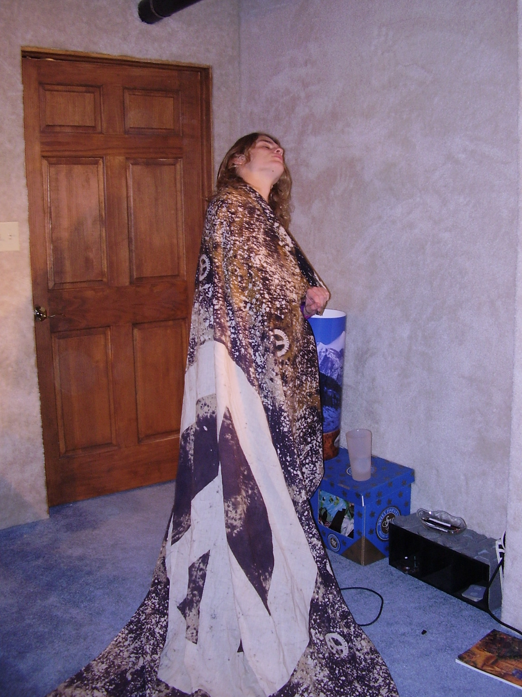
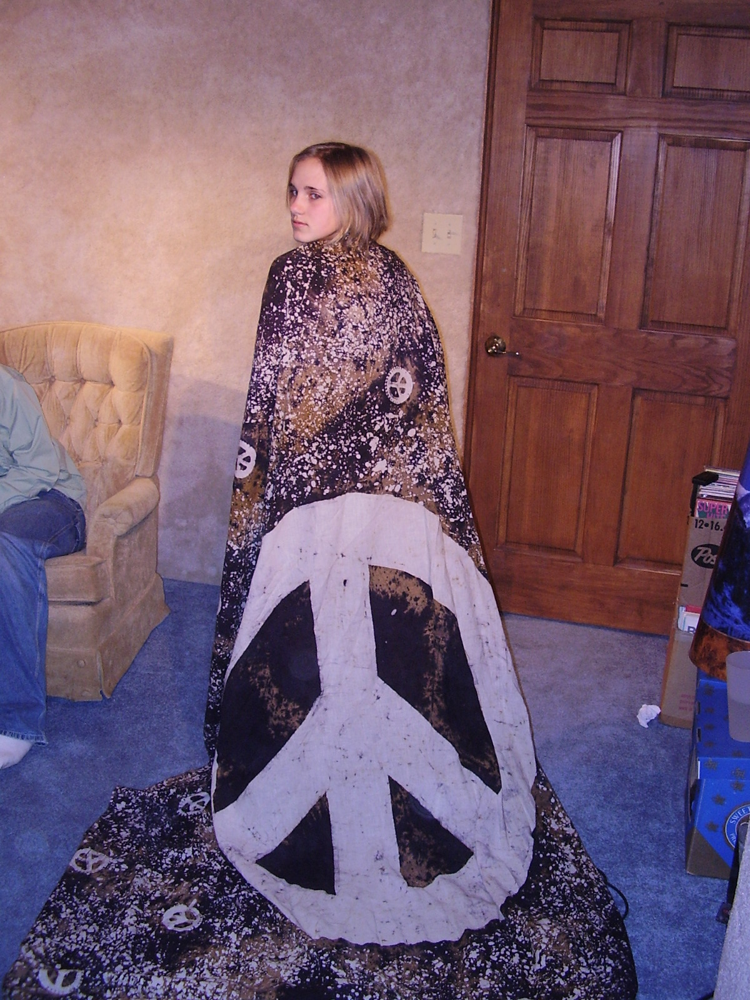
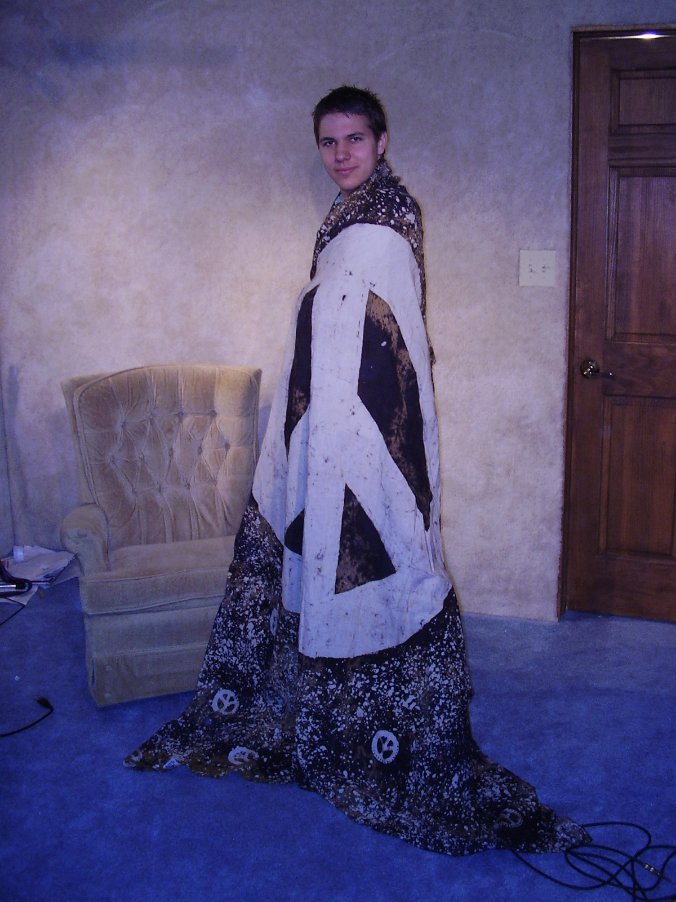

## Blog: Josh able to play after life threatening crash?

This blog was written July 12th 2006 by Tyler. Although it authorship is not explicitly noted, I'm 100% sure it is him by the comedic style and the attempt to funnel donations to himself. This one refers to a real life accident in which I broke my right arm while sidewalk surfing. For the record, the accident was serious but was absolutely not life threatening.

> We have been flooded with letters of concern about the health of lead "key"-tarist Josh Orndorff. He is in good health and should keep most of his chest hair intact.
> 
> Let me first end the rumors that it indeed was a murder attempt by Tyler Morehart. Yes, great animosity has grown between these two band mates, however this was just an accident. Tyler is not facing any criminal charges and Josh is not pursuing any. The original duo from famous bands as "Harry Possum", "Dark Allusion", and "The (z)Orphans" are on good speaking terms. They are willing to get back to work on the next ITPOK album as soon as Sarah stops ditching them to hang out with her lame friends. (On a more personal note, it would also be helpful if Sarah would help out in the building of the foosball table of which she is of 1/3 ownership yet has done 0/3's of the work.)
> 
> Another rumor is that after the accident Josh's face now looks like Mr. Yohe's. This is true. Sadly, the doctors do not believe that Josh's stunning good looks will ever be the same. Yes, although Josh is no longer good looking, Tyler and Sarah are better looking than ever! It has been announced that from now on only Tyler and Sarah shal appear onstage during concerts. This is because management is afraid that people will be so apalled at Josh's appearance that they will systematically throw themselves off of a ledge like lemmings.
> 
> But, finally to what this announcement is about. Yes, Josh is still able to play. We were hoping for a "Rookie of the Year" turnabout in Josh's abilities but to no avail. We are still optomistic about his chances of surving still. If you wish to send donations to help in his recovery send them to:
> 
> 209 Canton Avenue
> Huron, OH 44839
> 
> Please adress the envolope to ITPOK and make the checks out to cash. We are deeply thankful for your kindness.
> 
> PRIZES! PRIZES! PRIZES!
> ITPOK is throwing its yearly "ITPOK Neighborhood Bash Contest"! If you are interested in having ITPOK play in your neighborhood post requests on this myspace and you will be entered into a drawing. The winner will have the chance to go backstage at a real ITPOK concert held in their neighborhood. Drawing TBD.

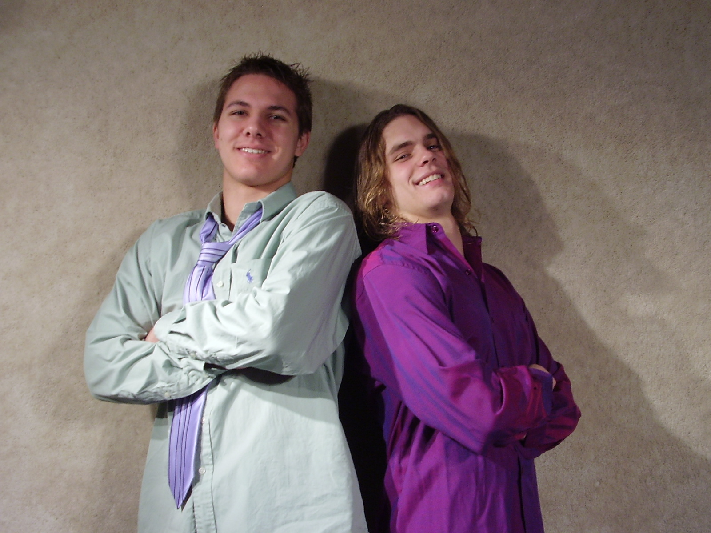
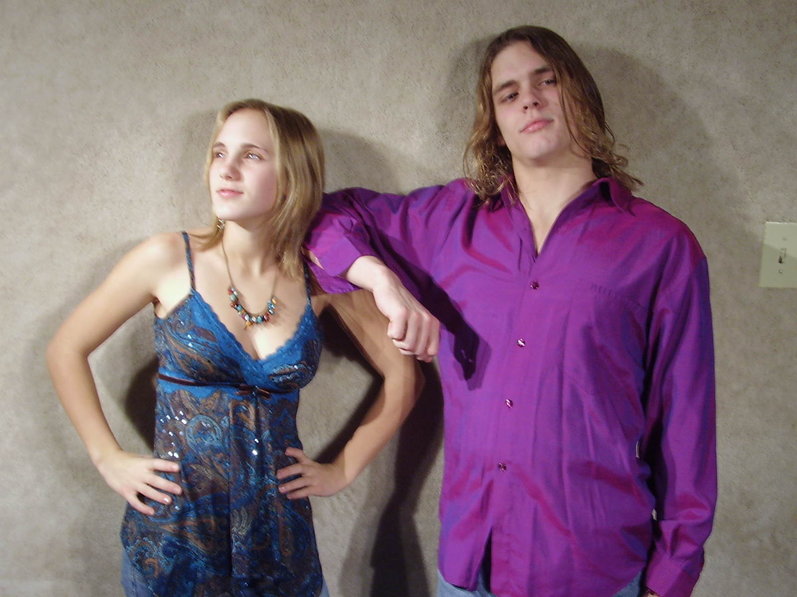
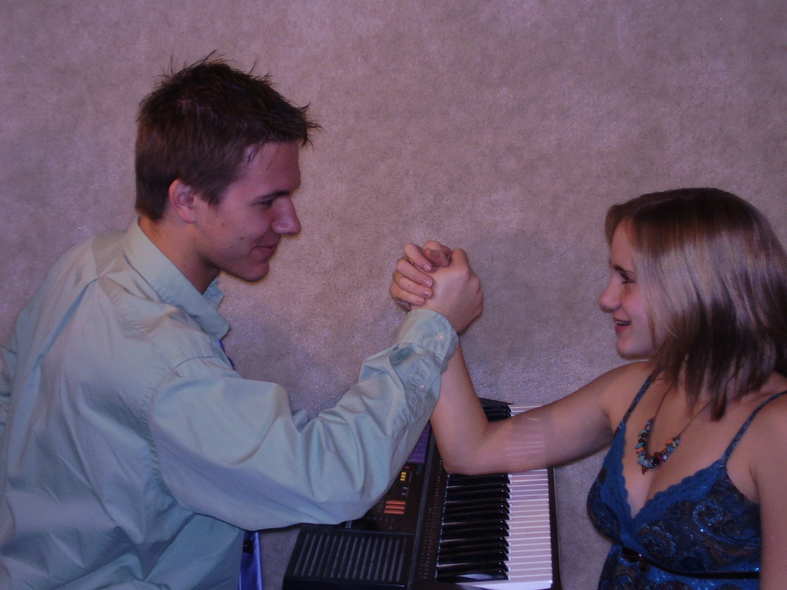
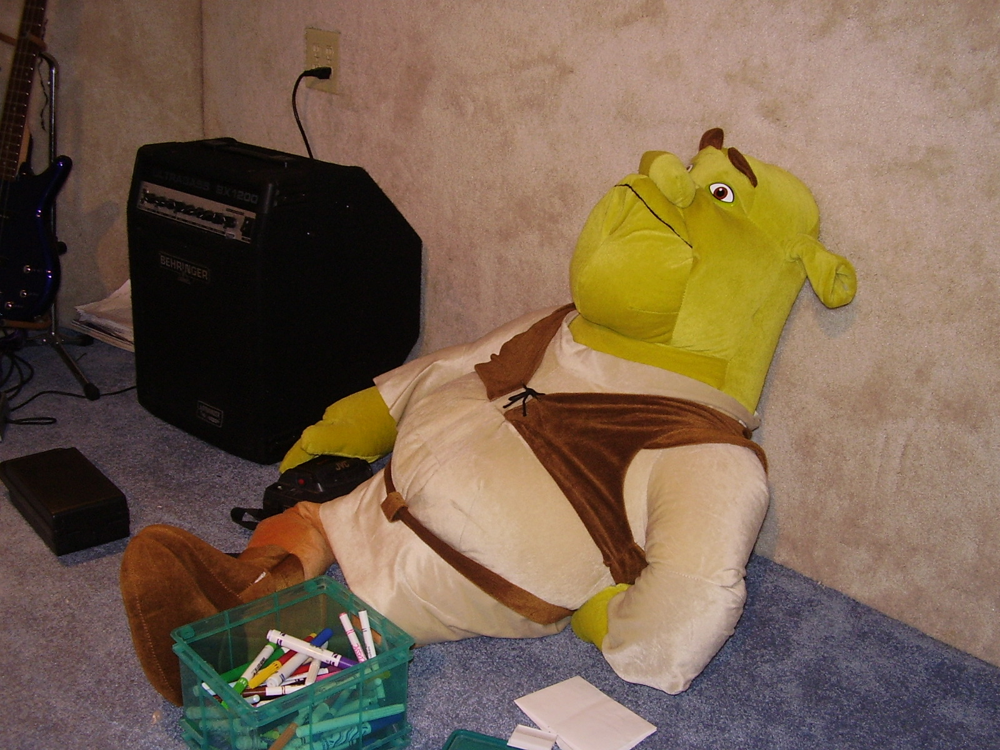

## Band Bio

This one was written by me at an unknown date. IMO it is the least funny of the three. Looking back, it kind of reflects the fact that I took the band really seriously (which sounds great), sometimes to the extent of costing us fun (which is a bummer).

> It Pok is the result of several years of evolution involving many band names and members. The only static member throughout the evolution was drummer Tyler Morehart, with guitarist Josh Orndorff being involved for the vast majority of the time.
> 
> It began when Josh and Tyler were in the eighth grade. One painfully boring day in Mrs. Rena Medina's health class they decided to form a band. The following weekend the first practice was held in Tyler's basement with the following members:
> Tyler Morehart, Josh Orndorff, Mike Lisk, Chris McClure, Gary Dickman
> 
> There was however only one practice with the original line-up. For the next practice the dropped Gary putting Tyler behind the drums. It was at this point that the band adopted it's first official name "Hairy Possum" as suggested by Mike.
> 
> After practicing for a few weeks it was decided that the band should part ways with Mike. A close friend of the band, Dom Camella, volunteered to break the news to Mike as none of the band members had the heart to do it. Shortly after Firing Mike the band auditioned for the school talent show as a three piece, playing Alice Cooper's "I'm Eighteen." Before playing the actual show however they Hired Dom Camella to play guitar along with Josh. After winning the talent show they adopted the new name "Dark Allusion" much to Dom's displeasure. It was during the Dark Allusion Days that the band Played their first paying gig at "The Just sisters' birthday party."
> 
> After that gig Dom insisted on a new band name making several suggestions, but none that the band could agree upon. At the end of that eighth grade year bassist chris McClure moved to Philadelphia to live with his dad, and the three remaining members stopped practicing. By the end of the summer all three members mutually agreed that Dom should no longer be a member of the band.
> 
> Shortly after beginning ninth grade Josh and Tyler hired Alex Wyatt, and Sarah Orndorff to complete the new line-up, and played under the name "The Orphans" a name that Dom had suggested the summer before. The orphans went strong for over a year, their most notable accomplishments being "The Conservation Club," and "The McCormick Middle School Halloween Dance." By the end of Sophomore year (for Josh and Tyler) Josh and Sarah had decided that the band wasn't dedicated, and went their separate ways.
> 
> Tyler and Alex hired new bassist Jeff Halsey, and played for a few weeks, before hiring guitarist Tom Shackelford on guitar. Eventually Josh and Sarah decided to come back, and Jeff was politely asked to leave the band. The new five piece played together for a few weeks under the name "The Zorphans" as they were all of the original Orphans with one additional member. Eventually the band just stopped practicing, and ceased to exist for several months.
> 
> When Sarah, Tyler, and Josh finally decided that they were ready to give it another try they came together under the name "It Pok." Then newly formed band had one practice before deciding that they would play no more cover songs, and only write and rehearse original material.
> 
> After that defining moment in It Pok history, practices became infinitely more productive, and the band became a more creative, and attractive unit, as they were no longer just reciting pre-written, pre-listened songs.

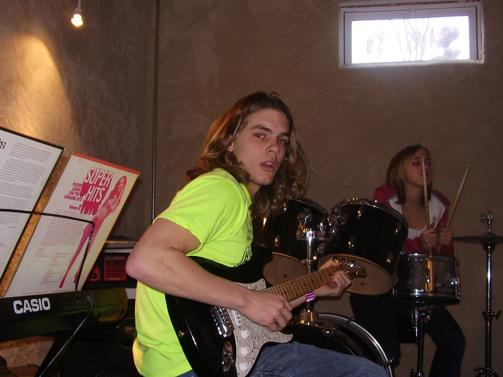
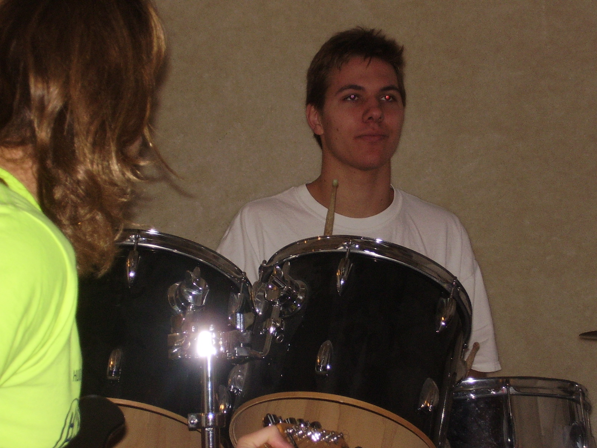
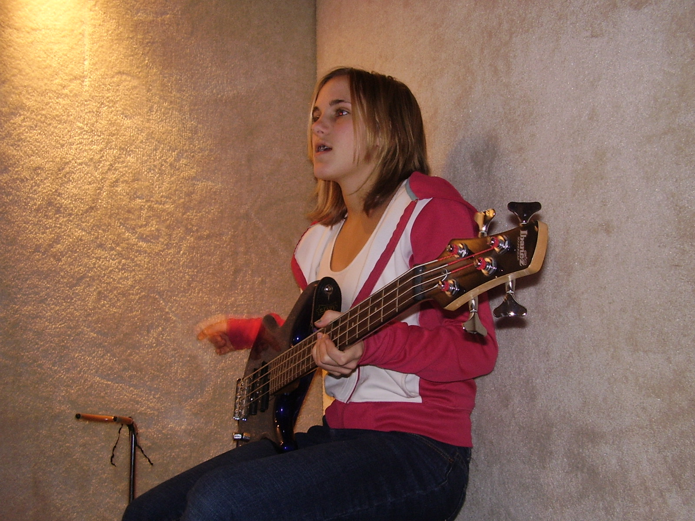
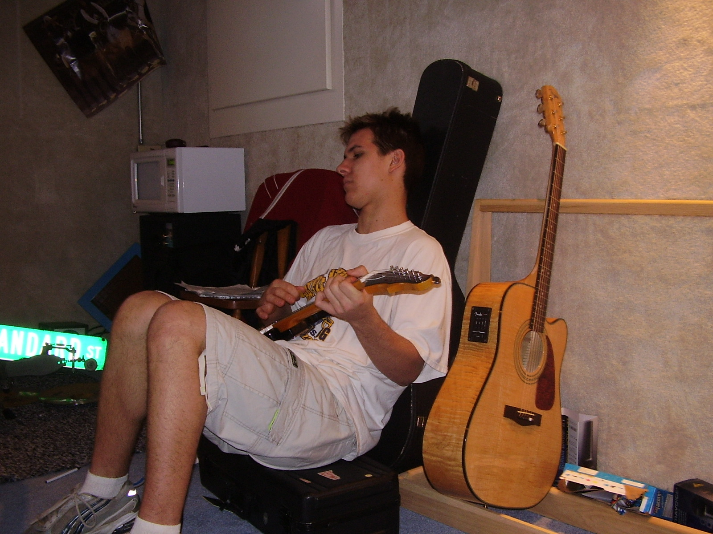
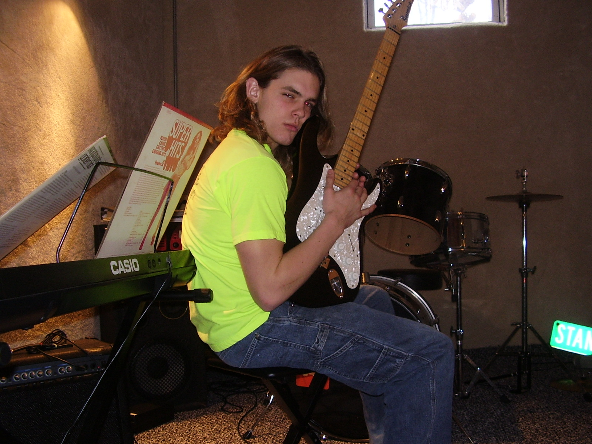
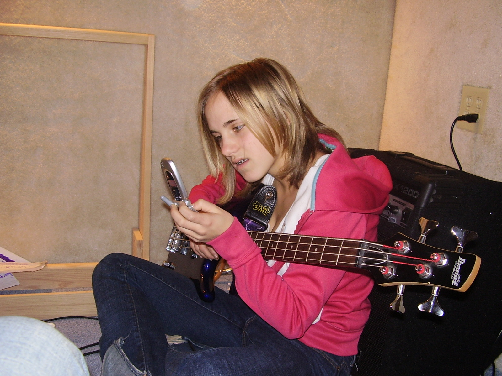
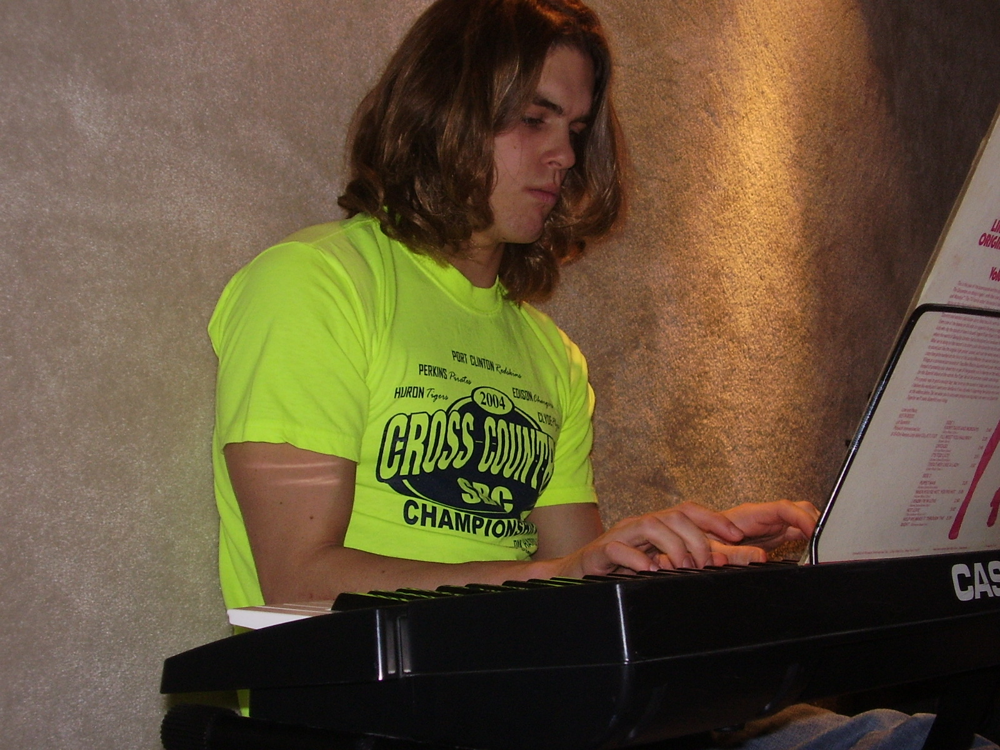
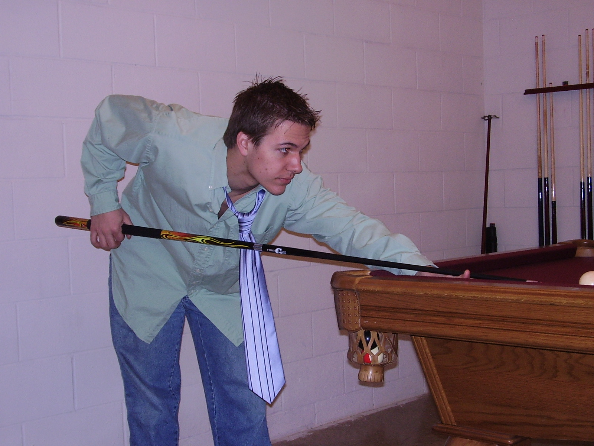