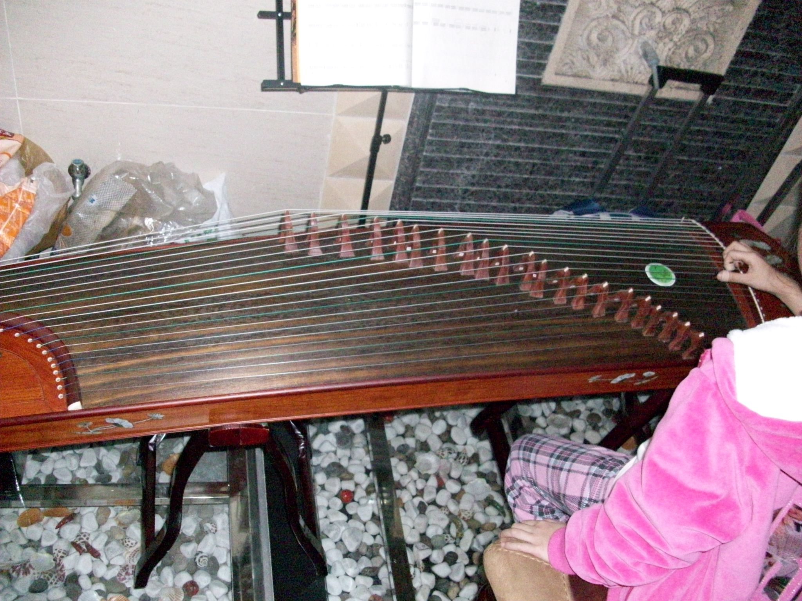
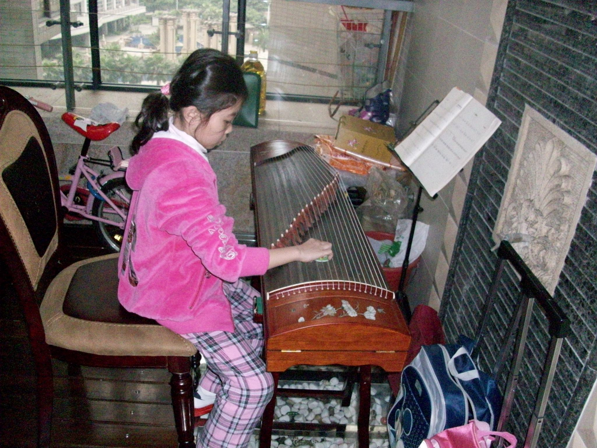
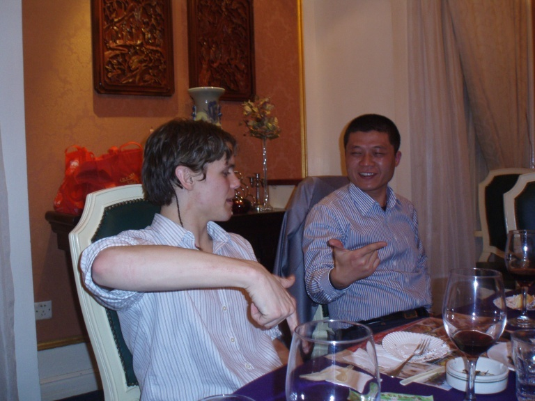
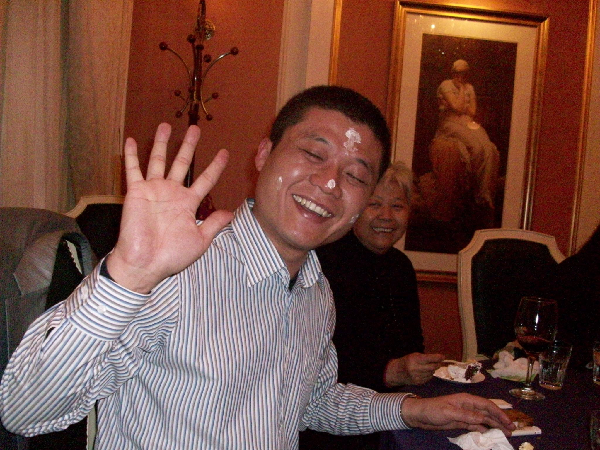
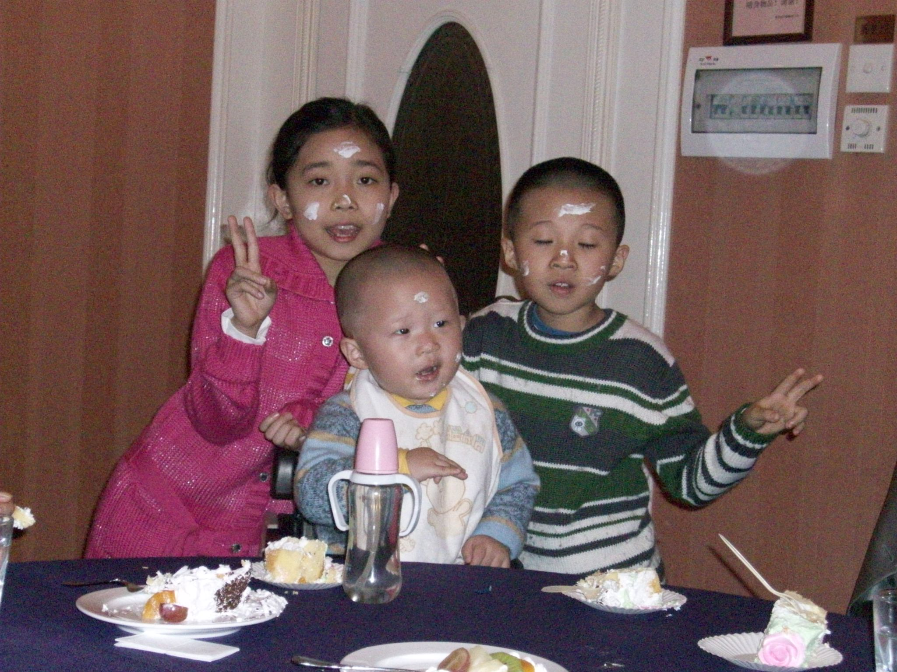
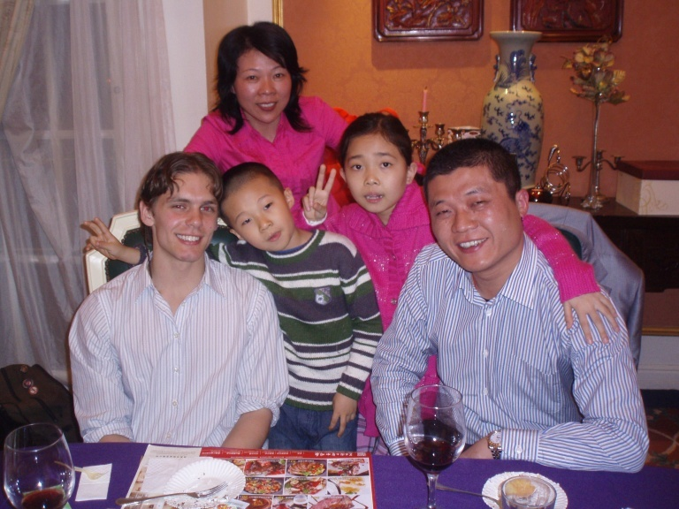

+++
title = "Jeff's Birthday"
date = "2010-03-28T10:33:40+00:00"
tags = ["China"]
categories = []
image = "P3270036.jpeg"
+++

By pure chance, I met the mother of one of my students at lunch a few days ago.  We ate together and exchanged email addresses, and she told me that her brother had a son in another one of my classes.  Saturday was her brother's birthday party, and since the family was getting together they decided to invite me as well.  I figured it would be a little awkward because of the communication barrier, but didn't let that stop me.  I met the whole extended family and went out to a fancy dinner.  They even paid for me!  It was fun and, somewhat surprisingly, not awkward at all.

Photos:

