+++
title = "2024 Lake Huron Motorcycle Trip"
date = "2025-06-05"

tags = [
    "Memories",
    "Travel",
    "Motorcycle"
]
categories = []
image = "motorcycle-group.jpg"
+++

In the fall of 2024 my Dad invited me to join on a motorcycle trip organized by his friend Mike.

## My Bike's Backstory

My motorcycle is a 1981 Yamaha Maxim XJ650. I bought it for $800 in Harrisburg PA in 2012.

I had been working as an instructor at the Center for Talented Youth in Carlisle. It was my first time as an instructor and I had worked my butt off all summer. When I had enough energy to do something other than work, it certainly went to having summer fun with my colleagues, and not to figuring out how I would get home from Carlisle after the summer.

bout two days before I had to be out of Carlisle, I found this bike on Craigslist. The price was right and I was familiar with Yamaha Maxims, so I was hoping it would work out. KArl let me borrow his car to take a look. I got there and it was only running on three cylinders out of four. But I didn't have any other plan, so I really wanted to make it work. I convinced the guy to let me do some diagnostics right there in his driveway and after cleaning and swapping some spark plugs and feeling the exhaust pipes a lot of times, I determined the problem was most likely the plug. I told him I wanted the bike, but I couldn't take it that day because I didn't have a ride home.

So the next day, I borrowed the car again, and my teaching assistant, Matt, was kind enough to drive with me. We stopped to get new plugs on the way. Showed up and put the new plugs in. Thank goodness it ran on all four because I really didn't have a backup plan. We still had to go to the notary and the seller asked if he could ride the bike to the notary and I said sure. When we got there he said he was impressed how powerful it was with all four cylinders. I guess he had been riding it on three for the whole summer.

Since then I've overseen all the maintenance myself. I've done most of it and dad has helped a lot too. Mostly standard things like brakes, brake fluid, carb cleaning, oil changes. But also a few non-routine things. Dad and I changed the tires on it at home. That was pretty cool and the only time I've done it. I also replaced the gasket for the mechanical tachometer cable.

At times I had it running in great condition and I rode it frequently. At other times it sat mostly un-ridden. I don't _think_ it ever went a full year without at least starting and getting a few miles. But it definitely had some summers where it got zero maintenance. Since having kids, it has mostly sat and it was in rough shape when the invite for the trip came.

## The Plan

The plan was to all meet up in Sarnia ON right across the border at the southern most point on Lake Huron Friday morning and take off. We would ride together for three full days and part ways in Southern Michigan. The crew was Mike, his step dad Hall, his brother-in-law Stan, his colleague Tim, my dad, and me. A few others were invited but the scheduling didn't work out.

I live outside of Cleveland OH so Sarnia is pretty far for me, and so I decided to add a full day of solo riding to the beginning to get there. I also decided to spend one last night camping solo and return the next morning. This would give me some nice alone time at the beginning and end.

I could fit five days of clothes, rain gear, tools, and camping gear in a duffle bag on my rear seat, so that would be the easy part. Getting the bike back in shape was the task to conquer.

## The Prep

When I first took it out, it was hard to start, ran rough, and the front brake was mostly seized. I started draining the brake and filling the tires so the bike could move freely.

Next I got to work cleaning out the carburetors. I'm especially fond of these Maxim carburetors because I learned almost everything I know about carbs back in 2009 working on a set just like this with my friend Nate during a week of intense learning, reading, thinking, being stumped, and trying over and over again. Definitely a school of hard knocks experience. But now I'm so familiar with these ones that cleaning them is a pleasure as long as I can find the time to focus on it. Luckily the trip gave me the concrete deadline necessary to make it a priority, and after a few hours of cleaning the engine was running well. Now I could do serious test drives and was confident the trip would be feasible.

I took care of a few more basic tasks like changing the oil. Actually I changed the motor oil, as I've done many times before, as well as the final drive gear oil which I've never done. It turns out this bike takes hypoid gear oil which is not commonly available at local auto parts shops. I found a few online and chose the Honda brand. I didn't see a Yamaha brand and I figured Honda made similar equipment. I also went deep down the rabbit hole about the difference between GL4 and GL5 hypoid gear oil. I tend to get stuck on this kind of thing. My bike calls for GL4, but is that because GL5 was not available in 1981? I decided (but this is not advice for you) that I wanted the tougher GL5 oil and was not risking anything by using it because my transmission is not syncro mesh and does not have any brass parts. After overthinking all of that, the change was entirely straight forward.

The last lingering problem was that front brake that I had drained. I tried flushing it like I've done many times, but I couldn't get any fluid past the master cylinder. Eventually I realized that the master piston was stuck. I considered that maybe I could just do the ride with one brake. I had ridden like that for a few weeks in California in 2010, but that was just shot commutes on city streets. At some point Dad and Mike went on a test ride and Mike had to make a sudden stop. I wasn't there to see it but the story was enough to convince me that I should not be fucking around with a multiday international trip on only one brake. Returning to the task a second time, I was able to carefully press the stuck piston back open and lube it up really well until it moved smoothly. Then I was able to fill the system with fluid as I expected and the brake worked. I have to confess that I could hear echos of warnings I had read in manual and websites like, "always get a new master cylinder or a proper rebuild kit", "your life is riding on this one piston" etc. But it was working well and a lot better than before I didn't want to be too much of a perfectionist, so I decided to call it roadworthy.

## Day 0 - Cleveland (ish) OH to Point Edward ON

On Thursday september 12th I got up and left pretty early. Julie and her dad were going to watch the kids while I was away. I strapped my bag on the back seat and got started. I headed west following route 2 looking forward to the view especially the Sandusky Bay crossing. Right as I was crossing the bay I felt the bike lose power and come right back. A few second later I felt another lurch. My bike doesn't have a fuel gauge. Instead you usually watch the odometer, or wait to feel this power loss, and then switch to the reserve which has another 30ish mile. So I reached down only to find that I had left the fuel switch in the `prime` position. This means I had been running on my reserve the whole time and was really almost out of gas. I didn't know where the next gas station was, and accepted that I may have to push a few miles. But I hoped to make it over the bridge first. As the motor got weaker and weaker I gave it more choke trying to get every bit of fuel. I got to full choke just as the bridge ended and my next goal was to make it up the hill afterwards. I was down to 25mph, full choke, and full throttle on the shoulder before the engine finally dies and I started coasting. It seemed a little early in the trip to be having an incident, but I wasn't too worried because I had plenty of time and I knew exactly what was happening.

But when I stepped off my bike to find the nearest gas station, I realized that I was standing in oil and there was a trail of oil behind me. That is definitely not normal. Luckily the gas station was just around the corner and I could easily push. I fuelled it up and decided to make sure it still started and ran before thinking more seriously about the oil mystery. It did start and run well and I made triple sure that the fuel switch was in the mail position.

Looking in the oil level indicator level, I could not see the level at all. It kind of looked empty which made me worried that I ahd lost it all, but it seemed to run too well for no oil. Leaning the bike hard to the left, I finally saw a bubble and realized that I had way too much oil in it. I guess that oil change wasn't so routine after all. I did my best to fashion a funnel and collection tray out of some trash I pulled from the dumpster and let out more than half a quart of oil. The process was not easy because the oil was hot and slippery and I was doing a shitty job of collecting it with the trash tools I made. I got it down to the point that it was still kind of high but no longer ridiculous and decided it was good enough for now. Having solved that issue I was officially in trip mode.

I have no idea how I botched the oil change that badly. And I really regret how much oil I dripped. I guess it was dripping out my air box all the way until I ran out of fuel. Including the passage over the bay. I took this as a reality check and reminder that even though I love this bike it is kind of an environmental hazard. If I want to keep riding it I need to make a real effort to minimize the effects. Maybe some day I'll have an electric one.

Back on the road, I made it up to Sinclair Shores MI without too much trouble. I stopped to have lunch from a grocery store and discovered that I still had some time to spare even after the oil incident. I decided to go for a five mile run here and enjoy the lake views. It was hot but a good run overall. But never go for a long ride in sweaty underwear; it accelerates the saddle rash. 

I decided to cross into Canada down by Lake St Clair instead of up by Lake Huron as I had originally planned. But when I got to the river, I found out that the crossing I had seen on the map was a ferry and was not running. So I followed the small roads along the St Clair river all the way up. But the ramp up to the bridge to canada was closed so I had to go several miles back to the previous highway exit and approach that way.

I was the first of our crew into Canada so I hung out at Point Edward, paid USD cash at a casual 6/5 exchange rate for some french fries, and watched water flow out of Lake Huron. Less than an hour later dad and Mike arrived and we checked into the hotel, got dinner, and chatted until bed time.

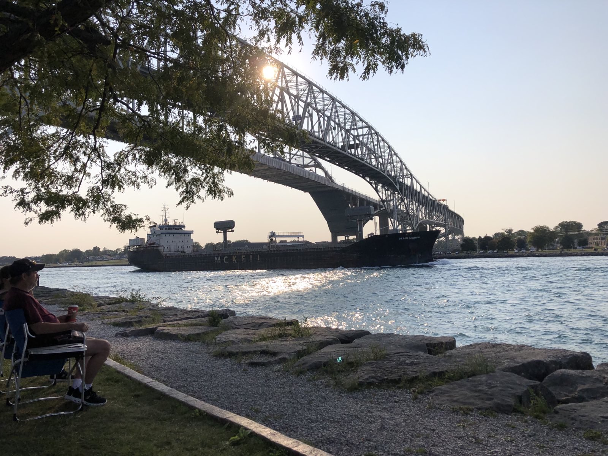

## Day 1 - Point Edward ON to South Baymouth ON

I got up and made a quick gas run, then joined dad and Mike at the hotel's continental breakfast. Not long later, Tim, Stan, and Hall showed up. We set out riding. Beautiful countryside and small roads. Not a ton of lake views yet. Lots of solar panels, and most of them were mounted on heliostats which are pretty uncommon down here. We stopped at the home of a friend that some of the guys knew from a vacation to Florida. Their home was right on the water so we got lots of lake views there. We visited for an hour or so and then got back on the road.

As we drove, my bike crossed over to 40k miles.

Eventually we made it up to Tobermory where we would board the ferry. We had some time so I got some more fuel and we all had dinner. I ordered fish and chips. We watched as the ferry came it. It was the coolest ferry I've ever seen. As it approached the dock, its whole bow opened like a big mouth that was going to chomp up all the passengers. And we rode our motorcycles right down it's throat.

The views from the ferry were amazing. Water and islands and trees and sunset forever it looked like. I thought it would be cool to kayak among them and regretted that industrial society may yet spread even to these more remote areas. Indeed this ferry was a first step.

The other side was Manitoulin Island. It was about sunset when we arrived and conveniently our hotel was only about 100m from the dock. I went for a short run up the road that we would ride in the morning, and then turned down a side road that served a few cottages on the water. It was wonderful to hear the quiet and see the stars and consider the population density.

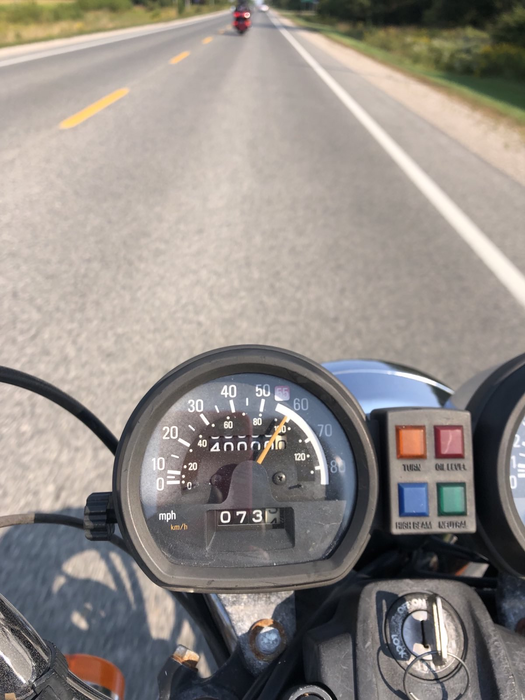
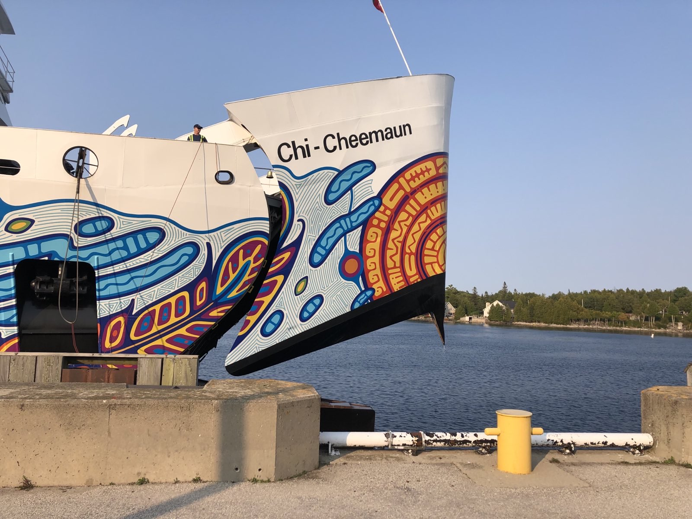
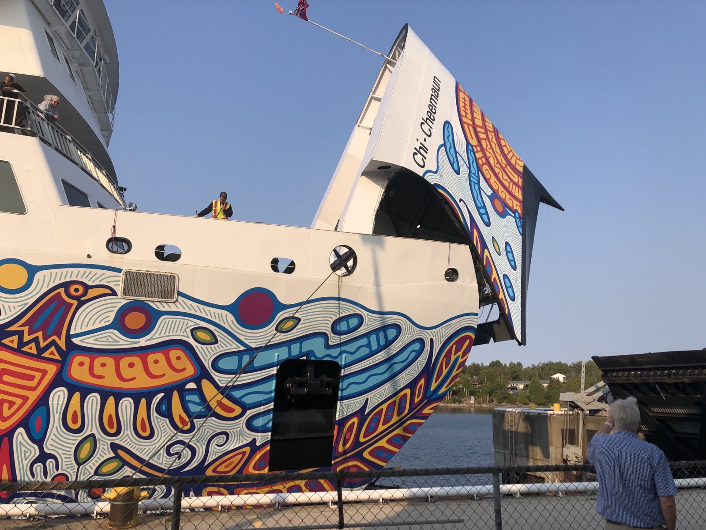
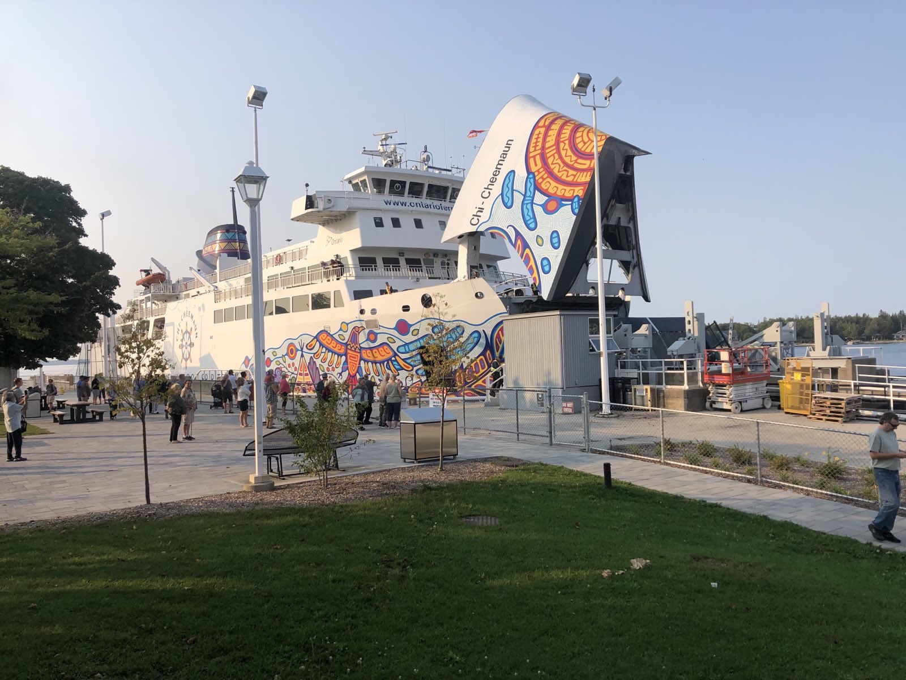
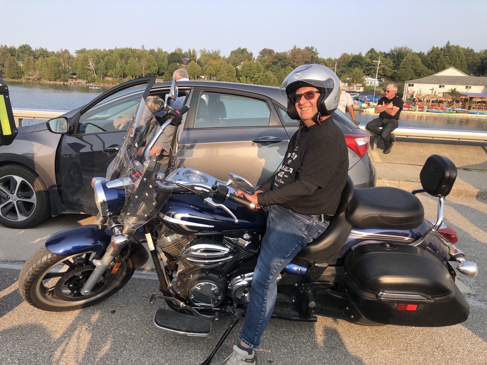

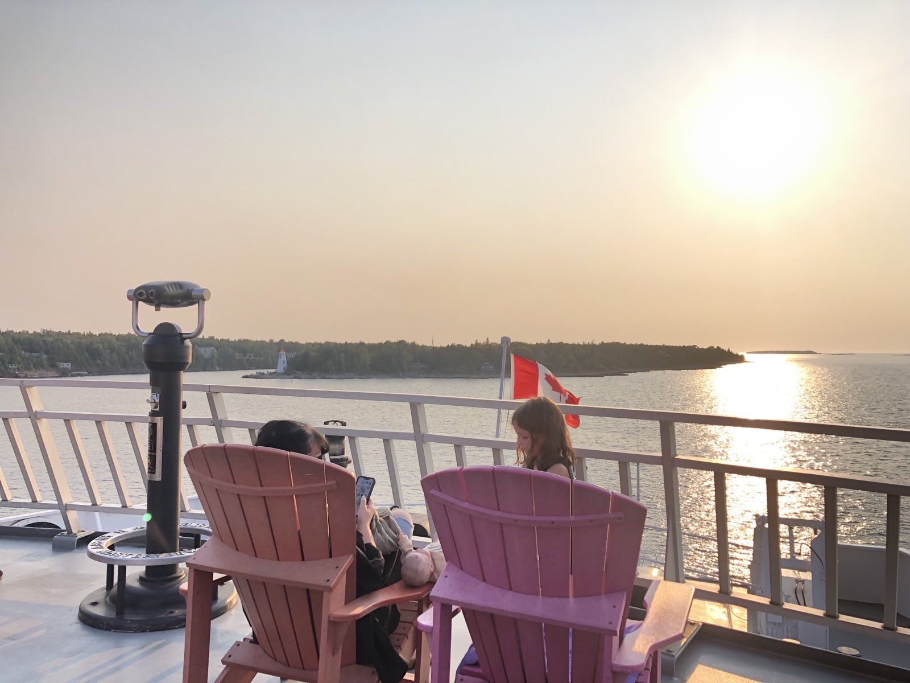
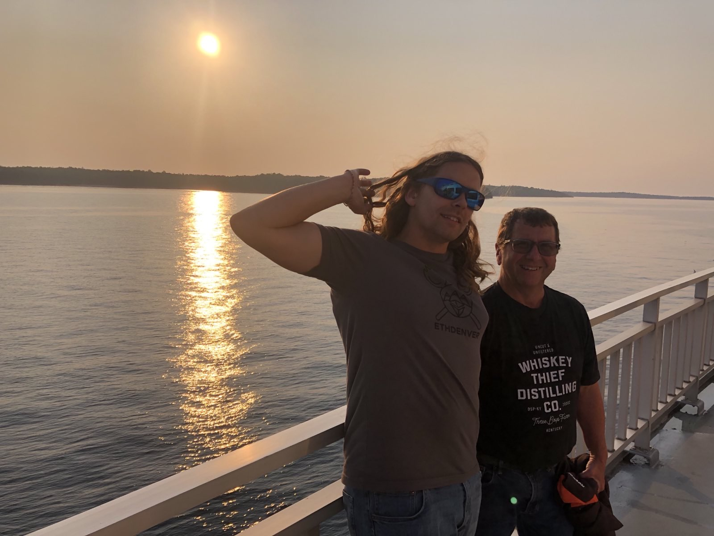
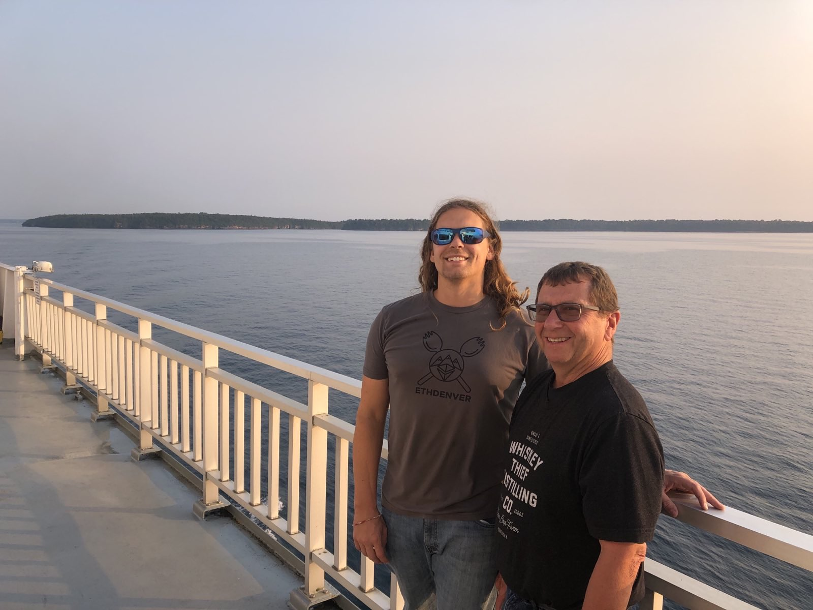
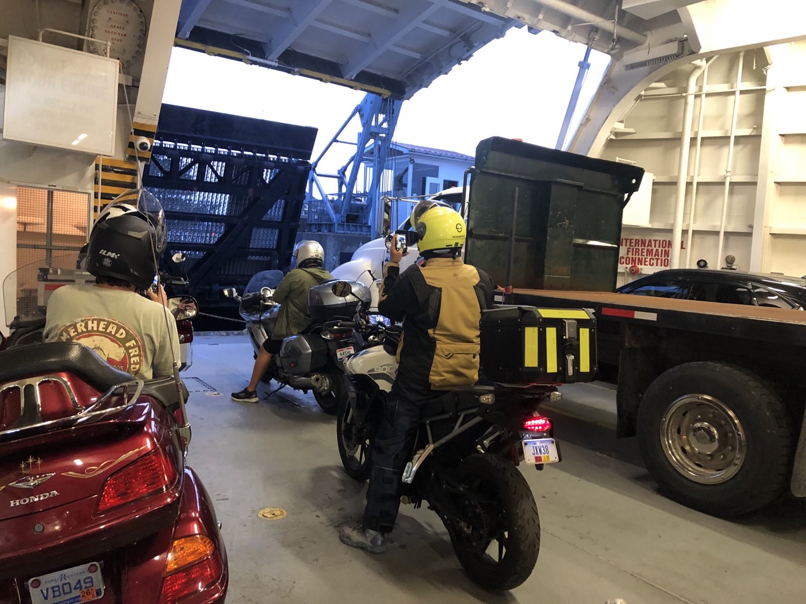
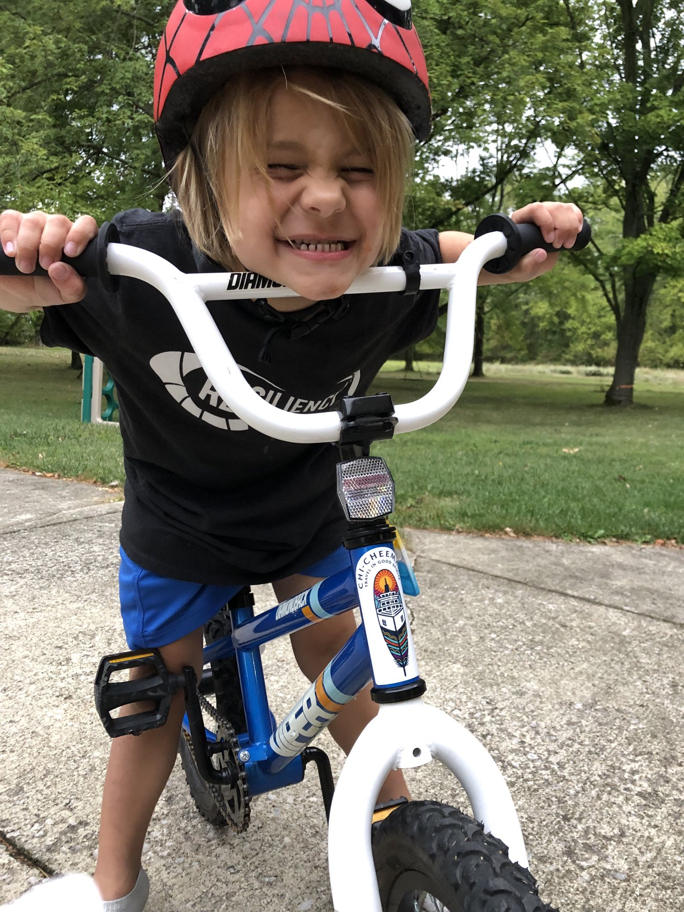

<video controls>
    <source src="ferry-vid.mp4" type="video/mp4" />
    Ferry Approaching
</video>

## Day 2 - South Baymouth ON to Mackinaw (ish) MI

The next morning we got up and hit the road without any breakfast. We made our first stop for gas and food a few hours later and ate at a nice diner. Later in the day we stopped at a campground that Stan's family used to own but was now owned by some natives. It had a nice lake and was cool to hear his memories from that place.

At some point Stan was leading, Tim was second, and I was third. For the past fifteen minutes or so we had been behind a truck pulling a trailer. All of a sudden one of the tires on the trailer blew. It swerved somewhat, slowed and got to the shoulder. Stan managed to dodge the debris by some combination of skill and luck. time hit one piece of tire that didn't seem to affect his riding but the tire got kicked up at me. Luckily I was able to duck it. (This event might be out of sequence; I can't quite remember.)

We crossed back into the states at the Sault St Marie. I hadn't been there since 2008 with Calvin Cross Country. It was cool to see the locks again. I led the next leg which was down I75 to the Mackinaw Bridge. That was a really amazing view and ride. I'm surprised I didn't get a photo of it to match the one I took of the golden gate bride in 2009. It was weird to think that for all of human history it would have taken days or weeks to travel by land from the upper peninsula to the lower.

We stopped for the night at a hotel Mike had arranged just on the south side of the bridge. I went for a run on a sandy ATV trail. The terrain was not great, but the night and view and quiet was. When I got back we played cards until we went to bed.

## Day 3 - Mackinaw (ish) MI to Maumee OH

In the morning Mike and I went to McDonald's for breakfast and the others skipped it. We followed the small roads along the Lake Huron coast. We took a stop at a park at one point and got the most official group picture of the trip. We stopped again at a chinese buffet for lunch and met a few more of Mike's crew who were not able to do the whole trip for scheduling reasons. Leaving the restaurant was our official goodbye. Although we rode together for a while longer, we all branched off at our appropriate times.

Mike took me and dad to see his hunting property. It was an awesome acreage with lots of privacy and a small lake. We sat in his tree stand for a while. I considered that I'd probably end up camping there. We pressed on to Marlette where Dad and mike finished the trip and got back in his truck. I sat and read for a while planning to stay at the hunting property. But after several hours it was still light out and I felt like riding more so I pressed on to Maumee Bay State Park to camp.

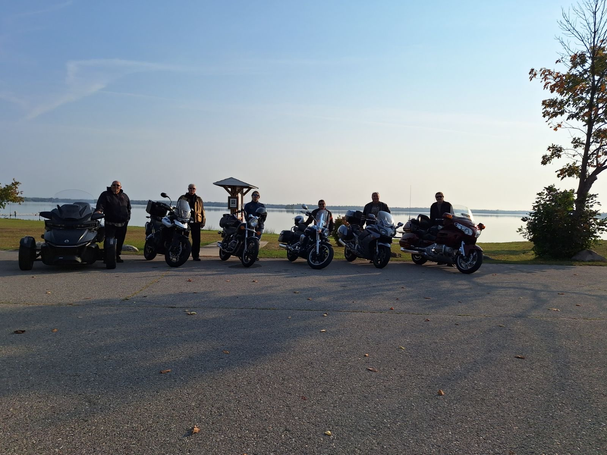
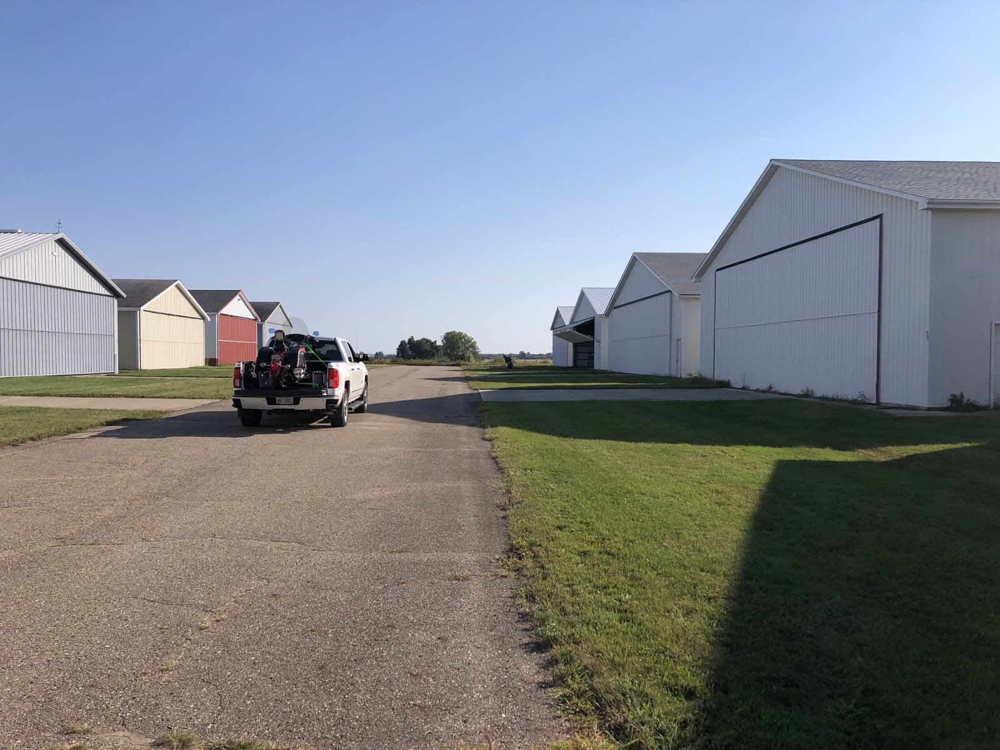
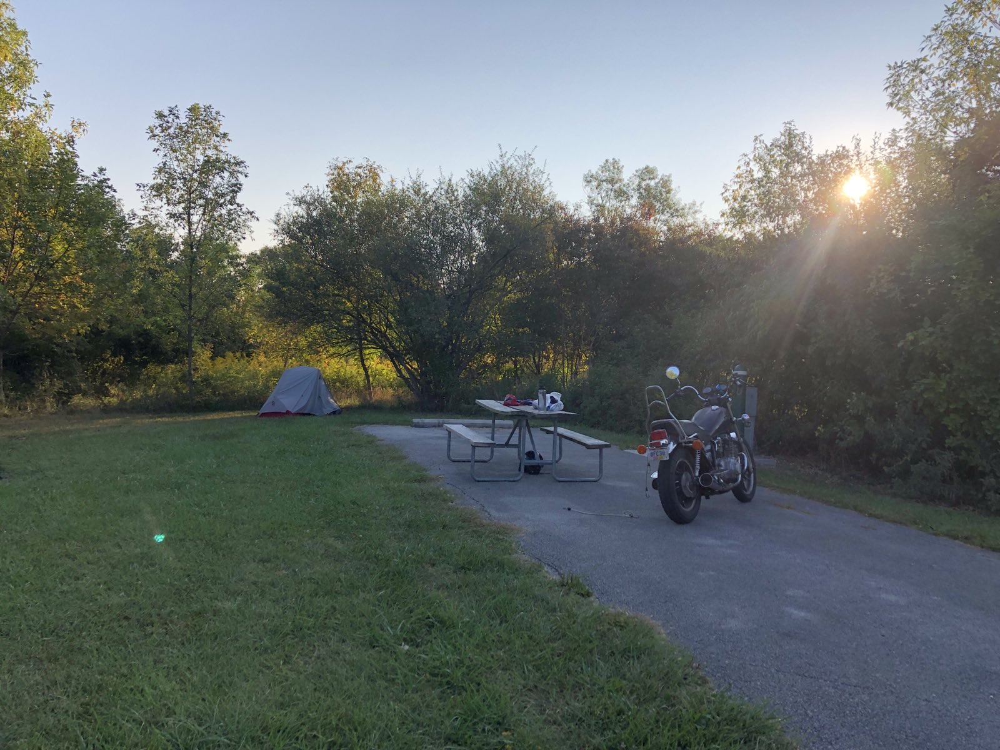

## Day 4 - Return Home

In the morning I got up, showered in the bath house, and broke camp. It gave me bicycle trip vibes. But my legs definitely had not pedaled this whole loop. It was only a short ride home the next day and the family was there to greet me.

Overall it was a very fun trip, and a really good excuse to tap back into the motorcycle part of my personality.

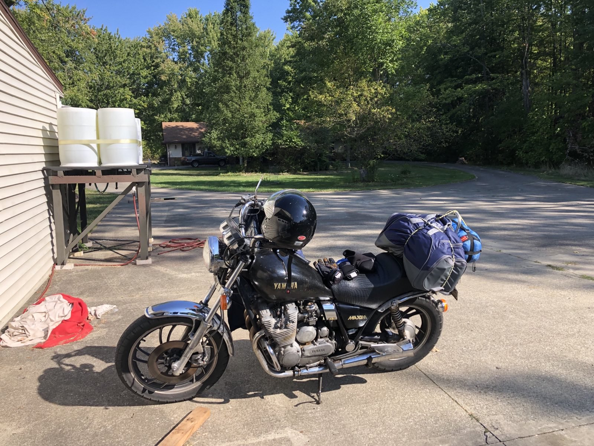