+++
title = "Light Board Toy"
date = "2026-04-05"

tags = [
    "Homemade",
    "Parenting",
]
categories = []
image = "LightBoardFront1.jpg"
+++

In December of 2020 I built a homemade light board toy for my twine niece and nephew as a Christmas present. At that time they were two years old and ready, in my opinion, to appreciate learning how a variety of switches and digital logic work. I was a new dad at the time, my son Forest having been born just half a year earlier. I was new enough that I hadn't yet been overcome with the perpetual tiredness, and thus decided that I should dive in on making this homemade toy.

## The Idea

The idea was simple: Twelve switches, each directly controlling to an LED, four blue, four green, and four red in a row. Then a second row with fewer LEDs, two blue, two green, and two red, that were controlled based on digital logic combinatorics from the first row, each color representing a different logic operation. Then another row, one blue, one green, and one red following the same color-based logic rules. Last an RGB LED following exactly the previous row, showing how the primary colors of light combine to make all the other colors. And finally, environmental themed artwork on the front with appropriate biomes for each of the LED colors, and the RGB in the sun at the top. Well... that seemed simple in my head. As you may guess, I significantly underestimated the time, effort, and love that would be required to complete the project.

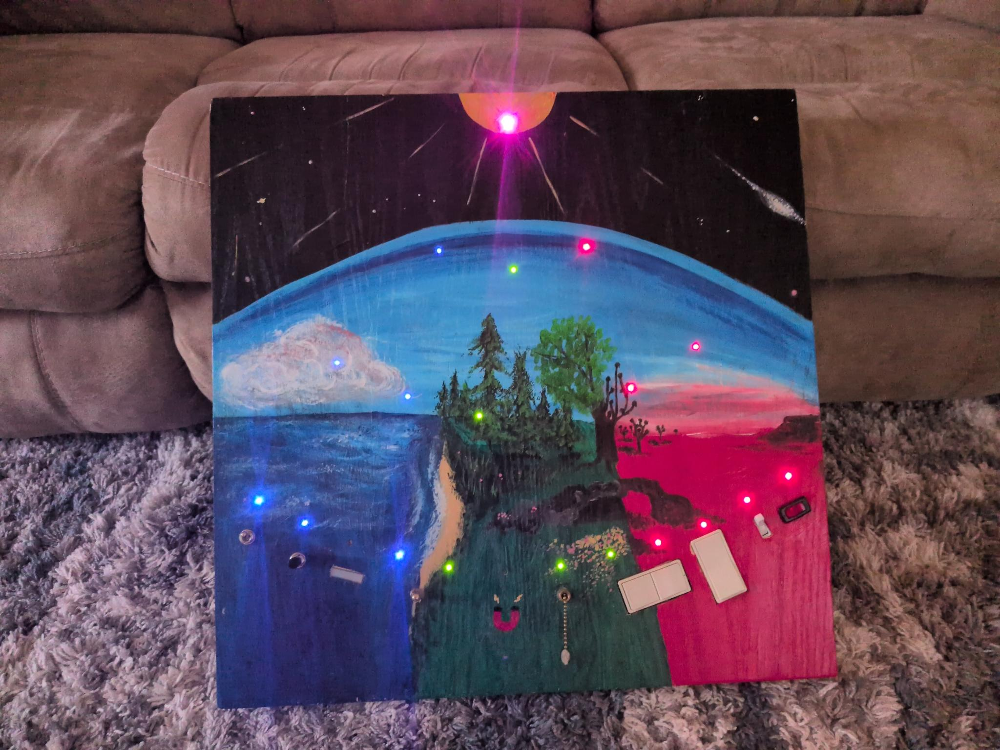
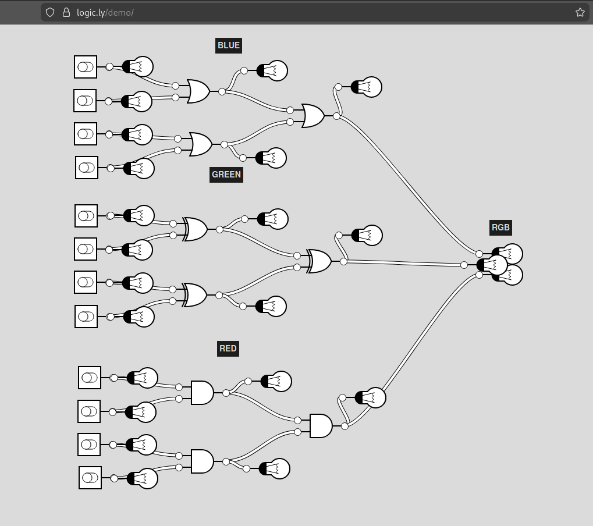

## The Switches

Most of the switches are pretty straight forward - simple push button or rocker style toggle switches. But there are a few that I think are cool enough to all out specifically.

The third in the blue zone is a doorbell button to teach the kiddos that some switches are "momentary" which means they are only on when you are actively holding them on.

The one bordering the blue and green zone is a four-position rotary switch that controls the last blue and first green LEDs. They can be both on, both off, only blue on, or only green on. It is the only case of a single device controlling multiple LEDs.

Then there is a magnetic reed switch. It isn't actually visible from the front at all except for the painted magnet icon. In reality I found that the reed switches were not sensitive enough to be reliably activated using common household magnets so I decided to parallel several of them at different angles. Through trial and error, I found that three was the magic number.

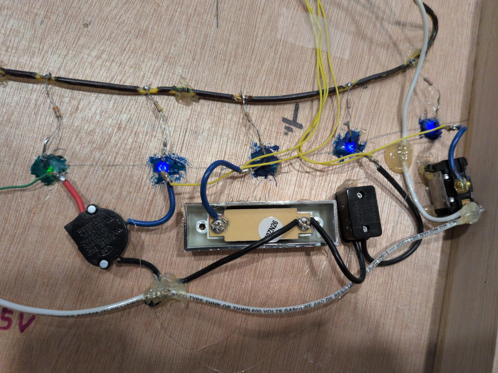
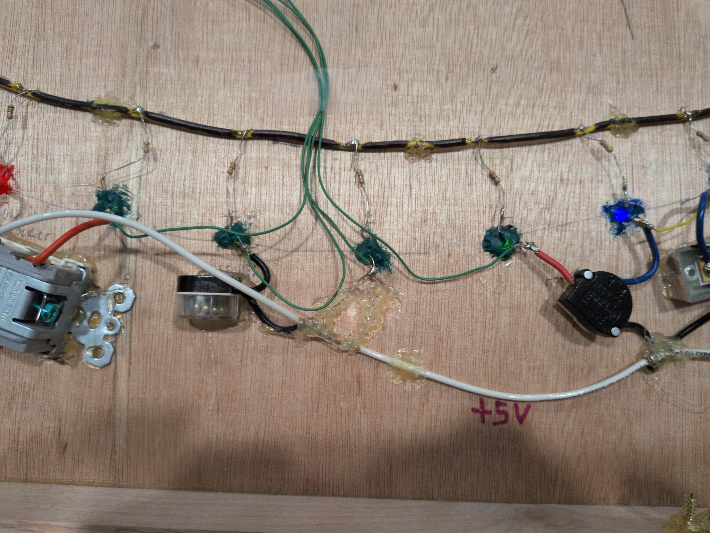
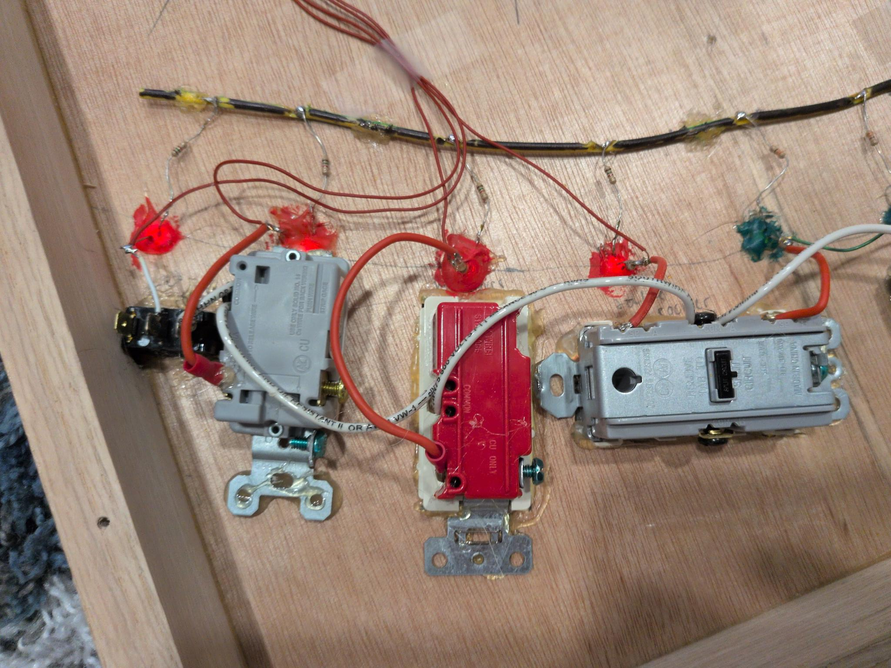

Each of the LEDs is painted on the back to minimize light bleeding in from nearby LEDs when they are off. That smear of hot glue in the green section is holding the magnetic reed switches in place.

## The Guts

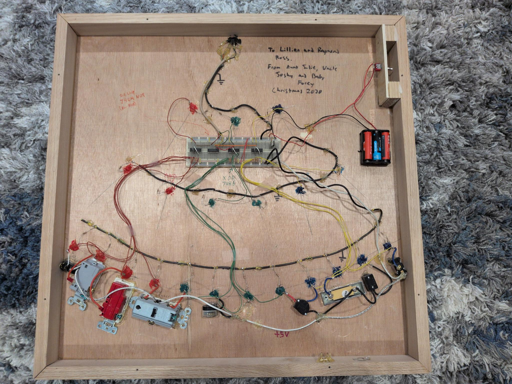
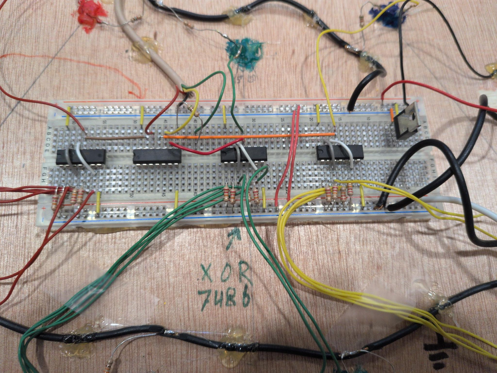

I tried to label the inside as clearly as possible and keep the wiring organized and color coded. I recycled the logic wire from an old telephone cable that I pulled out of the house we were renting at the time, so I didn't have any blue, and used yellow instead. Each switch has a pulldown resistor on the breadboard.

The brains are some 7400 series logic chips. One for each color, plus a NOT gate to drive the RGB which was common cathode. It actually took me a long time to figure that out and required some last minute plan changes because all along I thought it ws common anode.

The breadboard also has an unused 5V regulator. I originally installed it because I was testing with a 9V battery, and I left it because it reminded me of CTY, where I used to teach electrical engineering. In that class we used the 9V battery 5V regulator combo all the time because those were the batteries we had available. I actually thought of CTY a LOT while I was building this project. That reminiscing was a way for me to get some ROI from of the time I spent on this project because I have lots of fond memories of that place and I had only recently spent my final summer there. That is also where I discovered the logic.ly simulator that I used to make the logic diagram above. I used that tool in many many classes, and always used the demo. Never once paid the $59 for the full version. I honestly don't even know what the full version contains. But I shilled to hundreds of students, so maybe some of them bought it.

## The Front Art

This toy contains elements of many things that are important to me or close to my heart. The electronics, logic, and light combinations are some. Environmentalism is another.

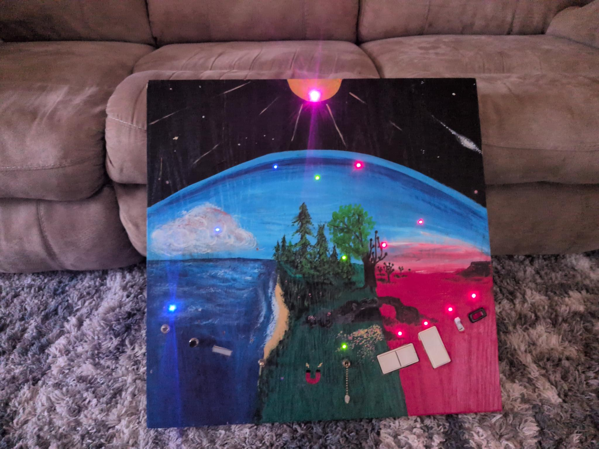

The art on the front shows three different climates found on Earth, and associates each with a color. It also serves as a reminder that green forest areas can easily become deserts at the hands of reckless humans. And shows that while the earth is ultimately one tiny part of a much larger cosmos, it is front and center for us humans.

I conceived the art along with the electronics from the outset and consider them both integral aspects of the work. I initially intended to paint the front myself because I was concerned that I wouldn't be able to communicate the intention to anyone else effectively enough for it to work. But my attempt sucked big time. Luckily, my wife, Julie, is an artist and not only understood the goal, but was willing to redo the painting and capture my visions for it.

## Updates

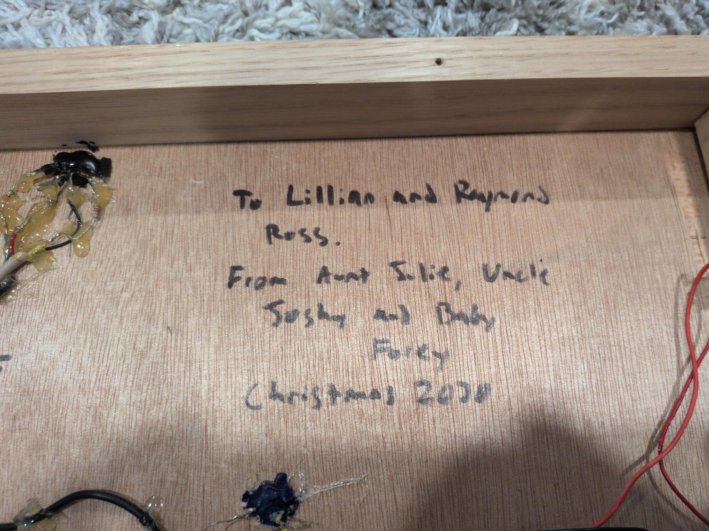

By Christmas 2024, My niece and nephew had outgrown this toy and gave passed it on to my own kids who were then one and four years old. I took the opportunity to make a few upgrades that improved the useability.

When I originally designed this thing, it was important to me that it did not burn through single-use batteries like so many of the plastic toys I had experienced in my half-year of parenthood because I considered it wasteful and irresponsible.

My original solution involved a rechargeable lithium battery pack and an exposed USB port for charging. I imagined it being used like a laptop computer - sometimes plugged into the charger, but also mobile. Well that turned out to have some major shortcomings. The idle draw, even when all lights are off, was enough to quickly drain the battery pack and require frequent recharging. And the regular complete discharging caused the battery pack itself to die an early death which required the toy to be plugged in full time.

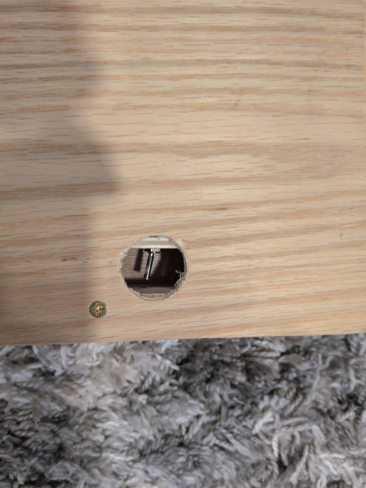
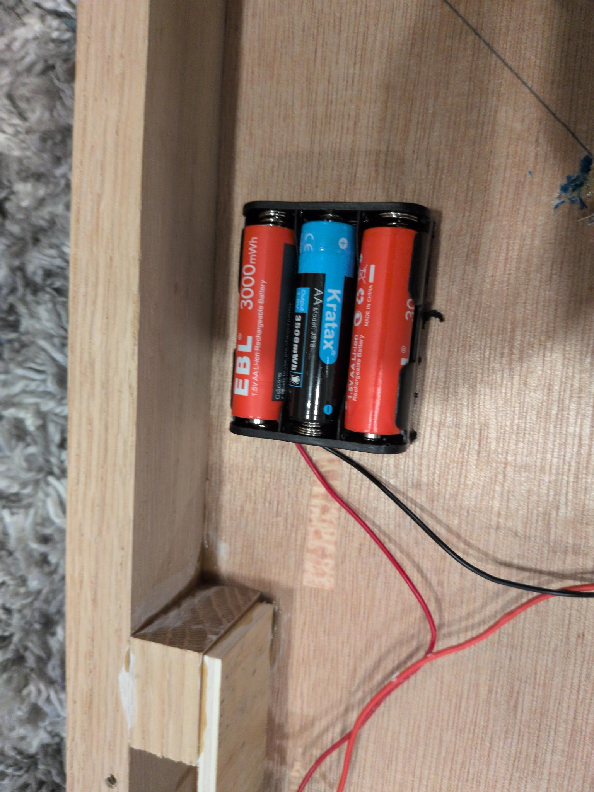

When we got the toy back for our own kids, I reworked it as shown here, with a power switch to reduce the idle draw to zero, and a standard AA battery box that holds three AA batteries. I solved the problem of single use batteries by buying rechargeable lithium batteries which had become accessible in the time since I originally built it. Actually they may have been available all along, but I didn't know it if they were. And I also upgraded all the other toys in the house to use rechargeable batteries.