+++
title = "Logging the Kuskokwim"
date = "2015-06-25T04:08:52+00:00"
tags = ["Alaska"]
categories = []
image = "IMG_20150525_112255521.jpg"
+++

Wood is really valuable in the bush both for heating and construction. Each spring when the river breaks the ice moves out in big chunks and takes down some trees with it. Conveniently the ice (usually) strips the trees of limbs and leaves them on the banks of the river. Although some of the logs are higher up the bank and still have some branches.  So we took the opportunity to boat up river, collect the logs, build them into a raft, and then push it back to Bethel to use as firewood for the winter.

Photos:

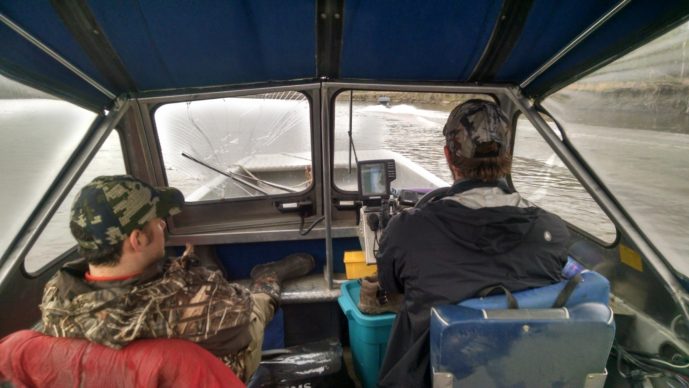
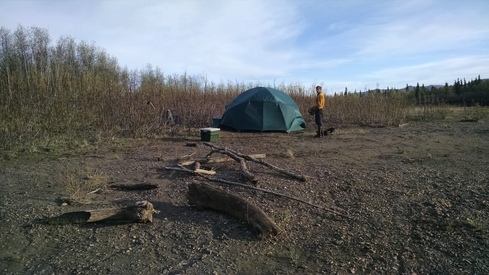
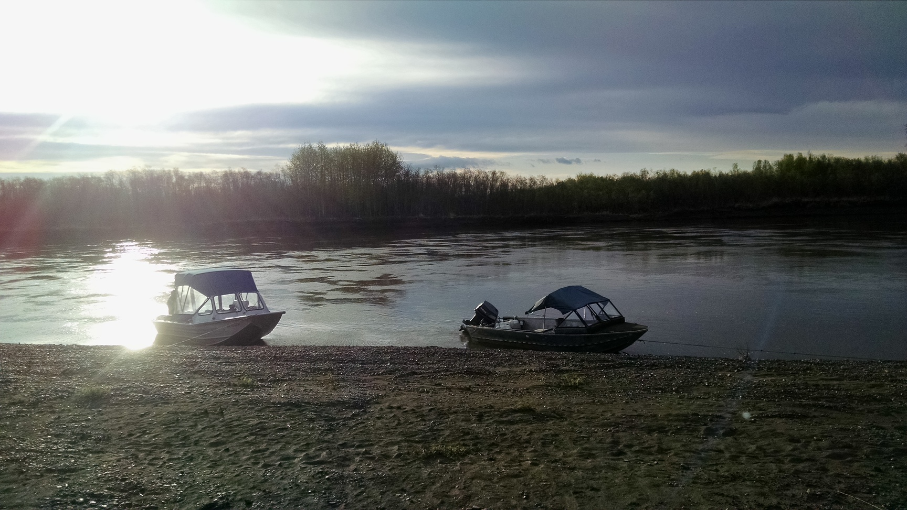
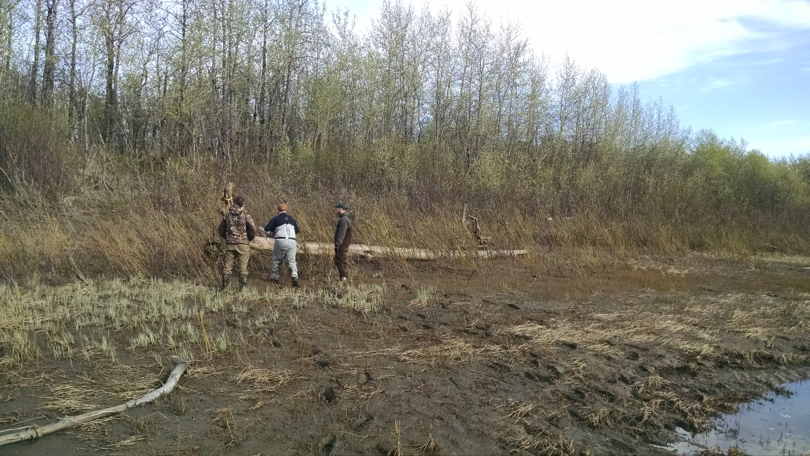

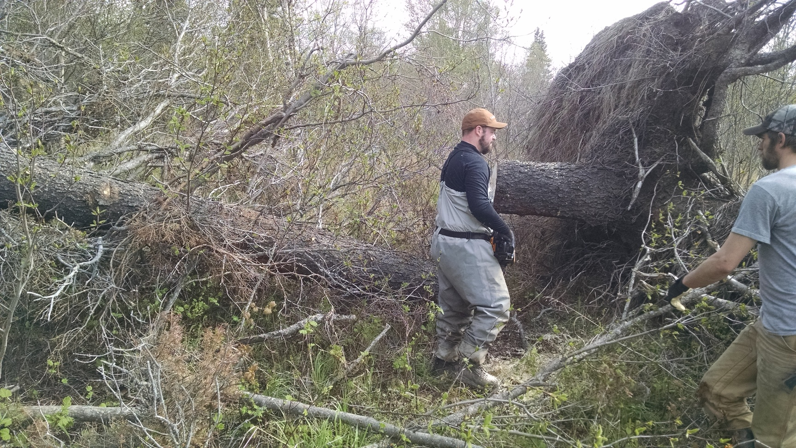
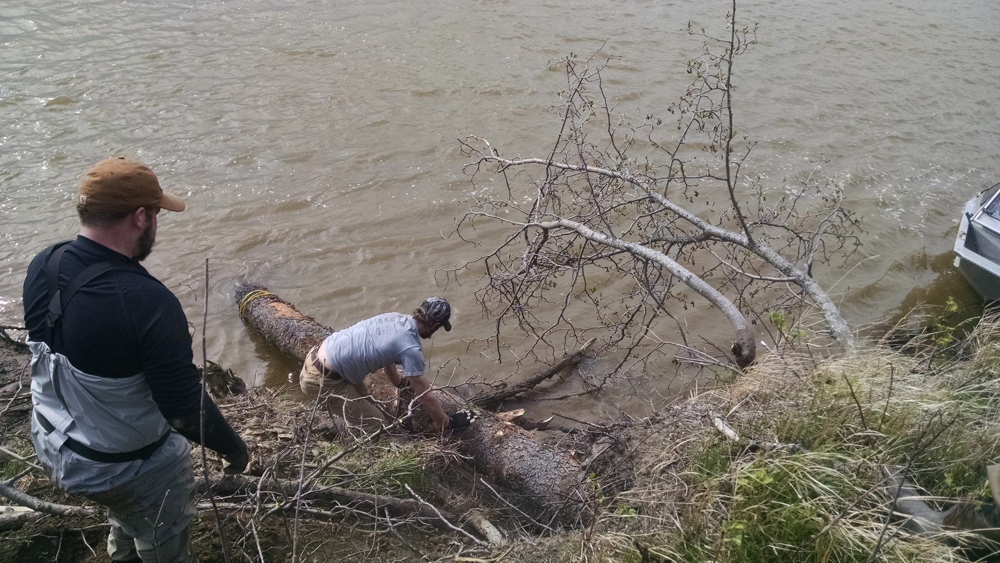
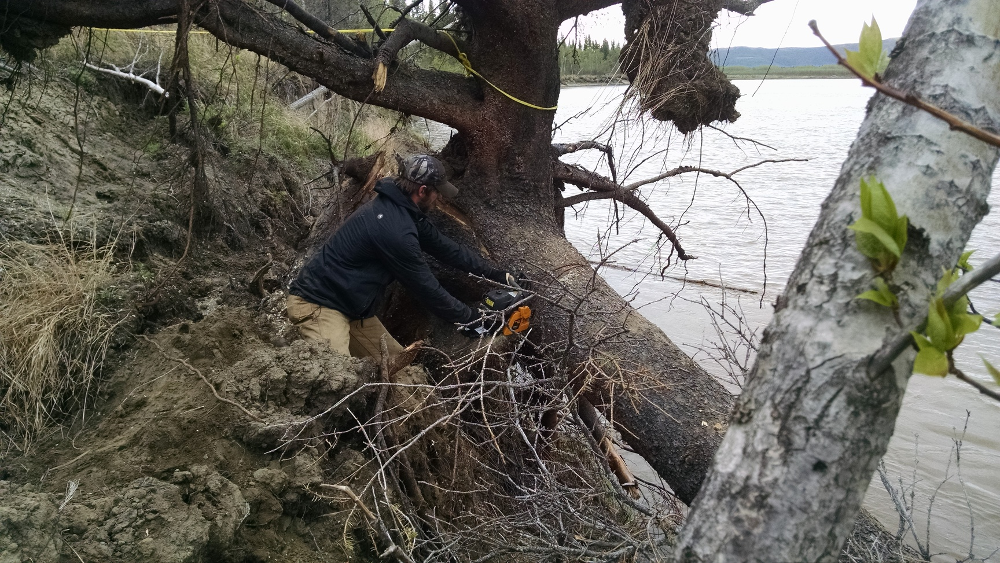
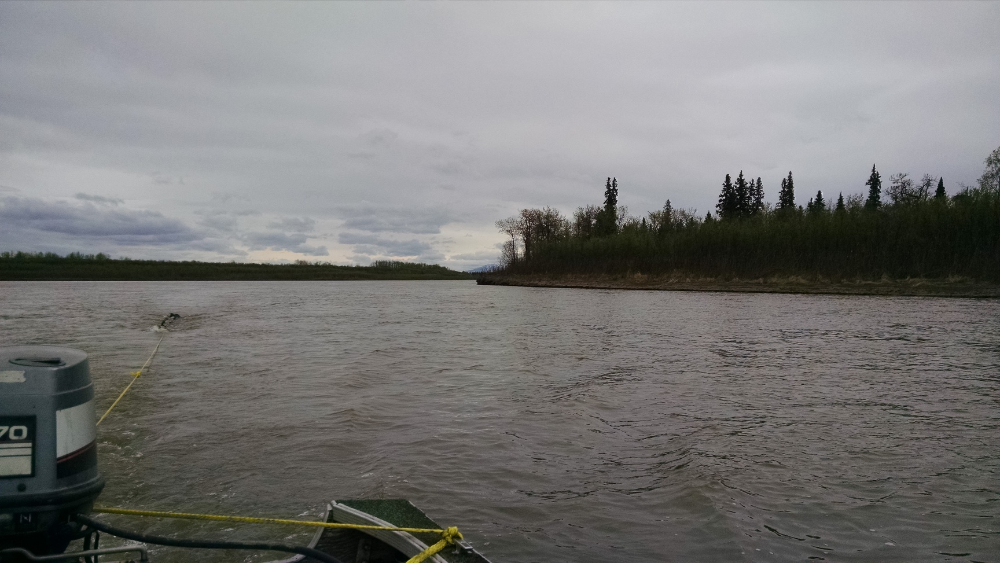

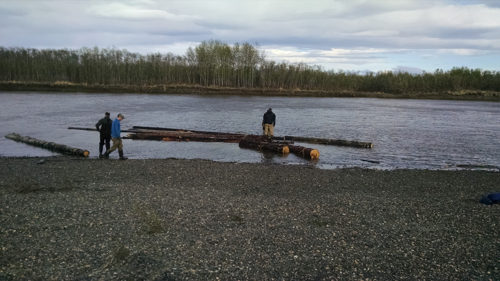
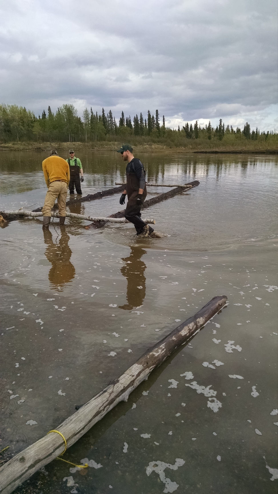
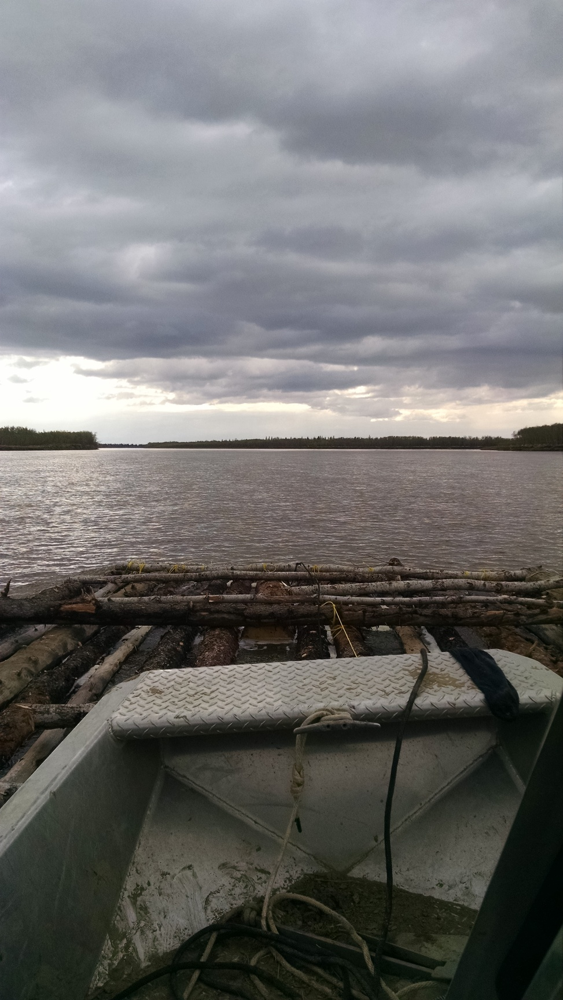
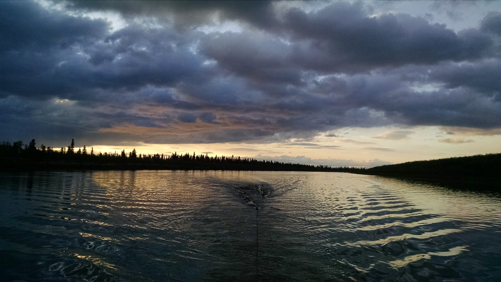

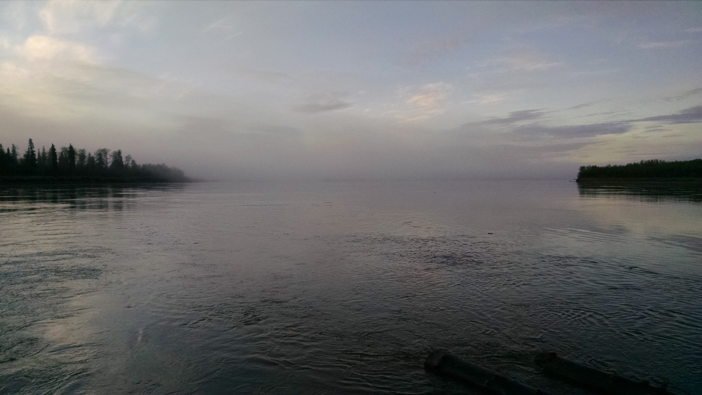
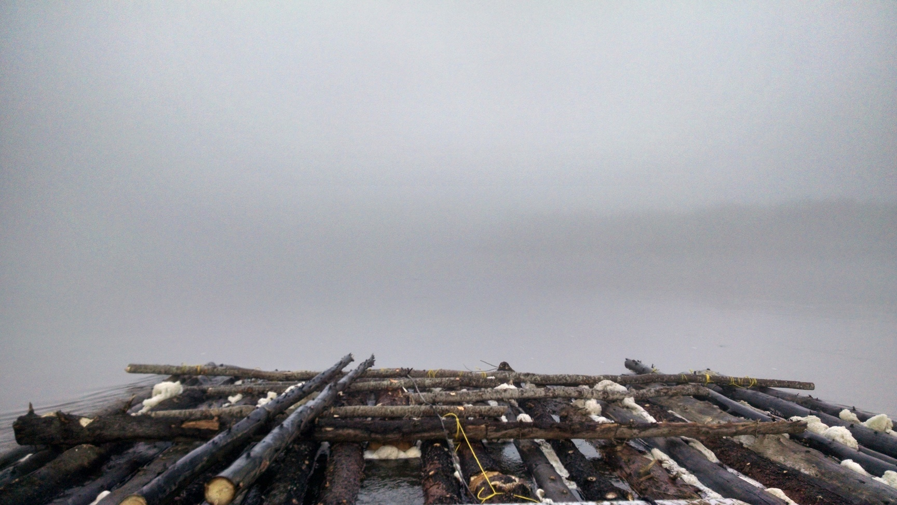
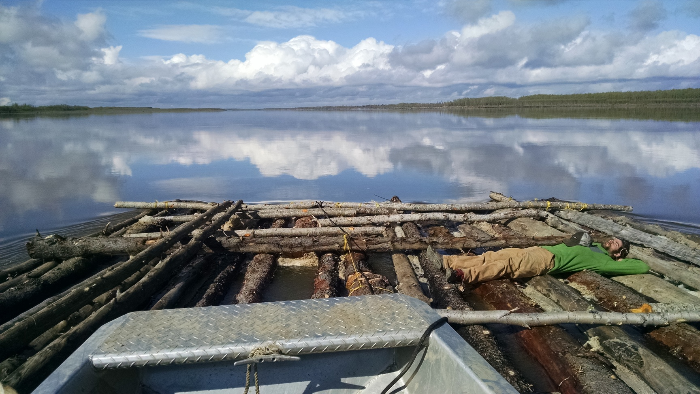
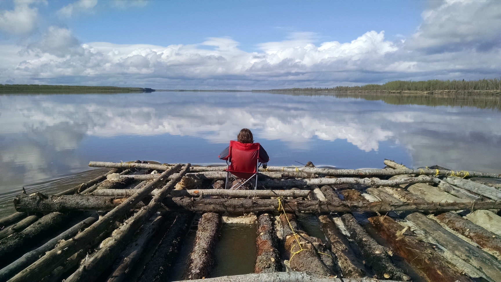
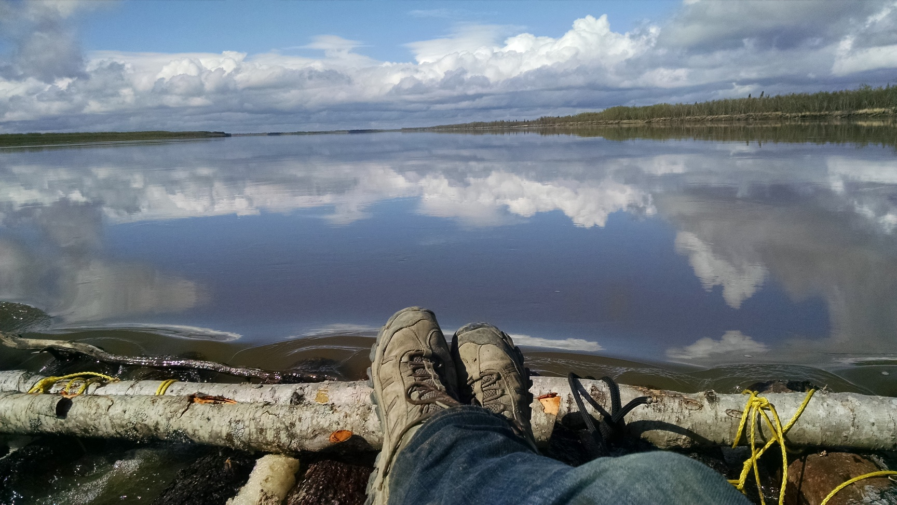