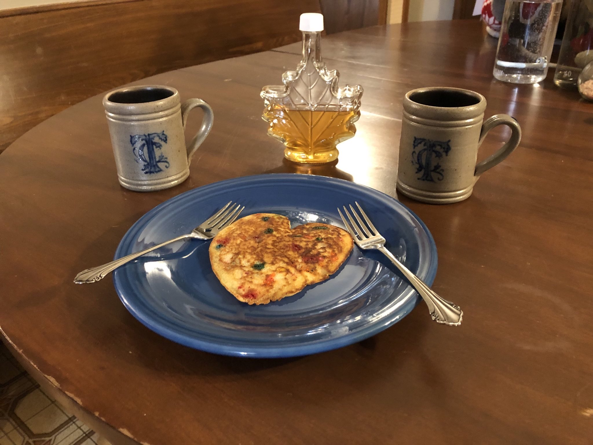

+++
title = "See You on Maple Syrup Day"
date = "2025-03-27"

tags = [
    "Homesteading",
    "Family",
]
categories = []
image = "maple-syrup-day.jpg"
+++

In the summer of 2023, our second summer as homeowners, we decided it would be cool to make maple syrup from the maple trees in our yard. We knew nothing about it. Turns out you harvest the sap in the spring, so we would have to wait until 2024. But we took the opportunity to mark some of the maple trees in our yard because it is a lot easier to identify them when the leaves are on. We have Red Maples and Silver Maples, and we decided to tap the red maples only. For the next few months we told our family and friends that we were excited about syruping and the standard way to say goodbye among the cousins became "See you on maple syrup day".

So finally in Spring of 2024 maple syrup day arrived and we had help from the cousins as well as my friend Kristin and her dog Lucy. We tapped 10 trees and it turned out that 8 of them gave us a decent amount of sap. When we were colecting the sap, Forest decided to show us the game "sink or float" that he had learned at school where you throw something into water and see whether it sinks or floats. He threw the duct tape into our first sap bucket. Luckily all the boiling sanitized it. In hindsight I think it's awesome that while most people only consider changing the thing that you throw _into_ the liquid, he wanted to see what would happen if you change the liquid itself. Excellent instinct kiddo. Keep it up.

Next comes the boiling. We had read that it would take forever. And we made it even harder by not really knowing how to best boil it. We tried a camp stove and 1lb propane cans. That was gonna take forever and consume like 60 propane cans. So we switched to a larger camp boiler and 20lb propane can. Much better. Everyone says burning wood make it more cost effective, but we were in it more for the learning and fun than cost, and plus I don't wanna burn all our firewood on one day outside. Then we finished on the inside stove for better lighting and to have the bottling stuff convenient.

When we finished the first small batch, it was like 10pm. Boiling takes forever, and we did not know to respect that the first time around. But I was so excited that I insisted we make pancakes right then and try it out. So Julie made us a delicious heart-shaped pancake and we ate it together. We got several jars, and enthusiastically shared with everyone who we could convince to have a pancake. I also foolishly dropped a bottle in my parents' driveway and broke it 🤦.

<video controls>
    <source src="signal-2025-03-26-123652_018.mp4" type="video/mp4" />
    First tasting livestream
</video>

Since it went reasonably well the first time and we had already passed the steepest part of the learning and equipment procurement curve, we decided to give it another go in 2025. We tapped ten trees again and they were mostly the same trees. We just rotated from the two that didn't give any sap last year. We were a little later in the season this year and got darker syrup.

Speaking of equipment, my dad had gotten me a hydrometer for my birthday to better judge when the syrup was "done". We tried it several times, but were never able to make it float. I guess that means we should cook longer right? But the temperature was already higher than we expected. Anyway, the syrup still turned out yummy in the end.

See you on Maple Syrup Day!
