+++
title = "Mustang For Sale"
date = "2011-02-27T23:19:24+00:00"
tags = ["mustang"]
categories = []
image = "100_1018_0.JPG"
+++

This is my 1965 mustang restoration project.  It is running and drivable, and with a small amount of love it will be road-ready.  I've had the car for about a decade, and it has come a very long way since I got it.  I was fixing it up to be a daily driver, but it took a long time, and while it has been out on the road, I've never had it out on a regular basis.  The body is painted, and rust-free, but a little dinged up.  The interior is almost entirely complete, but there is a small hole in the headliner.

## Upgrades

<ul>
<li>Eledbrock Mild Cam</li>
<li>Edelbrock lifter set</li>
<li>Ebelbrock performer intake</li>
<li>Edelbrock 600cfm four-barrel carb</li>
<li>Edelbrock air cleaner</li>
<li>New battery</li>
<li>Chrome Weld racing wheels</li>
<li>New safety-glass windshield</li>
<li>Motorcraft chrome valve covers</li>
</ul>

## What it needs
<ul>
<li>Some electrical behind the dash needs hooked up (speedometer, windshield wipers, etc)</li>
<li>There is a little valve tap on one cylinder</li>
<li>The muffler baffles started making noise.  Some headers and a new exhaust system would make it look and sound great.</li>
</ul>

<strong><big>Asking Price: $5,000</big></strong>
<E-mail me if you are interested.

Photos:

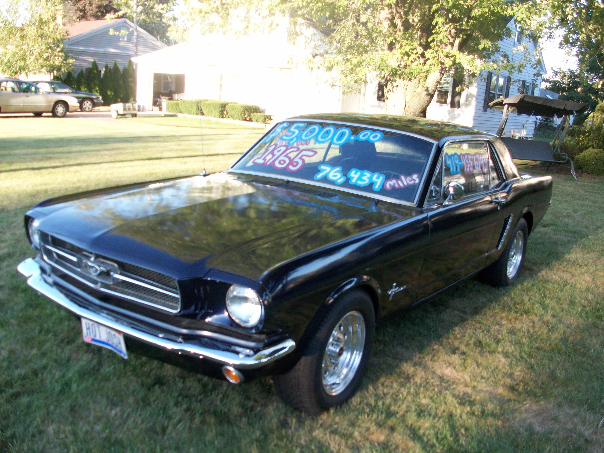
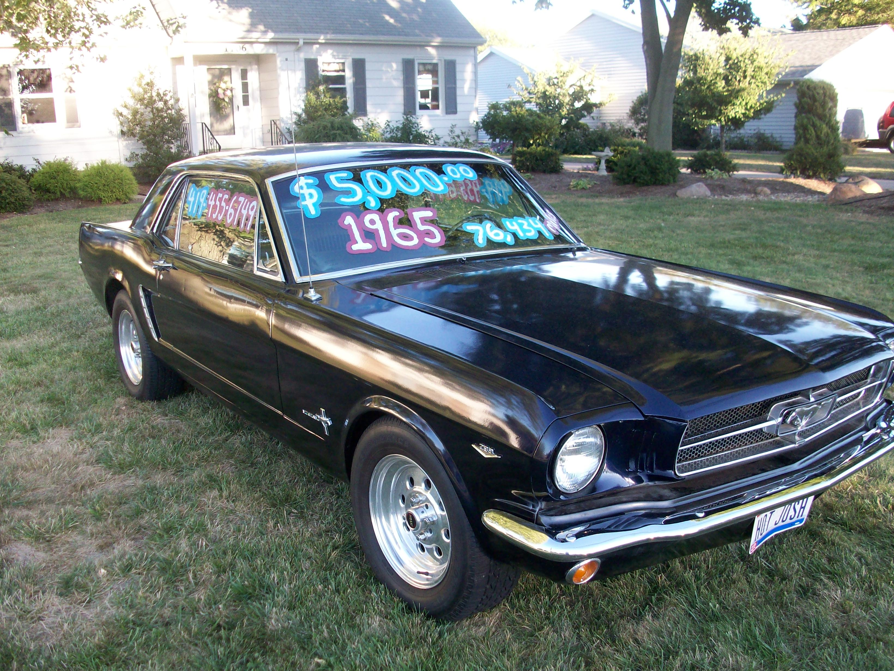
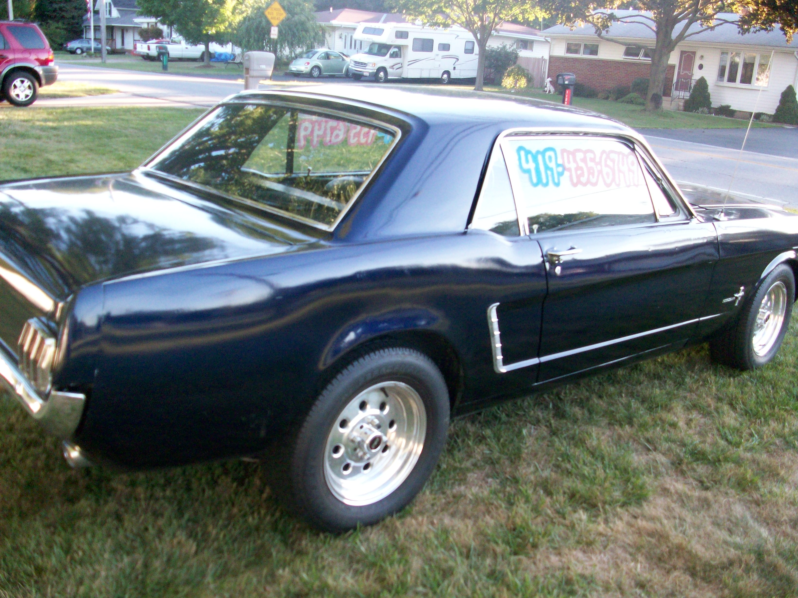
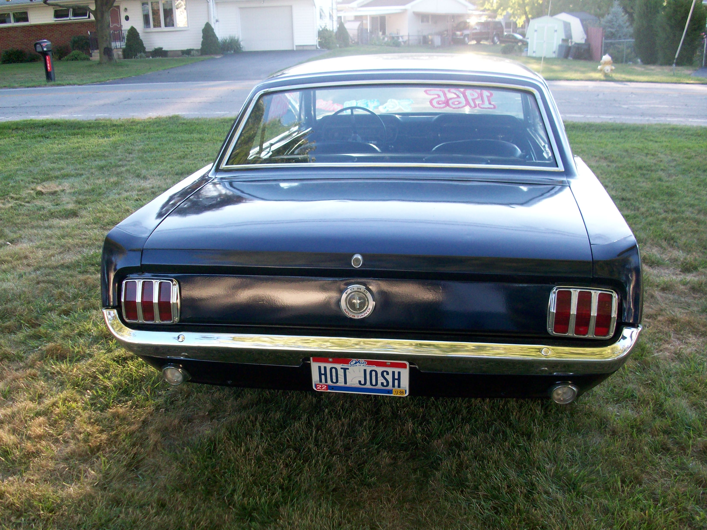
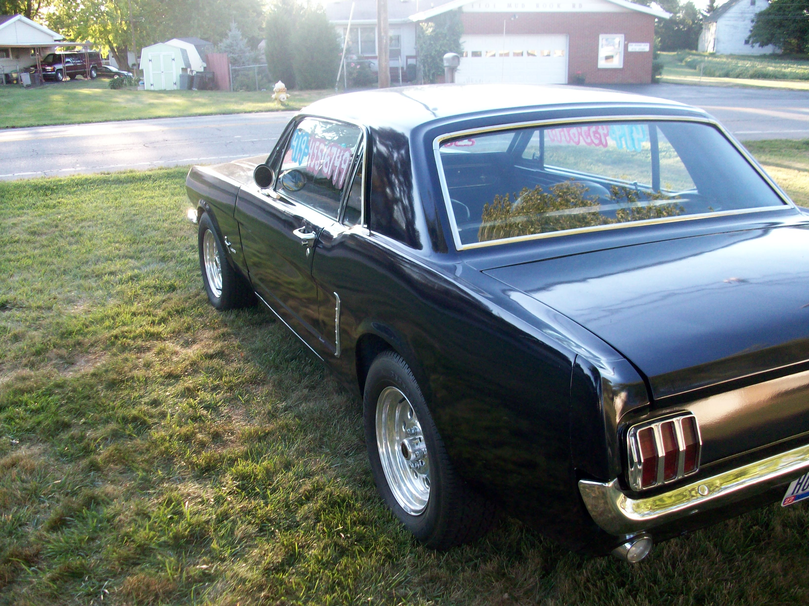
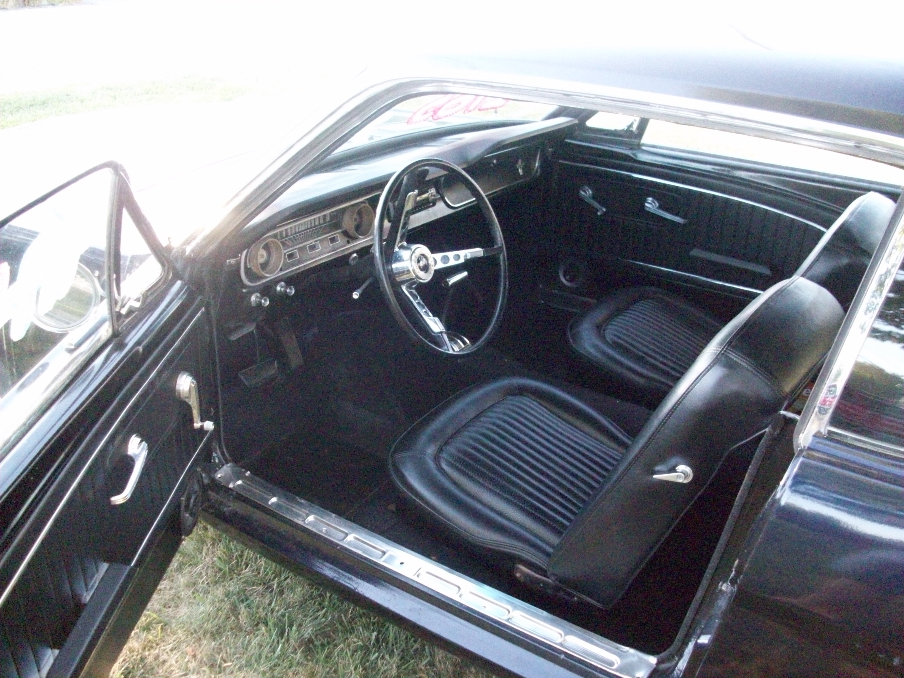

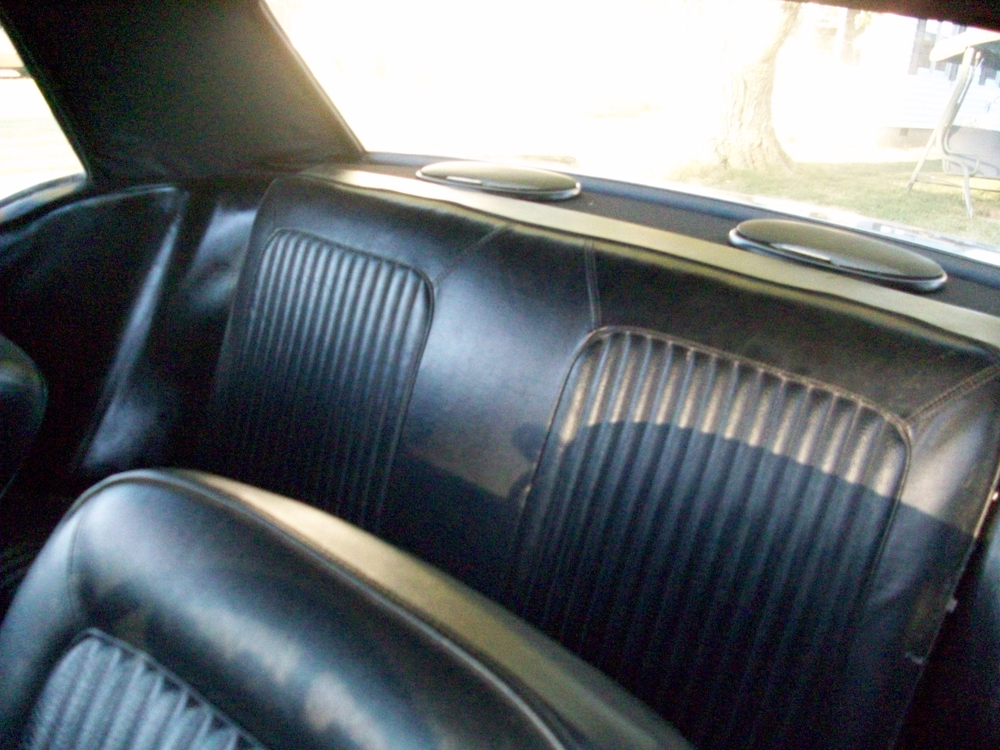
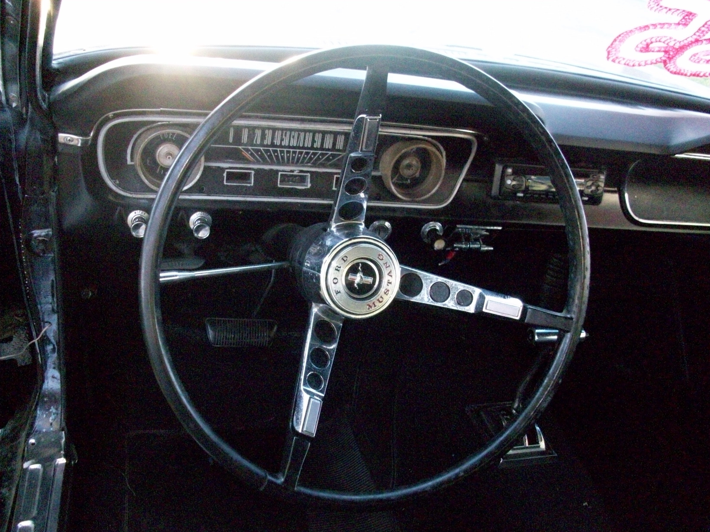
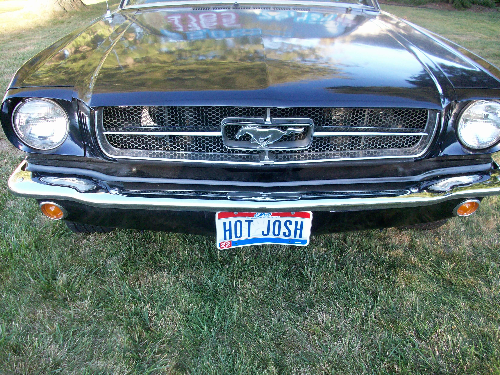
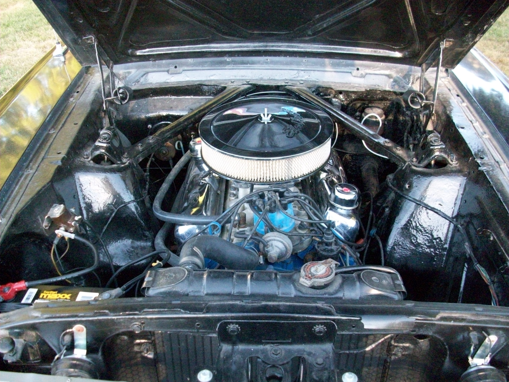
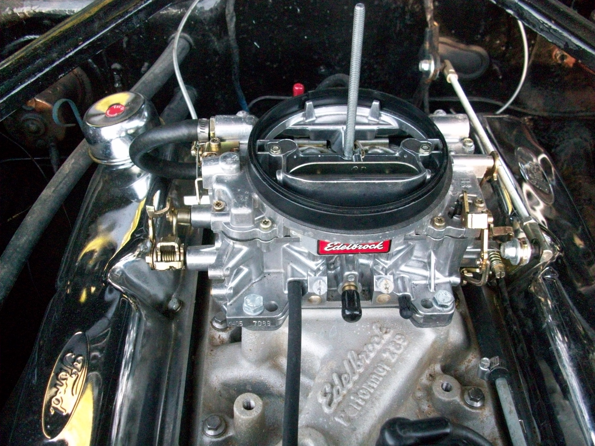
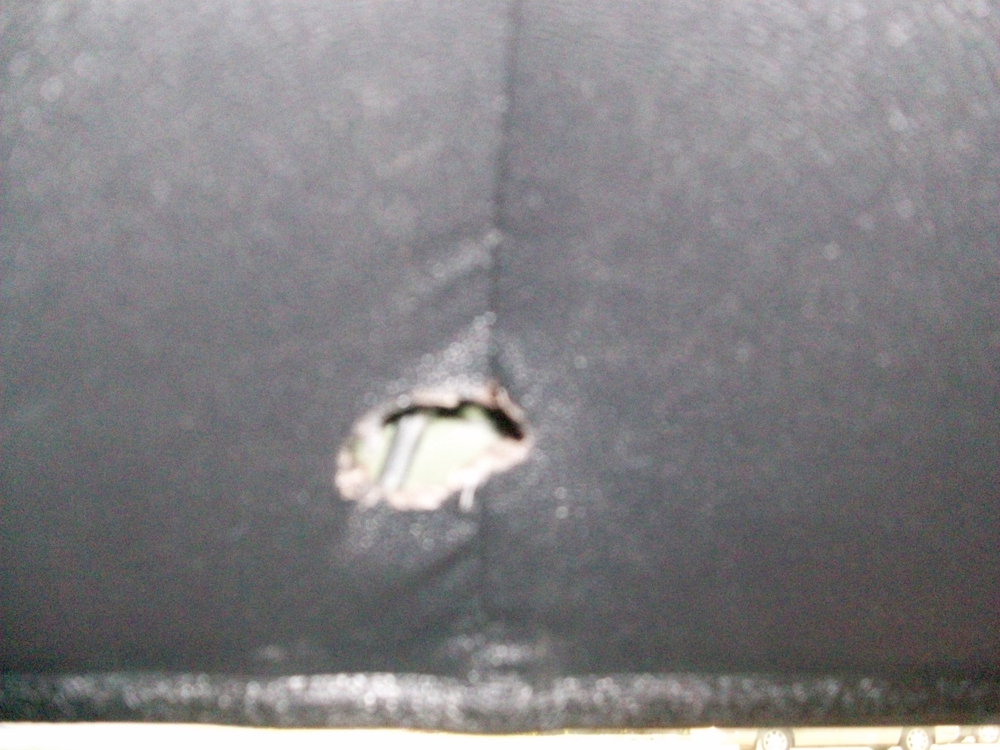
