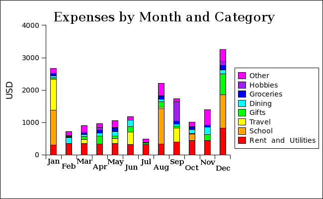

+++
title = "New Years Resolutions 2012"
date = "2012-01-02T08:41:33+00:00"
tags = ["Resolutions"]
categories = []
+++

Just like <a href="resolutions-2011">last year</a> I figured I'd state some of my resolutions here for accountability.  In addition to a few typical year-long resolutions, I've decided to also do  a series of one-month resolutions.  So here they are.

## All Year -- Keep careful financial data
I was looking into charities recently and found myself frustrated with the lack of available information about their expenditures, donations, salaries, etc.  Since they weren't keeping careful track, I figured it would be easy for them to spend irresponsibly.  That got me thinking that I also want to spend responsibly, and if I keep careful track of my finances and publish the data on my website, I will probably do a better job being responsible.
 <strong>End of year update:</strong> Well, I did it, and I only lost $10 along the way. Here is an expense graph and the entire <a href="JoshOrndorffAccounts2012Final.gnucash">GnuCash file</a>.

## All Year -- Go to Alaska
This one is pretty straight-forward.  My friend <a href="http://nateandthemagichat.blogspot.com/">Nate</a> has been up there for over a year, and I've been meaning to go, but haven't yet.  This year I'll make it happen.
 <strong>End of year update:</strong>This didn't work out. But I will do it next year.

## All Year -- Pay off my student loans
I tried to get this done in 2011, but it didn't happen.  I did make a lot of progress, and I'm sure that I'll make it this year.  My balance forward from last year is $4,712.52
 <strong>Update as of 08 September:</strong>  I can't believe I forgot to post the update here earlier, but I have officially completed this resolution.  I have no more student debt.

## All Year -- Don't buy meat
One of my classmates is a vegan, and he convinced me to spend a week as a vegan.  A week wasn't so bad, but I wouldn't be able to give up cheese for a whole year.  What I want is to gain the environmental benefits of a vegetarian diet without the social inconveniences.  My solution is that I won't buy any meat for myself.  I'll still eat it at parties or friends' houses, and I'll even eat it at restaurants.  But I won't get it at the grocery store. 
<strong>Update as of 1 May:</strong>  This is going very well and I really like it.  But it is almost too easy.  Starting in July I will make this resolution even stronger so that I don't buy meat even at restaurants. 
<strong>Update as of 24 August:</strong>  Still going fine, but I didn't end up doing the restaurant thing.  Maybe in October. 
<strong>End of year update:</strong> Well, I made it until 24 December without screwing up, but then I bought a big box of Mexican Pizzas for a Christmas gift. That was the only slip up, and it was an honest accident. (For the record I never did the restaurant thing).

## All Year -- Proofread everything.  Seriously.
I keep finding typos in all kinds of things I've written.  I even spotted one in my resume the other day.  How hard can it be to proof my writing!?  I'm starting by proofing this blog entry.
 <strong>Update as of 24 August:</strong> I've been doing better with this than usual, but I really still haven't been proofreading everything -- at least not thoroughly enough.  I'm going to refocus my efforts now that school is starting up again.

## All Year -- Do some reflection each week
Last year I did a daily video log.  I'm glad I did it because it forced me to reflect on what I was doing each day.  This year I'm taking a different approach that I think I'll like better.  Instead of doing an update every day, I'm going to answer <a href="http://www.marcandangel.com/2008/07/24/20-questions-you-should-ask-yourself-every-sunday/">these questions</a> from one of my favorite websites each Sunday.
 <strong>End of year update:</strong> I got a little burned out on this by the end and won't stick to any rigid schedule for it next year, although I do hope to do some video log entries from time to time.

## All Year -- Drink alcohol sparingly
This is similar to my fast food resolution from last year which was a big success, and it is a joint resolution with my sister.  We've both decided to drink a maximum of twelve times.  So how do we define "one time"?  Once I take the first sip, I can continue to drink for up to twelve hours and it will count as only one time.
<table style="margin: 0 auto; width:80%;"><tr><th>Josh's Log</th><th>Sarah's Log</th></tr>
<tr><td><ol>
<li>7 January -- John Marshall's wedding</li>
<li>17 February -- Tyler's going away party</li>
<li>2 March -- Birthday party in  Ecuador</li>
<li>5 May -- Alex's and Gretchen's Wedding</li>
<li>14 June -- Karaoke night at 705 in LA with Amanda</li>
<li>18 June -- Happy Ending bar in West Hollywood</li>
<li>30 June -- Teamwork 40 hands at CTY</li>
<li>27 July -- 40s Prom</li>
<li>4 August -- Sadie Hawkins party</li>
<li>02 September -- Labor Day Cookout</li>
<li>23 November -- Date at Maumee Bay Brew Pub</li>
<li>29 December -- Date at Spaghetti Warehouse</li>
</ol></td><td><ol>
<li>29 January -- After half marathon</li>
<li>25 February -- Game night</li>
<li>2 March -- Birthday party in  Ecuador</li>
<li>3 March -- Night in Baños, Ecuador</li>
<li>17 March -- St. Patrick's Day</li>
<li>28 April -- Party Bus</li>
<li>5 May -- Alex's and Gretchen's Wedding</li>
<li> 12 May -- Hawaiian birthday rager</li>
<li><strong>Booo. She gave up :(</strong></li>
</ol></td></tr>
</table>

## All Year -- Use metric units
There really is no reason that the states aren't using these sensible units.  I'm going to report my figures in metric units in everyday life whenever possible.
 <strong>End of year update:</strong> I really liked this and will keep doing it, although I may cave a little bit when it is starting to piss people off.

## January -- Perfect my drumstick twirling
This is also a continuation of one of last year's resolutions.  I did learn to twirl the sticks, and it comes somewhat naturally, especially in my right hand, but if I was a drummer, I wouldn't risk doing it in the middle of a song.  I think part of the problem was that this resolution really shouldn't have taken too long, and giving myself a whole year allowed me to put it off way too long.

## February -- Count calories
It's no secret that I'm perpetually struggling with my weight, and I think taking careful data for a month will be a small step in the right direction.
 <strong>End of year update:</strong> This turned out a little crappier than I had hoped. It's just so hard to get reliable data, and I had a hard time estimating. In any case, here is the spreadsheet I used: <a href="February2012Calories.csv">February2012Calories.csv</a>.

## March -- Keep a dream notebook
I love dreams, and trying to understand them.  I like the concepts of lucid dreaming, and reality tests.  I've wanted to keep a notebook for a while, and I'm now resolving to do it for a month.

## April -- Run Everyday
I think by April it will be warm enough that I'll be willing to get out the door a little more.  I'm hoping to already be in decent shape by the beginning of April, and continue running after it ends, but for the month, I'll run thirty times.
 <strong>Update as of 1 May:</strong>  I made it!  Check it out in my <a href="/runninglog?field_date_value[min][date]=2012-04-01&field_date_value[max][date]=2012-04-30">April running log</a>.
 <strong>End of year update:</strong> I ran 1364.5 kilometers this year. I'm very proud of that, but sometimes I can't help wondering what it was all for. I guess the joy and fitness and reflection time is enough.

## May -- Don't eat after 10:00pm
Now that I'm gaining some good fitness from running and lifting, it is high time I stop being such a fatty.  One of my (many) big weight-related problems is that I have a midnight snack almost every night.  So For this month I won't eat between 10:00pm and 5:00am.

## June -- Practice Chinese everyday
I've been trying to learn languages for a long time, but I never buckle down and do it.  I'm not saying one month of dedication will make all the difference, but it just might start a positive habit.

## July -- Go to sleep without the TV
Somewhere along the line I got in the habit of watching TV or movies every night while I'm falling asleep.  It is a waste of energy, and sometimes it cuts into my sleep.  There is also good that comes of it because sometimes I watch documentaries or lectures, but more often, it is mindless sitcoms.  Last week while I was traveling I didn't have a TV, but as soon as I returned I was back to my old ways.  I want to break the habit of watching something every night.
 <strong>Update as of 24 August:</strong> This turned out to be super easy.  I think it's partly because I was at CTY and I was always super tired, but I definitely no longer consider it a habit.

## August -- Do yoga everyday
I'm not as flexible as I used to be or as graceful as I'd like to be.  I think Yoga will help with both of these.  It also seems like a good preventative measure for running-related injuries.
 <strong>Update as of 24 August:</strong> I've been doing the sun salutation following <a href="http://www.youtube.com/watch?v=yuvfHTaftLQ">this video</a> each day, but my hamstrings are not flexible enough and don't seem to be improving :-/

## September -- Take a daily photo
This could potentially be really cool, although I think doing it for a whole year would be cooler. I'm going to take a photo of myself in the same position every morning (or night, not sure which yet), and compare them at the end of the month.
 <strong>Update as of 30 October:</strong> I finished this a month ago, but you know how I am about taking forever to do things. Anyway, I finally got the pictures in a form that will look alright for the web.

<video src="SeptemberPictures.mp4" controls></video>

## October -- Practice piano everyday
Music is a big hobby of mine, and something I'd like to do for the rest of my life.  But the last year that I've been in graduate school it has taken a back seat and I don't like that.  It is common for grad students to say that they are too busy with classwork for other things like hobbies or fitness or relationships etc, but that's bullshit (in my humble opinion).  I realized a while ago, in terms of my running, that if something is important to me I can make time for it.  And music is no exception.  I'm planning to get a piano sometime in September, so October's resolution is to buckle down and get good at it.
 <strong>Update as of 08 September:</strong>  I ordered the piano this week.  It is supposed to get here on Monday.
 <strong>Update as of 30 October:</strong>  This is going great so far! I really like playing and, like the running resolution, I'm pretty sure I'll be able to continue it after the month is over.

## <del>November -- Spend less than $500</del>
<del>Looking at my expense graph above, I notice a trend.  I get looser and looser with my spending all the time.  The two huge bars are exceptions because they contain my school fees, and the tiny one is an exception because I was living at CTY.  The others show that I'm always increasing my spending.  Now that I'm out of debt, that trend could easily continue and get out of hand.  This resolution should help me keep that in check and return to my old stingy ways.
 <strong>Update as of 08 September:</strong>  Crap! I hadn't considered that I would be moving before this month.  I guess I'll have to find another place with cheap rent.</del>
 <strong>Update as of 30 October:</strong> I decided to change this resolution for two reasons. The first is that I hadn't considered that I would be living on my own and my rent and utilities would have increased when I first made the resolution. Second, my new girlfriend Maggie will be coming to visit over Thanksgiving break, and nobody wants to be dating a total cheapskate. I'm not saying that cheap or free dates can't be fun; I actually believe quite the opposite. I'm just saying that planning a weekend around an arbitrary spending cap needlessly eliminates some fun possibilities.</strong>

## November -- A dual resolution
The first resolution is that I'll have my Chinese office mate, <a href="http://wordsterence.com/">Terence</a> teach me a new Chinese phrase each weekday.  So far this has been going very well. He comes up with great useful analogies.  And he is my first actual Chinese teacher since Anna in California in 2011. 
 
The second is that I'll make all non-critical choices via random methods (eg. coin flips, dice, etc). 
<strong>Update as of 10 November:</strong>This has been fun, but the month is 1/3 over and I haven't had many chances to do it yet.

## December -- Only write with my left hand
I've wanted to be ambidextrous for a while, and I can do most things with either hand, but not writing.  My left-handed penmanship is really bad. The only way to become fluent is through immersion, so for the month I'm going to write everything with my left hand. No exceptions (except I'll probably forget once in a while).
 <strong>Update as of 02 December:</strong>  This is going to be brutal with finals coming up.  I'm really going to have to power through.

