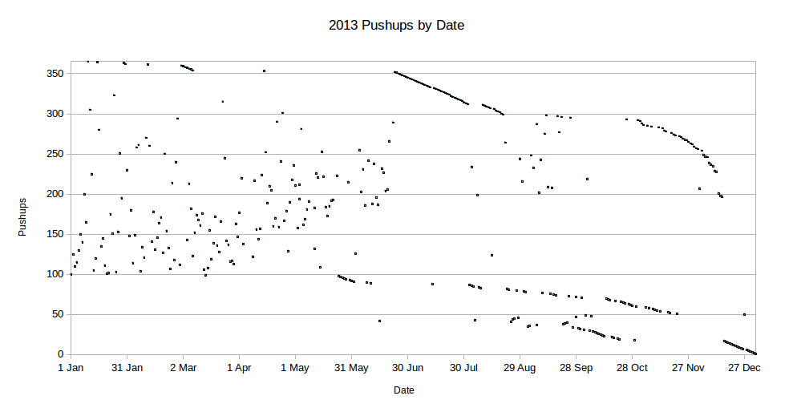

+++
title = "New Years Resolutions 2013"
date = "2013-01-01T07:15:06+00:00"
tags = ["Resolutions"]
categories = []
image = "todo.jpg"
+++

Keeping with [tradition](/tags/resolutions), I'm posting a few new years resolutions here. I'm keeping the list a little shorter this year.

## Run two megameters
Last year I ran 1,364.5 km.  This year I will bump that up to over 2,000 km.  That is a lot for me, so I'll have to get on it pretty soon. I'll keep track on my <a href="http://www.joshorndorff.com/joshorndorff.com/runninglog?field_date_value[min][date]=1+Jan+2013&field_date_value[max][date]=31+Dec+2013">running log</a> again.

<strong>Update as of 17 June:</strong> The years is almost 50% over and I've run almost 10% of this distance. That's partly because I spent a lot of time on the bike trip, but I'm really going to have to get going on this one.

<strong>Year-end Update:</strong> This really didn't work out. I don't really have a good excuse.

## Finish the tough mudder in under two hours
My tough mudder is April 27th. I really don't think two hours is going to be too tough, but I haven't been able to find any other final results or anything, so for now that's what it is.

<strong>Update as of 17 June:</strong> This didn't quite happen. The course was a lot muddier than I expected, but mostly the problem was that I was too fat and out of shape.

## Get skinny
In order to help accomplish my tough mudder goal, part of my preparation will be losing weight. I will get my body mass below 73kg by the date of the tough mudder. It is currently about 80kg, so I have a little work ahead of me.  I'd actually like to lose a little more than that, but anything extra will be considered bonus.

<strong>Update as of 17 June:</strong> I didn't get skinny by the posted deadline which is why my tough mudder was slower than I had hoped, but my bike trip did get me fairly skinny. I'm down to about 74kg, and I'll work hard to get it coming down.

<strong>Year-end Update:</strong> Although I was skinny again after the bike trip, I gained the weight back. This will be a priority in 2014.

## Do pushups every day
This is similar to a resolution I made in 2011, but this time I'm using an idea I learned from my friend Anne. I'll write all of the numbers between 1 and 365 and each day I'll choose a number (not randomly, but intelligently), do that many pushups, and cross the number off the list. I'll have an actual paper copy, a copy on my computer, and a copy here on the website to prevent tragedy if something gets lost or corrupted.

<strong>Update as of 17 June:</strong> This is going great so far.

<strong>Year-end Update:</strong> Put simply I successfully completed this resolution. The data is available as [ods](2013PushupTally.ods) and [xls](2013PushupTally.xls). There are a few minor errors in the accounting of how many pushups I did each day which can be seen in the linked data. The errors generally fall into one of three categories, none of which I consider major:

<ol><li>Daily total entered after midnight. I didn't require myself to complete my daily pushups by midnight as many people suggested, but rather by when I went to bed for the night. If I was going to bed at 1:00 am and glanced at my phone's clock for the date as I entered the tally, the date would say the next day. This happened a few times and resulted in, for example, two entries for 28 September and no entry for 27 September</li>
<li>Wrong month entered: After typing in a date in March for an entire month, it is easy to continue typing March even after April has arrived. This results in, for example, two entries for 03 March, and no entry for 03 April</li>
<li>Forgotten entry / Unknown mistake: On days when I completed all of my pushups early in the day, it is easy to forget to enter the total in the spreadsheet. I'm totally confident that I did pushups every day this year, but there were apparently two days during the year when I forgot to enter the total. In order to correct for this, I still did the last two days of pushups on January first and second 2014. There were a few other goofy entries that I'm not quite sure of, but, aas I mentioned, I'm confident that I did pushups each and every day, and the pushups were at least as many as the recorded number.</li>
</ol>

## Go to Alaska
Last year I resolved to visit my friend Nate in Alaksa, and that was the only resolution that I really messed up in a major way. So this year I'll do it for real.

<strong>Year-end Update:</strong> I finally made it to Alaska, and it was more than just a visit. I worked with Nate at Renfro's Alaskan Adventures for most of September and October.

## Take flying lessons
My parents got me a first lesson for my birthday last month, and it was amazing. I want to continue taking them, but they aren't free, so I'm resolving to take a few more lessons this year. Specifically, I'll fly at least once every calendar month.

<strong>Update as of 17 June:</strong> This has not worked out. I've missed March, April, and  May, and will almost certainly miss June and July as well.

<strong>Year-end Update:</strong> Although I didn't actually fly each month, I did fly a lot more than expected and got my pilot license, so I'll consider this a success.

## Bicycle trip
My friend David Dornbos III took a bicycle trip from coast to coast last year. I think that's awesome, and I'd really like to do the same. I'm not officially resolving to do it yet, because there are going to be time and money constraints, but I'm resolving to do my best to make it happen. I'm already very excited about the possibility, and I hope that excitement keeps growing and turns into an actual trip. In my head I'm planning Los Angeles to Boston in May and June.  We'll see what happens.

<strong>Update as of 17 June:</strong> Did it! And it was awesome.

## Read two books
I don't do a lot of reading even though I think it is valuable in moderation. I know a lot of people read hundreds of books every year and think it's ridiculous that I would resolve to read only two. Good for them; everyone has their interests. For me two is a good number that I will enjoy without getting burned out or reading stupid stuff.

<strong>Year-end Update:</strong> I read "Locks, Mahabharata, and Mathematics" after Aditya bought it for me in India, and "The Theory of Almost Everything" which has been sitting in my book drawer since I never read it in college. I also read a ton of study material for my pilot's license.

Wish me luck!

