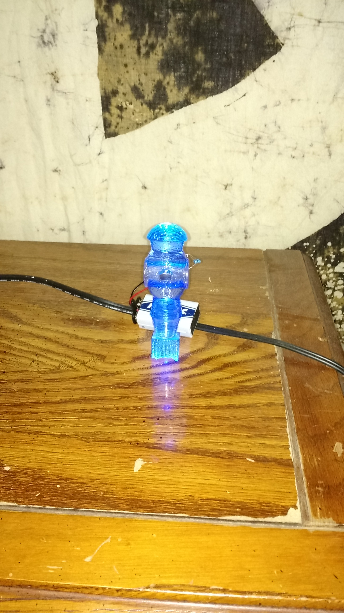
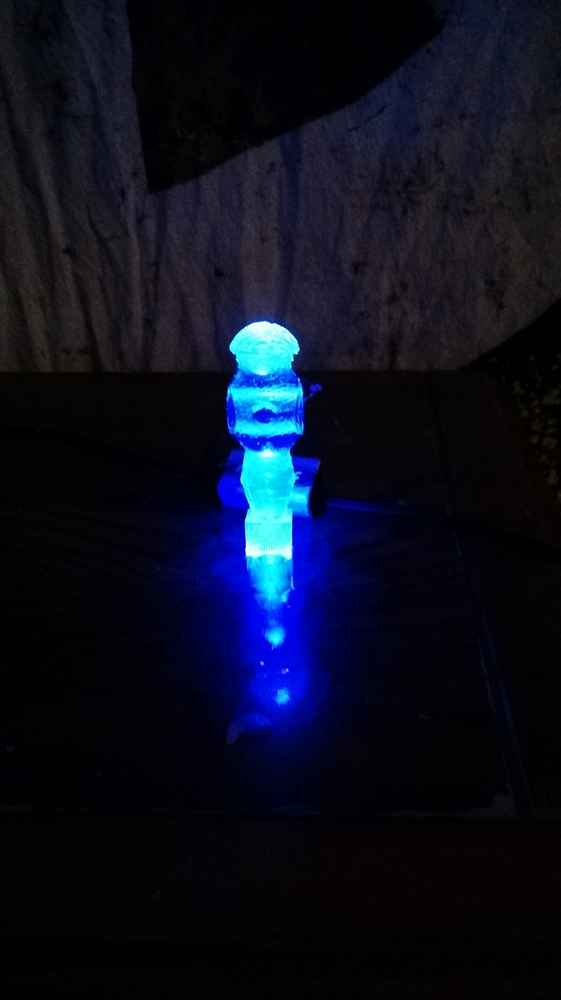
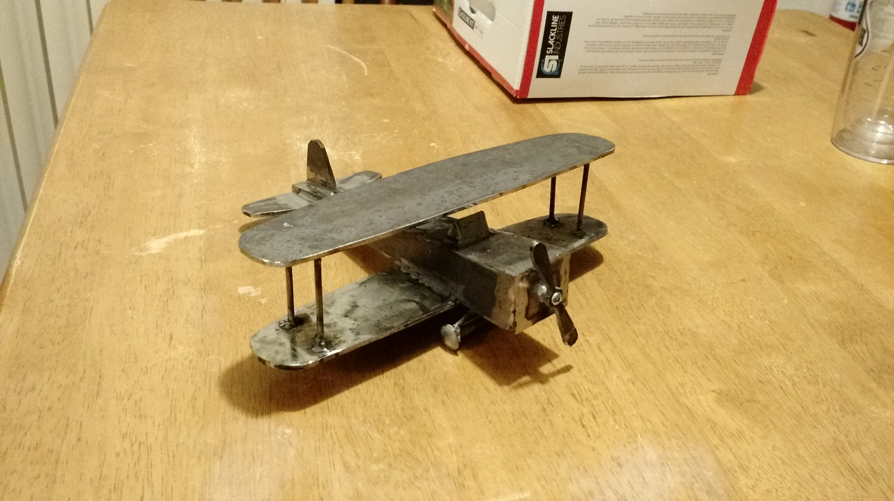
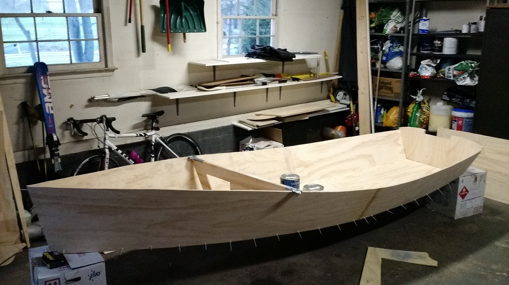
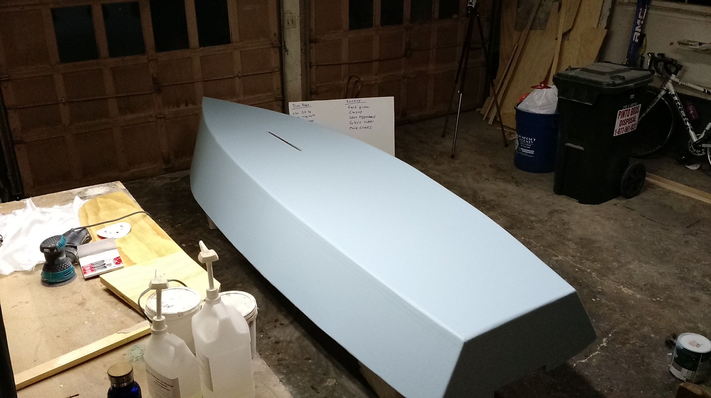

+++
title = "New Years Resolutions 2016"
date = "2016-01-01T05:00:53+00:00"
tags = ["Resolutions"]
categories = []
image = "BoatUpdate1.jpg"
+++

Last year's resolutions went well for the most part, and I'm hoping for the same this year. (See also: <a href="/tags/resolutions">Other Years</a>).

<h3>Write a Clue Notepad Android App</h3>
I've wanted to do this for a long time, and now that I'm a computer science teacher, it is time to finally do it. The app will keep track of the information a user knows in the boardgame clue, and use deductive logic to solve the game as quickly as possible. I've already started to prototype the algorithm in python (because I know python better). Since I'm distancing myself from google, the app need not be in the google play store for this resolution to be considered a success, but I will put an apk on this website, and release the app in f-droid if that process is practical.
<strong>Update as of 31 January:</strong> I've made some good progress on the python version, but have not yet made much progress on the android app. I'll write at least a bare bones android app by the end of February.
<strong>End of year result:</strong> Definitely failed this one. Partly because there was higher-than-expected learning curve for android development, and partly because I've lost faith in the future of Android as a platform. I am still interested in the clue app though, and hope to keep working on the python version, although even that didn't get much love this year.

<h3>Learn to Weld</h3>
I've wanted to do this for years. I just got a welder for my birthday last week, and just made my first successful weld today. I don't have a specific goal for when I'll consider myself learned, but I'll get an idea as the year progresses. If I haven't made any progress by the end of January, I'll update this resolution with a more specific goal.
<strong>Update as of 31 January:</strong> I made one cool project (currently secret, but soon not to be secret anymore) already, and plan on making my <a href="http://www.lincolnelectric.com/en-us/support/welding-projects/Pages/biplane-detail.aspx">airplane project</a>.
<strong>End of year result:</strong> Big success. See photos below.

<h3>Build Spinning Disk Toy</h3>
I saw this really cool rotational inertia demo at the museum of life and sciences in Durham, NC, and want to make my own version of it. I'll need to scavenge an old motor from something (eg. a vacuum cleaner), but I think with my electronics skills and my new welder, I'm all set up to make this happen.
<strong>End of year result:</strong> Another clear failure. I did scavenge a motor from an old dryer, but didn't build the demo. Partly because I'm a lazy bum, and partly because I didn't know where I'd put it or use it.

<h3>Bike and run a lot</h3>
This is an exact repeat of last year's resolution which I failed. The goal is:  (running) + (biking / 4) > 2000 km. The difference this year is that I'll make monthly subgoals to keep me on track. In order to start out strong, I'll make January's goal 200 km (10% of the total).
<strong>Update as of 31 January:</strong> Finished January with 201km. February goal in 170km.
<strong>End of year result:</strong> Big check mark. Here's the <a href="http://joshorndorff.com/bikinglog?field_date_value[min]=01+Jan+2016&field_date_value[max]=1+Jan+2017">2016 running and biking log</a>.

<h3>Build a Sailboat</h3>
My first boat building resolution went very well, and I think I'm now ready for a bigger challenge. This year I'll make a sailboat instead of a row boat and I'll make it over 8ft so that it requires scarfing plywood together.
<strong>Update as of 31 January:</strong> Not much progress here, but it is on my mind. I've decided I'll start as soon as I return from spring break.
<strong>End of year result:</strong> Another big check mark. See photo below, and expect a full post about the boat after I've finally taken it out this spring.

<h3>Cast a LUFT Foosball man</h3>
I'll cast a transparent foosball man with working LED(s) inside.
<strong>Update as of 31 January:</strong> Ordered the materials today.
<strong>End of year result:</strong> Big check mark; photos below.

<h3>Upgrade to Drupal 8</h3>
Since the new version of Drupal is out, it is time to upgrade this site.
<strong>Update as of 31 January:</strong> Making my very first attempt as soon as I finish updating this node.
<strong>End of year result:</strong> You're looking at it! Although technically it didn't really look usable until a week or two into January 2017.

<h3>One Plate One Bowl</h3>
Everyone knows I have a huge problem with overeating. Last year at CTY I only allowed myself one plate and one bowl at the dining hall and it worked great. This year I'll do the same thing at the dining hall at Pingry and at CTY.
<strong>Update as of 31 January:</strong> So far so good. It is hard not to run back for more as soon as I finish my first plate and bowl, but, as I learned at CTY, if I wait even a few minutes, I usually lose interest in more.
<strong>End of year result:</strong> Success!

<h3>Run an 18 minute 5k</h3>
I know this is bold, but I'm not getting any younger, and who knows when I won't be able to do it any more.
<strong>Update as of 31 January:</strong> My running totals are looking good, and I've been working out with the sprinters some, so hopefully I'm getting there. I still haven't lost much weight though, which I think would help me a lot.
<strong>End of year result:</strong> This never happened. I ran <a href="http://joshorndorff.com/node/2513">one race</a> that I took seriously in November, and won handily, but it was much longer than 5k as I took over 29 minutes to finish.

<h3>Stretch every day</h3>
This is just like last year, except this year I'll reduce the time to seven minutes each day so I dread the stretching less when I wait until right before bed to do it.
<strong>Update as of 31 January:</strong> Great so far.
<strong>End of year result:</strong> Success!

<h3>Do situps and pushups</h3>
At least 49 pushups and 147 situps each day.
<strong>Update as of 31 January:</strong> Great so far.
<strong>End of year result:</strong> Success!

Photos:

