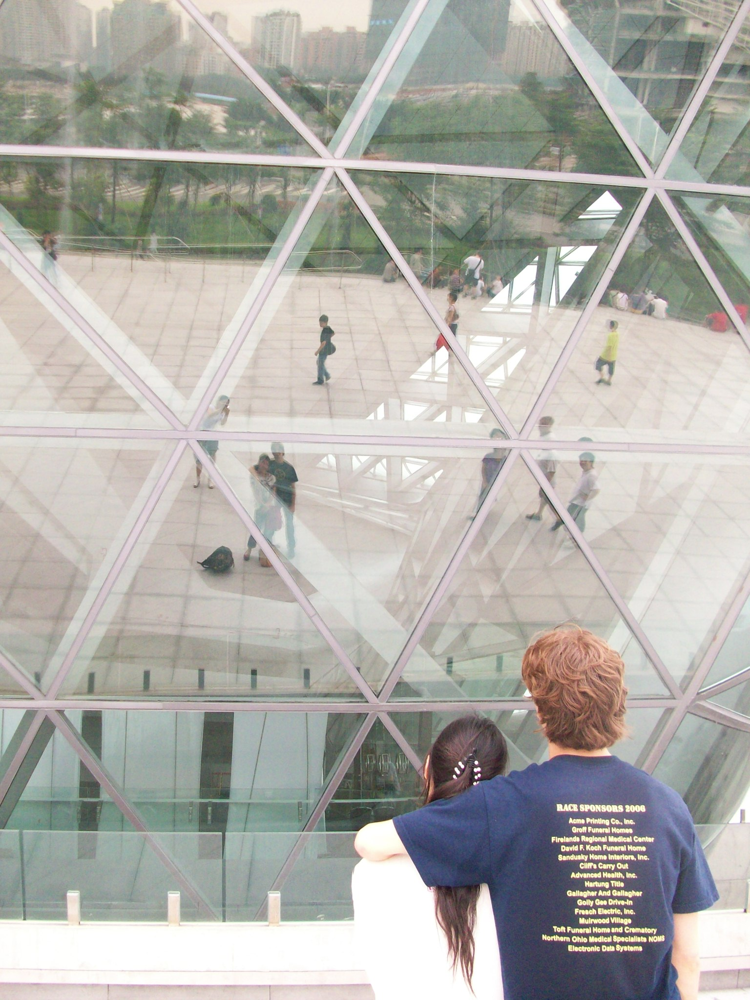
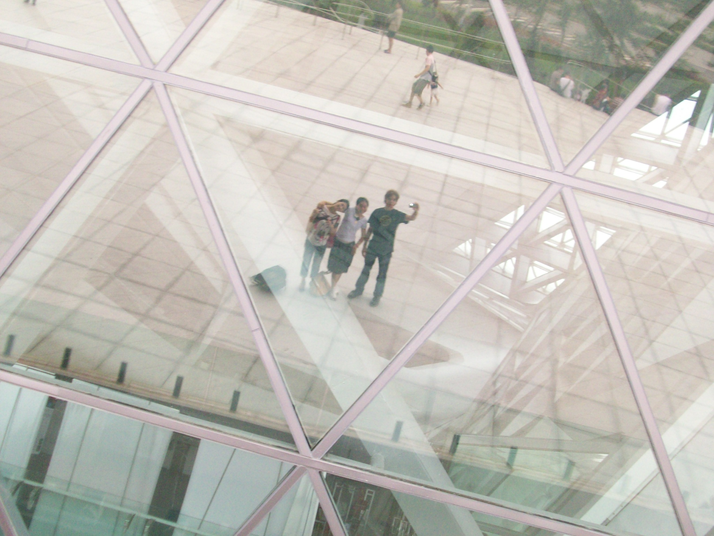
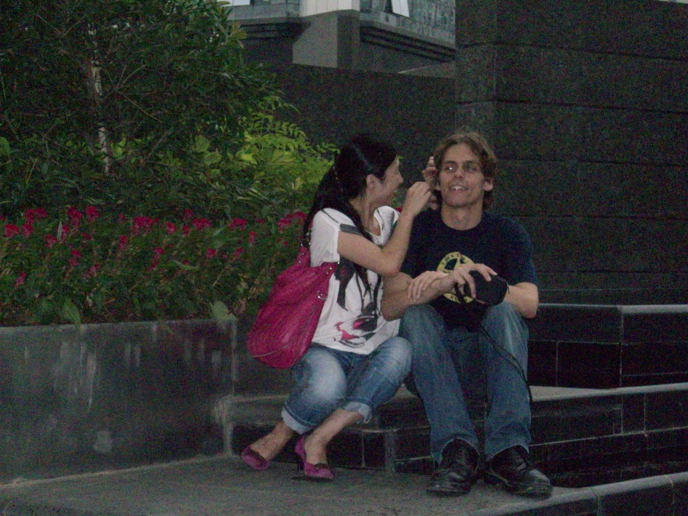
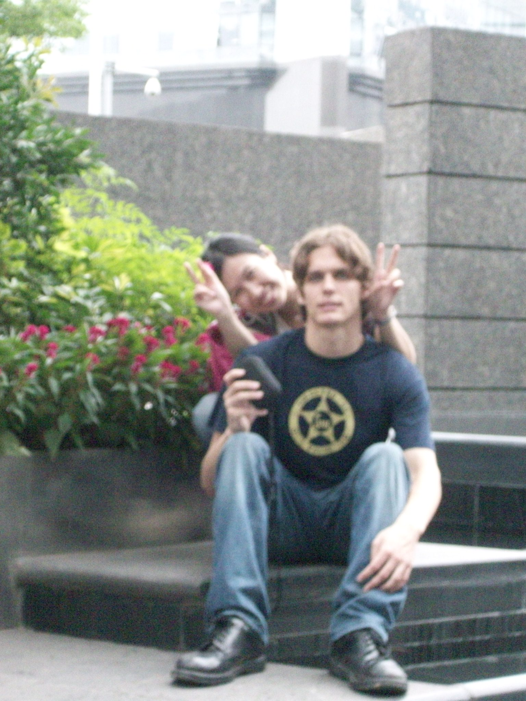
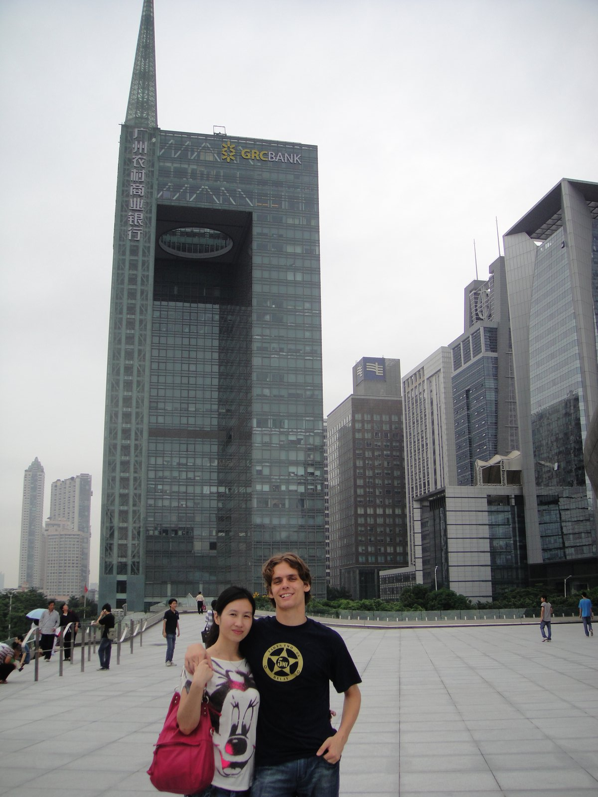
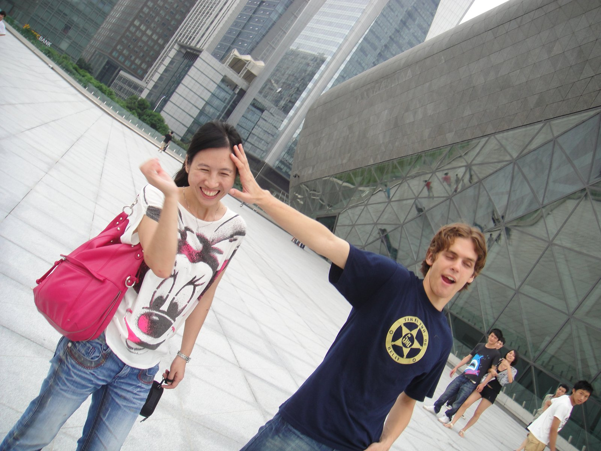
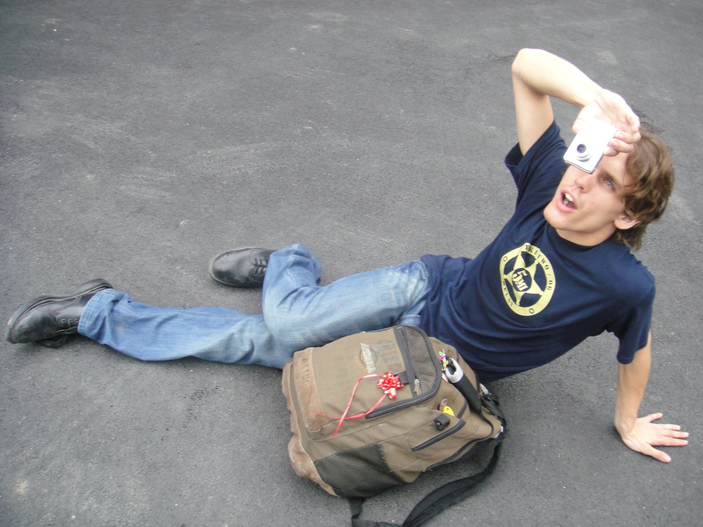
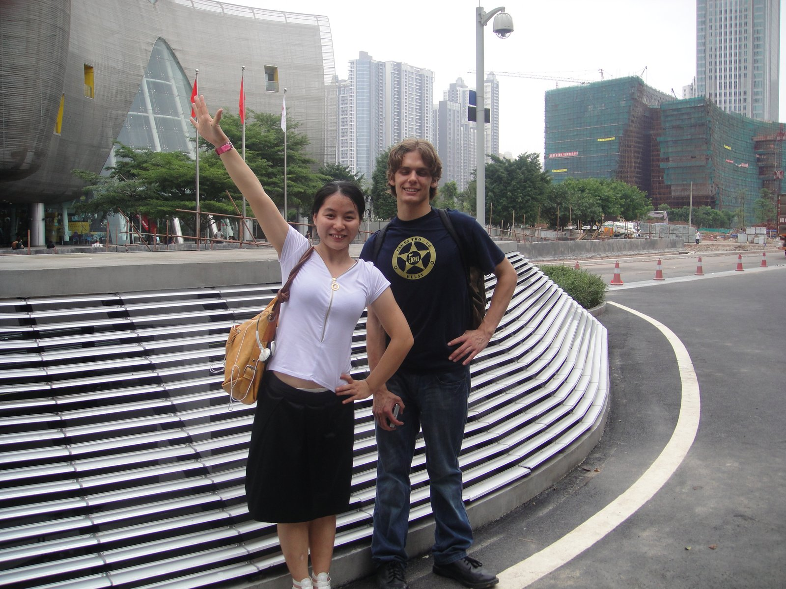
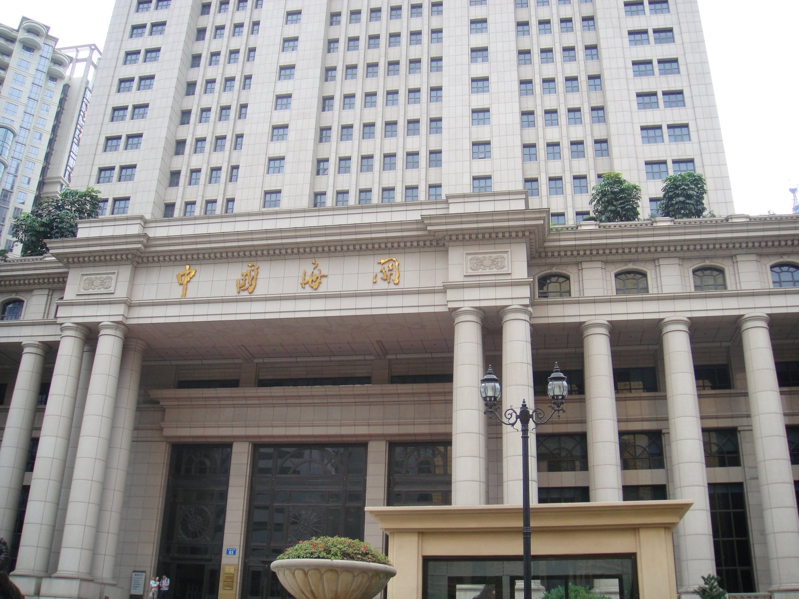

+++
title = "Opera House"
date = "2010-06-24T13:07:29+00:00"
tags = ["China"]
categories = []
image = "100_0553.JPG"
+++

Over the holiday break I went walking around the opera house with Sunny and Yoyo.  Of course we didn't go inside because that requires buying a ticket to the opera.  And we have neither the class nor the money for that kind of thing :)  But the building is really cool, so we took some pictures outside, and some pictures at other nearby locations.

Photos:

