+++
title = "Pearl River Cruise"
date = "2010-07-23T02:04:06+00:00"
tags = ["China"]
categories = []
image = "100_0594.JPG"
+++

This will probably be my last Gallery of China pictures.  Toward the end of the semester I went on a river cruise with Tim, Sunny, our friend Anna, my friend Johnny, and his girlfriend.  We were walking to the dock when a woman approached us and offered us a better deal to take her cruise line instead.  So she crammed us into the back of her van and drove us to another dock up the river.  In China that is a legitimate offer rather than a sure way to get jumped and maybe killed.  We sat on the back deck of the boat.  It was a fun night and the city lights looked really cool.

Photos:

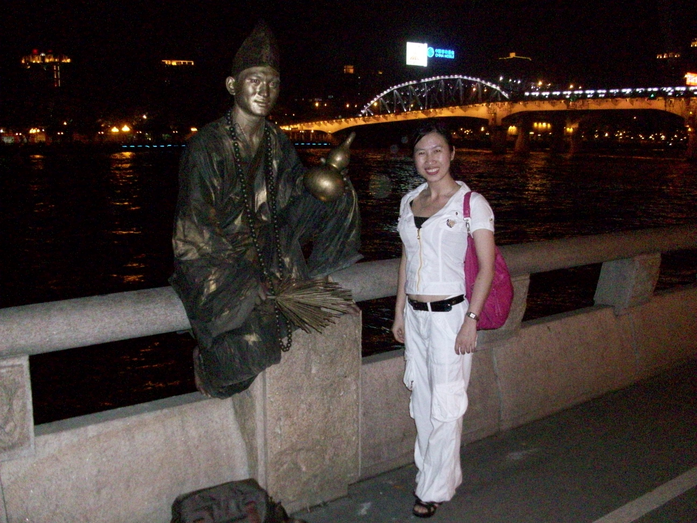
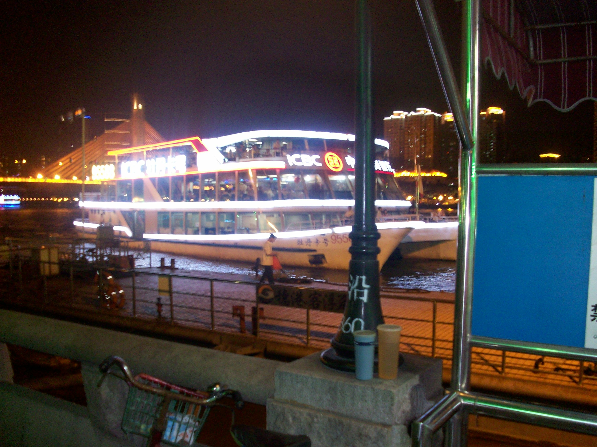
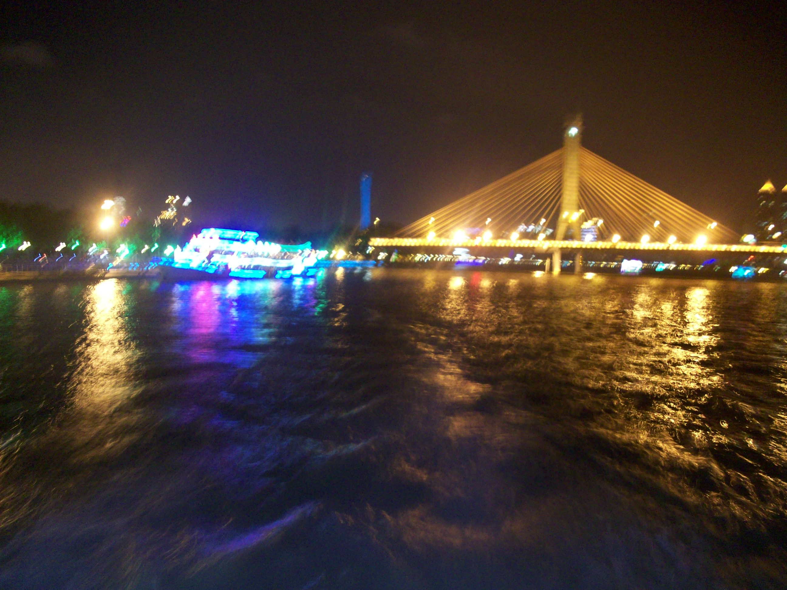
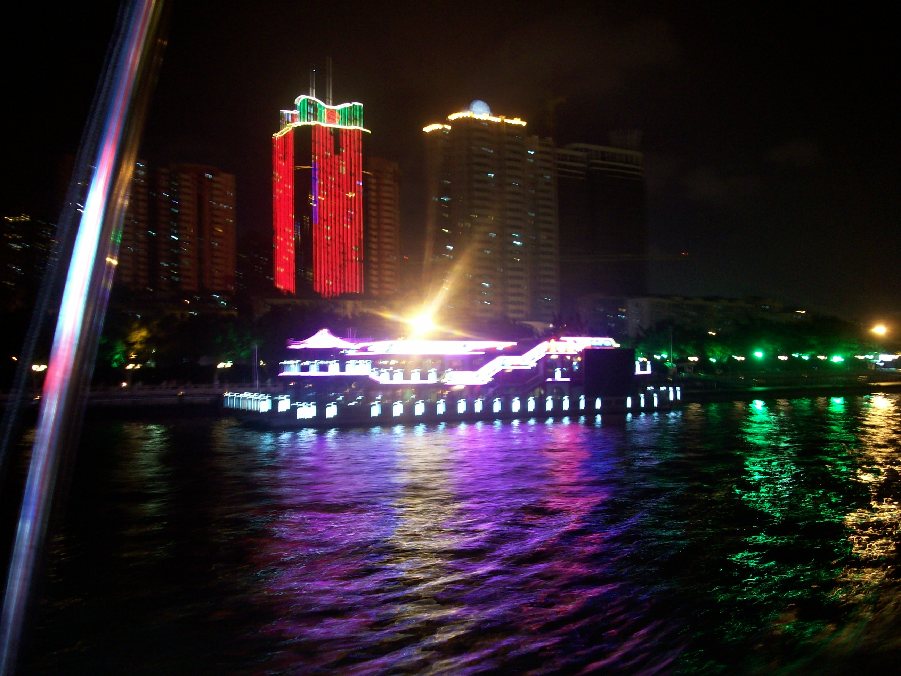
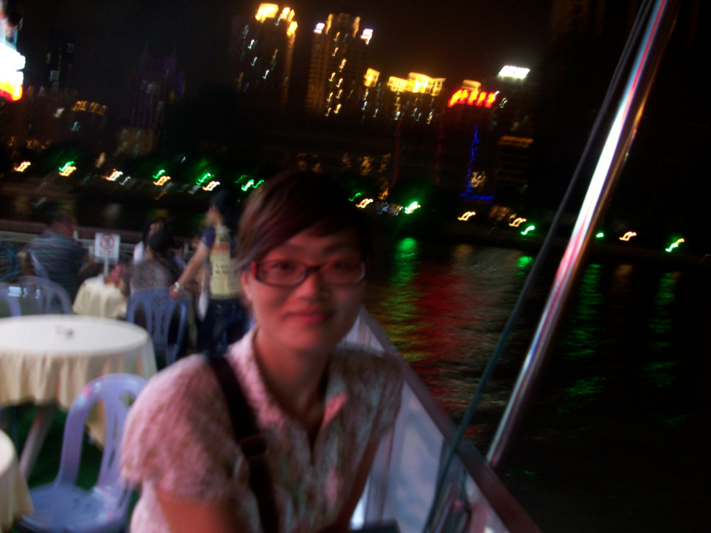

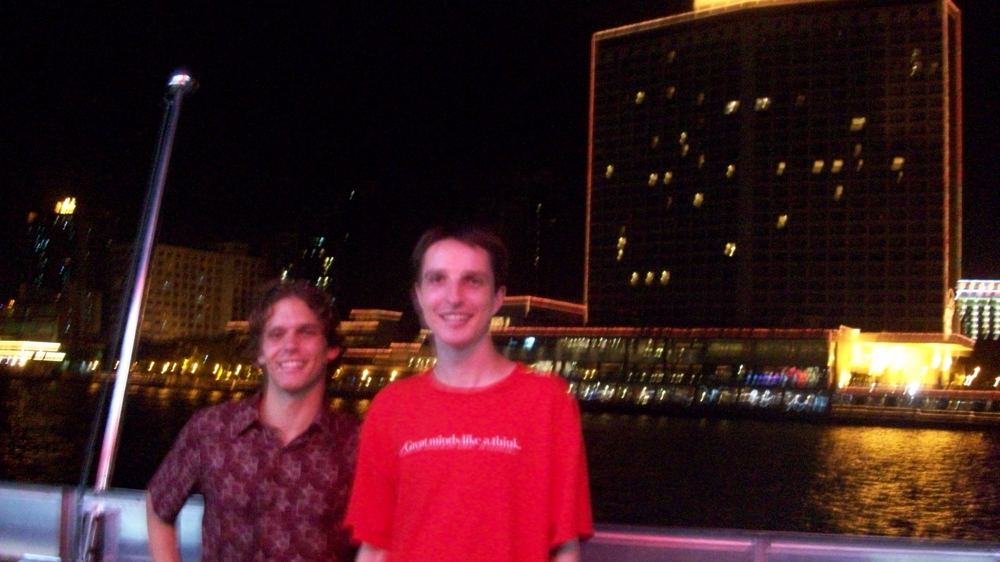
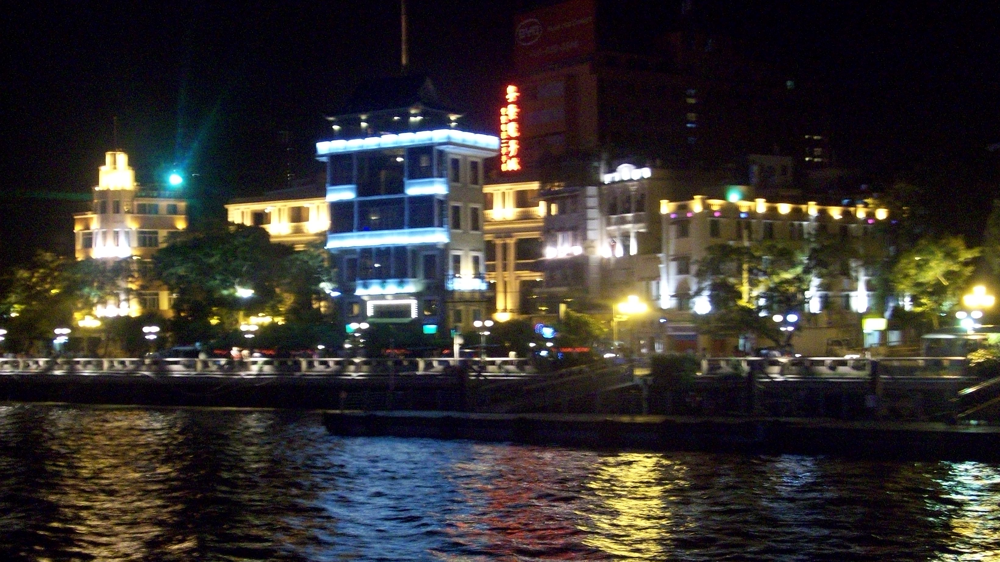
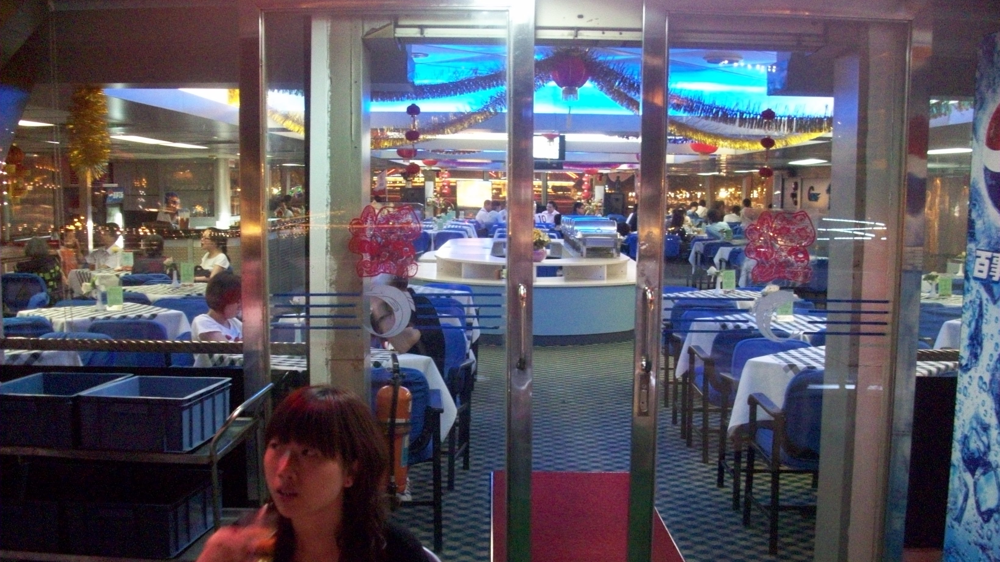
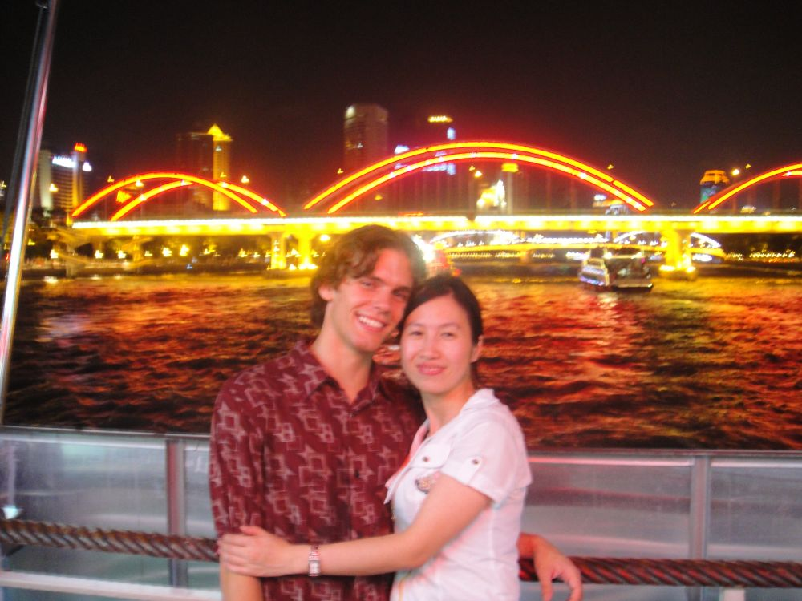
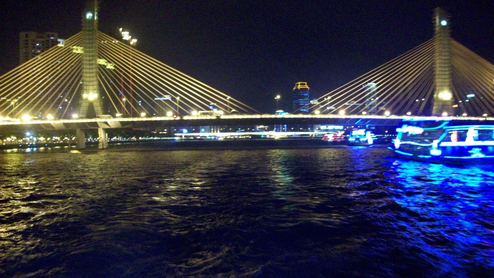
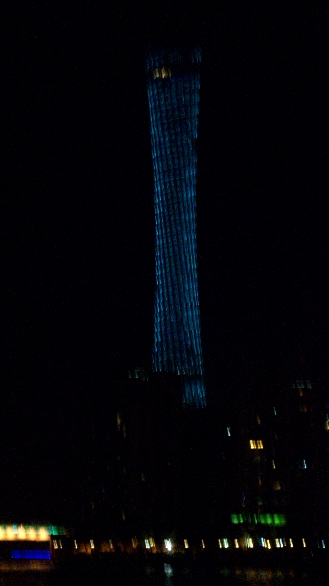
