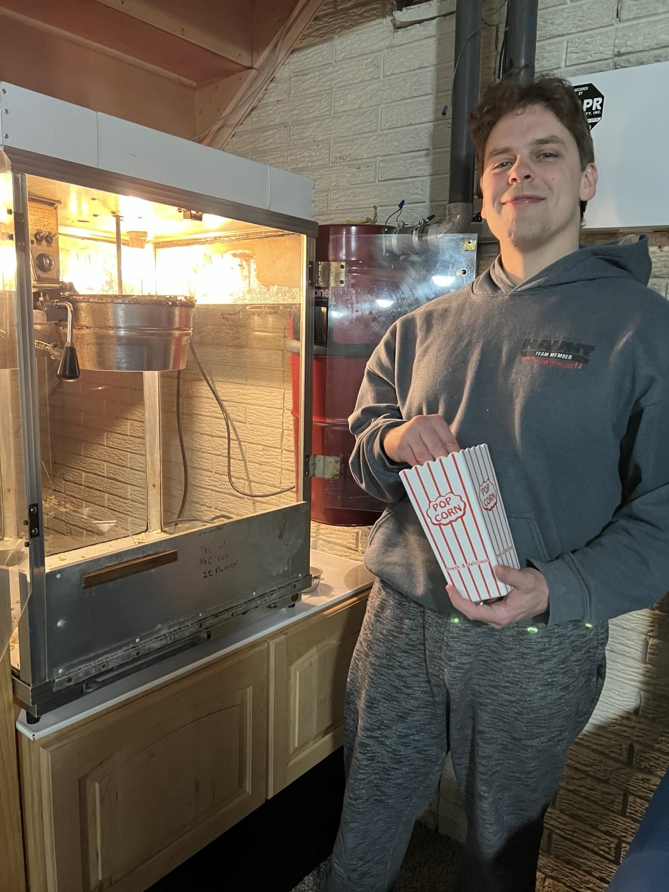

+++
title = "Popcorn Machine"
date = "2025-03-26"

tags = [
    "Memories",
    "Homeownership",
]
categories = []
image = "popcorn-machine-1.jpg"
+++

When I was in 8th grade, my parents went to an auction in our town. Among other things, they came with a lot of three non-working popcorn makers. The goal was to get at least one of them working and use the others for parts.

In the initial phase I worked with Beth Bower to pick out the best looking most complete of the three machines, clean it, and simplify the wiring. After this initial effort the machine we chose showed a lot of promise. The light worked, the agitator motor worked, and the warmer plate worked.

In the following days, dad and I assembled the agitator and cook pot with parts from another machine. But that's about where we got stuck. We couldn't get the darn cook pot to get warm. All of  the accessories were working, but not the critical part that actually pops the corn.

Then few days or weeks later my dad went out and took another stab at it. I can't remember whether I was helping or not. But I remember at some moment my friend Grace had come over and I was at the house visiting with her and her mom and my mom. When all of a sudden, dad comes walking up from the barn with some popped corn! 🍿

I remember it was too dirty to eat because it was popped on an old cook pop. Dad said he had reassembled everything completely one more time and tried again really patiently and then some corn popped. He didn't seem sure of one specific thing he had fixed. But I remember that confidence and patience were important parts of the process.

So then we had a popcorn machine for the rest of the time growing up. At some point we got a second machine working. And at some point my friend Kristin's dad made a top for it to cover the wiring.

The machine still operated in my parents basement at their parties for many years until just a few weeks ago. They moved out of that house and into a condo, and I got to inherit the popcorn machine. Now it is installed in my own basement under the stairs. Funny thing is, the popcorn machine is more likely to be with me in future phases of life than the house itself is.

