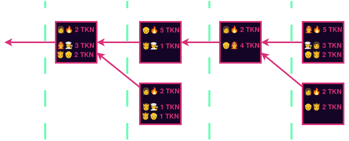
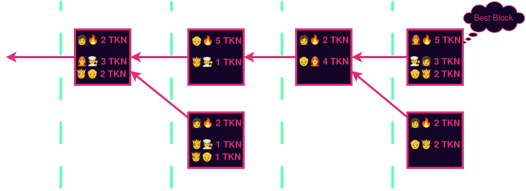
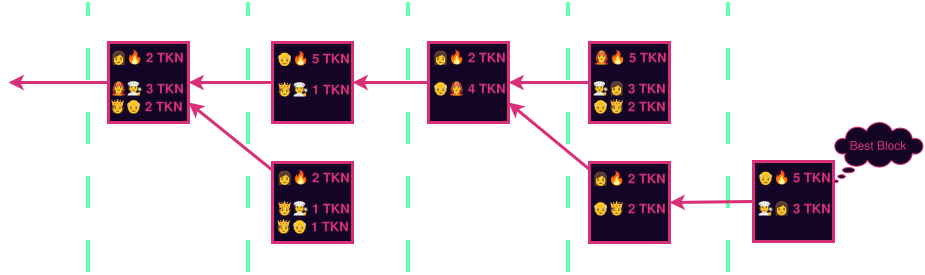
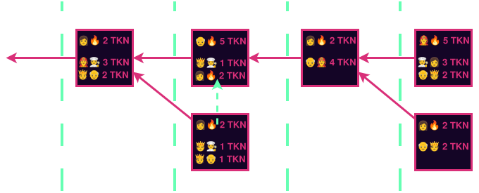
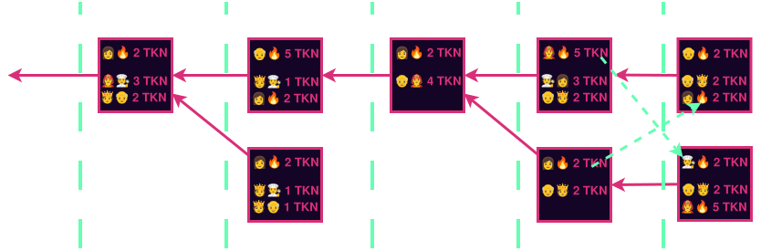

+++
title = "Proof of Sacrifice"
date = "2026-10-06"

tags = [
    "Blockchain",
    "Consensus",
    "Leader Election",
    "Probabilistic Finality",
    "Proof of Work",
]
categories = []
image = "ForkChoiceReorg.svg"
+++

In this post I will introduce "Proof of Sacrifice" a novel leader election and probabilistic finality mechanism in the field of blockchain consensus. Proof of Sacrifice captures the best aspects of both Proof of Work and Proof of Stake. Specifically it has the simplicity and permissionless sibyl resistance of Proof of Work while requiring stake in the network and avoiding large energy consumption like Proof of Stake.

## Proof of Sacrifice Core Idea

Time is divided into slots, and one block will ultimately be committed in each slot, although more may be authored. Anyone may author a block in any slot without permission or providing advanced notice. Their block must contain one special transaction that represents their bid for the privilege of authoring the block. This special transaction is somewhat analogous to a coinbase transaction except that the author typically offers to burn their existing money rather than receive newly minted money.

In the diagram above we can see that the author offers to burn some tokens in the very first transaction in each block. After that normal transactions are included. In the leftmost block depicted:

* The author (👩) offers to burn 5 tokens for the privilege of authoring. This transaction is interpreted as a bid because it is the first in the block. A block that does not offer to burn in the first position is not a valid block.
* The next transaction is a regular transfer from 🧑‍🚒 to 🧑‍🍳 in the amount of 3 tokens.
* And finally a regular transaction from 🫅 to 👴 in the amount of 2 tokens.

While they are not depicted in the diagram, we assume that the regular transactions offer some fee to be collected by the author.

### Fork Choice Resolution

To determine which block is the best block, we use the Heaviest Chain rule where the block weights are set to the amount of money burnt in that block's coinbase transaction. At any moment, the best chain is the one in which the most tokens have been burned. (In a real-world implementation, the [GHOST](https://eprint.iacr.org/2013/881.pdf rule is probably better than the simple heaviest chain rule, but in this writeup I will use the heaviest chain rule to keep the diagrams manageable and the content approachable.)

Now consider what happens if an author in the next slot hasn't yet seen the marked best block or chooses to ignore it, and instead authors on its sibling.

### All Bids Are Burned

In some ways, this is similar to naive proof of stake. There are no security deposits and there is no slashing. Indeed, as I've described it so far, it may appear to suffer from its own variant of the [nothing at stake problem](https://vitalik.eth.limo/general/2017/12/31/pos_faq.html#what-is-the-nothing-at-stake-problem-and-how-can-it-be-fixed). As described so far, when one offers to burn 5 tokens to author a block in slot N, and their block is eventually orphaned, then they still have their bid tokens, and thus no scarce resource was consumed in order to mine. That would be fundamentally different than actual PoW and is why existing PoS networks need security deposits, slashing, complexity, and so forth to make proof of stake work.

We solve this apparent problem by introducing a rule that **all bids are burned**, even the loosing ones. To implement this, the bid transactions are formatted as standard transactions like any other and are identified as bids only by their position first in the block. The **bids can be replayed across forks**. Let that sink in. It is well understood that regular transactions can appear on both sides of a fork, and the figures show such a transaction. In the second pictured slot, the transaction (🫅🧑‍🍳 1 TKN) appears on both sides of the fork. The coinbase transactions can appear on the other side of a fork as well and thus the tokens are burned in both sides. This means that if you author a block, you pay the tokens you bid regardless of whether it ends up in the canonical chain or not. Just like in PoW.

This figure shows how the chain would look with the new rule introduced. There are two cases where multiple blocks were authored in the same slot. The first case (the second pictured slot) is more straightforward. 👩 authored first, and was outbid within the same slot. This is evident because her burn transaction is included in the sibling block within the same slot. 

In the second case (the fourth pictured slot) 👩 authored again and lost again. We can guess that 🧑‍🚒 did not see her block yet because he did not include her burn transaction. Similarly, 👩 did not include 🧑‍🚒's burn transaction in her block. This is not a problem because their burns will be included later in the chain.

### Tattling on Yourself

A keen observer will notice that in the last pictured slot of the previous diagram, 🧑‍🍳 has accidentally disclosed that he knowingly built on the wrong block. By including 🧑‍🚒's burn from the correct block according to the heaviest chain rule, 🧑‍🍳 discloses that he has indeed seen the block and chose not to build on it anyway.

One may be tempted to consider 🧑‍🍳's block invalid, but there is no benefit to doing so. Making these self-tattle blocks invalid makes the block checking logic more complex and does not prevent the behavior. If such a rule existed, 🧑‍🍳 would simply not include 🧑‍🚒's burn in his block. But 🧑‍🚒's burn would be included later in the chain anyway.

## Compare to Proof of Work

Proof os Sacrifice is similar to Proof of Work in that you consume a scarce resource for the privilege of authoring. If you imagine running Proof of Work and paying your energy bill with the tokens of the blockchain the similarity is even more apparent. One difference is that the money spent on security is directly burned rather than being spent on energy and thus the security spend is recouped by the token holders rather than an external energy utility.

Proof of Sacrifice is unlike Proof of Work, and more like Proof of Stake in that it doesn't require any actual energy burn or the environmental side effects associated with it. It is also like Proof of Stake in that authoring requires having some stake in the network.

### Why are Slots Necessary?

In genuine Proof of Work blockchains, the Proof of Work is doing two duties: consuming a scarce resource for the privilege of authoring, and throttling the block production rate. Proof of Sacrifice replaces the duty of consuming a scarce resource directly and entirely, but does nothing to throttle block production.

By introducing slots and requiring at most one block be accepted into the canonical chain in each slot, we cap the maximum throughput of the chain and thereby guarantee that syncing the network remains feasible over the long term.

## Managing Noise on the P2P Layer

It may seem that an entirely permissionless author set would lead to a huge amount of blocks being gossiped on the P2P layer and could overwhelm the bandwidth that nodes have available. This is mitigated in the node implementation. Nodes will only gossip the best block (the highest bidding valid block) they have seen at a particular block height. If they receive a block that is worse than one they have previously seen, they do not gossip it at all and its spread quickly dies off. If they receive a block better than the best they have currently seen, they gossip it out and stop gossiping the previous best. A similar rule exists in PoW blockchains where nodes only gossip the first block (or sometimes the block with the most work) that they have seen at a given height.

## Why Pay to Author Blocks?

First let's observe that this is exactly what already happens in PoW networks like Bitcoin today. Proof of Sacrifice authors would pay money for the same reason that PoW miners pay energy: You make more than you spend.

Currently, building blocks is a huge advantage because of [MEV](https://ethereum.org/developers/docs/mev). Ethereum has acknowledged it with Proposer Builder Separation where block builders offer competing bids to proposers for the privilege of building the blocks. Proof of sacrifice also acknowledges this advantage in a more direct way. Rather than having builders submit their bids to separate proposers, the role of proposer is entirely permissionless and builders propose their blocks and bids directly to the network.

## When Authoring Does Not Pay Enough

MEV is often considered a negative or undesirable property and several efforts in underway to reduce or eliminate it including [encrypted mempools](https://encryptedmempool.org/) and [inclusion lists](https://eips.ethereum.org/EIPS/eip-7547). If these efforts succeed, the value that block builders can extract from the transactions they include in their blocks will be significantly reduced. In this potential future, block authors will still collect regular transaction fees. During periods of low transaction volume, there may be so little value to capture that doesn't make sense to pay to author blocks.

In an extreme case there may be no extractable value and no incentive to bid to author blocks. As a philosophical point, it may be preferable to have no blocks authored at all in such conditions. However, would-be authors would still have to run their authoring setups and watch for transactions that would make authoring profitable again. And many networks prefer to have blocks authored even if they are empty to demonstrate that the network is still live. Therefore, the cost of running an authoring setup is never reduced to zero even though the income stream may be.

 In cases like this, authors may require being paid for their services from the network itself. To accommodate this, we allow authors to bid negative amounts. That is, we allow them to bid such that they will be paid, rather than pay. As ever, the highest bid (least negative in this case) is the winner.

 The one fundamental difference in this case is that only the winning bid is paid. Unlike the usual case where all bidders pay. There is no additional rule necessary to make this work. It is always forbidden to mint tokens in regular transactions, and relpaying negative bids would constitute exactly that.

## How to Fair Launch?

Some networks strive to launch with #NoPremine. That is to say, they launch with no pre-existing token allocation. Bitcoin itself launched this way and it is one of its greatest strengths. Proof of Sacrifice chains cannot realistically launch with no preexisting tokens because there would be no tokens with which to bid for authoring rights.

A few solutions are discussed in the following sections.

### Switching mid-flight

A network could launch with an entirely different author selection mechanism, and switch to Proof of Sacrifice after a certain number of blocks, or a certain amount of tokens have been minted. The initial leader election mechanism could be something like Proof of Work or a more traditional Proof of Stake with round robin election, or something more randomized like [Ouroboros](https://en.wikipedia.org/wiki/Ouroboros_(protocol)).

### Sacrifice an External Asset

Another option would be to launch with Proof of Sacrifice where authors sacrifice another asset entirely. For example the authors of some new chain could bid on the privilege of authoring by sacrificing an established asset like ETH. As before, the highest bidder wins and gets to author, but all of the bids can be replayed on the Ethereum chain, and thus all bidders pay.

### Multi Asset Sacrifice

It is also possible to allow sacrifice of multiple different assets. Bidders could be allowed to sacrifice ETH, BTC, or the native token, or some combination of them. This has the disadvantage that there must be some way to decide who wins the auction when bidding in disparate assets.

#### Gradual Handover

Multi asset sacrifice can be used as a way to gradually switch from external asset sacrifice when the network is young to native asset sacrifice after the network matures. By valuing the external asset less and less over time, bidders are gradually encouraged to bid in the native token eventually approaching pure Proof of Sacrifice.

## What About Finality?

The Proof of Sacrifice mechanism constitutes a leader election mechanism and a probabilistic finality gadget just like Proof of Work, and therefore it can be used all by itself. However, in many cases, deterministic finality is desirable, and in these cases, Proof of Sacrifice can be coupled with a deterministic finality gadget. For a detailed analysis of such coupling is presented in the [Ebb and Flow paper](https://arxiv.org/pdf/2009.04987) where Proof of Sacrifice would fulfill their Πlc.

## Conclusion

Proof of Sacrifice is a leader election mechanism and probabilistic finality consensus mechanism that is awesome and will fill the world with 🌈🦄.
