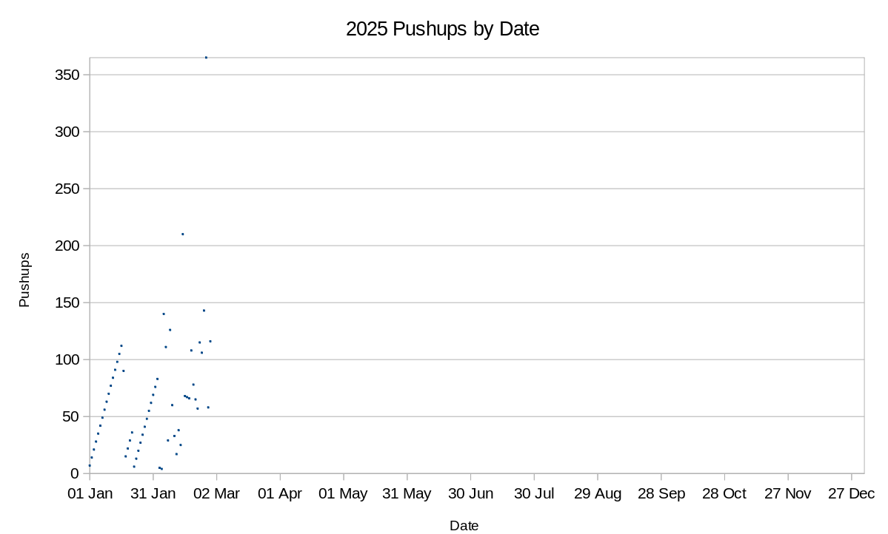

+++
title = "Pushup Challenge 2025"
date = "2025-02-27"

tags = [
    "resolutions",
]
categories = []
image = "2025PushupTally.png"
+++

Back in 2013, I did the Pushup challenge. It was hard, but rewarding. I've struggled to do hard things recently, so I'm trying it again this year.

You write all the numbers between 1 and 365 on a paper. Each day you choose one number, do that many pushups, and cross it off the list. Here;s how I'm doing so far.

Back in 2013, I didn't do any days below 100 for several months. This year I got off to a much slower start. This is partly because some days I really lacked motivation and wanted to give up. It is also partly because my wrists were really sore for a while and are still moderately sore now. I'm taking it one day at a time and accepting that I have to ease into it to let myself strengthen slowly.

This is my only official New Years Resolution this year. Although there are lots of other things I'm working on.

