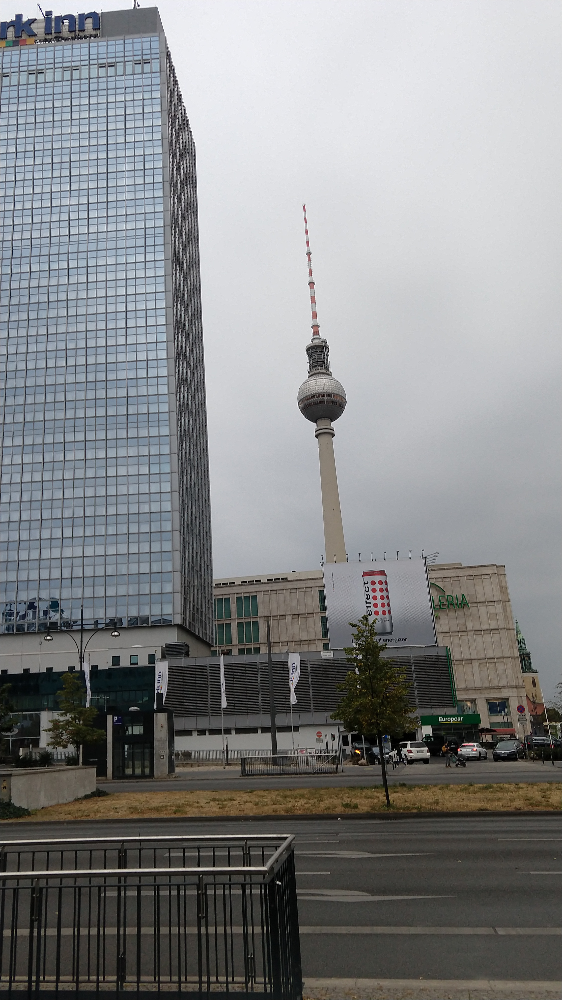
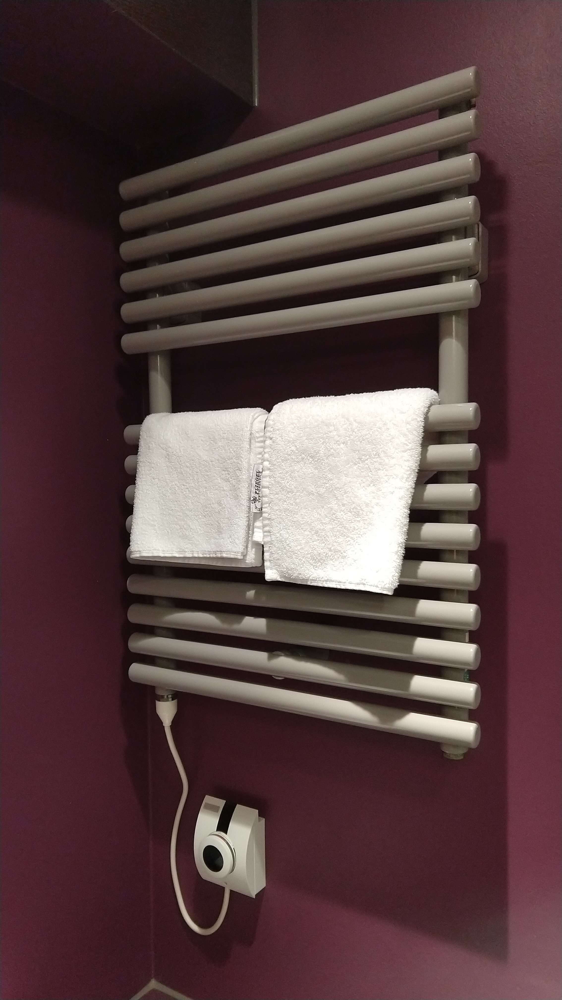
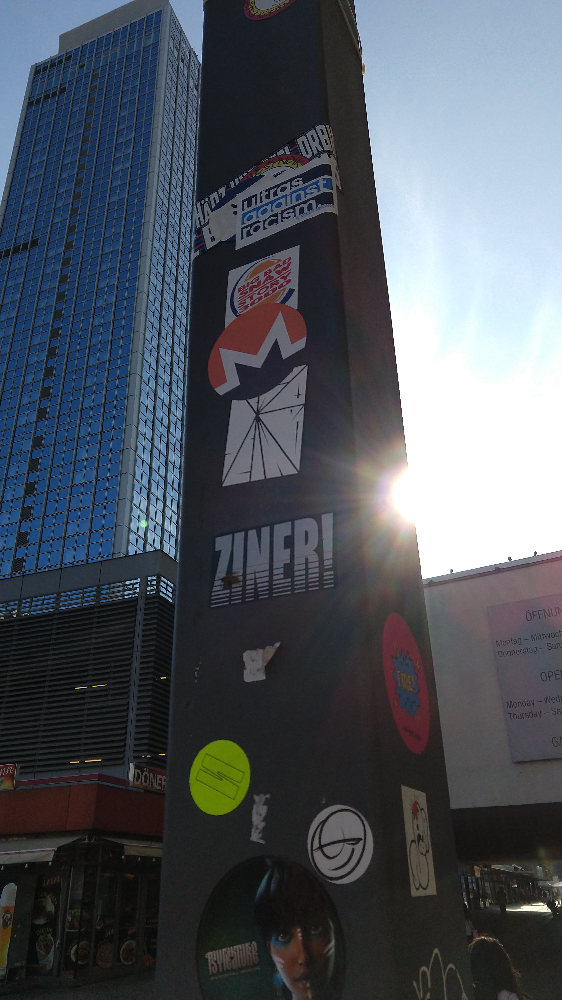
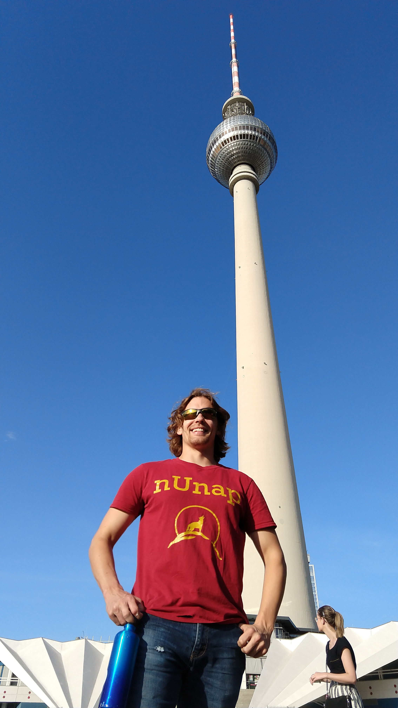
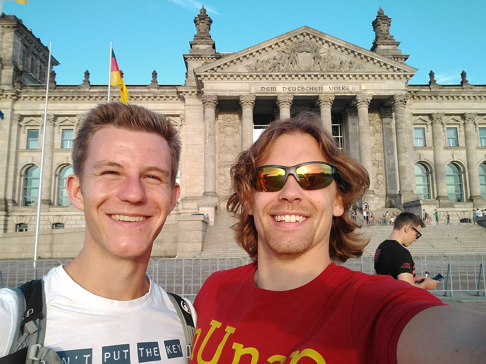
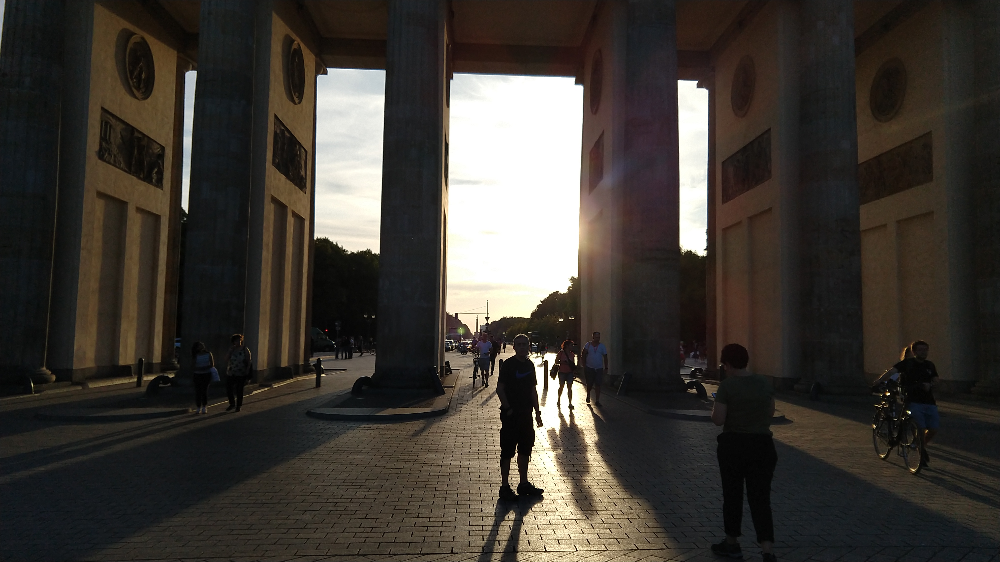
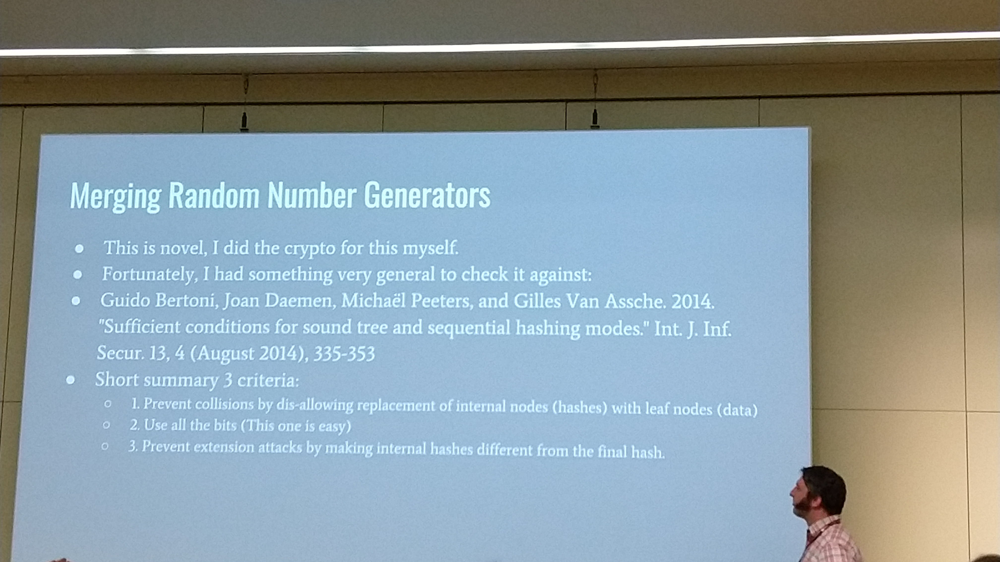
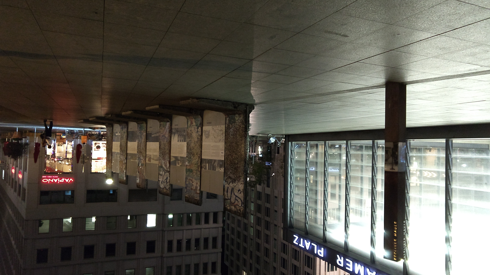
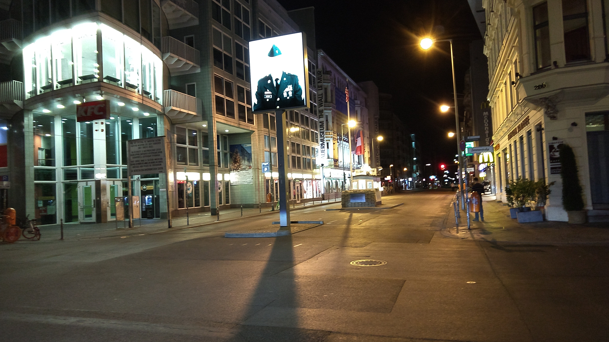

+++
title = "RCon3 in Berlin"
date = "2018-09-24T02:11:31+00:00"
tags = ["Travel", "Blockchain"]
categories = []
image = "IMG_20180902_054714234.jpg"
+++

Even though I just went to Europe for the first time, I had a chance to go back already. This time I went to Berlin for RCon3. It was my first conference presentation. I also had a little bit of time to see Berlin stuff. Hopefully I'll get out and about more next time.

Photos:

