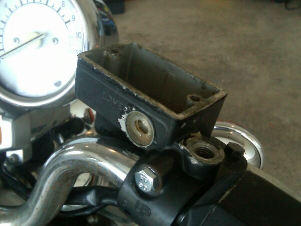
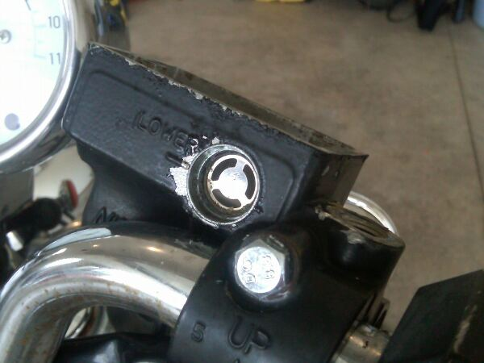
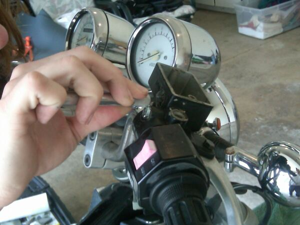
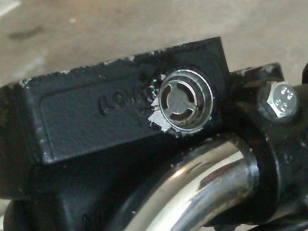
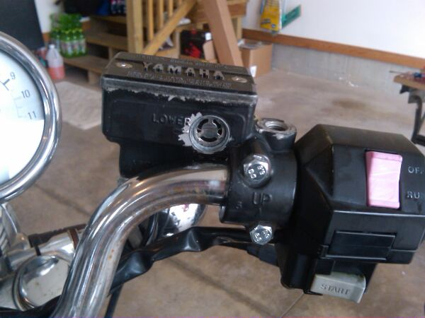

+++
title = "Replacing a master cylinder's viewing lens"
date = "2012-04-01T21:58:11+00:00"
tags = ["motorcycle"]
categories = []
image = "old.jpg"
+++

Most bikes use a hydraulic system for the front, or both front and rear brakes.   My XJ700 uses a dual-disc hydraulic system for the for the front wheel only.  Maintaining the specified level and quality of brake fluid in the master cylinder for such systems is critical, so there is almost always a clear plastic window in the side of the master cylinder that allows you to monitor the fluid level and color.  Unfortunately, as bikes age, these windows become hazy and cracked which makes monitoring the fluid impossible.  Eventually the window may even start to leak.  Luckily, it is pretty straight-forward to replace and old window with a new glass one that looks great and doesn't leak.

<ul>
<strong>You will need:</strong>
<li>New Lens</li>
<li>Screw driver</li>
<li>RTV Silicone</li>
<li>Precision Knife</li>
<li>Aerosol brake cleaner</li>
</ul>

My lens was so old that it started leaking.  You can see that the leaking brake fluid eroded some of the paint from the outside of the master cylinder.  It got bad enough that I accidentally punched a hole right through the lens with my bare finger.  It is not uncommon for old bikes to have lenses like this, but replacing them is so easy that I will never let mine get like this again.  The first step in this process is to remove the master cylinder cap and empty out any remaining brake fluid either with paper towels or a vacuum pump.

Next, dig out the old lens in chunks.  I used a flat tip screwdriver for this, but pretty much any tool will do.  There is really no reason to try to keep your old crusty lens in one piece, so just chip away at it.  If your bike has a chrome trim or other metal ring around the lens, leave it in place.  You can see that mine has a metal ring around the hole and a back plate.  This is a pretty common design, and you will want to leave it in place.

After you have most of the plastic removed, you can get out a precision knife such as an X-acto to clean out the rest of the small plastic chunks, hardened brake fluid, gasket, and any other crud that has built up around the lens.  Take your time, and get all of this out thoroughly because if you don't your new lens will be leaking in no time.

When you have <em>all</em> the debris removed from the area clean it with brake cleaner, and wipe it down with a paper towel several times, then let it dry for several minutes.  When you are done with hole should be impressively clean, possibly even new looking.

Now you are ready install the new lens.  Read and follow all of the instructions on the packaging of your RTV silicone.  Sparingly apply a ring of silicone around the outside of the lens <em>or</em> the inside of the hole in the master cylinder.  Quickly seat the lens in place making sure that the silicone seals the joint all the way around the circumference of the lens.  The silicone will skin in less than 30 minutes, but will not dry to full strength for 24 hours.  Let the silicone dry over night and then refill and flush the brake system.

The process is pretty straightforward, and not counting the drying time, it should take a little over an hour.  Obviously you will want to thoroughly test the system to be sure it is safe before any real riding.

