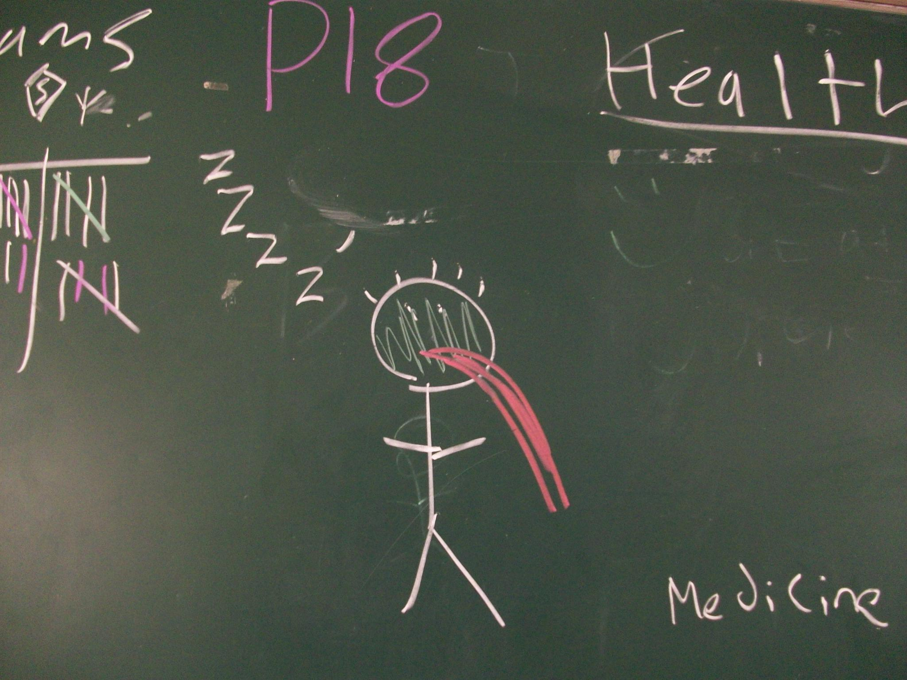
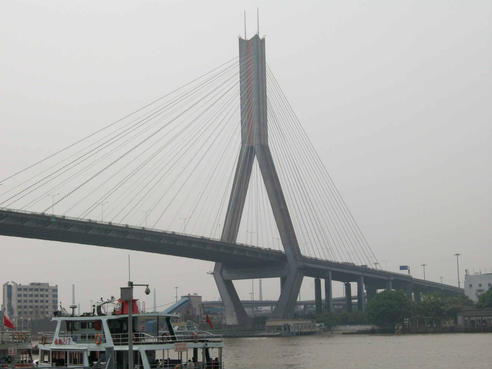
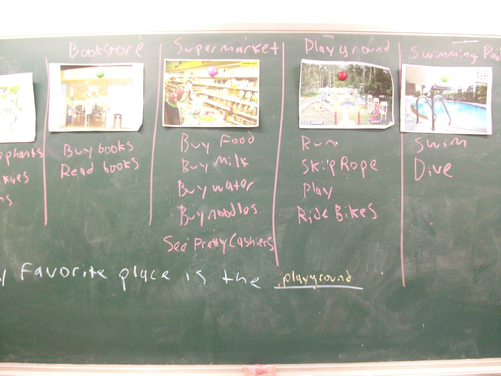
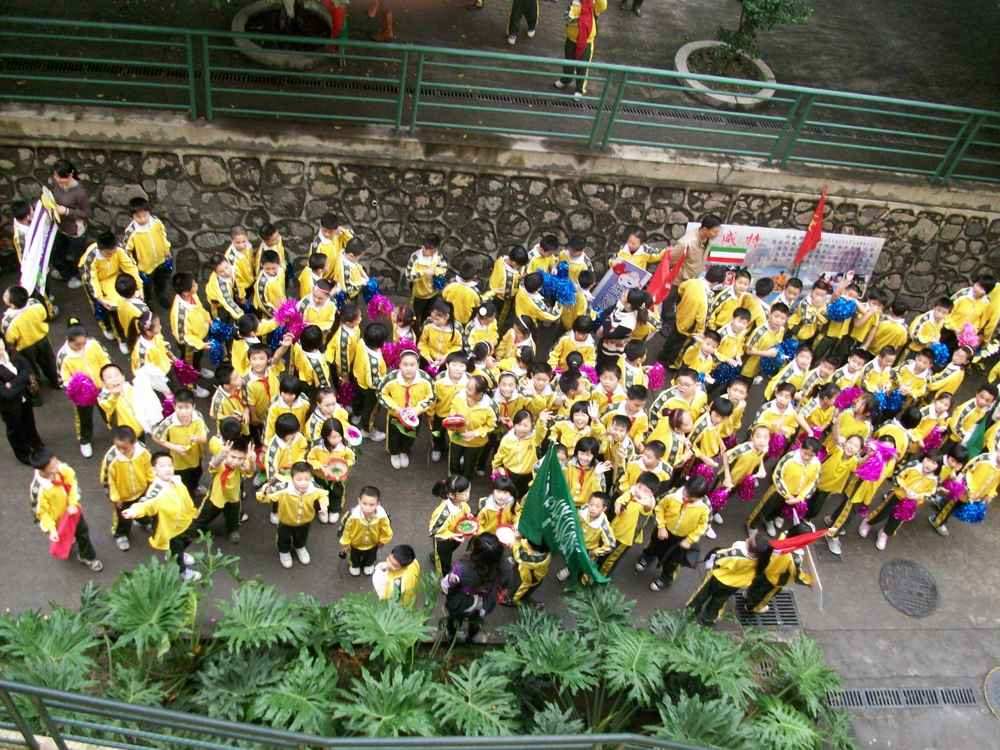
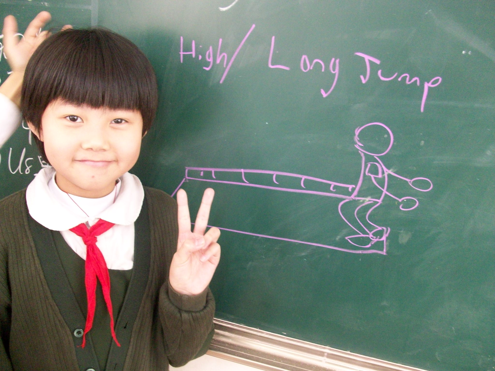

+++
title = "School"
date = "2010-03-21T05:08:44+00:00"
tags = ["China"]
categories = []
image = "100_0191.JPG"
+++

These are all the pictures that I've taken in and around my school. I teach at 北大附中 which is the affiliated high school of Peking University. The buildings have a really cool design.

Photos:

