+++
title = "Shamian Island (沙面岛)"
date = "2010-04-05T09:29:16+00:00"
tags = ["China"]
categories = []
image = "100_0125.JPG"
+++

Saturday (3 April) Tim and I took a walking trip around an area of town that is pretty close to my house.  We found a pedestrian mall, tons of jade jewelry stores, a White-person-infested Island and lots of other cool stuff.  I'm not sure about the history of Shamian Island, but there are lots of English signs and white people, and the food prices are set to match those in western cultures.  Obviously we didn't eat there :)  There are lots of pictures so I've selected a representative subset to show here.

Photos:

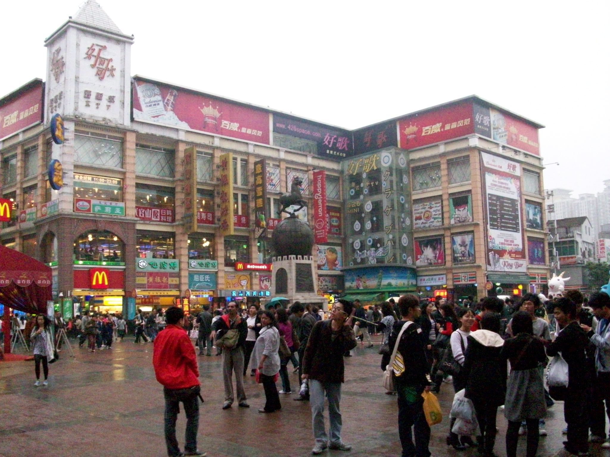
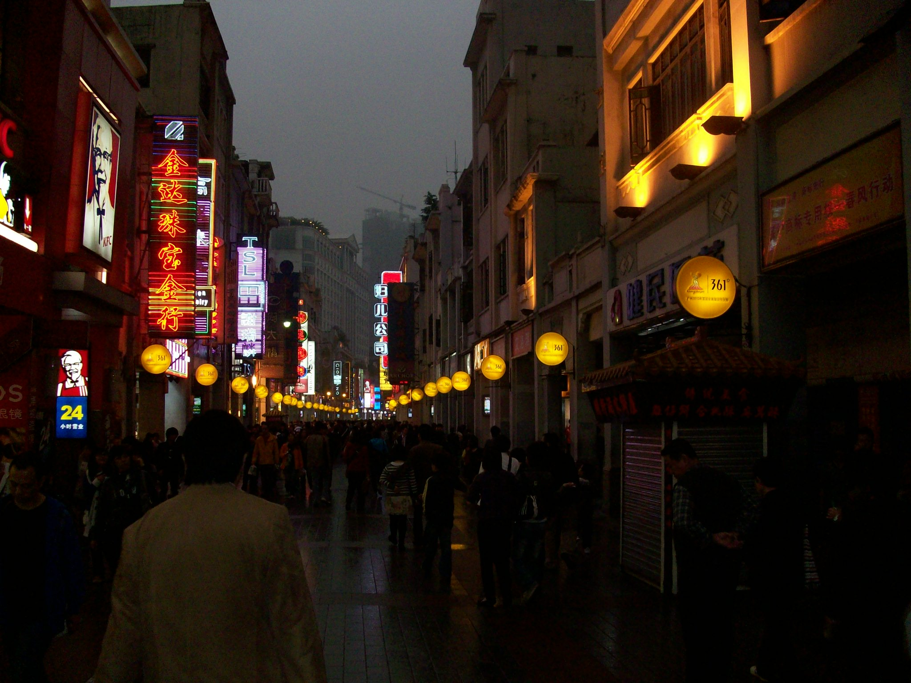
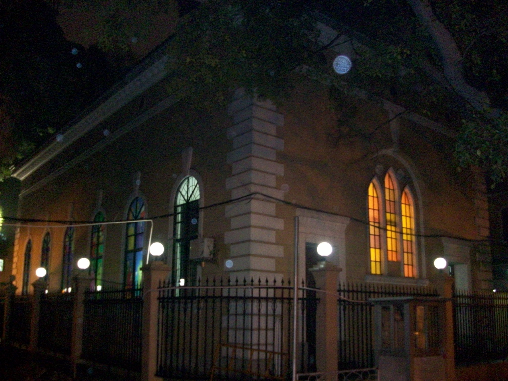
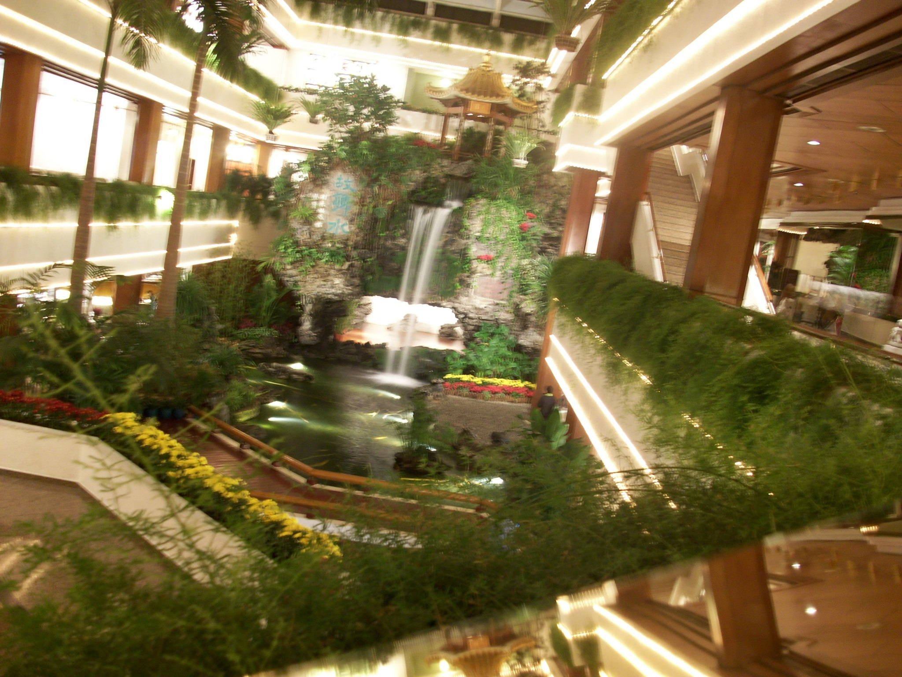
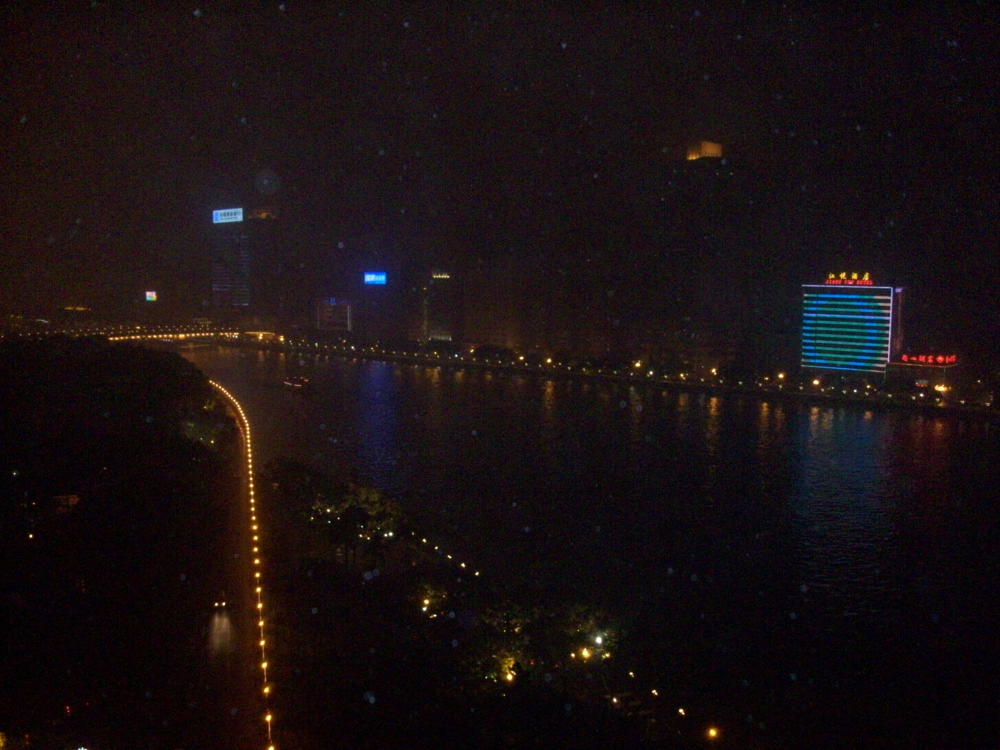

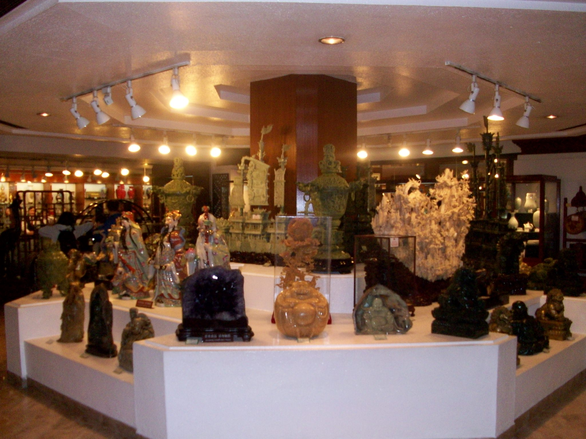
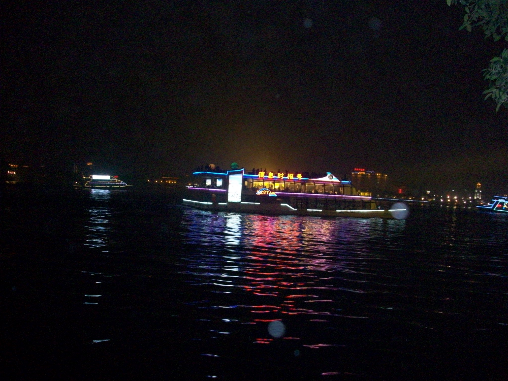
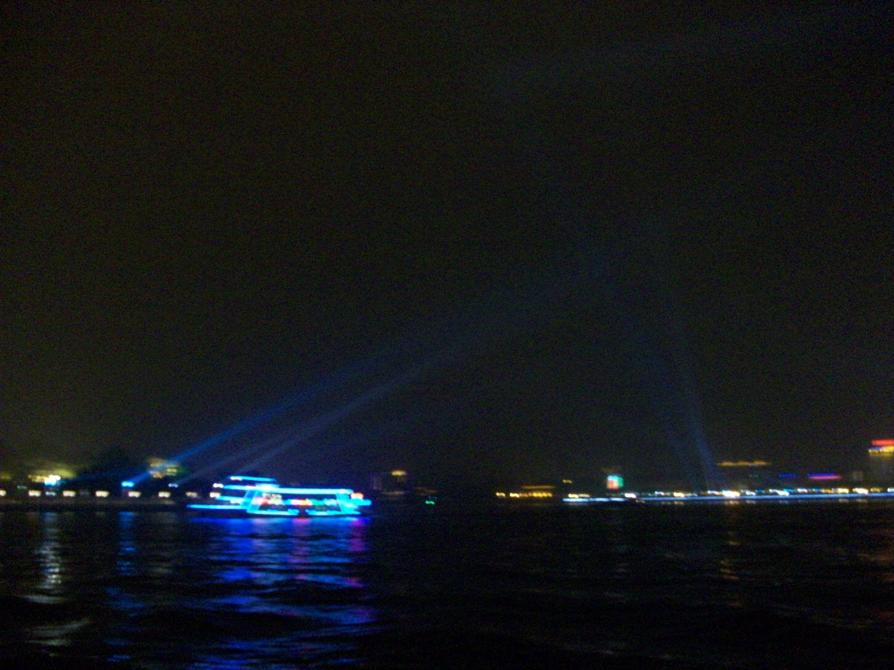
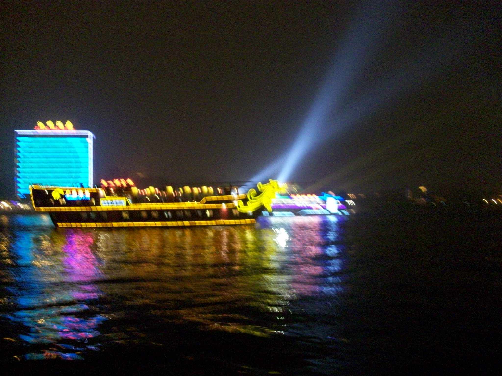
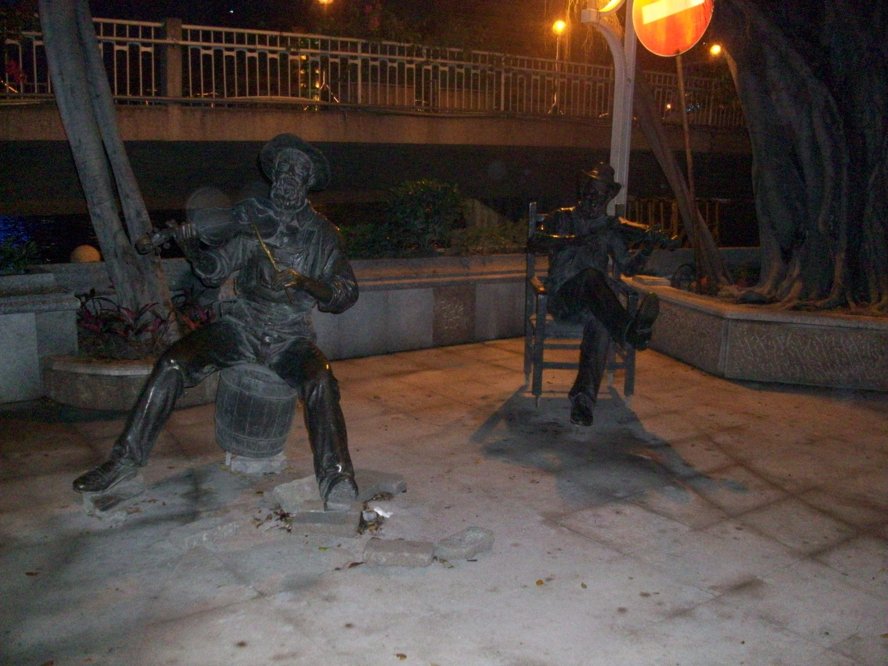

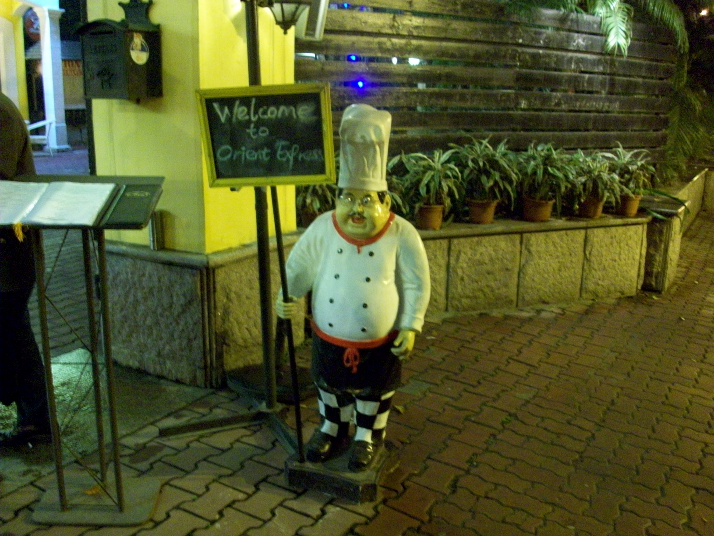
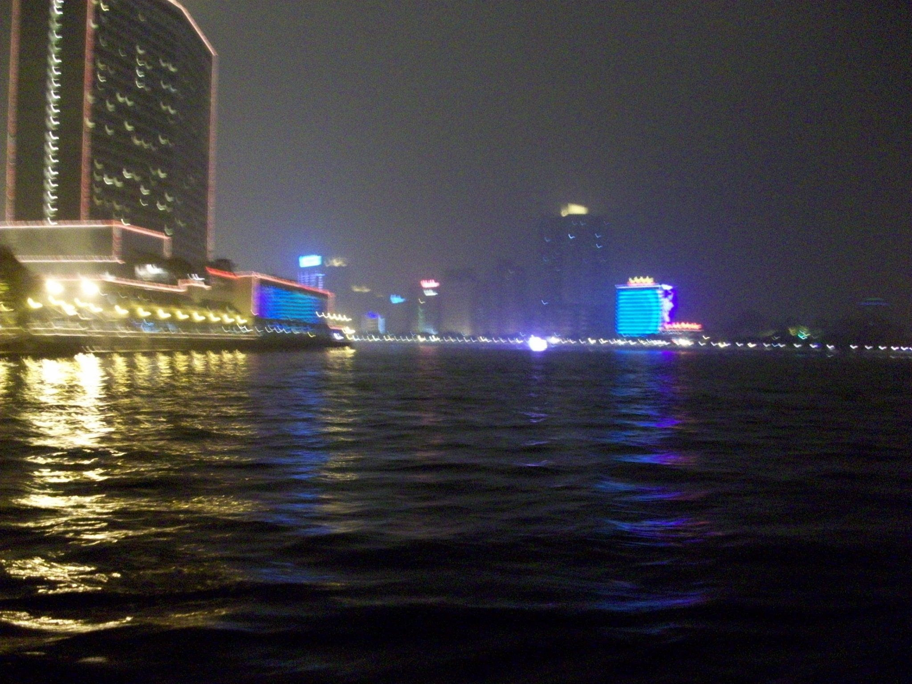
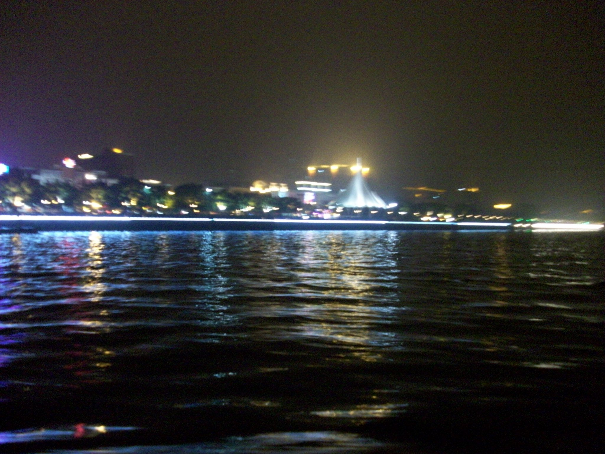
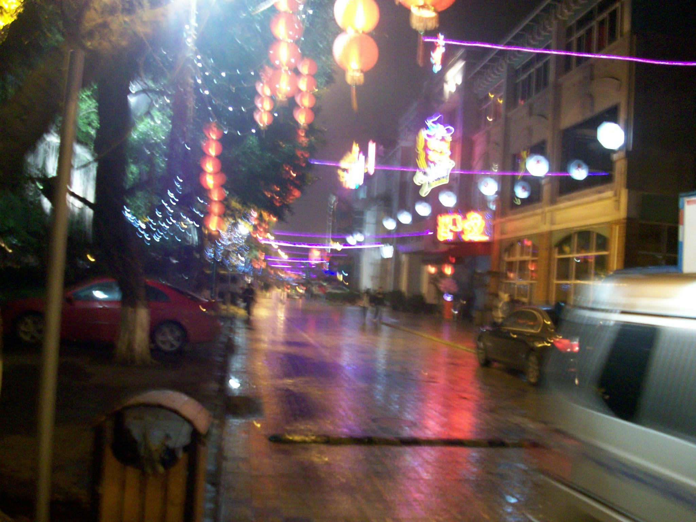
