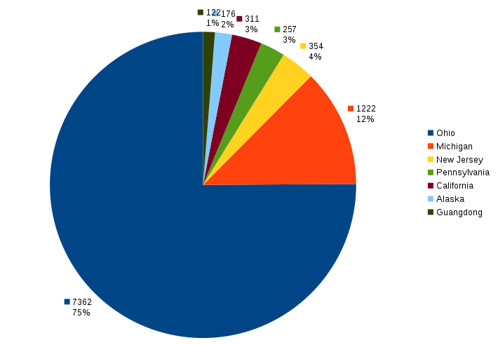
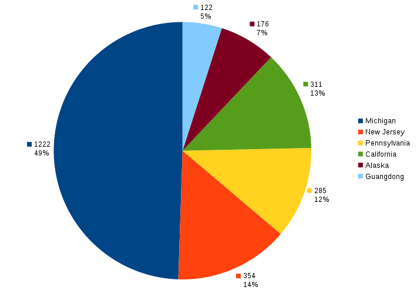

+++
title = "States I've spent the most time in"
date = "2015-09-05T23:44:41+00:00"
tags = ["Travel"]
categories = []
image = "TimeSpent-PieChart.png"
+++

From time to time I think about where I've spent my life. I've moved around a decent amount, but most of it has been lately. As any good scientist knows, the key to understanding your data is visualizing it properly, so I've tabulated which states (and provinces technically.) I've spent my time in and made a pie chart to summarize.

<table>
<tr>
<th>State</th>
<th>Start</th>
<th>End</th>
<th>Total (days)</th>
<th>Comment</th>
</tr>
<tr>
<td>Ohio</td>
<td>21 Dec 1987</td>
<td>01 Aug 2006</td>
<td>6798</td>
<td>Growing up</td>
</tr>
<tr>
<td>Michigan</td>
<td>01 Aug 2006</td>
<td>01 Jun 2007</td>
<td>304</td>
<td>Freshman year</td>
</tr>
<tr>
<td></td>
<td></td>
<td></td>
<td>0</td>
<td>Assume summer 2007 roughly cancels other Ohio visits</td>
</tr>
<tr>
<td>Michigan</td>
<td>01 Aug 2007</td>
<td>25 Feb 2010</td>
<td>939</td>
<td>Final 2.5 years of college</td>
</tr>
<tr>
<td>Guangdong</td>
<td>28 Feb 2010</td>
<td>30 Jun 2010</td>
<td>122</td>
<td>Teaching in China</td>
</tr>
<tr>
<td>California</td>
<td>15 Sep 2010</td>
<td>15 Jun 2011</td>
<td>273</td>
<td>Living in LA</td>
</tr>
<tr>
<td>Ohio</td>
<td>01 Sep 2011</td>
<td>01 May 2013</td>
<td>608</td>
<td>Graduate school</td>
</tr>
<tr>
<td>Alaska</td>
<td>05 Sep 2013</td>
<td>31 Oct 2013</td>
<td>56</td>
<td>Working as Renfro's ramper</td>
</tr>
<tr>
<td>California</td>
<td>01 Dec 2013</td>
<td>22 Dec 2013</td>
<td>21</td>
<td>Flight School</td>
</tr>
<tr>
<td>New Jersey</td>
<td>02 Jan 2014</td>
<td>15 Jan 2015</td>
<td>378</td>
<td>PRISMS</td>
</tr>
<tr>
<td>North Carolina</td>
<td>15 Jan 2015</td>
<td>12 Feb 2015</td>
<td>28</td>
<td>Living with Nghi while in transition</td>
</tr>
<tr>
<td>Alaska</td>
<td>12 Feb 2015</td>
<td>12 Jun 2015</td>
<td>120</td>
<td>Managing Evert's</td>
</tr>
<tr>
<td>New Jersey</td>
<td>16 Aug 2015</td>
<td>05 Sep 2015</td>
<td>20</td>
<td>Pingry</td>
</tr>
<tr>
<td>California</td>
<td></td>
<td></td>
<td>17</td>
<td>'09 mc trip, LA summer visits '12 '13, Stockton visit '15</td>
</tr>
<tr>
<td>Pennsylvania</td>
<td></td>
<td></td>
<td>257</td>
<td>CTY</td>
</tr>
<tr>
<td>Pennsylvania</td>
<td></td>
<td></td>
<td>28</td>
<td>Camp Fitch</td>
</tr>
<tr>
<td>Michigan</td>
<td></td>
<td></td>
<td>-21</td>
<td>Adjustment for CTY '09</td>
</tr>
<tr>
<td>Ohio</td>
<td></td>
<td></td>
<td>-44</td>
<td>Adjustment for CTY '12</td>
</tr>
<tr>
<td>New Jersey</td>
<td></td>
<td></td>
<td>-44</td>
<td>Adjustment for CTY '14</td>
</tr>
</table>

The raw data. Italicized dates are dates that I don't (yet) know exactly.  If you can help me pinpoint any of them, spot mistakes, or point out omissions, please do.

Of course I've had to make some simplifying approximations because I don't remember exactly when I entered or left each place, and I've completely omitted anything that I deemed insignificant which generally meant I'd been there less than about 1.5 weeks.  So let's see what the graph looks like.

So Ohio occupies most of the area. That's good because that's where I'm from and I'm proud of it. But it also obscures the rest of the data, so let's see what it looks like if we take that big chunk out and analyze all the other places I've been.

I don't really have any conclusions to draw except that I like analyzing data :) I had considered making another one removing only the portion of Ohio before I went off to college, but decided to leave that as an exercise to the reader. Or better yet, go make your own, I'd love to see them. My <a href="TimeSpent-Analysis.ods">original data analysis</a> is up for grabs in ods format.

-Joshy

