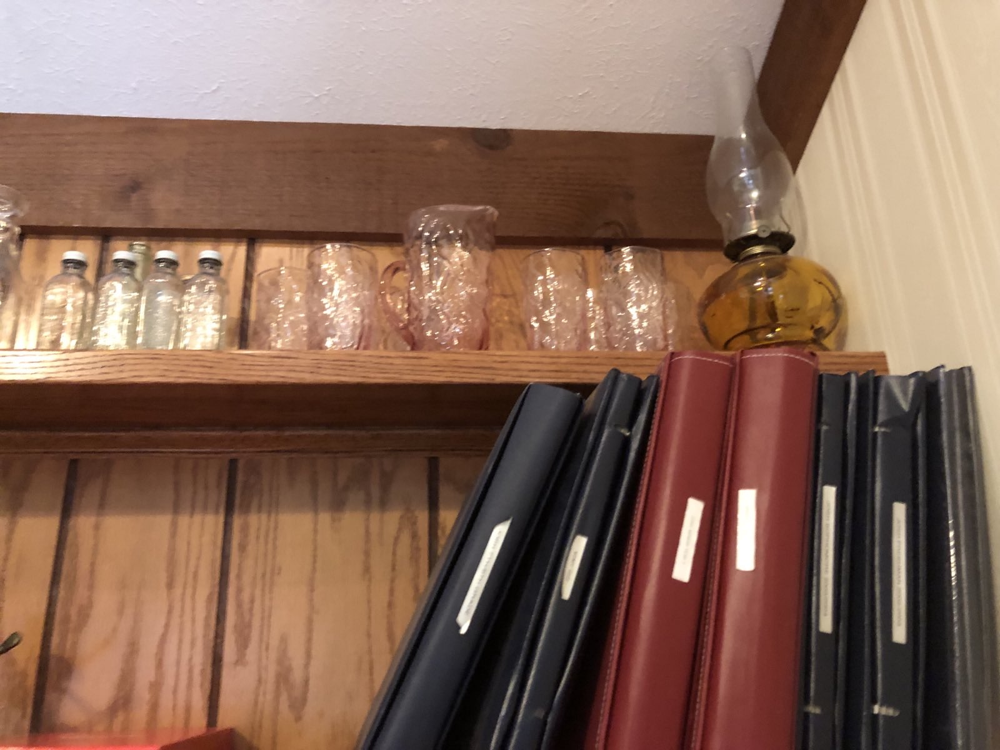

+++
title = "Stuff From My Closet"
date = "2025-06-04"

tags = [
    "Memories",
    "Art",
    "Teaching"
]
categories = []
image = "flamenail-cover.jpg"
+++

A few months ago, my parents moved out of the house I (mostly) grew up in. It was a little while coming, and there was a few years back they almost moved but the plan changed. So we had lots of time to get stuff gradually moved out and downsized.

There were a few odd things I had left in my old room. Mostly my old closet. It was the last stuff I hadn't cleaned up or moved out yet, and at some point, my parents dropped this last batch off at my house. It seems weird to me, but the stuff left was not the junk that I didn't care enough to get. The last stuff that I never took was actually some of the most sentimental. Maybe I had not yet found a place worthy of moving those things. I've given them temporary homes around my house now, but maybe this blog post in the cloud will be their permanent home.

It was a lot of wall hangings. A whiteboard - I guess I was into them even back then. Some awards from my high school running career. Also glassware that I had inherited from my grandparents and a collection of shot glasses that I had put together over a few years. Scrap books that my mom had made me from 7th to 12th grade, and a few guitar themed nicknacks.

And some art from a 3D art class I took in highschool. It was an interesting course. I hadn't previously liked art class much, but I took that one anyway because I thought it sounded cool. The teacher quit part way through. We had a few subs before a long-term one. I have some baked-but-not-glazed pots because the new sub just wasn't quite ready to do glazing.

I want to tell you about a specific piece that I've never named. Maybe its name is flamenail.

I know you just scrolled right past it. Go back and look at it. Some of the nails are bent; that is an artifact of age and wear. The rest is original. Including the incomplete bottom border that split because I drove too many nails into the grain, and then glued back together.

This is among my favorites, and that is part of why I kept it all this time. I received a failing grade for this piece. The assignment was based on some art piece that the new teacher liked and we were supposed to do something in the same style. It had nails driven into wood and geometric stuff in the background. I think. Honestly, I don't really even remember the examples. But I took some inspiration and set to work. The teacher pointed out that the fire texture I used was not consistent with the original style which was all geometric stuff. True. She encouraged me to revise it. But I didn't because I liked it. It wasn't common for me to actually like some art I had made and I didn't want to f it up.

Look back at that Orphans wall hang. It has a baller orphans logo, and also some random vines and candle. WTF? The teacher said it needed more detail. In hindsight, I guess maybe she just had more class time to fill. I wish I hadn't messed that one up too.

In the years since I made that piece, I've worked as a teacher in a lot of different contexts. I hope that at least some students (CTY, ACI, UToledo, PRISMS, Pingry, PBA) have had this attitude. I hope they have built cool shit, and explored interesting things, and maybe even learned something, and not given a shit about the grade.

